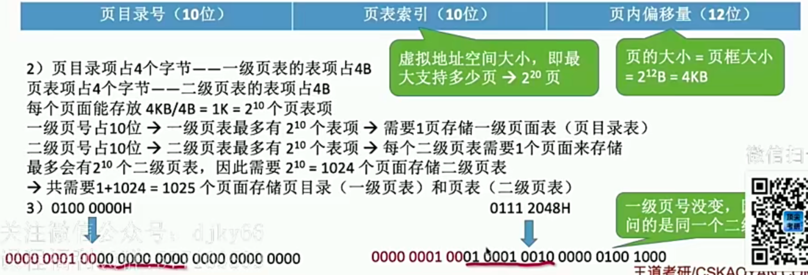
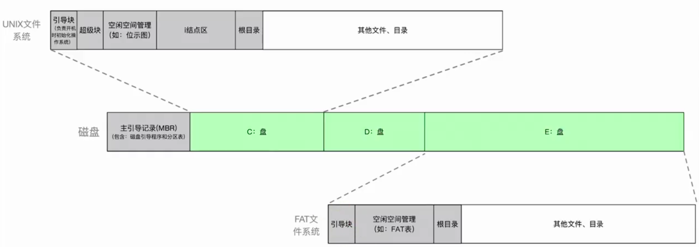

# 2009

## 45-PV


```c
//p1-生产者 produce() put()
//p2-消费奇数 getodd() countodd()
//p3-消费偶数 geteven() counteven()
//一个生产不同东西 吸烟者问题

// 互斥关系：互斥访问缓冲区
// 同步关系：P1产生奇数 --V-odd=0--- P2消耗奇数 产生偶数 --V-even---P3消耗偶数
// 同步关系：P2P3取数--P1放入数 empty=N
Semaphore mutex = 1;//访问缓冲区互斥信号量
Semaphore even=0,odd=0;//奇数偶数进程的同步信号量
Semaphore empty=N;//缓冲区单元个数信号量
CoBgin{
  Process P1(){
    while(1){
      x=produce();
      P(empty);//缓冲区有空位
      P(mutex);
      put();
      V(mutex);
      if(x%2==0)
        V(even); //向P3发信号
      else
        V(odd); //向P2发信号
    }//while
  }//P1
  Process P2(){
    while(1){
      P(odd);//收到P1来的信号
      P(mutex);
      getodd();
      V(mutex);
      V(empty);
      countodd();
    }//while
  }//P2
  Process P3(){
    while(1){
      P(even);//收到P2来的信号
      P(mutex);
      geteven();
      V(mutex);
      counteven();
    }
  }
}
CoEnd
```

考试时忘记加while(1){}循环了


## 46-内存


```c
页面大小4KB，页内地址12bit，虚页号4bit //给的虚拟地址16bit
驻留集为2 给进程分配两个页框 //两个页框号不变
LRU替换算法（局部算法）//当置换0页时，占用其页框号，其有效位设为0，页号1页框号设为101H
1)
  2364H-虚页号2 访问时间：TLB缺页+访问内存页表成功+访问内存=10ns+100ns+100ns=210ns
  1562H-虚页号1 访问时间：TLB缺页+内存也表缺页+缺页处理+访问TLB成功+访问内存=10+100+100000000+10+100=100000220ns
  25A5H-虚页号2 访问时间：TLB命中+访问内存=100+10=110ns
2)101565H，2号页面最近被访问，因此置换出页号0，并使用其页框号。
```


# 2010

## 45 -文件


```c
//磁盘管理：1.空闲表法(为每个文件分配一个空闲表) 2.空闲链表 3.位示图法(一个二进制对应一块) 4.成组链接法(Unix最后一块指向另一个空闲块，适合大型文件)
1)
  2KB=16384bit,因此使用位示图法
2)//读写操作的时间=寻道时间(启动时间+磁头移动时间-横向移动)+旋转延迟时间(定位扇区的时间1/2r)+传输时间(b/rN)
  //寻道时间和磁盘调度算法 题目不强调就是C-LOOK算法(会从头开始)
  //每次都是定位到并且读取
  延迟时间:1/2r=5ms
  传输时间:1/100r=0.1ms //转一圈1/r=10ms 读取一个扇区(总共100个扇区)10ms/100=0.1ms
 	采用SCAN算法，顺序为120-30-50-90
 	移动磁道数为 20+90+20+40=170 因此总寻道时间:170*1ms=170ms
  延迟总时间:4*5ms=20ms
	传输总时间:0.1ms*4=0.4ms
  总时间:170ms+20ms+0.4ms=190.4ms
3)//磁盘调度算法只有先来先服务，最短时间优先，SCAN(LOOK)，C-SACN(C-LOOK) LOOK就是不到底
	采用随机访问的Flash半导体存储器，会不需要寻道时间和延迟时间，则此时采用先来先服务磁盘调度算法会更公平。
```


## 46 内存


```c
//
1)
  地址空间64KB=2^16B--16bit 页面大小1KB=2^10B--10bit 因此页面 6bit
  17CAH=0001 0111 1100 1010 页号:000101=5
2)//采用固定分配 只能在这个页面内换出，如果是全局的可以从其他进程的页面换出
	页号5没有访问，替换最早访问的0号页面，因此页框号为7=0111 页内偏移量为 11 1100 1010
  组合就是物理地址 01 1111 1100 1010= 1FCAH
3)//clock算法:分配的四个页框组成循环队列，页面替换进去的时候设置访问位A=1，但需要选取替换页的时候，就逐个遍历，访问之后将访问位A=1，一趟结束后选择当前所指向的页替换出。
//改进的clock算法:设置一个修改位M，优先保留A 最先淘汰-A=0,M=0 其次-A=0,M=1 
	如图只想页框2时，所有访问位=1，此时要访问页号5的，会循环扫描一遍，如果不是访问位=0，直到扫描位都为0的时候，此时指向2，因此需要把2号换出，因此页框号=2
	物理地址=00 1011 1100 1010 =0BCAH
  
```


Belady异常 ，使用4个页框中包含的页面 和使用三个页框相比，不一定包含三个页框中的页面，这样导致页框多不一定命中率高，也就导致了页故障不减反增。


# 2011

## 45-PV


> Tips
>
> 1. 写出行为轨迹，多留点空
> 2. 按逻辑推进，分析：哪些地方会等待(等待的地方先写P，再找到对应的地方V )？哪些地方会互斥
> 3. PV成对出现
> 4. 定义信号量semaphore
>
> 10个座位表示顾客来的时候需要占一个座位才能叫号，设置一个座位的信号量full=10,并且先P,如果没有空位就让当前进程堵塞在此处。取到号之后就可以释放座位去等待叫号，释放座位可以在等待叫号之后，也可以在营业员叫号之后。取号机需要互斥访问mutex=1。营业员只有一位，设置一个信号量表示营业员空闲empty=1，在顾客取到一个号码时就不空闲了。这时候需要开始服务了，但是服务员只有一位，当叫号之后需要表示现在可以服务了，设置一个信号量表示现在可以服务了(也是叫号)service=1；

```c
//
Semaphore mutex = 1;//使用叫号机的互斥信号量
Semaphore full =1;//座位空位的个数信号量
Semaphore empty=0;//营业员空闲的信号量
Semaphore service=1;//叫号之后可以服务的信号量

CoBegin{
  process 顾客i(){
    P(full);//顾客有位置坐才能叫号
    P(mutex);
    从取号机获取一个号码;
    V(mutex);
    V(empty);//来客了
    等待叫号;
    P(service);//响应叫号
    获取服务;
  }
  process 营业员(){
    while(1){
      P(empty);//营业员空闲
      叫号;
      V(full);//释放座位
      V(service);//叫号表示可以服务了
      为客户服务; 
    }
  }
}CoEnd
```


## 46 文件


```c
1)
  场景中，由于写入的文件不可修改，使用连续存储最合适，支持随机访问，空间利用率最高，链式分配只能顺序访问且需要消耗额外空间存储链接指针，索引表支持随机访问，但是索引表会额外占用存储空间
  需要在FCB中添加字段<起始块号,块数>或者<起始块号,结束块号>
2)//一个磁盘块可以存储多个FCB，所有文件的FCB会占用多个磁盘块。
  使用FCB集中存储好，文件数据块集中存储，在按名查找文件时，只需要访问集中存储的FCB区域，可以减少磁盘移动和磁盘I/O次数。
  FCB和对应文件数据块存储时，只能逐一读入包含文件FCB的磁盘块，每次查找一个文件时都要读取，总体磁盘I/O次数更多，磁头移动距离更长。
  
```

|      | 连续分配                              | 链式分配                                           | 索引分配                                       |
| ---- | :------------------------------------ | -------------------------------------------------- | ---------------------------------------------- |
| 优点 | 随机访问,查找速度最快，空间利用率最高 | 增删改方便                                         | 增删改方便，支持随机访问，但是不如连续分配方式 |
| 缺点 | 增删改不方便,易产生外部碎片,文件定长  | 查不方便，只能顺序访问，需要额外的空间存放链接指针 | 索引表存放需要额外的存储空间                   |


> FCB集中存储如0 1 2 3
>
> 与对应数据块存储如 4 5 6

FCB的格式:


# 2012

## 45 内存


## 46 文件


```c
//索引表的块号要包含磁盘块数
1)
  磁盘块数4TB/1KB=2^32 对应索引表需要32bit=4B来表示块号
  索引表项数:512B/4B=2^7=128
	单个文件最大长度:128*1KB=128KB
2)
	<6B,2B> //2B=16bit 预分配块数2^16=64K 
	直接索引可分配块数:504B/6B=84
	总共块数:64MB+84K
	起始块数可以用32bit=4B表示 那么块数号8B-4B=4B，则预分配连续空间可以为2^32 *1kB=4TB
  直接索引就不用加进去了，则刚好4TB的连续空间分配完
```


 

# 2013

## 45-PV


~~~c
Semaphore empty =500;//可以容纳最多人数的信号量
Semaphore mutex=1;//进出门的互斥信号量
CoBegin{
  参观者进程i(){
    P(empty);//可参观人数减一
    P(mutex);
    进门;
    V(mutex)
    参观;
    P(mutex);
    出门;
    V(mutex);
    V(empty);//可参观人数加一
  }
}
CoEnd
~~~


## 46 内存


```c
//
1)
  页面的大小:2^12 B=4KB
	页表大小:2^20 * 4B=4MB (页表项个数*页表项大小4B) //有题目也会问成页表最大占多少个页框
//页框(内存中的块)=页(进程中的块)
//页表项是由【页号】【页框号】组成，其中页号隐藏。页表项类似一个数组的元素类型
2)
  //无符号右移>>> 按位与& (0x3FF =11 1111 1111)
	页目录号=(LA>>>22)&0x3FF
  页表索引=(LA>>>12)&0x3FF
3) 20+12 代码长度8KB 占2页
	开始的虚页号:00008H 和 00009H //由逻辑地址得到虚页号+页内偏移000H
  物理地址1=8号页对应的页表项地址=页表始地址+8*页表项长度=0020 0000H+8*4=0020 0020H
  物理地址1=8号页对应的页表项地址=页表始地址+9*页表项长度=0020 0000H+9*4=0020 0024H 
	//两个页面是连续的，内存中对应的页框也是连续的20+12bit
  代码页面1的页框号00900H 因此代码页面2的页框号为00901H //页内偏移000H
  物理地址3:0090 1000H
	
```

| 运算符名称 | 符号 | 作用                               | 举例             |
| ---------- | ---- | ---------------------------------- | ---------------- |
| 按位与and  | &    | 同时为1才为1 其他为0               | 1&1=1、0&1=0     |
| 按位或or   | \|   | 一个为1就是1                       | 1\|1=1、 1\|0 =1 |
| 异或       | ^    | 值不同为1                          | 1^1=0、1^0 =1    |
| 有符号右移 | >>   | 左边的补上符号位，正数补0，负数补1 |                  |
| 无符号右移 | >>>  | 都是补0                            |                  |


# 2014

## 46-文件


```c
//注意审题 每个磁盘块存放一条记录。
//将内存中一条记录写到磁盘的F文件中。
//文件F前后都有空闲 30更靠近前面
//移动磁盘块:先把磁盘块读到内存，再写进磁盘
//连续分配FCB中重要内容:文件名,文件起始块,文件长度
//通过指针确定磁盘个数很关键
1)
  由于F存储区前后都有空闲磁盘空间，把前29条记录向前面移动显然会移动更少的磁盘块，由于移动一块磁盘需要读入内存再写回磁盘，因此29块磁盘访问29*2=58次磁盘块，加上最后需要把新记录写进去作为第三十条需要访问磁盘一次，总共需要访问磁盘块59次。FCB中重要内容有文件名,文件起始块,文件长度，因为向前移动和加了一条记录，故文件起始块(减一)和文件长度(加一)会改变
2)//链式分配FCB重要内容:文件名,起始块,结束块 读入一个磁盘块之后 1020B数据+4B指针 可以定位到下一块磁盘
  链接分配只能顺序查找，因此找到第29块磁盘块需要读磁盘29次，然后修改其指针并且写回，同时新加的块也会修改指针写进，因此还会有两次访问磁盘块,总共访问磁盘31次。
  通过指针个数确定磁盘块数，4B=32bit,最大块数2^32,文件的数据块大小:1024B-4B=1020B
  因此文件最大长度:2^32 *1020B=4080GB

如果是索引分配呢？链接分配的显式方式FAT呢？//总结的时候要思考一下
```


## 47-PV


```c
//多生产-多消费 不要忘记while(1)
//当1000件消耗时设为empty
//当生产产品时候设为full，因为生产产品会导致满了
Semaphore mutex=1;//访问缓冲区的互斥信号量
Semaphore mutex1=1;//连续取10件的互斥信号量
Semaphore empty=1000;//缓冲区个数信号量
Semaphore full=0;// 生产产品的个数信号量
CoBegin{
	Producer(){
    while(1){
      P(empty);//有位置就生产
      生产一个产品;
      P(mutex);//互斥访问
      把产品放到缓冲区;
      V(mutex);
      V(full);//产品加一
    }//while
  }
  Consumer(){
    p(mutex1);//连续取10件
    for(int i=0;i<10;i++){
      P(mutex);
      从缓冲区取走一件产品;
      V(mutex);
      V(empty);
      P(full);
      消费这件产品;
    }
    V(mutex1);
  }
}


//进阶 联合队列 环形缓冲区
//队列
int buffer[1000];
int front =0;
int rear=0;
//信号量
Semaphore mutex=1;//访问缓冲区的互斥信号量
Semaphore mutex1=1;//连续取10件的互斥信号量
Semaphore empty=1000;//缓冲区个数信号量
Semaphore full=0;// 生产产品的个数信号量
CoBegin{
	Producer(){
    while(1){
      x=produce();//生产一个产品;
      P(empty);//有位置就生产
      P(mutex);//互斥访问
      buffer[rear]=x;//把产品放到缓冲区;
      rear=(rear+1)%1000;//实现循环
      V(mutex);
      V(full);//产品加一
    }//while
  }
  Consumer(){
    p(mutex1);//连续取10件
    for(int i=0;i<10;i++){
      P(mutex);
      x=buffer[front];//从缓冲区取走一件产品;
      front=(front+1)%1000;
      V(mutex);
      V(empty);
      P(full);
      consume(x);//消费这件产品;
    }
    V(mutex1);
  }
}
```

# 2015

## 45-PV


## 46 内存


```c
//页-进程的块 页框-内存块 页=页框
1)采用字节编址B
  页=页框=2^12B=4KB
  虚拟的地址空间有 2^10 *2^10 =2^20=1M页
2)页目录项=页表项=4B，则1页可以有 4KB/4B=1K个页表项
	一级页表占1页，一个二级页表也是1页
  二级页目录共占 1K*1=1024页
  共占 1+1024=1025页
3)//要想确定访问多少二级页表，需要确定两个虚地址是否进行了二级页表的切换，就是看一级页表是否改变
  0100 0000H=0000 0001 0000 0000 0000000000000000
  0111 2048H=0000 0001 0001 0001 0010000001001000
  两个虚地址前10位一样，访问的是同1个二级页表，即只访问了1个二级页表
  
```





# 2016

## 46-PV


## 47 文件


```c
//簇(Windows)=块(Linux) FAT(文件分配表，整个磁盘就一个)=磁盘号(一般隐含)+下一块
//目录项(FCB):文件名+第一个簇号
1)目录项(FCB):文件名+第一个簇号
  dir内容:dir1 48
  dir1内容:file1-100/file2-200
2)
	FAT最大长度(2B=16bit):2^16  *2B=128KB 
	最大文件:2^16 * 4KB=2^28B=256MB //像FAT中表示结束的-1或者空闲的标记 实际应用的时候会采用特殊的标记表示，因此实际的大小是要小于这个文件的
3)//由于题目没有给从0号还是1号开始，因此直接说存在100号表项里面，不要加"第"
	106簇号放在100号表项中
	108簇号放在106号表项中
4)
	通过dir将dir1读如内存需要访问48簇，由于5000B>2096B=4KB 因此需要读取文件的第二个块即106号簇
```


# 2017

## 45-内存


## 46 -PV


# 2018

## 45 内存


## 46 文件


```c
// 簇大小Window=磁盘块大小Linux
// 文件索引结点=inode结点(inode区中有多个inode结点)
1) 索引项个数:4KB/4B=1K
  直接地址:8
	一级间接地址:1k
	二级间接地址:1k*1k
	三级间接地址:1k*1k*1k
	文件最大长度:(8+2^10+2^20+2^30)*4KB=32KB+4MB+4GB+4TB
2)//一个inode索引结点对应一个文件 //
	inode区大小:1M*4KB=2^32B 共有inode结点:2^32B/64B=2^26个
	每个文件占两个簇(4KB<5600B<8KB)，512M/2=256M=2^28个
	因此最多存放2^26=64M个图像文件	
3)
	F1文件需要6KB/4KB+1=2个块进行存储
  F2文件需要40KB/4KB=10个块进行存储
	F1仅需要前两个直接地址就可以存完，读起最后一块的时候是直接读取，需要访问一次磁盘，而F2最后一个簇需要用到二级间址，需要三次访问磁盘，因此两者访问时间不一致
```

> 一个[文件系统](https://zhidao.baidu.com/search?word=文件系统&fr=iknow_pc_qb_highlight)维护了一个索引节点的数组，每个文件或目录都与索引节点数组中的唯一一个元素对应
>
> Linux 为每个文件分配一个称为索引节点的号码inode，可以将inode简单理解成一个指针，它永远指向本文件的具体存储位置。
>
> 文件名可以随时更改，但是索引节点对文件是唯一的，并且随文件的存在而存在。

# 2019

## 43-PV


## 44 文件 磁盘


```c
//一个柱面就是一个圈，300个柱面就是一个磁面300个磁道，整个磁盘有300*10=3000个磁道，一个磁道200个扇区就是磁盘的一圈被分成了200份，然后总共3000个圈，也就是共有3000*200个扇区。(有时候一个盘面会有两面，这时候就当成两个盘面计算)
1)//求容量起始就是用扇区个数*扇区大小
  磁盘容量:300*10*200*512B=300000KB
2)//扇区:硬盘的基本单位 簇/块:操作系统层面限制的，存储空间分配的基本单位 要确定寻道顺序，需要确定柱面号
	通过簇号得到对应的柱面号
	100260/1000=100,60005/1000=60,101660/1000=101,110560/1000=110
	对应磁道顺序:60,85,100,101,110
	85-60=20>15=100-85,SSTF调度访问算法排序:100260,101660,110560,60005
3)//读写一个簇需要通过驱动程序转化成物理地址(柱面号，盘面号，扇区号)，再通过设备控制器读取相应的扇区 (磁道号，磁头号，扇区号)
	柱面号=簇号/1000=100530/1000=100
	盘面号=(簇号/1000)/100=530/100=5
  扇区号=(簇号%100)*2=60 //注意先得到簇号在乘二得到扇区号
```


> 柱面号(从里面往外编号):0~299
>
> 盘面(从上往下编号):0~9
>
> 扇区号():0~199 
>
> 簇号(两个扇区组成一个):0~99

|               | 柱面号(300) | 盘面号(10) | 扇区号(200) |
| ------------- | :---------: | :--------: | :---------: |
| 0~99号簇      |      0      |     0      |    0~199    |
| 100~199号簇   |      0      |     0      |    0~199    |
| 200~299号簇   |      0      |     0      |    0~199    |
| 300~399号簇   |      0      |     0      |    0~199    |
| 1000~1099号簇 |      1      |     0      |    0~199    |
| 1100~1199号簇 |      1      |     1      |    0~199    |
| 2000~2099号簇 |      2      |     0      |    0~199    |

> 1000号簇对应2000号扇区，也就是一个一个柱面的扇区(200*10)访问完了，盘面号0~9起始就是对应簇号的百位，
>
> 柱面号=簇号/1000
>
> 盘面号=(簇号/1000)/100
>
> 扇区号=(簇号%100)*2
>
> 如果改成一个扇区号为一个簇？或者4个扇区为一个簇？
>
> 一个扇区号
>
> 柱面号:簇号/(200*10) 除以的就是扇区个数(簇的个数)✖️盘面个数
>
> 盘面号:簇号/2000之后再除以扇区个数(簇的个数)
>
> 扇区号就是对剩余的取余数(%200,200为一个磁道的扇区数)
>
> 重要补充:
>
> 读取过程就是通过IO系统的磁盘驱动程序得出物理地址(柱面号,磁盘号，扇区号)
>
> 通过柱面号将磁头臂移到对应的柱面，然后通过磁盘号激活对应磁面的磁头，当对应扇区转过来的时候读取扇区的数据

# 2020

## 45-PV


## 46 内存


# 2021

## 45-PV


## 46 文件


> 磁盘制造过程：
>
> 空磁盘--物理格式化(初级划分，划分扇区，并用备用扇区替换坏的)--磁盘分区 C D E -- 逻辑格式化(如下图)-也是文件系统在外存中的结构
>
> 开机整个过程：
>
> 开机之后CPU运行ROM引导程序(自举程序，在内存中)，将磁盘主引导记录(MBR)读到内存，MBR中有磁盘引导程序和分区表，运行磁盘引导程序即通过分区表找到主分区(也就是安装了操作系统的分区)，然后执行这个分区的引导块-将会在根目录下找到操作系统初始化程序并启动，完成开机。




# 2022

## 45 文件


```c
1)
  stu的目录项:course项和doc项
	文件名:course 索引结点号:2
	文件名:doc 索引结点号:10
2)//一个文件对应一个索引结点 doc和course是一个文件 硬链接
	doc占用的磁盘块块号x=30
3)
	读入course1第索引结点一次，通过索引结点读入course1块一次，总共两次
//错误理解:通过course占用10个内存块，刚好通过十次直接索引10次，总共读11个磁盘块
4)//题目是要求哪几级，关于二级间接地址，inode二级间接地址项会对应一个块号指向下一个块，求索引表项大小因此只能用4KB，另外一个inode结点包含很多信息，而且一个块也会包含很多inode结点，因此不能用inode结点大小去除以4B得到表项数
	一个索引结点对应大小为:
	10个直接索引:10*4KB=40KB
	1个一级间接(一级索引表表项数4KB/4B=1024):1*1024*4KB=4MB
	1个二级间接:1*1024*1024*4KB=2^32B=4GB
	1个三级间接:1*1024*1024*1024*4KB=2^42B=4TB
	40KB+4MB<6MB<4GB，因此需要用到一级、二级间接地址项
	//另外也可以用6MB/4KB=1536个页面，1个一级间接地址项+10个直接地址项=1025<1536,而2014*1024>1536的，因此需要用到一级间接地址和二级间接地址
2^10=1K
2^20=1M
2^30=1G
2^40=1T
2^50=1P
2^60=1E
```


## 46-PV


# 2023

