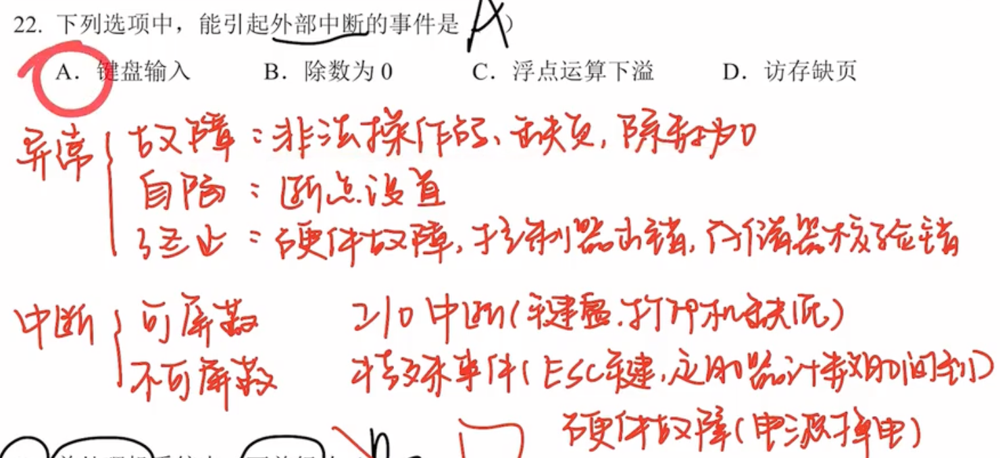
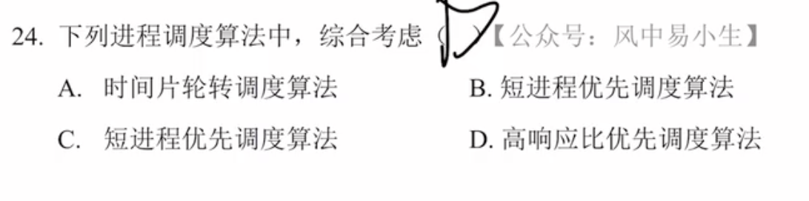

# 2009

## 22

看到外部优先想到CPU外部可能会产生的中断

异常(内中断)--CPU内部--终止异常和外中断是硬件中断

中断(外中断) CPU外部

- 可屏蔽中断

  - Cache缺失

  - I/O中断：键盘输入，打印机缺纸

  - 时钟中断

  - I/O中断请求

- 不可屏蔽中断

  - 通常是非常紧急的硬件故障，如电源掉电等

## 23

并行：同一时刻

并发：同一时间 宏观

## 24

响应比=(等待时间+要求服务时间)/要求服务时间

带权周转时间>1

## 25

2x+1+资源m ==》 x就是最少个数

 

## 26

分配内存主要的保护措施是界地址保护 

## 27

逻辑地址=段号+段长

## 28

文件物理结构(文件在外存上的存储存储)

存储方式：

1. 顺序分配
   - 连续的存储空间-可随机访问
   - 文件头指定起始块的位置和长度
2. 链表分配
   - 隐式链接 -- 通过指针访问
   - 显示链接 -- 把指针放在文件分配表FAT里(在内存中)
3. 索引分配
   - 为每个文件创建索引数据块--存放文件数据块的指针列表-在外存上

## 29

磁盘调度算法：

先来先服务FCFS：按来的顺序访问

最短时间优先SSTF：贪心思想，按照离当前最近的访问，可能不是最优的

电梯算法SCAN：朝向一个方向移动访问，到边缘之后在掉头访问未访问的。LOOK--不需要到最边缘的点

C循环扫描算法C-SCAN：移动到边缘之后，直接从另一边开头重新访问。C-LOOK -- 不需要到最边缘的点，

LOOK -- 不需要到最边缘只需要到最远的一个需要访问的点

## 30

文件控制块FCB

- 基本信息
  - 文件名、文件的物理位置、文件的逻辑结构、文件的物理结构
- 存取控制信息
  - 存取权限
- 使用信息
  - 建立时间，修改时间

## 31

刚开始文件F1的 count=1 F1--物理块count=1

F2为软链接 相当于复制物理块的信息此时count=1

F3为硬链接 此时物理块的count+1=2 由于F2为复制链接(只是个路径) 因此其信息始终和物理块一致  其count值也是2

删除硬链接F1之后，count--=1  

count=0才是文件删除

建立时:软链接 count不变  建立硬链接 count+1

删除时:count都会变 

检索目录(调入内存)时UNIX采用了文件名和其他信息分开的方法，其文件目录结构=文件名+索引结点编号，减少开销

## 32

设备分配的数据结构

设备标识通常是逻辑设备名-程序员系统调用

系统设备表SDT(整个系统就一张，记录连接到系统的设备): 设备类，设备标识符，DCT，驱动程序入口

| 设备控制表DCT          | 控制器控制表COCT             | 通道控制表CHCT           |
| ---------------------- | ---------------------------- | ------------------------ |
| 设备标识符号：deviceid | 控制器标识符号：controllerid | 通道标识符：channelid    |
| 设备状态               | 控制器状态                   | 通道状态                 |
| 指向控制表的指针       | 与控制器相连接的通道表指针   | 与通道连接的控制器表首址 |
| 重复执行次数或时间     | 控制器队列的队首指针         | 通道队列的队首指针       |
| 设备队列的队首指针     | 控制器队列的队尾指针         | 通道队列的队尾指针       |
| 设备类型type           |                              |                          |

# 2010

## 23

操作系统的主要有命令接口和程序接口(系统调用)

库函数属于用户程序，是系统调用的上层

## 24

创建进程的主要原因：

1. 用户登入系统
2. 高级调度
3. 系统处理用户程序的请求
4. 用户进程的进程请求

>  用户是绝对不能直接创建进程的

## 25

信号量表示可用资源个数，K<0,|K|表示等待资源的进程个数

## 26

## 27

互斥基本准则：

1. 空闲让进
2. 忙则等待
3. 有限等待
4. 让权等待

实现临界区互斥的基本方法

软件：

| 方法       | 单标志法                                                     | 双标志先检查法                                               | 双标志后检查法               | Peterson算法   |
| ---------- | ------------------------------------------------------------ | ------------------------------------------------------------ | ---------------------------- | -------------- |
| 关键点     | turn=0/1 进入                                                | 设置while(flag[i]=T/F);                                      | 把自己设置成flag=True        | 用了flag和turn |
| 违反了什么 | 只能交替进入，如果一个进程不访问了，另一个也不能访问，违反了空闲让进 | 检查对方是否使用,如果同时进的话，就会争抢临界区，违反了忙则等待 | 这样会相互谦让，导致饿死现象 | 很好           |

硬件：(没有理解)

1. 中断屏蔽方法-关中断
2. 硬件指令方法
   - TestAndSet-原子操作
   - Swap

## 28

连续分配管理方式

1. 单一连续分配

   - 系统区
   - 用户区

2. 固定分区分配

   - 分区大小相等
   - 分区大小不等

3. 动态分配分区

   |      | 首次适应 | 邻近适应                     | 最佳适应         | 最坏适应 |
   | ---- | -------- | ---------------------------- | ---------------- | -------- |
   | 方法 | 地址递增 | 地址递增(从上次查找地方开始) | 容量递增         | 容量递减 |
   |      |          | 比首次还查                   | 产生最多外部碎片 |          |

   相邻的空闲区要合并

非连续分配-分段分页段页

## 29

注意点:一页2^9项，也就是需要需要9为表示页号

26-10-9=7

2^7=128

## 30

索引表可以表示256B/4B=2^6

(4+2\*64+64\*64)\*256B=1057KB

## 31

减少磁盘读写次数:

1. 设置当前目录
2. 设置索引结点

## 32

键盘是IO设备，首先要通过中断程序响应再处理数据

# 2011

## 23

## 24

## 25

## 26

## 27

## 28

## 29

## 30

## 31

## 32

# 2012

## 23

## 24

## 25

## 26

## 27

## 28

## 29

## 30

## 31

## 32

# 2013

## 23

## 24

## 25

## 26

## 27

## 28

## 29

## 30

## 31

## 32

# 2014

## 23

## 24

## 25

## 26

## 27

## 28

## 29

## 30

## 31

## 32

# 2015

## 23

## 24

## 25

## 26

## 27

## 28

## 29

## 30

## 31

## 32

# 2016

## 23

## 24

## 25

## 26

## 27

## 28

## 29

## 30

## 31

## 32

# 2017

## 23

## 24

## 25

## 26

## 27

## 28

## 29

## 30

## 31

## 32

# 2018

## 23

## 24

## 25

## 26

## 27

## 28

## 29

## 30

## 31

## 32

# 2019

## 23

## 24

## 25

## 26

## 27

## 28

## 29

## 30

## 31

## 32

# 2020

## 23

## 24

## 25

## 26

## 27

## 28

## 29

## 30

## 31

## 32

# 2021

## 23

## 24

## 25

## 26

## 27

## 28

## 29

## 30

## 31

## 32

# 2022

## 23

## 24

## 25

## 26

## 27

## 28

## 29

## 30

## 31

## 32

# 2023

## 23

## 24

## 25

## 26

## 27

## 28

## 29

## 30

## 31

## 32

# 冲刺

## 23

## 24

## 25

## 26

## 27

## 28

## 29

## 30

## 31

## 32

