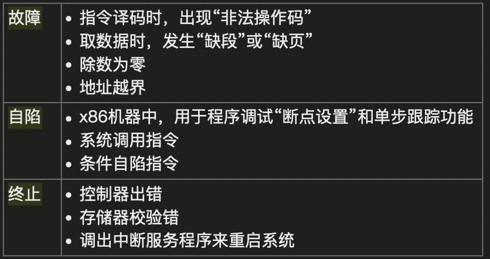

# 2009

## 22

看到外部优先想到CPU外部可能会产生的中断

异常(内中断)--CPU内部--终止异常和外中断是硬件中断

中断(外中断) CPU外部

- 可屏蔽中断

  - Cache缺失

  - I/O中断：键盘输入，打印机缺纸

  - 时钟中断

  - I/O中断请求

- 不可屏蔽中断

  - 通常是非常紧急的硬件故障，如电源掉电等

## 23

并行：同一时刻

并发：同一时间 宏观

## 24

响应比=(等待时间+要求服务时间)/要求服务时间

带权周转时间>1

## 25

2x+1+资源m ==》 x就是最少个数

 

## 26

分配内存主要的保护措施是界地址保护 

## 27

逻辑地址=段号+段长

## 28

文件物理结构(文件在外存上的存储存储)

存储方式：

1. 顺序分配
   - 连续的存储空间-可随机访问
   - 文件头指定起始块的位置和长度
2. 链表分配
   - 隐式链接 -- 通过指针访问
   - 显示链接 -- 把指针放在文件分配表FAT里(在内存中)
3. 索引分配
   - 为每个文件创建索引数据块--存放文件数据块的指针列表-在外存上

## 29

磁盘调度算法：

先来先服务FCFS：按来的顺序访问

最短时间优先SSTF：贪心思想，按照离当前最近的访问，可能不是最优的

电梯算法SCAN：朝向一个方向移动访问，到边缘之后在掉头访问未访问的。LOOK--不需要到最边缘的点

C循环扫描算法C-SCAN：移动到边缘之后，直接从另一边开头重新访问。C-LOOK -- 不需要到最边缘的点，

LOOK -- 不需要到最边缘只需要到最远的一个需要访问的点

## 30

文件控制块FCB

- 基本信息
  - 文件名、文件的物理位置、文件的逻辑结构、文件的物理结构
- 存取控制信息
  - 存取权限
- 使用信息
  - 建立时间，修改时间

## 31

刚开始文件F1的 count=1 F1--物理块count=1

F2为软链接 相当于复制物理块的信息此时count=1

F3为硬链接 此时物理块的count+1=2 由于F2为复制链接(只是个路径) 因此其信息始终和物理块一致  其count值也是2

删除硬链接F1之后，count--=1  

count=0才是文件删除

建立时:软链接 count不变  建立硬链接 count+1

删除时:count都会变 

检索目录(调入内存)时UNIX采用了文件名和其他信息分开的方法，其文件目录结构=文件名+索引结点编号，减少开销

## 32

设备分配的数据结构

设备标识通常是逻辑设备名-程序员系统调用

系统设备表SDT(整个系统就一张，记录连接到系统的设备): 设备类，设备标识符，DCT，驱动程序入口

| 设备控制表DCT          | 控制器控制表COCT             | 通道控制表CHCT           |
| ---------------------- | ---------------------------- | ------------------------ |
| 设备标识符号：deviceid | 控制器标识符号：controllerid | 通道标识符：channelid    |
| 设备状态               | 控制器状态                   | 通道状态                 |
| 指向控制表的指针       | 与控制器相连接的通道表指针   | 与通道连接的控制器表首址 |
| 重复执行次数或时间     | 控制器队列的队首指针         | 通道队列的队首指针       |
| 设备队列的队首指针     | 控制器队列的队尾指针         | 通道队列的队尾指针       |
| 设备类型type           |                              |                          |

