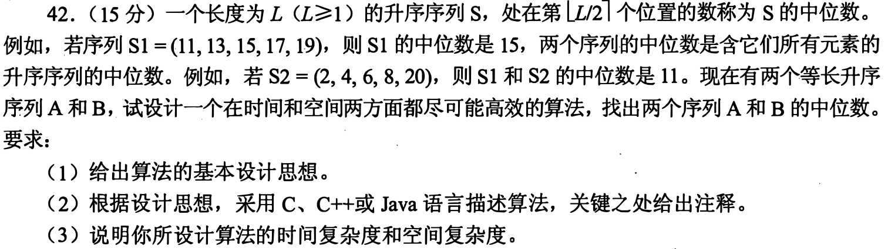
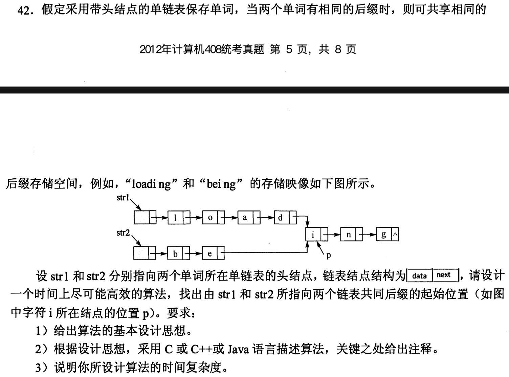
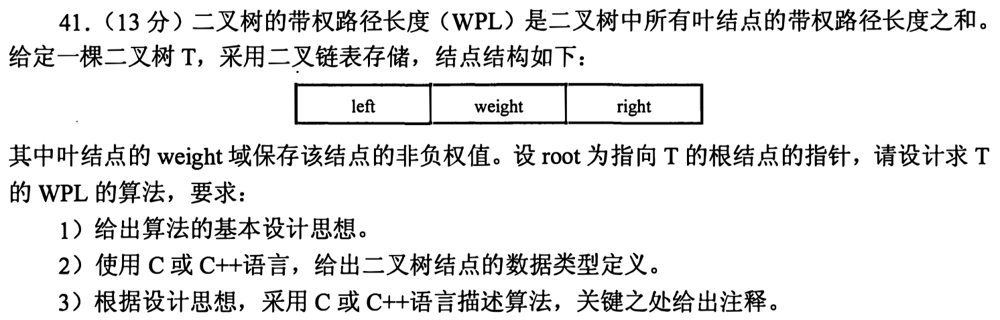
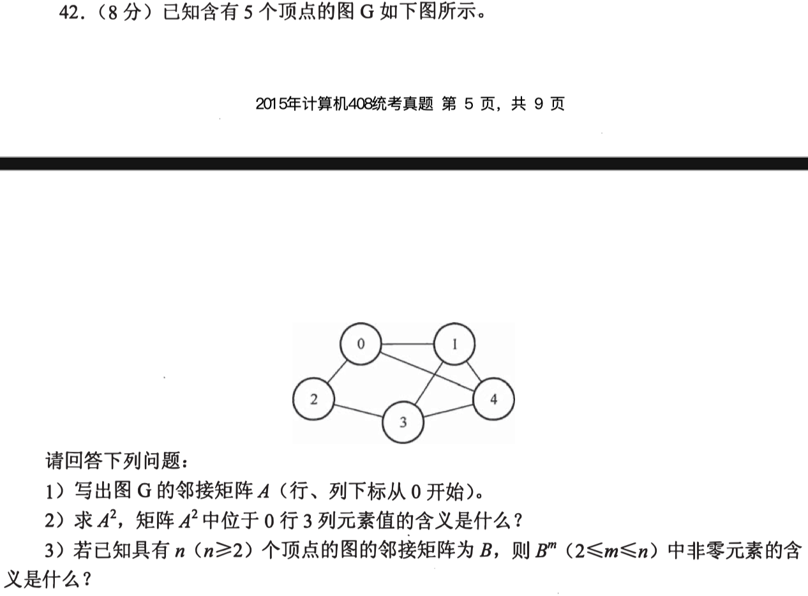
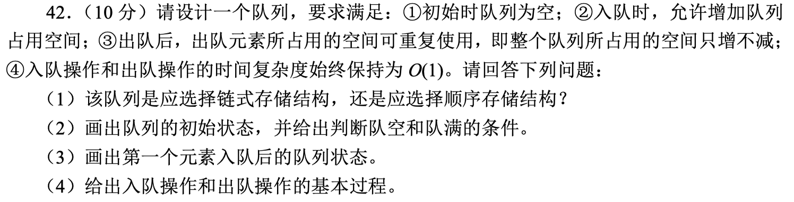

# 2009

## 41 


## 42 


> 1. 基本思想:
>
>    由于单链表只能从前往后查找，因此查找倒数第k个位置就是查找正数第len-k+1个位置(len为单链表的长度)
>
> 2. 实现步骤
>
>    - 求出链表长度len
>    - 判断k是否越界0<=k<len
>    - 找到倒数第k个位置的数组下标(len-k)
>    - 输出结点的值
>
> 3. 如以下代码

```c
//结构体定义-单链表
typedef struct LNode{
  int data;
  struct *link;
}LNode,*LinkList;//两者等价
//实现函数
int Serach_k(LinkList L,int k){
  int len=0;//表长
  LinkList *p=list->link;//设置一个指向第一个结点的指针
  while(p!=NULL){//求表长
    p=p->link;
    len++;
  }
  if(K<0 || k>len) return 0;//判断k是否越界
  for(int i=0;i<len-k;i++){
    p=p->link;
  }
  printf("%d\n",p->data);
  return 0;
}
```

```c
//最优解

```


# 2010

## 41 


## 42


> 1. 基本思想
>
>    创建一个临时数组temp，将原数组中的p~n-1位放到前面，原数组的0-p-1位放到后面，最后把temp数组复制到原数组。
>
> 2. 实现算法
>
> 3. 时间复杂度O(n) 空间复杂度O(1)

```c
//
void RemoveP(int A[],int p,int n){
  int temp[n],k=0;//k用来记录temp位数
  for(int i=p;i<n;i++){ //p-n-1的数据放temp前面位数
    temp[k++]=A[i];
  }
  for(int i=0;i<p;i++){ //0-p-1继续放入temp后面
    temp[k++]=A[i];
  }
  for(int i=0;i<n;i++){ //将temp数据对应移到A[]中
    A[i++]=temp[i++];
  }
}
```


# 2011

## 41 


## 42




> 1. 基本思想
> 2. 算法
> 3. 时间复杂度 空间复杂度

# 2012

## 41


## 42




# 2013

## 41


## 42


# 2014

## 41




## 42


# 2015

## 41


## 42




# 2016

## 42


## 43


# 2017

## 41


## 42


# 2018

## 41


## 42


# 2019

## 41


## 42




# 2020

## 41


## 42


# 2021

## 41


## 42


# 2022

## 41


## 42


# 2023

## 41

## 42


​	
