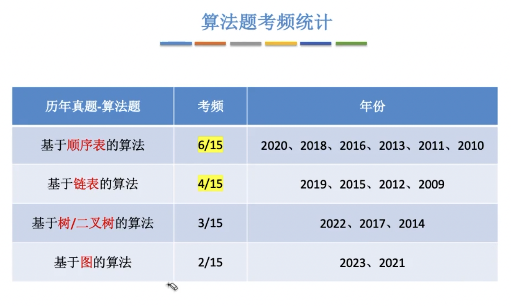


> 【腾讯文档】操作系统历年真题考频统计 （学员专享版）
> https://docs.qq.com/sheet/DRkdFRWRyQ21WcE1B?tab=BB08J2
> 计组【腾讯文档】计组历年真题考频统计 （学员专享版）
> https://docs.qq.com/sheet/DRmtGdU9tUFdhTGNy?tab=BB08J2
> DS【腾讯文档】DS历年真题考频统计 （学员专享版）
> https://docs.qq.com/sheet/DRmhIS2Z0QlNQQ2ZN?tab=BB08J2
> 计网【腾讯文档】计网历年真题考频统计 （学员专享版）
> https://docs.qq.com/sheet/DRlp5WkJ6eVBCcXJG?tab=BB08J2

# 2009

## 41 


> 不能求得最短路径,局部最优不等于全局最优
>
> 如图，如果1-4权值为2，其他每一边权值为1，则按照题目来说最短路径的权值为3，而全局来看1-4为2应该为最短路径
>
> 若A- B为1 A- C为2，则无法求出A- C的最短路径

~~~mermaid
graph LR
1--1-->2--1-->3--1-->4
1--2-->4

A--1-->B
A--2-->C

~~~


## 42 

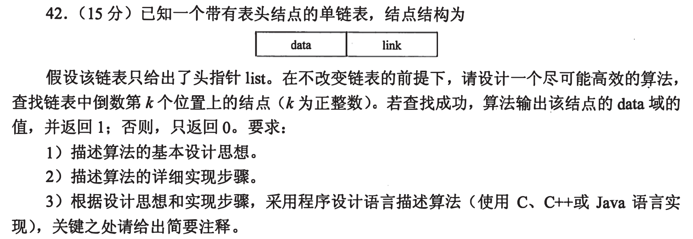

> 1. 基本思想:
>
>    由于单链表只能从前往后查找，因此查找倒数第k个位置就是查找正数第len-k+1个位置(len为单链表的长度)
>
> 2. 实现步骤
>
>    - 求出链表长度len
>    - 判断k是否越界0<=k<len
>    - 找到倒数第k个位置的数组下标(len-k)
>    - 输出结点的值
>
> 3. 如以下代码

```c
//结构体定义-单链表
typedef struct LNode{
  int data;
  struct *link;
}LNode,*LinkList;//两者等价
//实现函数
int Serach_k(LinkList L,int k){
  int len=0;//表长
  LinkList *p=list->link;//设置一个指向第一个结点的指针
  while(p!=NULL){//求表长
    p=p->link;
    len++;
  }
  if(K<0 || k>len) return 0;//判断k是否越界
  for(int i=0;i<len-k;i++){
    p=p->link;
  }
  printf("%d\n",p->data);
  return 0;
}
```

```c
//最优解

```


# 2010

## 41 

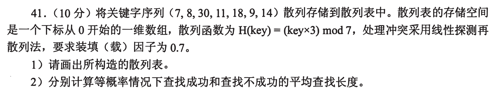

> 装填因子=数据总数/表长=0.7 表长=7/0.7=10
>
> 注意散列函数H(key)=(key***3**)mod 7 --一定不要忘记✖️3
>
> 7：3*7%7=0
>
> 8: 3*8%7=3
>
> 30: 3*30%7=6
>
> 11：3*11%7=5
>
> 18: 3*18%7=5
>
> 9: 3*9%7=6
>
> 14: 3*14%7=0

1. 散列表为

| 下标   | 0    | 1    | 2    | 3    | 4    | 5    | 6    | 7    | 8    | 9    |
| ------ | ---- | ---- | ---- | ---- | ---- | ---- | ---- | ---- | ---- | ---- |
| 关键字 | 7    | 14   |      | 8    |      | 11   | 30   | 18   | 9    |      |

2. 

查找成功：

| key  | 7    | 8    | 30   | 11   | 18   | 9    | 14   |
| ---- | ---- | ---- | ---- | ---- | ---- | ---- | ---- |
| 次数 | 1    | 1    | 1    | 1    | 3    | 3    | 2    |

ASL(成功)=1/7 * (1+1+1+1+3+3+2)=12/7

查找失败(按位置来-散列函数mod后面的数字 对应7--0～6)

| key  | 0    | 1    | 2    | 3    | 4    | 5    | 6    |
| ---- | ---- | ---- | ---- | ---- | ---- | ---- | ---- |
| 次数 | 3    | 2    | 1    | 2    | 1    | 5    | 4    |

失败次数为找到散列表为空的地方为止

ASL(失败)=1/7 * (3+2+1+2+1+5+4)=18/7


## 42


> 1. 基本思想
>
>    创建一个临时数组temp，将原数组中的p~n-1位放到前面，原数组的0-p-1位放到后面，最后把temp数组复制到原数组。
>
> 2. 实现算法
>
> 3. 时间复杂度O(n) 空间复杂度O(1)

```c
//
void RemoveP(int A[],int p,int n){
  int temp[n],k=0;//k用来记录temp位数
  for(int i=p;i<n;i++){ //p-n-1的数据放temp前面位数
    temp[k++]=A[i];
  }
  for(int i=0;i<p;i++){ //0-p-1继续放入temp后面
    temp[k++]=A[i];
  }
  for(int i=0;i<n;i++){ //将temp数据对应移到A[]中
    A[i++]=temp[i++];
  }
}
```

```c
//最优解 数组逆置
//先将数组逆置,再将前n-p个元素和后p个元素逆置
void Reverse(int R[],int left,int right){
  int k=left,j=right,temp;
  while(k<j){
    temp=R[k];
    R[k]=R[j];
    R[j]=temp;
    j--;
    k++;
  }
}
void leftshift(int R[],int n,int p){
  if(p>0&p<n){
    Reverse(R,0,n-1);
    Reverse(R,0,n-p-1);
    Reverse(R,n-p,n-1);
  }
}
```


# 2011

## 41 

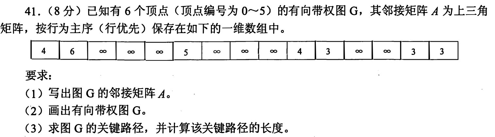


## 42


> 1. 基本思想
> 2. 算法
> 3. 时间复杂度 空间复杂度

# 2012

## 41

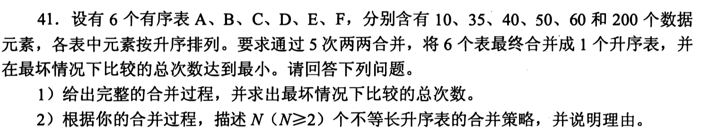

```c
//最坏的比较次数(表长m,n):m+n-1
1) 采用哈夫曼树构建
  比较总次数:10+35-1 + 45+40-1 50+60-1 85+110-1 195+200-1 
2)
	采用哈夫曼树的思想，依次构建最短的两个表进行合并，可以获得最佳的合并效率

```


## 42


```c
//两个链表已经有共享空间了，现在只是去找共同后缀，而不是去匹配
//暴力解
1)
  基本思想:
	1.定义两个指针p、q，分别前进遍历(非空就前进)
	2.p每次走一步，q就遍历一遍链表，并和p进行对比
	3.当相等的时候就是共同后缀
2)
//链表的定义
typedef struct Lnode{
  int data;
  struct Lnode *next;
}Lnode,*Linklist;

Linklist SearchCommon(Linklist L1,Linklist L2){
  Linklist p = L1->next;//指向第一个结点
  Linklist q = L2->next;
  while(p!=NULL){
    while(q!=NULL){
      if(p==q){
        return q;
      }
      q=q->next;
    }
    p=p->next;
    q=q->next;
  }
  return NULL;
}
3)
  时间复杂度O(n^2)
```


```c
//最优解
//由于如果有共同后缀的话，那么以尾部对齐，用两个指针p、q，指向m-n+1(mn表长)，使得两个指针从当前位置到表尾的距离是等长的
1)
  基本思想：
  1.求出两个链表的表长m和n
  2.将两个链表以表尾对齐；p、q分别指向str1 str2的头结点，m>=n,p指向m-n+1个结点；n<=m,q就指向第n-m+1个结点
  3.反复将p、q向后移动，并判断他们是否属于同一个结点，同一个结点即为所求。
2)
//结构体定义
typedef struct Node{
  char data;
  struct Node *next;
}SNode;
//求链表长度
int listlen(SNode *head){
  int len =0;
  while(head->next!=NULL){
    len++;
    head=head->next;
  }
  return len;
}
SNOde* findlist(SNode *str1,SNode *str2){
  int m,n;
  SNode *p,*q;
  m=listlen(str1);
  n=listlen(str2);
  for(p=str1;m>n;m--)
    p=p->next;
  for(q=str2;n>m;n--)
    q=q->next;
  while(p->next!=NULL&&p->next!=q->next){//查找共同后缀的起始位置
    p=p->next;
    q=q->next;
  }
  return p->next;
}
3)
  时间复杂度O(m+n)
```


# 2013

## 41


```c
//必备算法--空间换时间O(n) O(n)
//计数思想
int Majority(int A[],int n){
  int *p,max=0;
  p=(int*)malloc(sizeof(int)*n);//申请辅助数组
  for(int i=0;k<n;k++) p[i]=0; //计数组清0
  for(int i=0;i<n;i++){
    p[A[i]]++;
    if(P[A[i]]>p(max)) max=A[i];
  }
  if(p[max]>n/2) return max;
  else return -1;
}


```

>根据给定的数组 A={0,5,5,3,5,1,5,7}，我们来追踪整个过程中 p[A[i]]++ 和 max 的值变化：
>
>初始状态：
>
>辅助数组 p：[0, 0, 0, 0, 0, 0, 0, 0]
>最大值 max：0
>第一次运行（i=0，A[i]=0）：
>
>执行 p[A[i]]++，即 p[0]++
>辅助数组 p：[1, 0, 0, 0, 0, 0, 0, 0]
>max 不变：0
>第二次运行（i=1，A[i]=5）：
>
>执行 p[A[i]]++，即 p[5]++
>辅助数组 p：[1, 0, 0, 0, 0, 1, 0, 0]
>max 更新为 5
>第三次运行（i=2，A[i]=5）：
>
>执行 p[A[i]]++，即 p[5]++
>辅助数组 p：[1, 0, 0, 0, 0, 2, 0, 0]
>max 不变：5
>第四次运行（i=3，A[i]=3）：
>
>执行 p[A[i]]++，即 p[3]++
>辅助数组 p：[1, 0, 0, 1, 0, 2, 0, 0]
>max 不变：5
>第五次运行（i=4，A[i]=5）：
>
>执行 p[A[i]]++，即 p[5]++
>辅助数组 p：[1, 0, 0, 1, 0, 3, 0, 0]
>max 不变：5
>第六次运行（i=5，A[i]=1）：
>
>执行 p[A[i]]++，即 p[1]++
>辅助数组 p：[1, 1, 0, 1, 0, 3, 0, 0]
>max 不变：5
>第七次运行（i=6，A[i]=5）：
>
>执行 p[A[i]]++，即 p[5]++
>辅助数组 p：[1, 1, 0, 1, 0, 4, 0, 0]
>max 不变：5
>第八次运行（i=7，A[i]=7）：
>
>执行 p[A[i]]++，即 p[7]++
>辅助数组 p：[1, 1, 0, 1, 0, 4, 0, 1]
>max 不变：5
>最终结果：
>
>辅助数组 p：[1, 1, 0, 1, 0, 4, 0, 1]
>max：5
>根据最终的辅助数组 p 和最大值 max 的值，我们可以得出结论：数组 A 中出现次数最多的元素是 5，并且它的出现次数为 4


```c
//更暴力解 O(n^2) O(1 )
int Majority(int A[],n){
  int m;
  for(int i=0;i<n;i++){
    m=0;
    for(int j=0;j<n;j++){
      if(A[i]=A[j])
        m++;
      if(m>n/2)
        return A[i];
    }
  }
  return -1;
}
```


## 42


```c
//定位：排序算法题目 数字--字母 概率就看成数字大小
//考点：平均查找长度
1)
  元素按照概率从大到小排列,采用顺序查找方法,
	平均查找长度:0.35*1+0.35*2+0.15*3+0.15*4=2.1
2)
  元素按照概率从大到小排列构成单链表,采用顺序查找方法,
	平均查找长度:0.35*1+0.35*2+0.15*3+0.15*4=2.1
```


# 2014

## 41


```c
1)
	基本设计思想:可以采用递归算法实现
 	叶子结点的WPL=全部叶结点的带权路径长度之和=根结点左子树叶结点之和+右子树叶结点之和
  叶结点的带权路径长度=该结点的weight值+改点的深度
2)
  typedef struct BitNode{
    int weight;
    struct *left,*right;
  }BitNode,*BitTree;
3)
int WPL(BitNode root){
  return welPreOrder(root,0);
}
//WPL是所有叶子结点的带权路径长度之和
int wplPreOrder(BitNode root,int deep){
  static int wpl=0;
  if(root->left==NULL && root->right==NULL){
    wpl+=deep*root->weight; //若为叶结点，则累积WPL
  }
  if(root->left!=NULL){
    wplPreOrder(root->left,deep+1);//左子树不为空，递归遍历
  }
  if(root->right!=NULL){
    wplPreOrder(root->right,deep+1);
  }
  return wpl;//返回WPL值
}
  
```


## 42

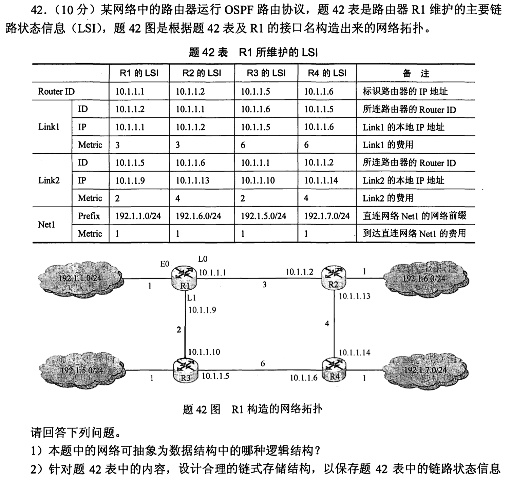

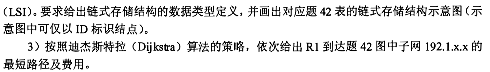

```c
1)
  可以抽象为图结构/无向图/网状结构/非线性结构
2)//可以把每一个路由器当成一个结点，然后连接的弧有两种，一种连接其他路由器一种连接目的网络 NEXT的设置很重要
typedef struct{
  unsigned int ID,IP;
}LinkNode;//Link
typedef struct{
  unsigned int Prefix,Mask;
}NetNode;//NET

typedef struct Node{
  int Flag;
  union{
    LinkNode Lnode;
    NetNode Nnode;
  }LinkORNet;
  unsigned int Metric;
  struct Node *next;
}ArcNode;//弧结点

typedef struct HNode{
  unsigned int RouterID;
  ArcNode *LN_link;
  struct HNode *next;
}HNODE;//表头结点
3)
192.1.1.0/24 直连.			 1
192.1.5.0/24 R1-R2-. 		3
192.1.6.0/24 R1-R2-.   	4
192.1.7.0/24 R1-R2-R4-. 8
```

> 
>
> 
>
> 
>
> 
>
> 遇到这种多个表项的，先选择一项进行提取信息，在拓展，一次看太多会乱的
>
> 最重要的一点是需要对图对信息进行梳理了解，首先LSI是链路状态信息，可以知道是表示对边的信息
>
> 先单个分析R1，Router ID为10.1.1.1 在拓扑图中找到，并且知道这个代表的是路由器的IP
>
> 再看Link1，ID=10.1.1.2，Metric=2可以知道这个连接到R2的那一条边
>
> Link2 ID=10.1.1.5，IP=10.1.1.9表示从L1这边出来，也就是表示到R3的那一条边
>
> Net1就比较好分析了，指向相邻的网络
>
> 总结一下就是：路由器有Router ID标识，然后有两个指针分别指向路由器和网络
>
> 还应该有两个弧结点，分别表示下一跳的信息
>
> 补充：
>
> **OSPF协议基本原理**
>
> 工作过程：邻居发现、路由交换、路由计算、路由维护
>
> 1、邻居表：记录所有建立了邻居关系的路由器，包括相关描述和邻居状态。会定期的相互发送hello报文来维护，若在一定的周期内没有收到领居回应的hello报文，则认为邻居路由器失效，将它从邻居表中删除
>
> 2、链路状态数据库表（LSDB）：此表里包含了网络拓扑中链路状态的通告。**每台路由器在同一个区域内LSDB表一样**
>
> 3、路由表：在获得完整LSDB表后，进行SPF算法，形成最优路由加入路由表


# 2015

## 41

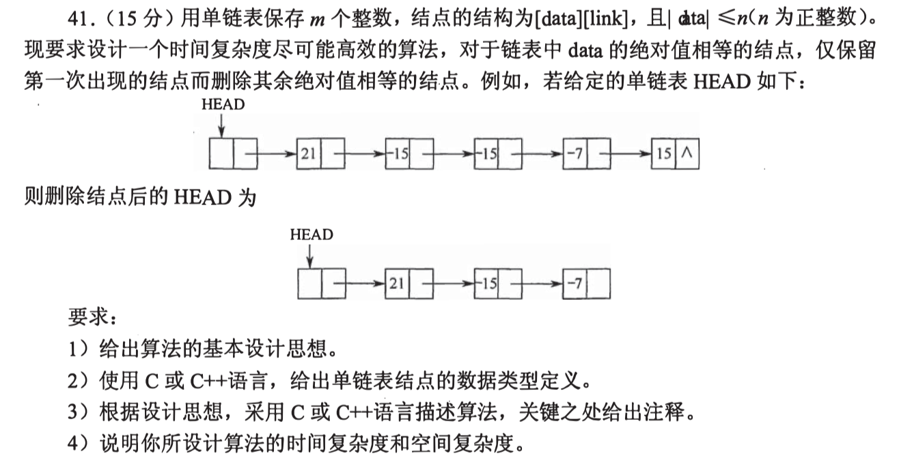


## 42


# 2016

## 42

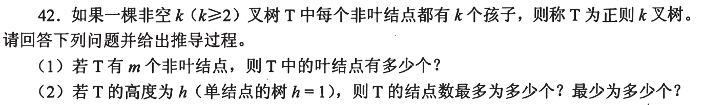


## 43


# 2017

## 41


## 42


# 2018

## 41

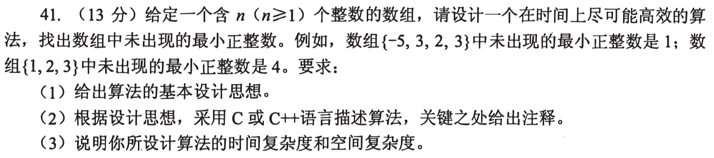


## 42


# 2019

## 41

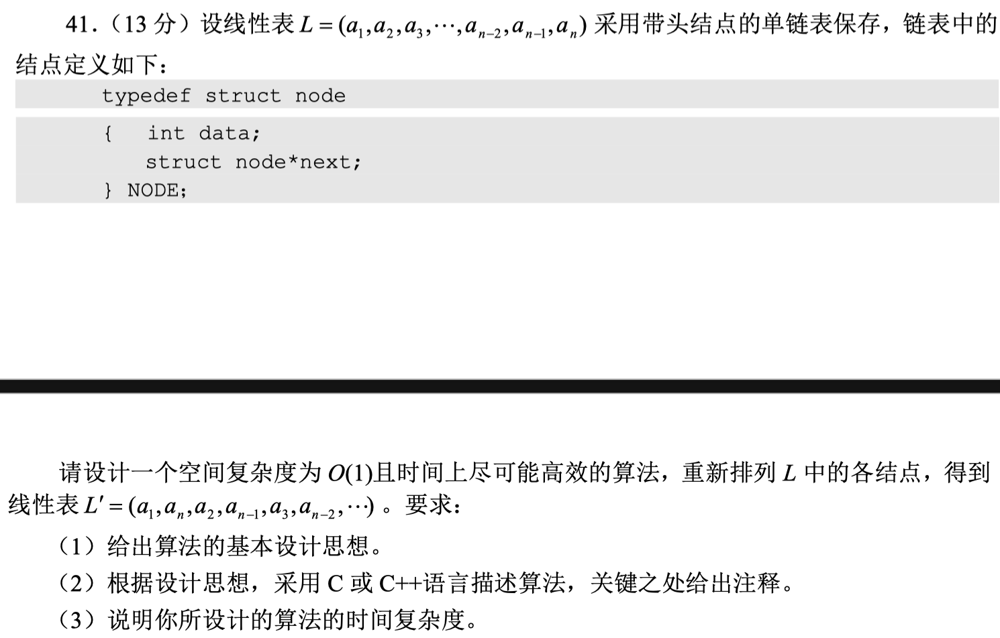


## 42


# 2020

## 41

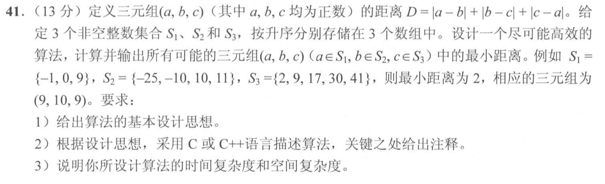


## 42


# 2021

## 41

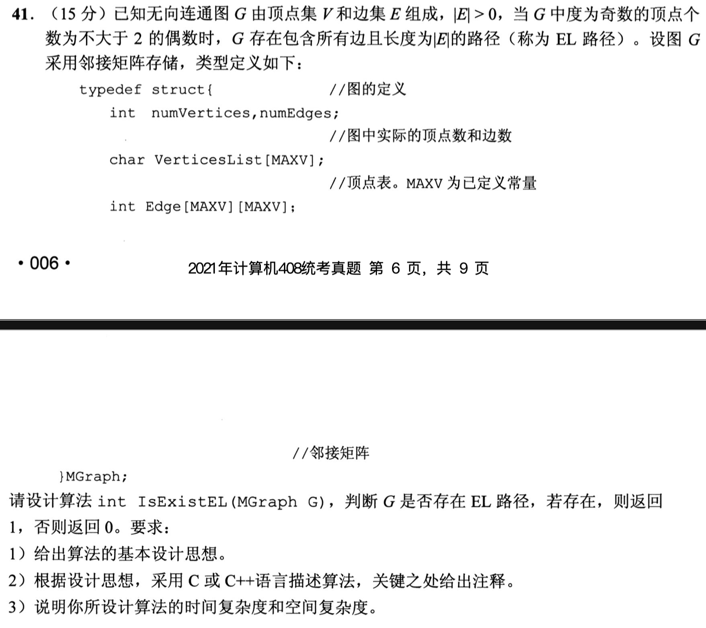


## 42

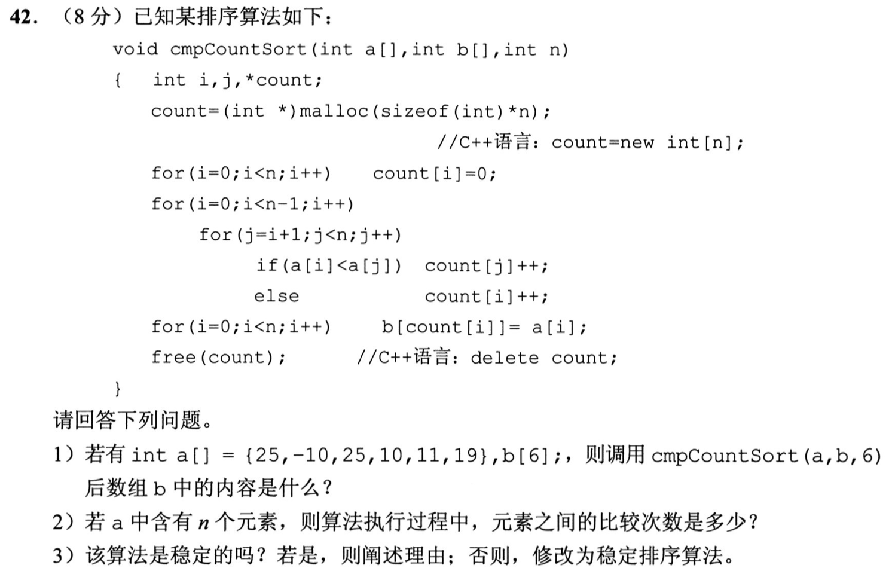


# 2022

## 41


## 42


# 2023

## 41

## 42


​	
