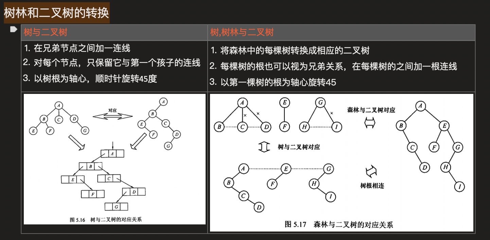
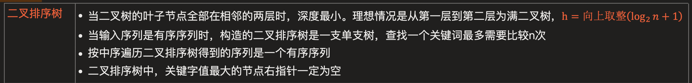
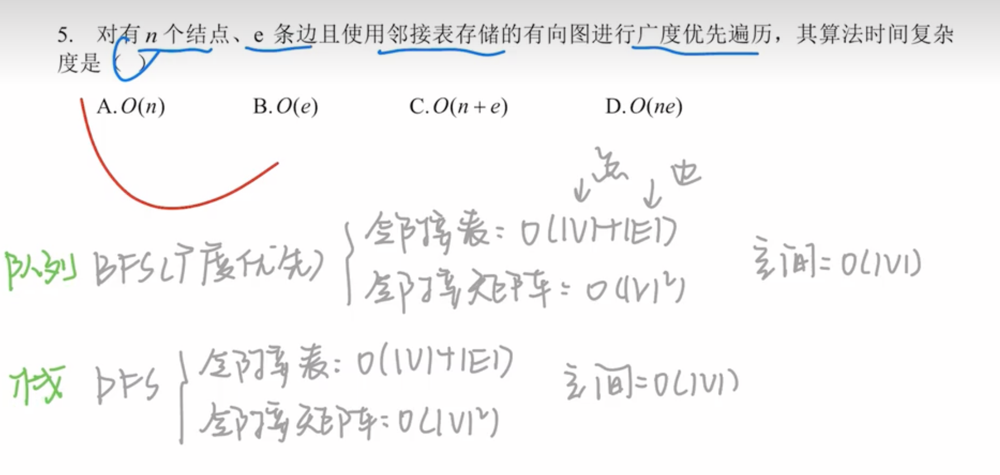
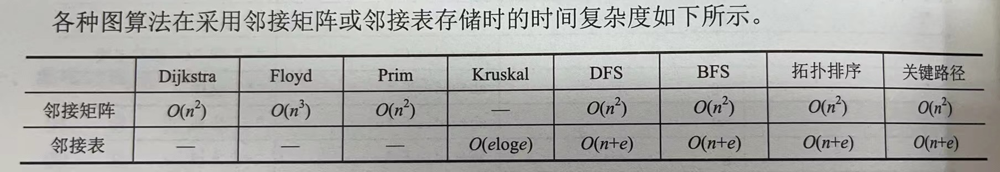

# 2010

## 3

判断后序线索树：1先写出后序序列 2根据前序后继画出线索

## 7

审题：在任何条件下都是连通的

思路：六个顶点组成完全无向图n(n-1)/2 = 15,如果有15条边的情况下，也会导致有一个顶点没有连进来，因此不满足在任何条件下，这是需要将另一个顶点连进来就好了总共15+1=16

## 9

画折半查找判定树，方形结点是虚的，不计入比较次数

最多：log2n +1 最少：1次

## 11

希尔：有个增量d

归并：分组之后再归为一组

基数：个-十-百 分趟

# 2011

## 3

入队：(rear+1)%n

## 6

特殊值法：1-1-1-1-1-....-1-116

## 7

结点值:左<根<右

# 2012

## 2

栈的应用：中缀转后缀

从左向右扫描，如果是操作数就输出，如果是操作符就入栈，继续扫描，如果再次扫描到操作符，和栈顶的比较优先级，优先级高就输出，低和相同就入栈(之前的出栈)，依次扫描，最终得到的输出顺序就是后缀表达式。右扣号会把左括号中间的都弹出，括号不写到输出。

##  4

N(h)=N(h-1)+N(h-2)+1

## 5

## 11

比较趟数

