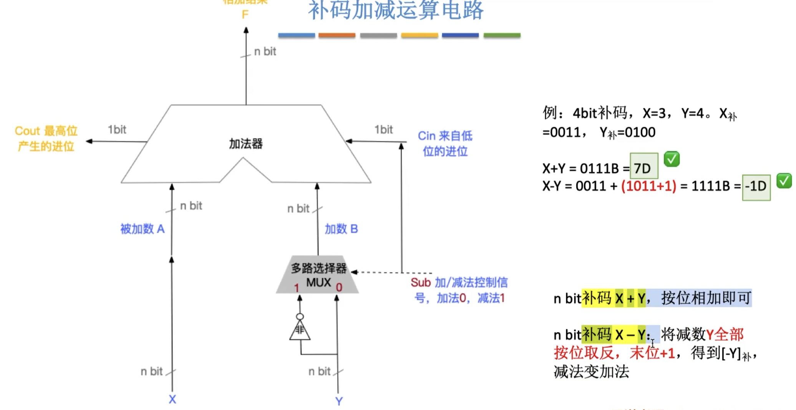

# 2009

## 43-IO


```c
//看到主频 500MHZ表示 1s有500M时钟周期T<==>1个时钟周期=1/500M 
//CPI 执行每条指令平均需要的时钟周期 -- 一般用来算时钟周期数
//传输速率0.5MB/s -- 1s传输0.5MB 传输单位32bit=4B 1秒中断次数0.5MB/4=125000次
1)//用时钟周期个数算比例 CPU一秒500M 主要找到中断次数
  中断一次传输4B 则1s内中断次数:0.5MB/4B=125000次
  中断一次需要的时钟周期个数:(18+2)*5=100个
  1s中断周期个数:125000*100=12500000个
  用于I/O时间占比:12500000/500000000=2.5%
2)//1s传输5MB DMA按块来的
  1s DMA次数:5MB/5000B=1000次
  需要时钟周期个数:1000*500=500000个
  占比:500000/500M=0.1% 
```


## 44 CPU


```c
//错误：C2处应该为MDR<--M(MAR)
//MAR的输出一直使能==MAR的数据直接可以传输到M
//ADD (R1),R0 功能为(R0)+((R1))-->(R1) //(R1) 主存单元 要做的就是把R1的内容先通过MAR做指令定位到内存单元中的数据，然后通过MDR放到暂存器A中
//重点：指令译码之后，R1 R0 ALU的信号 就都准备好了
//ALU是逻辑单元 不是存储单元 不需要写出来
```

| 时钟 | 功能                                    | 有效控制信号     |
| ---- | --------------------------------------- | ---------------- |
| C1   | MAR<--(PC)                              | PCout,MARin      |
| C2   | MDR<--M(MAR),PC<--(PC)+1                | MemR,MDRinE,PC+1 |
| C3   | IR<--(MDR)                              | MDRout,IRin      |
| C4   | 指令译码//R1，R0，ALU的信号选择都就位了 | 无               |
| C5   | MAR<--(R1)                              | R1out,MARin,     |
| C6   | MDR<--M(MAR)                            | MemR,MDRinE      |
| C7   | A<--(MDR)                               | MDRout,Ain       |
| C8   | AC<--(R0)+(A)                           | R0out,ADD,ACin   |
| C9   | MDR<--(AC)                              | ACout,MDRin      |
| C10  | M(MAR)<--(MDR)                          | MDRoutE,Memw     |

第二种可能：外部总线和内部总线可以同时使用

| 时钟 | 功能                                    | 有效控制信号          |
| ---- | --------------------------------------- | --------------------- |
| C1   | MAR<--(PC)                              | PCout,MARin           |
| C2   | MDR<--M(MAR),PC<--(PC)+1                | MemR,MDRinE,PC+1      |
| C3   | IR<--(MDR)                              | MDRout,IRin           |
| C4   | 指令译码//R1，R0，ALU的信号选择都就位了 | 无                    |
| C5   | MAR<--(R1)                              | R1out,MARin           |
| C6   | MDR<--M(MAR),A<--(R0)                   | MemR,MDRinE,R0out,Ain |
| C7   | AC<--(A)+(MDR)                          | MDRout,ADD,ACin       |
| C8   | MDR<--(AC)                              | ACout,MDRin           |
| C9   | M(MAR)<--(MDR)                          | MDRoutE,MemW          |
|      |                                         |                       |


 


开始下一个时钟周期时 把上个时钟周期的信号撤销 


# 2010

## 43 CPU指令


```c
//单字长格式:指令字长=机器字长 相对寻址 按字编址
//一般把运算后的结果放到目的操作数 Ms-寻址特征  s-source d-destination
//操作码(4bit)+两个操作数(各占6bit(寻址特征3bit+形式地址3bit))
1) 16bit=2B 按字编址 128KB/2B= 64K 个字 =2^16 -- 主存地址 16位
  指令系统最多指令条数:2^4=16 //扩展操作码才需要减掉全1点情况
	最多通用寄存器个数:2^(6-3)=8 //主要用来存储形式地址，也是表示形式地址有多少种不同编号
	MAR位数: 128KB/2B=2^16,16bit //存储地址寄存器对应的就是主存地址位数，即对应存储单元个数
	MDR位数:16bit //MDR用于存放数据,主要是CPU与外部交换，也就是机器字长 补充：如果改成8bit的意思就是，每次CPU去主存中取16bit的数据要取两次，这个过程是比较耗时的
2)//转移指令一般来说会覆盖整个主存地址，有时候会限制PC的值来控制范围
	由表中可知:转移目标地址=(PC)+(Rn) //应该是寄存器为16bit PC Rn就都是16bit
	主存地址为16bit,存储器为16位，故(PC)为16位的无符号数，表示范围0~2^{16}-1
	计算机字长16bit，相对位移用补码表示(Rn)的范围是 -2^15 ~ 2^{15}-1
	(PC)-2^15 ~ (PC)+2^{15}-1 又主存的地址空间2^16,地址必须为正，故最大范围0~2^{16}-1，即0000H~FFFFH
3)
	汇编语言的机器吗为: 0010 001100 010101B=2315H
	由题意得:(R4)=1234H (R5)=5678H (1234H)=5678H (5678H)=1234H
  add (R4),(R5)+ 表示为 ((R4))+((R5))->(R5),(R5)+1->R5
  R5、5678H即(R5)的内容会变。
	R5的内容:(R5)+1=5678H+1=5679H
	5678H的内容:((R4))+((R5))=5678H+1234H=68ACH
```


## 44  cache


```c
//CPU与各组件之间数据交换以字为单位，cahche与主存之间以数据块为单位，在虚拟内存还可以以段、页为单位
//程序A:先累完一行，再累加下一行 程序B:先累加完一列,再累加下一列
//int型32补码=4B 一块cache行可以存64B/4B=16个元素，总共8*16=128个
1)
  主存地址：256MB/1B=2^28,故地址位数28位
  cache块内地址：64B/1B=2^6,故块内地址6位
  cache行号:8=2^3,故cache行号为3位
	采用直接映射,主存地址=主存字块标记+cache行号+块内地址
  主存字块标记位:28-6-3=19bit
	cache标记项=有效位(1bit)+标记项(19bit)+一致性维护位(0)+替换控制位(0)=20bit
  cache容量=cache数据+cache指令=64B*8+19bit*8=512B+20B=532B
2)
	 每块cache可以存64B/4B=16个数组元素，按行优先,首地址为320，按字节编址，每个数组元素占4个单元，a[0][31]=320+4*31=444=110111100B(a[0][1]=320+4*1 a[0][2]=320+4*2) 110=第6行
    a[1][1]=320+256*4+4*1=1348=10101000100B(切记是从0~255) 第101=5行
3)
	a[0][0]~a[0][255] 共有256个元素，每个cache块可以有16个元素，8个cache块共有16*8=128个元素，则256个元素会需要两组cache容量，即从a[0][127]之后的数据会将前面的覆盖
	对于程序A来说，行存储是按顺序访问的，也就是每块cache未命中一次，故cache命中率=15/16=93.75%
 	对与程序B来说，由于两个cache替换周期内，cache块已经被替换了，因此cache命中率为0(访问顺序a[0][0]-->a[1][0],必然不会命中)
  
```

| 行号隐含 | 每块大小64B        |
| -------- | ------------------ |
| 0        | a[0]\[0]~a[0]\[15] |
| 1        |                    |
| 2        |                    |
| 3        |                    |
| 4        |                    |
| 5        |                    |
| 6        |                    |
| 7        |                    |


# 2011

## 43 指令


```c
//要熟悉运用补码计算 c语言中用补码表示
R1:X=134=128+4+2=1000 0110=86H
R2:y=246=255-9=1111 1111 - 0000 1001=1111 0110 [-y]补码:0000 1001+1=0000 1010//取反+1
R3:m=1000 0110(补)=1111 1010(原码)=-122
R4:n=1111 0110(补)=1000 1010(原码)=-10
R5:z1=x-y=1000 0110 + 0000 1010=1001 0000=90H
R6:z2=x+y=1000 0110 + 1111 0110=1 0111 1110(溢出 取后8位)=7CH
R7:k1=m-n=1001 0000//直接-122+10=-112 原码:1111 0000 补码:1001 0000
R8:k2=m+n= 1 0111 1000//补码相加
1)R1:86H R5:90H R6:7CH
2)m=-122 k1=-112
3)能，n位加法器实现的是模2^n的无符号加法运算。
  对无符号而言,a+b直接用加法器实现，a-b=a+[-b]补
  对有符号也是一样的的操作。因此可以用同一个加法器完成
4)//带符号溢出OF=1(最高位进位和次高位进位异或) 无符号溢出 CF
  //异或 一真一假为真
	带符号整数通过OF信号判断溢出，OF=1表示溢出，OF结果为最高位进位和减法控制信号异或，即加法器两端输入的信号和输出的信号不同的时候会发生溢出。
```




> [-y]补码 电路实现：通过非门取反，加一(sub=1) sub减法信号为1 == 也是Cin

## 44 内存


```c
//虚拟逻辑地址16MB/1B=2^24,共24位 主存地址1MB/1B=2^20,共20位 页面大小4KB，页内偏移2^12,共12位，cache直接映射共8行，cache块32B/1B=2^5,占5位
1)
  虚拟地址24位，页内偏移12位，则前12位表示虚页号
  物理地址20位，前8位表示页框号
2)
  cache行号占3位，块内地址占5位，则标志位占20-3-5=12位
  主存地址=标志位12位+cache行号3位+块内地址5位
3)
  001C60H，虚页号001H，对应表项命中存在主存中，对应页框号04H，物理地址为04C60H
  后8位为0110000，其中cache行号011=6，此时有效位为0，cache没有命中
4)//需要弄清TLB组成，标记+页框号
  024BACH虚页号024H=000000100100
  采用4路组相联，共存放8个页表项，共8/4=2,占1位
  虚页号拆为标记11+组号1
  标记00000010010=012H，组号0
  则定位到TLB，有效位存在，故存在主存中。
```


# 2012

## 43 IO


```c
//主频 每秒80M个时钟周期
//CPI 执行每条指令平均4个周期 MIPS每秒多少百万条指令
1)//达到访存次数要求--就是cache不命中才需要访存，cache缺失次数300K
  每秒执行指令条数:80M/4=20M,则MIPS=20;//除以CPI这点需要搞懂
	每秒访存次数:20M*1.5=30M，cache缺失次数:30M*(1-99%)=300K次
	每秒需要调入:300K*16B=4.8MB,即带宽为4.8M/s //为什么是至少？因为如果有DMA的时候，也要使用总线，这时候就需要额外的带宽
2)
  每秒产生的缺页异常次数=300K*0.0005%=1.5次，//缺页去磁盘取
	//DMA周期挪用,IO每准备好一个数据块，就向总线发出DMA请求
	总共需要调入数据:1.5*4KB=6KB,每次可准备数据:32bit=4B
  则总共发送请求:6KB/4B=1.5K=1536次
3)
	DMA优先级更高， 由于DMA的数据放在缓冲寄存器，而且DMA一般是用于高速外设，如果得不到及时响应，IO数据可能会丢失。  
4)//这题要多看
//t=T+(m-1)r m个存储体 带宽=总量/时间=n*字长/t 本题求最大带宽，就忽略前面一截，从每个存储体都开始传输开始计算
//最大带宽=存储体个数*单个存储体带宽
	带宽=4*(32bit*50ns)=320MB/s

  
```


常用指令指标速度


## 44 指令


```c
//只有LOAD STORE才能存取数据，其他运算要要用这两条指令把数据写到对应寄存器
//五段流水线 需要再完整复习一下
1)
  513D=0000 0010 0000 0001
  -513=1000 0010 0000 0001
  补码:1111 1101 1111 1111=FDFFH
	//SHR 右移 负数高位补1
  寄存器内容:1111 1110 1111 1111 = FEFFH
2)//一条指令需要5个周期结束
	根据流水线可以得
    时钟周期:5+(4-1)=8个时钟周期
3)
	I3的ID被阻塞的原因：I3和I1、I2都存在数据相关，需要等到I1、I2把数据都写回寄存器之后才能读寄存器内容
	I4被阻塞，因为I3还在IF阶段，I3被阻塞，此时I4就不能进行IF
	I3需要等到R1取数完成之后才能进行使用，因此其ID必须在I1点WB之后，I4的IF是由于I3被阻塞在IF阶段不能使用，同样I4需要用到R1内容，而此时I3还在操作，I5要等到加法完成之后，才能将结果写回寄存器
	先执行取R1，然后可以进行操作了，这样就可以少一个周期，故至少17个周期，如果对换I1 I2就需要18个周期
```


> 每个间隙都有寄存器存储数据


> 按序发射和按序完成：只有前面一个指令取指令之后，后面一个才能取指令，完成也是。如果1，2之间有数据冒险的话，哪怕3指令和他们无关，也不可以提前执行优化。
>
> 转化技术：就是旁路技术，就是图中ALU的旁边那条通路，直接把准备好的数据往前传而使用，而不用存储到寄存器，从而优化
>
> 同时读写：当读写数据不同时，可以对同一寄存器进行同时读写而优化流程
>
> 以上：优化本题都不让


> 影响流水线的因素
>
> 1. 结构相关(资源冲突)
>
>    
>
> 2. 数据相关(数据冲突)
>
>    编译优化是通过调整整体指令顺序，来解决指令执行顺序
>
>    数据旁路是通过将运算结果直接用于计算(ALU)而减少冲突
>
>    
>
>    
>
>    一般是RAW冲突-写后读，
>
>    
>
> 3. 控制相关(控制冲突)
>
>    由于转移指令会导致之前在其后面的指令顺序改变，从而产生冲突，基本判断方法就是提前判别转移目标地址
>
>    
>
>    

# 2013

## 43 IO


```c
1)
  CPU时钟周期:1/800M=1.25ns
	总线时钟周期:1/200M=5ns
  总线带宽:总线宽度*总线频率=32bit*200M=800M/s
2)
  Cache块32B，一次突发传输可以传送32B，则一次突发传输就可以了
3)//完成突发传送总线事务=传送首地址+存储准备+传送数据
  传送首地址时间:一个总线时钟周期=5ns   //由题目一个总线时钟周期传送地址或32位数据
	存储准备数据:40+(8-1)*(40/8)=75ns  
  // 40/8=5 每5ns启动一个存储体 交叉存储按照顺序的话，就需要等一个数据全部完成才能开始下一个，交叉就会一个存储体对第一个数据完成对应部分就去完成第二个数据部分
	传送数据:5ns
	//一个总线时钟周期传32bit，一个存储体刚好需要一个总线时钟周期
  //由于传送数据就在准备数据后面5ns，从整个流水线等角度看，是边准备边传送，只需要在最后一个数据后面加一个传送时间就好，
  总共时间: 5ns+75ns+5ns=85ns
4)
	Cache命中每条指令需要的时钟周期(CPU- Cache):4*1.25=5ns //CPI=4为Cache命中时
	Cache未命中(Cache-主存,通过突发传送+再完成指令):1.2*85ns+5ns=107ns  //加5ns是因为没有题目没有给出CPU访问主存的周期，只能按总线周期进行。
  执行时间:100*0.95*5ns+100*0.05*107ns=1010ns
```


> 
>
> 
>
> 总线宽度=总线宽度*工作频率
>
> 工作频率=总线时钟频率/n，n-完成一次传输需要的时钟周期，本题n=1
>
> 
>
> 
>
> 
>
> 


## 44 指令


```c
1)
  由于机器字长16，根据(PC)+2知，每跳转一条指令，需要2个地址单元，因此16/2=8=1B是按照字节编址
  OFFSET的采用补码形式，其范围为: -128~127,向后转移127条//从0开始
2)//题目没有读懂--正确:C Z N三位是指令中的位数，当C=1 表示需要检测 CF的值，如果CF=1就转移
	//C=1&CF=1 转移 C=0&CF=1 C=1&CF=0 不转移 综合考察CF NF
  //另外地址都用补码表示，
	由图知:CZN=011 因此检查NF的值
  当CF=0,ZF=0,NF=1时,NF=1,此时转移,地址:(PC)+2+OFFSET =200CH+0002H+2*11100011=200CH+0002H+FFC6H=(1)1FD4H //补码主要是按照取模同余的思路设计的，跟进位没什么关系。，所以，两个用补码表示的数相加时，如果最高位（符号位）有进位，则进位被舍弃。
	当CF=0,ZF=0,NF=0时,NF=1,此时不转移,地址:(PC)+2=200EH
3)//比较两个数大小:两个数相减，通过结果判断大小 
	//无符号：看CF，ZF 有符号:看NF，OF，ZF
  //无符号不用符号标志判断是否借位是因为当隔得很远时，最高位表示符号不准确如 000-111 =(1)111
  //有符号的溢出判断：当最高位相同时，结果最高位(符号位)改变，则溢出 OF=1，其他情况为0
  故令C=Z=1 N=0
4)
	1-用于存放当前指令,指令寄存器IR
  2-OFFSET*2,移位运算器
  3-用于加法,加法器
```


转移指令的实现:


# 2014

## 44 指令


> 
>
> 一般会用最低的地址表示这整个地址，如上面就是用08048100H表示了00-03这四个地址
>
> 
>
> 关键点是R3中存放的是A[]的首地址，数组元素之间相差4个地址，就可以得出每个数组的大小
>
> 
>
> 分清地址和机器代码(内容)
>
> 
>
> 
>
> 
>
> 
>
> 
>
> 


```c
1)//每条指令地址差4个地址单元，4个地址单位为4B，则1个地址单位就是1B
  按字节编址
2)//数组元素一定是连续存放的
  二进制左移两位相当于乘4，故数字相隔4个地址单位，计算机按字节编址，所以数组A中每个元素占4B
3)
4)
```


> 
>
> 
>
> 
>
> 
>
> 
>
> 
>
> 硬件方式
>
> 
>
> 软件方式	nop
>
> 
>
> 数据旁路
>
> 
>
> 编译优化：与其插入nop不然根据插入有用的指令
>
> 
>
> 
>
> 控制相关
>
> 
>
> 

## 45  cache 磁盘


# 2015

## 43 CPU


## 44 指令


# 2016

## 44 IO


## 45 内存


# 2017

## 43 指令


## 44 CPU


# 2018

## 43 IO


## 44 内存


# 2019

## 45 CPU


## 46 内存


# 2020

## 43 数据运算


## 44 cache


# 2021

## 43 指令


## 44 内存


# 2022

## 43 CPU


## 44 IO


# 2023

