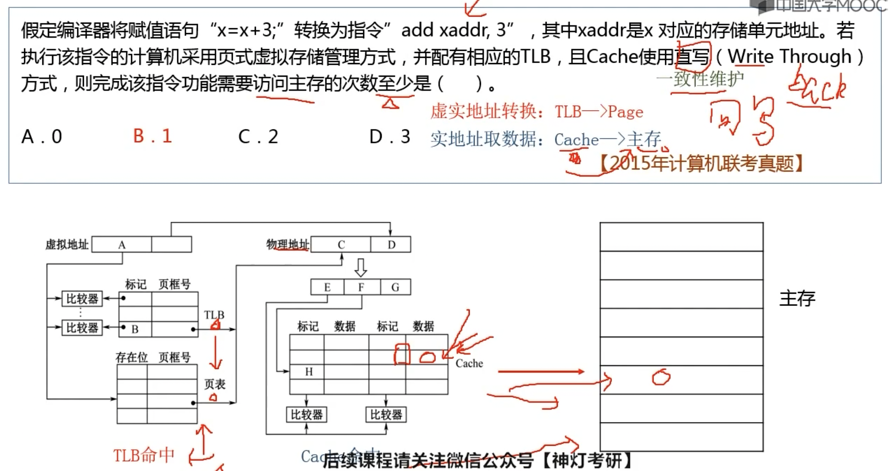
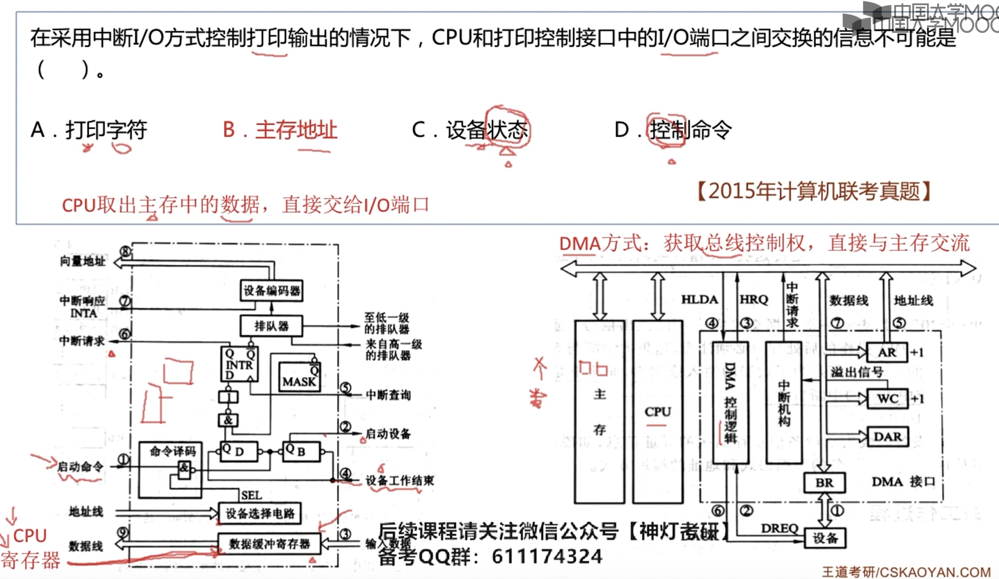

# 2009

## 11

冯诺伊曼计算机指令和数据都是以二进制存储，通过**指令周期的不同阶段**进行区分

## 12

c语言中数据以补码形式表示，32位系统 int-32bit short-16bit

short+int 会强制把short转化int型(符号扩展(-)/零扩展(+)) 相加之后最高位的进位直接丢弃

本题也可以直接把真值相加判断其补码正负进行排除

## 13

> 太容易忘记了
>
> IEEE规格化需要使小数点前是1(1.0xx)
>
> 普通浮点数规格化是使小数点相邻两个位不同(1.0xx/0.1xx)
>
> 计算时把阶码写前面

x=00,111;00.11101

y=00,101;00.10100

对阶 ▶️=111-101=2-移两位

x=00,111;00.11101

y=00,111;00.00101

尾数相加得01.00111  规格化时候尾数需要右移最后有效位，阶码+1=01,000发生溢出

直接X+Y=17/32*2^8 阶码3bit最多111=7 发生溢出

  ## 14

> 这个题的难点在于：主存129号单元指的是第129个字节(因为主存按字节编址)默认从0开始

 一个主存块32字节(32B) 129/32=4...1也就是在第五层(主存块从0开始0,1,2,3,4)也就是第四组，组号:4%8=4

或者 主存块=32B--偏移位数5bit 共8组--组号占3bit 

129=10000001  组号100=4

## 15

主存=RAM+ROM(少) 

## 16

PC+"1"

1表示一个指令的字长 

相对寻址:PC当前指向的指令的下一条指令+相对地址

## 17

## 18

以最长为准

## 19

## 20

总线带宽:单位时间总线上传输数据的位数B/s

4B/(2*(1/10M))=20MB/s 

## 21

950/1000 =9.5%

# 2010

## 12

CPU执行时间=(指令条数*每条指令时钟周期)/时钟频率

提高时钟频率；编译优化会减少指令数；优化数据通路会减少时钟周期，提高时钟频率；

## 13

8位补码能表示的整数范围-128～127 ；将补码全部转化为真值再进行计算判断

## 14 

1.i为整数没有小数部分，先转化为浮点数只会多零，之后再转化回来int也只会去掉多余的零，不会发生数值变化

2.f有小数，强制int的时候会去掉小数部分，精读丢失

3.double精度要高，只会多零，之后改回来不会变化

4.左边为double型，右边为float型，结果不可能为真

## 15

字位同时扩展 最终 8K*8bit

由2K*4bit组成==>可以知道进行了位扩展(由两片组成一个位) 共有 8K\*8/(2K\*4\*2)=4组 片选线占2bit

8KB=2^13B--13bit 用于地址 另外3位用于之后进行扩展

 0B1FH=000**0 1**011 0001 1111B

最小地址 0000 1000 0000 0000B=0800H

## 18 

对程序员可见：PC，ACC，通用寄存器，标志寄存器，状态寄存器，基址寄存器，

不可见：MAR，MDR，IR，Cache

## 19

> 数据旁路技术也就是让两部件传输数据的路径变短

## 21

中断服务程序：

- 保护现场
  - 程序断点-由隐指令在中断周期完成
  - 保存通用寄存器和状态寄存器的内容-由中断程序完成- Push到堆栈或保存到存储器
- 开中断（多重中断才有）
- 设备服务(中断事件处理)-就是对打印机或者显示器这些设备的操作
- 关中断(多重中断)
- 恢复现场-Pop堆栈
- 开中断 中断返回

## 22

刷新带宽=分辨率\*色深\*帧频

50%用来刷新 总带宽*2

# 2011

## 12

## 13

> 单精度32bit: 1+8+23
>
> 双精度64bit: 1+11+52
>
> 阶码-移码 尾数(前面省略1.)-原码 
>
> 移码转化E-127=真值(本题为3)
>
> -8.25 -就是1
>
> 8.25=1000.01=1.00001*2^3 
>
> E-127=3 E=130=10000010
>
> 1 1000 0010 0000 100 0000 0000 0000 0000 =C104 0000H

## 14

CDROM 光盘

## 15 

MAR的位数决定主存空间的大小

## 16

间接寻址不需要寄存器 EA=(A)

## 17

bgt(大于时转移) 就是比较A和B 也就是用A-B，若A>B ,则此时没有进位，也不为0 故CF=0，ZF=0 则取反就是1

对于无符号数 SF(最高位和sub异或) OF(溢出)没有意义

## 18

## 19

每个周期都要取指令--不用cache的话必访问主存

## 20

握手应答属于总线定时的控制信号

## 21

中断屏蔽字 0-可被中断 1-表示不可被中断

4>0>2>1>3 

求的的屏蔽字 4 0 2 可以打断1 ；1 3 不可以打断1

M4-0: 01010

## 22

1s 500M

200*500/500M=0.2%

# 2012

## 13

y也是无符号unsigned

无符号拓展 补0

符号阔展补1

## 14

E的取值 [1,254]

1.1111.... * 2^{E-127}

(1-2^{-23}+1)*2^127

## 15

1B=8bit 十六进制占两位

## 21

## 22

# 2013

## 12

> MIPS: Million Instruction Per Second 每秒执行多少百万条指令
>
> IPS=主频/CPI
>
> MIPS=IPS/10^6

## 13

> 单精度如：E=1，则为2^{E-127} E的取值1~254
>
> 减偏置值：E-127相当于E最高位取反然后加1
>
> 尾数隐含了1

## 14

> 算术移位：乘是左移，除是右移
>
> ‼️最高位和符号位均进位或都不进位就没有溢出

## 15

> 海明码：

## 16

> 页表基址寄存器+虚页号=页表地址 用来找到页表中对应页框

## 17

## 18

> 指令流水线

## 19

> 北桥连接较快的内部设备
>
> 南桥连接较慢的设备

## 20

> 条带化：数据分片，同时读写到不同磁盘，提高读写速度
>
> RAID：多个廉价磁盘

## 21

> 寻道时间(磁头启动+找到)+延迟时间(1/2r)+传输时间

## 22

> IO中断方式不适合高速外设，多路型DMA控制器也适合同时为多个慢速外设服务

# 2014

## 12

## 13

## 14

## 15

## 16

## 17

## 18

## 19

## 20

## 21

## 22

# 2015

## 12

## 13

## 14

> 补码的规格化之后，小数点前后数值不同-正数0.1 负数1.0 
>
> 注意IEEE是最高位为1并且隐藏，

## 15

> 不要忘记有效位，也就是一致性维护位

## 16

> 这个过程
>
> 虚拟地址分为虚页号+块内地址
>
> 通过虚页号去TLB或页表中找到页框号，
>
> 页框号+块内地址=物理地址，通过物理地址去访问cache
>
> cache根据映射关系可以分成不同的结构(全相联映射 组相联映射 直接映射)
>
> cache策略
>
> - 命中
>   - 直写法 -直接写到cache和主存
>   - 回写法- 给cache设置修改位，为1时，替换算法的时候必须先把这块写回主存才能调别的
> - 未命中
>   - 写分配-先将数据写到cache再按照回写法修改
>   - 非写分配-直接去主存修改
> - 一般搭配就是回写+写分配

## 17

## 18

## 19

每一个存储体的周期为T，每隔T/4启动一次，也就是循环一圈之后又回到这个存储体，可以最大效率利用

## 20

## 21

## 22

# 2016

## 12

## 13

## 14

## 15

## 16

## 17

## 18

## 19

## 20

## 21

## 22

# 2017

## 12

## 13

## 14

## 15

## 16

## 17

## 18

## 19

## 20

## 21

## 22

# 2018

## 12

## 13

## 14

## 15

## 16

## 17

## 18

## 19

## 20

## 21

## 22

# 2019

## 12

## 13

## 14

## 15

## 16

## 17

## 18

## 19

## 20

## 21

## 22

# 2020

## 12

## 13

## 14

## 15

## 16

## 17

## 18

## 19

## 20

## 21

## 22

# 2021

## 12

## 13

## 14

## 15

## 16

## 17

## 18

## 19

## 20

## 21

## 22

# 2022

## 12

## 13

## 14

## 15

## 16

## 17

## 18

## 19

## 20

## 21

## 22

# 2023

## 12

## 13

## 14

## 15

## 16

## 17

## 18

## 19

## 20

## 21

## 22

