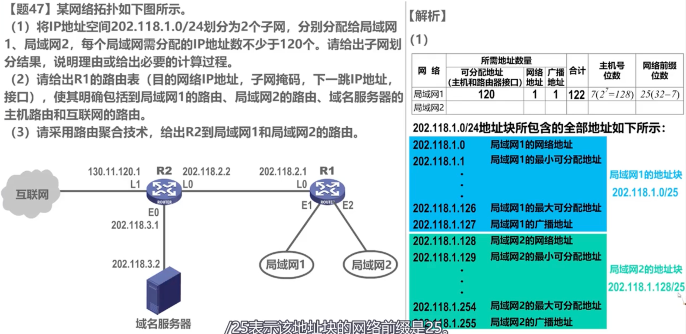
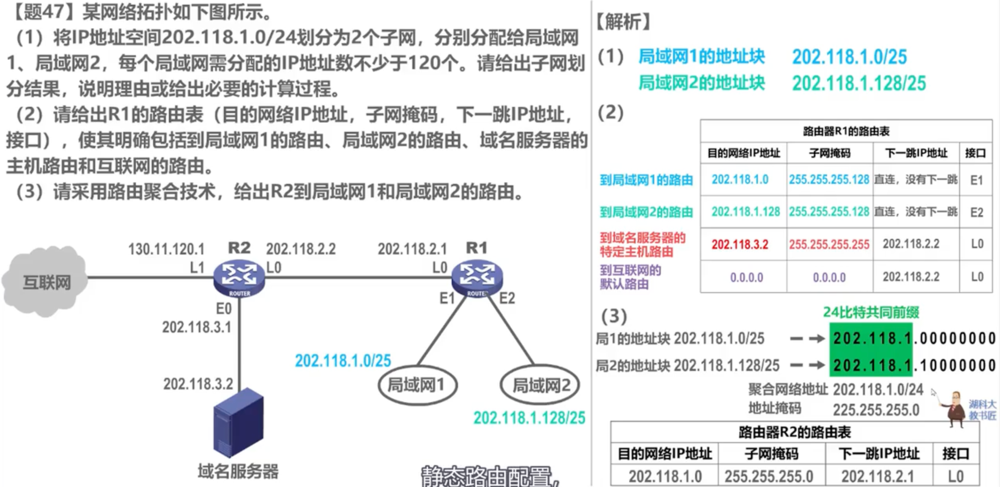
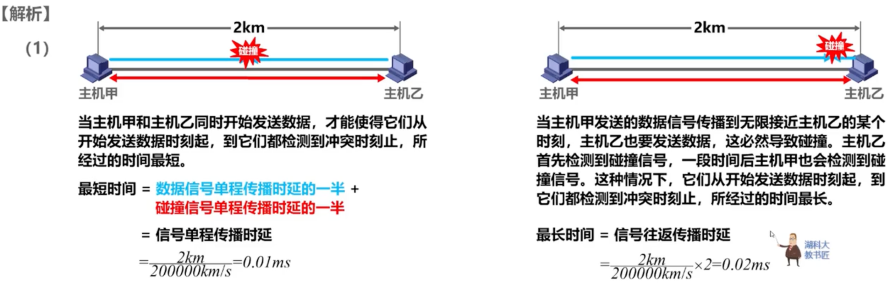
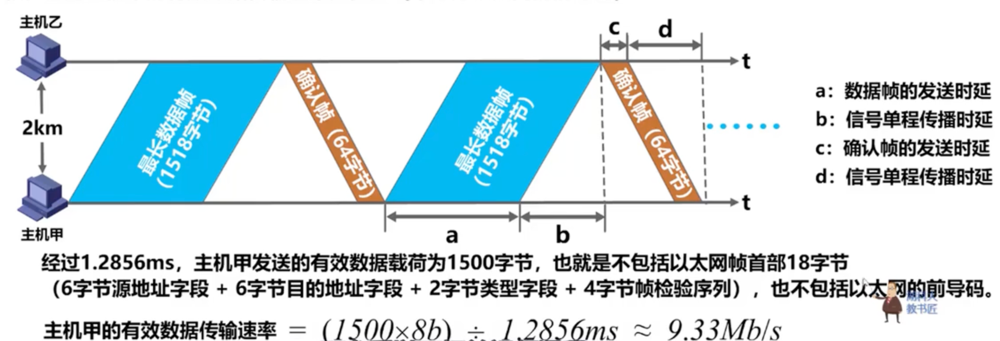

# 2009

## 47

第一问：

所需地址：主机数+网络地址0+广播地址1 = 120+1+1=122 < 128

主机所需位数：7

网络前缀：25 (32-7)

第二问：

域名服务器 子网掩码255.255.255.255表示特定主机路由

互联网-默认路由：如果不去其他IP则都转到默认路由

第三问：

R2到局域网1，2直有在R1这里才会聚合

另外：看到要给出路由，就是要给出路由表的信息

# 2010

## 47-CSMA/CD

1s = 1000ms 

1ms【毫秒】 = 1000μs【微秒】
 1μs【微秒】 = 1000ns【纳秒】
1ns 【纳秒】= 1000ps【皮秒】

主要考查为传播时延

易忽略:最长最短时间的截止点是两台主机都接受到了冲突

发送周期=数据帧发送时延+确认帧时延+往返时延

信道的有效数据传输速率=信道利用率*信道宽度(最大数据传输速率)=发送周期内发送的数据量/发送周期

最大长度为：1518B

最大数据单元 1500B

发送时延：数据量/数据传输速率
$$
k=10^3=千，M=10^6=兆，G=10^9=吉，T=10^{12}=太，\\ P=10^{15}=拍，E=10^{18}=艾，Z=10^{21}=泽，Y=10^{24}=兆。
$$

# 2011

## 47

# 2012

## 47

# 2013

## 47

# 2014 -连在一起

## 43

 42图-数据结构

# 2015

## 47

# 2016 -连在一起

## 41

# 2017

## 47

# 2018

## 47

# 2019

## 47

# 2020

## 47

# 2021

## 47

# 2022

## 47

# 2023

## 47

