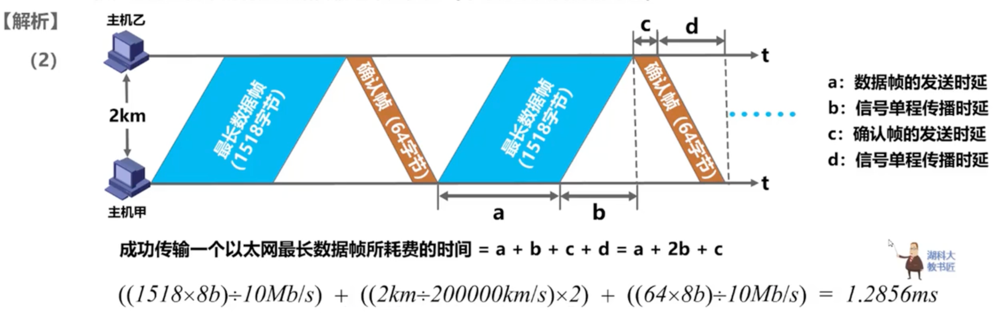
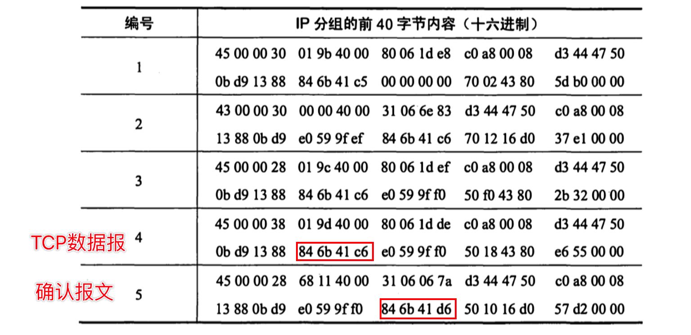

# 2009

## 47


第一问：

所需地址：主机数+网络地址0+广播地址1 = 120+1+1=122 < 128

主机所需位数：7

网络前缀：25 (32-7)

第二问：

域名服务器 子网掩码255.255.255.255表示特定主机路由

互联网-默认路由：如果不去其他IP则都转到默认路由

第三问：

R2到局域网1，2直有在R1这里才会聚合

另外：看到要给出路由，就是要给出路由表的信息


# 2010

## 47-CSMA/CD


1s = 1000ms 

1ms【毫秒】 = 1000μs【微秒】
 1μs【微秒】 = 1000ns【纳秒】
1ns 【纳秒】= 1000ps【皮秒】

主要考查为传播时延

易忽略:最长最短时间的截止点是两台主机都接受到了冲突





发送周期=数据帧发送时延+确认帧时延+往返时延

信道的有效数据传输速率=信道利用率*信道宽度(最大数据传输速率)=发送周期内发送的数据量/发送周期

最大长度为：1518B

最大数据单元 1500B

发送时延：数据量/数据传输速率
$$
k=10^3=千，M=10^6=兆，G=10^9=吉，T=10^{12}=太，\\ P=10^{15}=拍，E=10^{18}=艾，Z=10^{21}=泽，Y=10^{24}=兆。
$$


# 2011

## 47


```c
//ARP原理
//1B=8bit,不要误认为00为2B,不然容易搞错 满盘皆输
1)
  Web服务器的IP地址(IP报中的目的地址)为:64.170.98.32(40 aa 62 20)
	主机默认网关(与互联网直连的路由器充当，也就是数据帧中的目的MAC地址)的MAC地址:00-21-27-21-51-ee
2)//使用协议硬记ARP查找MAC地址 广播请求-响应设备会单播响应 双方都会将对方的IP地址和MAC地址写入自己的缓存
  使用ARP协议，由于不知道目的MAC地址，因此会发送ARP广播请求，广播MAC地址:FF-FF-FF-FF-FF-FF
3)//持续连接方式：服务器建立连接之后保持连接，客户端可以继续发送数据
//非流水方式:只有收到上一个请求响应才会发送下一个请求
  第一个RTT用于请求Web页面，后面还剩5个请求，总共就是6个RTT。//每访问一次对象就用一个RTT
4)//IP地址改变 10.2.128.100 --> 101.12.123.155
//头部校验和：只要其他字段进行改变，这个就会进行改变从而对整个IP报进行校验
  经过R转发时IP分组改变字段：生存时间TTL(减少-1)，源IP地址和头部校验和
```


# 2012

## 47


> H(192.168.0.8- c0 a8 00 08) --- 以太网 --- 路由器 --- internet --- S(211.68.71.80- d3 44 47 50)
>
> 
>
> 1  H-->S 
>
> 2 S-->H
>
> 3 H-->S
>
> 4 H-->S
>
> 5 S-->H
>
> IP报有没有填充(2号应该是5，题目有误)：5*4B=20B为首部固定长度没有填充
>
> 
>
> TCP连接过程：
>
> 
>
> //seq的的差值可以知道传送了多少数据帧
>
> H-->S : SYN=1 ACK=0 seq(序号)=x //TCP连接请求
>
> S-->H : SYN=1 ACK=1 seq =y ack=x+1 //TCP连接请求确认
>
> H-->S : SYN=0 ACK=1 seq=x+1 ack=y+1 //确认的确认
>
> 
>
> //低5为ACK 低2为SYN
>
> 1: 02H=0000 0010 --> ACK=0 SYN=1
>
> 2: 12H=0001 0010 --> ACK=1 SYN=1
>
> 3: f0H=1111 0000 --> ACK=1 SYN=0
>
> 4: 18H=0001 1000 --> ACK=1 SYN=0
>
> 5: 10H=0001 0000 --> ACK=1 SYN=0
>
> 以太网的MAC帧
>
> 
>
> 由于数据载荷最小为46B，如果IP报的数据没有46B就需要填充，这时候就需要通过IP首部的总长度进行判断
>
> 
>
> 1，2: 0030H=48  
>
> 3，5: 0028H=40 //小于46需要填充
>
> 4: 0038H=56
>
>   
>
> 根据TCP连接之后发送的第一个seq 和 ack的差值确定传输了多少
>
> 
>
> 846b41d6H-846b41c6H=16(序号)，发送的数据16B
>
>  
>
> 根据TTL
>
> 
>
> 40H-31H=15，共经过15各路由器


```c
1)//根据源IP地址找到报文是谁发的
  有H发送的为：1、3、4
  //TCP连接这个太细了，首先根据IP分组的首部长度确定IP分组没有补充字段，没有就可以确定后20B为TCP分组，再根据TCP连接过程SYN，ACK的变化确定连接过程  
  完成了TCP连接：1、2、3
  通过快速以太网进行填充: 3、5
2)
  16B
3)
	40H-31H=15个路由器
```


# 2013

## 47


> R1 R3都可以聚合，聚合方法是找到相同前缀
>
> 153.14.5.0/25   == 153.14.5.0000 0000
>
> 153.14.3.128/25 == 153.14.5.1000 0000
>
> 相同为前24位 第25位就不同了 153.14.5.0/24
>
> 194.17.20.0/25 == 194.17.0001 0100.0
>
> 194.17.21.0/24 == 194.17.0001 0101.0
>
> 194.17.20.0/23
>
> 知识点：BGP-4封装在TCP协议

```c
1)//在一个路由器内的都聚合
  
2)
  194.17.20.200有多条匹配的路由信息时，采用最长前缀匹配，选用/25 即194.17.20.128/25 通过E0转发出去
3)
  R1和R2属于外部网关EGP这个协议，典型的是BGP协议，使用最多的是BGP-4
  其报文封装在TCP报文中
```


# 2014

## 43

> OSPF路由选择协议

 42图-数据结构


> 
>
> 将下一条相同的目的网络聚合成一条
>
> 
>
> 每经过一个路由器，TTL-1
>
> 
>
> 


# 2015

## 47


# 2016 -连在一起

## 41


# 2017

## 47


# 2018

## 47


# 2019

## 47


# 2020

## 47


# 2021

## 47


# 2022

## 47


# 2023

## 47


