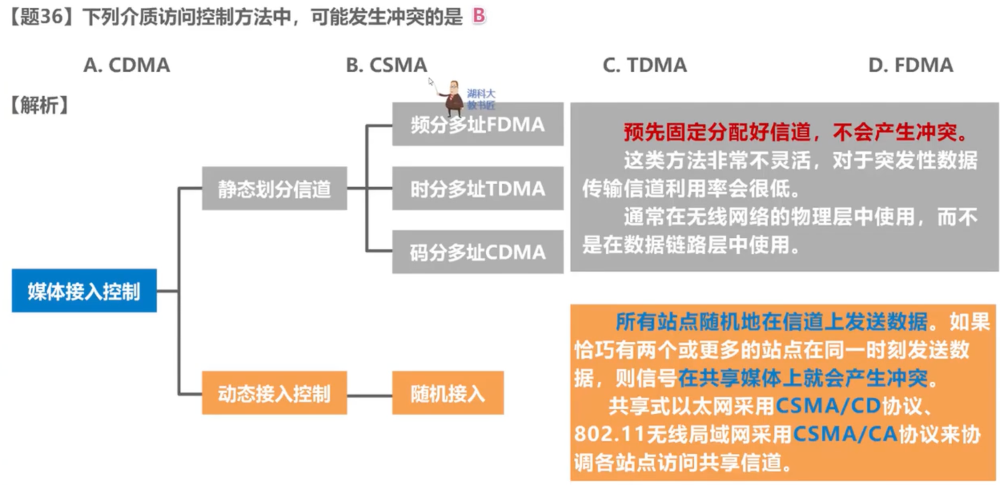

# 2009

## 33

## 34

## 35

三种可靠传输机制

停止-等待协议SW【stop-and-wait】

回退N帧协议GBN【Go-back-N】

选择重传协议SR

## 36

## 37

## 38

## 39 

tcp拥塞控制

 RTT为往返时间，因此有四个间隔 1--2--4--8--9

## 40 

FTP 文件传输协议

# 2010

## 33

内部的具体实现是由具体设备厂家确定的，厂家需要遵循这种体系结构

## 34

转发时延：分组大小/数据传输速率

注意 传播时延忽略了，经过两个路由器就多了两个分组时延

 

## 35

RIP基本原理

 

## 36

## 37

//子网不用不用减2，全0和全1都可以用作子网

**聚合某类网的数量**：如一个C类网包含2^8个地址，用该地址块包含的地址数量除以C类网包含的地址数量，就可以得出该地址块包含多少个C类网络

如题：聚合C类网络的数量：2^(32-24) ➗2^8

聚合还要多看看

## 38

 集线器-广播转发 

中继器-放大整形信号 

网桥和交互机--可以根据MAC地址丢弃数据，如果MAC地址是广播地址就不能

## 39

## 40

域名系统DNS的递归查询方法

本地-根-顶级-权限

迭代查询-多条DNS请求 ？

# 2011

## 33

> 网络层提供的是无连接、尽最大可能交付(不可靠)的数据报服务-- IP协议

提供虚电路服务：需要建立连接

网络层提供数据报服务:可以走不通路径

## 34

 

## 35

> 只用后退n帧才有累积确认
>
> 关键：3号因为没有给其他信息，因此不用考虑，如果考虑进去 不知道超时没有(没超时也不会重传)

## 36

## 37

> Key:找共同前缀  路由表信息的下一条中，直连部分由路由器自己得出，非直连则手工配置
>
> 192.168.2.0 =192.168.2.0000 0000
>
> 192.168.2.128=192.168.2.1000 0000
>
> 192.168.2.0/24

## 38

## 39

## 40

# 2012

## 33

ICMP用于询问查询和差错检测，位于网际层，但是选IP协议提供报告，PPP为数据链路层的协议

## 34

网络协议的三要素:语义、语法、同步

数据链路层的主要任务：封装成帧、差错检测、可靠传输

## 35

## 36

> 数据传输率-->发送时延
>
> 传播时延-->往返时延
>
> 信道利用率=发送时延/总时延=a/(a+b+c+d)
>
> 发送时延=帧长/数据传输率
>
> **从发送数据帧到接受到第一个确认帧这段时间内**，发送越多的数据帧信道利用率就越高
>
> 所以选定最小帧长128B

## 37

## 38

## 39

## 40

# 2013

## 33

> 表示层：实现数据表示相关的功能，数据字符集、数据格式化、文本压缩、数据加密解密
>
> OSI：物理层、数据链路层、网络层、传输层、**会话层**、表示层、应用层

## 34

> 10 BaseT 数据传输速率10Mbps，Base表示基带传输，T传输介质双绞线

补充

## 35

> 忽略链路传播延迟、分组头开销和分组拆装时间
>
> 本意是在分组的时候会产生这些时延，如果忽略就可以直接只考虑报文的发送时延

## 36

CD：碰撞检测

CA：碰撞避免

## 37

> 知识点：封装成帧

## 38

> 知识点：交换机

## 39

> 序号问题
>
> 比如序号从1开始，共有10个数据，那么最后一个需要就是10而不是11，这里怎么理解呢，就是将10个数据从1开始编号，而不是加上10

## 40

> 读邮件还可以采用IMAP协议

# 2014

## 33

## 34

## 35

> 香农公式
>
> 奈斯准则
>
> 调制速率=码元传输速率

## 36

 

## 37

## 38

## 39

## 40

# 2015

## 33

## 34

> 1. 不归零编码NRZ
>
>    正电平为1，负电平为0
>
>    需要时钟周期保证同步
>
>    反向不归零:与前一个码元电平相同表示1，不同表示0
>
> 2. 归零编码RZ
>
>    一个码元内都需要归零，不管是正还是负电平，最后一段时间都要回归零电平
>
>    与不归零不同的点就是最后会归零，其他正是1 负是0 不变
>
>    处于低电平情况多，信道利用率低
>
> 3. 曼切斯特编码
>
>    同一个码元：前高后低表示1
>
> 4. 差分曼切斯特编码
>
>    前半个码元和上一个相同表示1，相反为0.
>
>    按前半个码元比较

## 35

> 注意点:链路利用率不小于80%的含义是在整个时延的80%都在发送数据
>
> 注意计算问题: 128kb/s  k为1000 a+b+c=562.5ms
>
> 需要450ms在发送数据，总共发送的数据为128kb/s * 450ms=57600b
>
> 发送的数量:57600/8/1000B=7.2 因此发送窗口至少为8，
>
> **帧序号就是用几个比特表示窗口而不是窗口数**
>
> 
>
> 有选择重传可以推出至少是2^{4-1}=8 

## 36

> 类比上一题的80%时间内发送的数据，可以更加清楚在CSMA/CD中的最小帧长=往返时延*数据传输速率，就是表示在这个时间段里面发送的数据量
>
> CSMA中 - MA表示多点接入 CS表示载波监听，就是如果空闲96bit时间，就发送该帧
>
> CD 边检测碰撞边发送，碰撞之后就停止发送，之后再传
>
> 信道利用率，发送成功的时间占用发一帧的平均时间

## 37

> 以太网交换机从网桥发展过来，不过网桥只用两个端口
>
> 交换机是可以隔绝冲突域(碰撞域)的，这也是比集线器好的地方，集线器一般是信号放大
>
> 交换机连接两个交换机的广播域 就会变成一个更大的广播域

## 38

>  最长前缀匹配 是因为前缀越长，地址越具体
>
> 默认路由是其他路由不匹配时候按其转发

## 39

> 这题重点是放入接受窗口缓存的数据不取走，然后导致接受窗口变小，从而影响发送窗口=min{拥塞窗口，接受窗口}

## 40

# 2016

## 33

## 34

> 香农公式信噪比=10log(S/N)

## 35

> 注意：hub直接全部转发
>
> 交换机的自学习转发
>
> 自学习：登记帧的源MAC地址和进入交换机的端口号
>
> 转发：在帧转发表中查找目的MAC地址所在的转发条目(如果转发端口和进入的一样则丢弃帧，如果找到相关端口就按照其转发，如果找不到条目，则向除进入端口的所有端口进行转发也叫泛洪)

> H2 -->  H4
>
> H2发送的数据帧首先在交换机处进行转发到H4(由于题目没有明确给出转发表，因此就按明确转发到H4，但是要知道如果没有匹配就泛洪)，由于hub属于物理层，因此会泛洪，‼️当H4发送确认帧的时候也会进行泛洪，这时候H3也会收到确认帧，但是交换机因为进行了自学习，转发表已经记录了之前主机进入端口，因此会直接转发到H2。
>
> 两点补充：如果把Hub换成Switch，就不会发送到H3，如果Switch的转发表没有记录则也会转发到H1

## 36

> CSMA/CD 
>
> 最小帧长 = 争用期(一去一来的时间)\*传播速率(单位时间车子的数量) = 2个传播时延\*传播速率
>
> 
>
> 
>
> 以太网规定争用期为512比特时间
>
> 
>
> 100BASE-T的hub，传输速率为100Mb/s
>
> 传播时延是汽车在高速上跑的时间，传输时延是需要加上通过收费站的时间。
>
> 传播速率就是汽车跑的速度
>
> 
>
> 本题：
>
> 传播速度200m/us 就是车跑的速度
>
> 传输速率100Mb/s 就是单位时间从收费站驶入高速的车辆数量
>
> 争用期 一去一来的时间(包括中间耽误的时间) 512b/100Mb/s     -- 512b=64B(最小车的数量)
>
> 传输时延  整个车进站的时间，也就是发送数据所需要的时间
>
> 题目中因为加了个hub，会有个放大信号的时间消耗，但是因为属于物理层，其产生的时延会归到传输速率中，也就是争用期会包含这部分时延，这时候求争用期 64B/100Mb/s=5.12us 现在要求理论最远的距离，因此需要把hub这段时延去掉，单程的传播时延 5.12/2 - 1.535 =1.025us。所以最远距离200m/us \* 1.025us = 205
>
> ‼️区分传播 和 传输  还用速度和速率
>
> 速率用来求时间 速度用来求距离

## 37

> RIP-有陷阱 要好好分析 (坏消息传的慢)
>
> 首先给出的路由表信息 已经收敛
>
> | 路由器 | 下一跳 | 距离 |
> | ------ | ------ | ---- |
> | R1     | R3     | 2    |
> | R2     | R3     | 2    |
> | R3     | -      | 1    |
>
> 然后更新不可达 从R3开始
>
> | 路由器 | 下一跳 | 距离              |
> | ------ | ------ | ----------------- |
> | R3     | -      | min{16,2+1,2+1}=3 |
> | R2     | R3     | min{2+1,3+1}=3    |
> | R1     |        | min{2+1,3+1}=3    |

## 38

## 39

> H1 H2的默认网关没有对应路由器使其出去

## 40

> 主机中若有缓存则不用发送
>
> 没有 则向本地域名服务器迭代查询 本地服务器向其他域名服务器迭代查询(不要遗漏了根域名，所有都会先查询根域名，其次DNS 查询是由本地服务器发起的 向本地域名查询不计入)

# 2017

## 33

## 34

## 35

## 36

## 37

## 38

## 39

## 40

# 2018

## 33

## 34

## 35

## 36

## 37

## 38

## 39

## 40

# 2019

## 33

## 34

## 35

## 36

## 37

## 38

## 39

## 40

# 2020

## 33

## 34

## 35

## 36

## 37

## 38

## 39

## 40

# 2021

## 33

## 34

## 35

## 36

## 37

## 38

## 39

## 40

# 2022

## 33

## 34

## 35

## 36

## 37

## 38

## 39

## 40

# 2023

## 33

## 34

## 35

## 36

## 37

## 38

## 39

## 40

