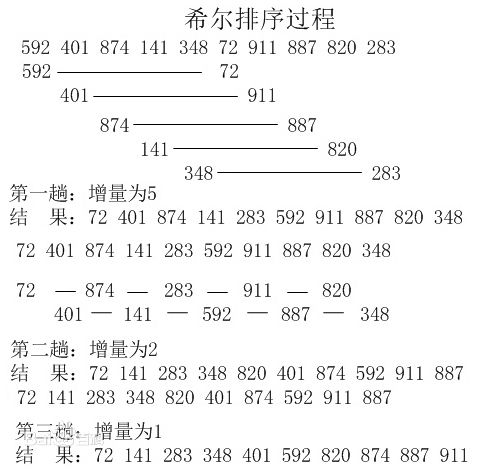
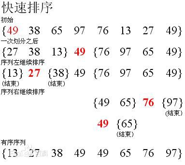
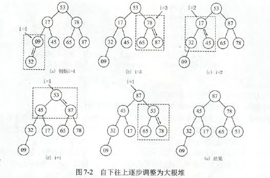
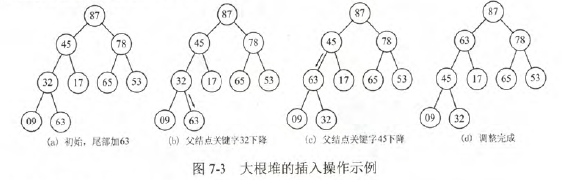
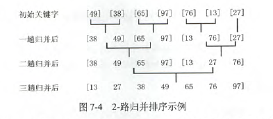
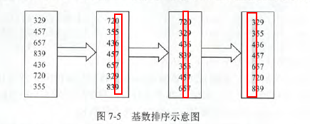

# 排序的基本概念

稳定性：相同的元素，排完后相对顺序不变

内部排序：所有元素都在内存中进行排序

外部排序：元素无法都放在内存中，必须在排序的过程中根据要求不断地在内、外存之间移动的排序

# 7.2插入排序

### 直接插入排序

```C
初始      (49) 38 65 97 76 13 27 49.
i=2：     (38 49) 65 97 76 13 27 49.
i=3：     (38 49 65) 97 76 13 27 49.
i=4：     (38 49 65 97) 76 13 27 49.
i=5：     (38 49 65 76 97) 13 27 49.
i=6：     (13 38 49 65 76 97) 27 49.
i=7：     (13 27 38 49 65 76 97) 49.
i=8：     (13 27 38 49 49. 65 76 97)
```

### 折半插入排序

直接插入排序的查找方法改为折半查找

### 希尔排序

将排序表分割成L[i,i+d,i+2d,..,i+kd]的特殊形式。先取一个小于n的步长d1,把表中的全部记录分成d1组，所有距离为d1的倍数的记录放在同一组中，**各组中进行直接插入排序**；然后取d2<d1，最后的增量一定是1

```C
void ShellSort(ElemType A[],int n){
    for(dk=n/2;dk>=1;dk=dk/2){
        for(i=dk+1;i<=n;++i){
            if(A[i].key<A[i-dk].key){
                A[0]=A[i];
                for(j=i-dk;j>0&&A[0].key<A[j].key;j-=dk>){
                    A[j+dk]=A[j]; // 后移
                }
                A[j+dk]=A[0]
            }
        }
    }
}
```




# 交换排序

### 冒泡排序

一趟冒泡，将最小的元素交换到待排序列的第一个位置.冒泡排序中所产生的有序子序列一定是全局有序的。冒泡排序算法的结束条件时在一趟排序过程中没有发生关键字交换。

```C
void BubbleSort(ElemType A[],int n){
    for(i=0;i<n-1;i++){
        falg=false;  // 本趟是否发生交换
        for(j=n-1;j>i;j--){
            if(A[j-1].key>A[j].key){
                swap(A[j-1],A[j]);
                flag=true;
            }
        }
        if(flag==false){
            return;
        }
    }
}
```

### 快速排序

每次取一个基准元素pivot。每趟排序后，pivot位置确定。



待排序序列越有序，效率越低

# 选择排序

### 简单选择排序

假设排序表为L[1...n],第i趟排序从L[i...n]中选择关键字最小的元素与L(i)交换。

```C
void SelectSort(ElemType A[],int n){
    for(int i=0;i<n-1;i++){
        min=i;
        for(j=i+1;j<n;j++){
            if(A[j]<A[min]){
                min=j;
            }
        }
        if(min!=i){
            swap(A[i],A[min]);
        }
    }
}
```

### 堆排序

堆排序常被用来实现优先级队列。





# 归并排序和基数排序

### 归并排序



### 基数排序

比如对数字排序，创建10个桶，分别是0~9，将数字按最低为放入桶中，一趟结束后，最低为已经有序。



# 各种排序算法总结

|算法种类|最好情况|平均情况|最坏情况|空间复杂度|是否稳定|每次能否固定一个位置|比较次数与初始状态有关|
|-----|-----|-----|-----|-----|-----|-----|-----|
|直接插入排序|$O(n)$|$O(n^2)$|$O(n^2)$|O(1)|是|否|是|
|冒泡排序|$O(n)$|$O(n^2)$|$O(n^2)$|O(1)|是|是|是|
|简单选择排序|$O(n^2)$|$O(n^2)$|$O(n^2)$|O(1)|否|是|否|
|希尔排序| | | |O(1)|否|否|是|
|快速排序|$O(nlog_2n)$|$O(nlog_2n)$|$O(n^2)$|$O(log_2n)$|否|是|是|
|堆排序|$O(nlog_2n)$|$O(nlog_2n)$|$O(nlog_2n)$|$O(1)$|否|是|是|
|2路归并排序|$O(nlog_2n)$|$O(nlog_2n)$|$O(nlog_2n)$|$O(n)$|是|否|-|
|基数排序|$O(d(n+2))$|$O(d(n+r))$|$O(d(n+r))$|$O(r)$|是|否|-|

### 外部排序最佳归并树

在一般情况下，对于 k–路平衡归并来说，若 (m-1)MOD(k-1)=0，则不需要增加虚段；否则需附加 k-(m-1)MOD(k-1)-1 个虚段。


- 算法流程
- 时空复杂度
- 稳定性