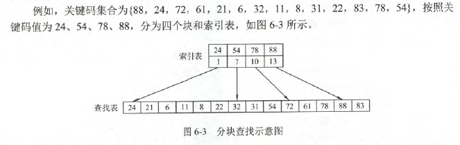
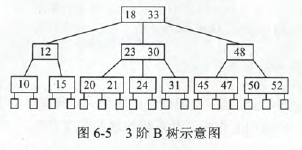
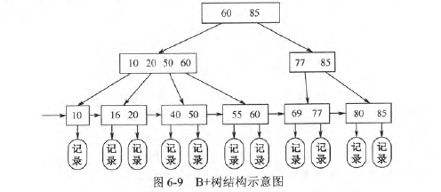
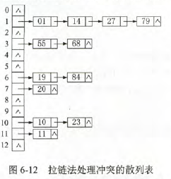
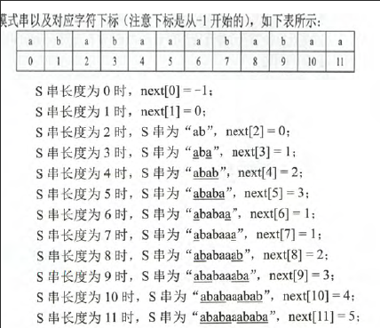

# 查找的基本概念

静态查找表:无需动态地修改查找表.适合静态查找表的方法:顺序,折半,散列.适合动态查找表的方法:散列,二叉排序树的查找

# 顺序查找和折半查找

- 一般线性表的顺序查找

```C
int Search_Seq(SSTable ST,ElemType key){
    ST.elem[0]=key;
    for(i=ST.TableLen;ST.elem[i]!=key;--i);
    return i;
}
```

ST.elem[0]为哨兵：哨兵的作用是遍历时不会越界，即遍历到0时会退出。这要求由后向前遍历

$ALS_{成功}$=n+1/2；$ASL_{不成功}$=n+1

线性链表只能顺序查找

- 有序表的顺序查找：不需查找完就可以退出。

$ASL_{成功}$=n+1/2；$ASL_{不成功}$=n/2+n/(n+1)

- 折半查找：只适用于有序的顺序表

```C
int Binary_Search(SeqList L,ElemType key){
    int low=0,high=L.TableLen-1,mid;
    while(low<=high){
        mid=(low+high)/2;
        if(L.elem[mid]==key){
            return mid;
        }
        else if(L.elem[mid]>key){
            high=mid-1;
        }else{
            low=mid+1;
        }
    }
    return -1;
}
```

ASL=$log_2(n+1)-1$

- 分块查找：索引。块内元素可以无序，但块间元素必须有序。
  - 在索引表中确定待查记录所在的块
  - 在块内顺序查找



# B树和B+树

B树中所有结点的孩子结点数的最大值称为B树的阶。一棵m阶树或为空树，或满足如下特征的m叉树：

- 树中每个结点至多有m棵子树，即至多含m-1个关键字
- 若根结点不是终端结点，则至少有两棵子树
- 除根结点外的所有非叶结点至少有$\lceil m/2\rceil$棵子树，即至少$\lceil m/2\rceil -1$个关键字
- 非叶结点关键字递减，且关键字左子树小于该关键字，右子树大于该关键字
- 所有叶结点在同一层，不带信息

B树是所有结点平衡因子都为0的多路查找树。



B树的高度（磁盘读取次数）：B树大部分操作所需的磁盘存取次数与B树的高度成正比。每个结点最多m-1个关键字，所以关键字$n<=(m-1)(1+m+m^2+...+m^{h-1})=m^h-1$.所以$h>=log_m(n+1)$.最大值：h$<=log_{\lceil m/2 \rceil}((n+1)/2)+1$

### B+树

B与B+树的区别

- 在B+树中，n个关键字的结点含有n棵子树，即每个关键字对应一棵子树。而B树中，具有n个关键字的结点含有n+1棵子树
- 在B+树种，每个结点的关键字个数n的范围是$\lceil m/2\rceil <=n<= m$(根结点1<=n<=n)；在B树中，每个结点的关键字个数n的范围是$\lceil m/2 \rceil -1<=n<=n-1$,(根结点1<=n<=m-1)
- 在B+树中，叶结点包含信息，所有非叶结点仅起索引作用，非叶结点中的每个索引项只含有相应子树的最大关键字和指向该子树的指针，不含该关键字对应记录的存储地址
- 在B+树种，叶结点包含了全部关键字，即在非叶结点种出现的关键字也会出现在叶结点种；而在B树中，叶结点包含的关键字和其他结点包含的关键字是不重复的。



# 散列表

### 散列表的构造方法

- 直接定址法：H(key)=a*key+b.a,b是常数。最简单且无冲突。适合关键字分布基本连续的情况，若关键字非陪不连续，空位较多，会造成空间浪费
- 除留余数法：H(key)=key%p.p是一个不大于m(散列表长度)，但接近于m的质数。
- 数字分析法
- 平法取中法
- 折叠发

### 冲突处理的方法

- 开放地址发：$H_i=(H(key)+d_i)\%m$,空现地址既向它的同义词开放，又向它的非同义词开放。m为散列表长，d为增量序列。【注意】：不能随意物理删除表中的元素，若删除，会截断其他具有相同散列地址的元素的查找地址。
  - 线性探测法：$d_i=0,1,2,...,m-1$,发生冲突时，看看下一个。容易产生堆积现象
  - 平方探测法：$d_i=0^2,1^2,-1^2,2^2,-2^2,...,k^2,-k^2$,k<=m/2.散列表长度m必须是一个可以表示成4k+3的素数。能解决堆积现象，但不能探测到散列表的所有单元
  - 再散列法：$d_i=Hash_2(key)$，再通过另外一个散列函数计算关键字的地址增量。$H_i=(H(key)+i*Hash_2(key))\%m$,i是冲突次数，初始时为0.
- 拉链法：同义词存储在一个线性表中。



### 散列表查找及性能分析

$\alpha=\frac{表中记录数n}{散列表长度m}$，散列表的平均查找长度依赖于散列表的装填因子$\alpha$,而不直接依赖于n或m。$\alpha$越大，冲突的可能性越大。

# 串

KMP算法！！！！！！！

计算next。

前一个next为n时，匹配前面串前n与后n是否相同，相同这个next是n+1,不同的话就-1，再匹配，匹配到相同后+1，以此类推。



计算next，就是看当前字符前的子串前后相同的长度，若由0开始，则next[i]=前后相同长度+1，若由-1开始，next[i]=前后相同长度。nextval第一个是和next值一样，后面的话对比a[next[i]]，如果相同的话，nextval[i]=nextval[next[i]]，就是两个一样，如果不同的话，nextval[i]=next[i]，这个nextval的作用和next一样，只不过是加强版，能更快。都是用来比较用的