# 树的基本定义

### 树的定义

树是n个结点的有限集合，n=0时，称为空树。

- 有且仅有一个根结点
- n>1时，其余结可分为m个互不相交的有限集合$T_1,T_2,...,T_m$,其中每个集合本身又是一棵树，称为根结点的子树。
- 树的根结点没有前驱结点，其余结点有且仅有一个前驱结点。
- 数中所有结点可以有零个或多个后继结点。

### 基本术语

- 度：子结点的个数，度大于0的称为分支结点，度等于0为叶子结点
- 深度、高度和层次：深度是从根结点开始自顶向下逐层累加的。高度是从叶结点开始自底向上逐层累加的。

### 树的性质

- 树中的结点数等于所有结点的度数加1（加的是根）
- 度为m的树中第i层至多有$m^{i-1}$个结点
- 高度为h的m叉树至多有$(m^h-1)/(m-1)$个结点
- 具有n个结点的m叉树的最小高度为$\lceil log_m(n(m-1)+1)\rceil$

# 二叉树的概念

### 二叉树的定义及其主要特征

二叉树有左右之分，其次数不能任意颠倒。

二叉树与度为2的有序树的区别

- 度为2的树至少有3个结点，而二叉树可以为空。
- 度为2的有序树的左右次序是相对于另一个孩子结点而言的，若某个结点只有一个孩子结点，则这个孩子结点就无须区分左右次序。而二叉树不一样。

几个特殊的二叉树

- 满二叉树：高度为h，且含有$2^h-1$个结点。每层都含有最多的结点。除了叶子结点度都为2.
- 完全二叉树：高度为h，有n个结点。特点如下
  - 若$i<=\lceil n/2\rceil$,则结点i为分支结点，否则为叶子结点
  - 叶子结点只可能在层次最大的两层上出现。
  - 若有度为1的结点，则只能有一个，且该结点只有左孩子而无右孩子。
  - 按层序编号，若i结点为叶子结点或只有左孩子，则编号大于i的结点均为叶子结点。
  - 若n为奇数，则每个分支都有左子女和右子女；若n为偶数，则编号最大的分支结点(编号为n/2)只有左子女，没有右子女。
- 二叉排序树：左子树上所有结点均小于根结点的关键字；右子树所有结点均大于根结点的关键字。左子树和右子树个是一棵二叉排序树。
- 平衡二叉树：树上任一结点的左子树和右子树的深度之差不超过1.

二叉树的性质：

- 非空二叉树的叶子结点数等于度为2的结点数加1，即$n_0=n_2+1$
- 非空二叉树第k层最多有$2^{k-1}$个结点
- 高度为h的二叉树至多有$2^h-1$个结点
- 具有n个结点的完全二叉树的高度$\lceil log_2(n+1)\rceil$或$\lfloor log_2n\rfloor+1$

### 二叉树的存储结构

- 顺序存储结构：用一组地址连续的存储单元一次自上而下、自左至右存储**完全二叉树**的结点元素。即完全二叉树编号为i的结点元素存储在某个数组下标为i-1的分量中。该结构对顺序二叉树和完全二叉树比较合适。这种存储结构要从数组下标1开始存储数中的结点。

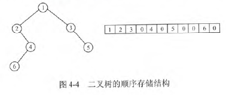

- 链式存储结构:在含有n个结点的二叉链表中，含有n+1个空链域

```C
typedef struct BiTNode{
    ElemType data;
    struct BiTNode *lchild *rchild;
}BiTNode,*BiTree;
```

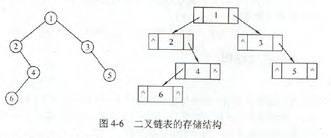

# 二叉树的遍历和线索二叉树

### 二叉树的遍历

- 先序遍历
  - 访问根结点
  - 先序遍历左子树
  - 先序遍历右子树

```C
void PreOrder(BiTree T){
    if(T!=null){
        visit(T);
        PreOrder(T->lchild);
        PreOrder(T->rchild);
    }
}
```

- 中序遍历
  - 中序遍历左子树
  - 访问根结点
  - 中序遍历右子树

```C
void InOrder(BiTree T){
    if(T!=null){
        InOrder(T->lchild);
        visit(T);
        InOrder(T->rchild);
    }
}
```

- 后序遍历
  - 后序遍历左子树
  - 后序遍历右子树
  - 访问根结点

```C
void PostOrder(BiTree T){
    if(T!=null){
        PostOrder(T->lchild);
        PostOrder(T->rchild);
        visit(T);
    }
}
```

不管是哪种算法，每个结点都访问一次且仅访问一次，故时间复杂度都是O(n).

- 递归算法和非递归算法的转换

```C
// 中序遍历非递归算法，需要借用一个栈
void InOrder2(BiTree T){
    InitStack(S); BiTree p=T;  // p是遍历指针
    while(p||!isEmpty(S)){
        if(p){
            Push(S,p);
            p=p->lchild;
        }
        else{
            Pop(S,p);visit(p);
            p=p->rchild;
        }
    }
}
```

显然非递归算法效率要高于递归算法。

- 层次遍历:先将根结点入队，然后出队，访问该结点，出队同时，若有左子树，则将左子树根结点入队；若有右子树，则将右子树根结点入队。

```C
void LevelOrder(BiTree T){
    InitQueue(Q);
    BiTree p;
    EnQueue(Q,T);
    while(!isEmpty(Q)){
        DeQueue(Q,p);
        visit(p);
        if(p->lchild!=null){
            EnQueue(Q,p->lchild);
        }
        if(p->rchild!=null){
            EnQueue(Q,p->rchild);
        }
    }
}
```

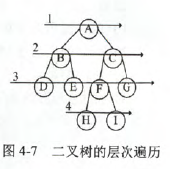

- 由遍历序列构造二叉树:由二叉树的先序序列和中序序列可以唯一地确定一棵二叉树；由二叉树地后序序列和中序序列可以唯一地确定一棵二叉树。

【例】先序序列(ABCDEFGHI)，中序序列(BCAEDGHFI)

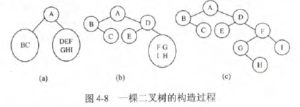

### 线索二叉树

在有n个结点的二叉树中，有n+1个空指针。这是因为每个叶结点有2个空指针，而每个度为1的结点有1个空指针，总的空指针数为$2n_0+n_1$,又有$n_0=n_2+1$，所以总的空指针为$n_0+n_1+n_2+1=n+1$

线索二叉树规定：若无左子树，令lchild指向其前驱结点；若无右子树，令rchild指向其后继结点

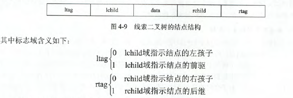

```C
typedef struct ThreadNode{
    ElemType data;
    struct ThreadNode *lchild,*rchild;
    int ltag,rtag;
}ThreadNode,*ThreadTree;
```

线索二叉树的构造：遍历一次二叉树，只是在遍历的过程中，检查当前结点的左右指针域是否为空，若为空，将它们改为指向前驱结点或后继结点的线索。

```C
void CreateInThread(ThreadTree T){
    ThreadTree pre=null;
    if(T!=null){
        InThread(T,pre);
        pre->rchild=null;
        pre->rtag=1;
    }
}
void InThread(ThreadTree &p,ThreadTee &pre){
    if(p!=null){
        InThread(p->lchild,pre);
        if(p->lchild==null){
            p->lchild=pre;
            p->ltag=1;
        }
        if(pre!=null&&pre->rchild==null){
            pre->rchild=p;
            pre->rtag=1;
        }
        pre=p;
        InThread(p->rchild,pre);
    }
}

```

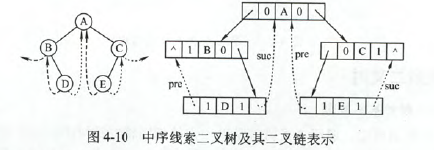

增加头结点的线索二叉树

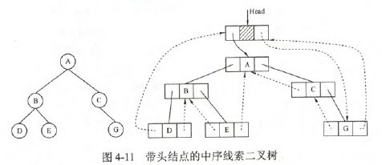

线索二叉树的遍历：利用线索二叉树，可以实现二叉树遍历的非递归算法

```C
void Inorder(ThreadNode *T){
    for(ThreadNode *p=Firstnode(T);p!=NULL;p=Nextnode(p))
        visit(p);
}
ThreadNode *Fisrtnode(ThreadNode *p){
    while(p->ltag==0) p=p->lchild;
    return p;
}
ThreadNode *Nextnode(ThreadNode *p){
    if(p->rtag==0) return Firstnode(p->rchild);
    else return p->rchild;
}
```

# 树、森林

### 树的存储结构

- 双亲表示法：采用一组连续空间来存储每个结点，同时每个结点中增设一个伪指针，指示其双亲结点在数组中的位置。可以很快得到每个结点的双亲结点，但求结点的孩子时需要遍历整个结构。

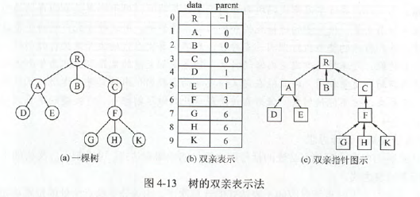

- 孩子表示法:将每个结点的孩子结点都用单链表连接起来形成一个线性结构，n个结点就有n个孩子链表。寻找子女操作非常直接，而寻找双亲需要遍历n个结点中孩子链表指针域所指向的n个孩子链表

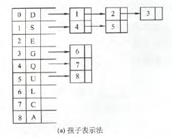

- 孩子兄弟表示法:又称二叉树表示法，即以二叉链表作为树的存储结构。每个结点分为三部分：结点值、指向结点第一个孩子节点的指针，指向结点下一个兄弟结点的指针。优点是可以方便地实现树转换为二叉树的操作，易于查找结点的孩子等。缺点是查找双亲麻烦

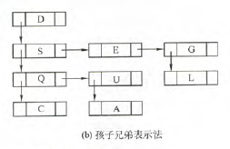

### 树、森林以及二叉树的转换

树转换为二叉树的规则：每个结点左指针指向它的**第一个孩子结点**，右指针指向它在树中相邻的兄弟节点，“左孩子右兄弟”，由树转换的二叉树没有右子树。

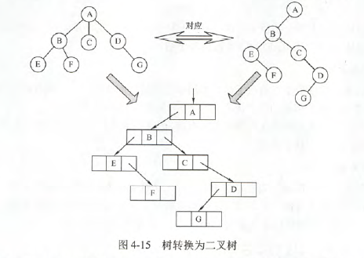

森林转换为二叉树：先将森林中的每棵树转换为二叉树，把第一棵树的根作为转换后二叉树的根，其左子树作为左子树。第二棵树作为转换后的右子树，第三棵树作为转换后右子树的右子树，即向右拼接。

二叉树转换为森林的规则：反过来即可。将右子树挨个拆下来。二叉树转换为树或森林是唯一的。

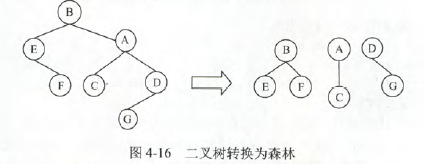

### 树和森林的遍历

|树|森林|二叉树|
|-----|-----|-----|
|先根遍历|先序遍历|先序遍历|
|后根遍历|后序遍历|中序遍历|

# 树与二叉树的应用

### 二叉排序树

- 二叉排序树的定义：或者是一棵空树，或者是以下特征的非空二叉树

- 若左子树非空，则左子树上所有结点关键字值均小于根结点的关键字值
- 若右子树非空，则右子树上所有结点关键字值均大于根结点的关键字值
- 左、右子树分别也是一棵二叉排序树

- 二叉排序树的查找：

```C
BSTNode *BST_Search(BiTree T,ElemType key,BSTNode *&p){
    p=null;
    while(T!=null&&key!=T->data){
        p=T;
        if(key<T->data) T=T->lchild;
        else T=T->rchild
    }
    return T;
}
```

- 二叉排序树的插入:插入的新结点一定是某个叶结点。

```C
int BST_Insert(BiTree &T,KetType k){
    if(T==null){
        T=(BiTree)malloc(sizeof(BSTNode));
        T->key-k;
        T->lchild=T->rchild=null;
        return 1;
    }
    else if(k==T->key){
        return 0;
    }
    else if(k<T->key){
        return BST_Insert(T->lchild,k);
    }
    else{
        return BST_Insert(T->rchild,k);
    }
}
```

- 二叉排序树的构造

```C
void Creat_BST(BiTree &T,KeyType str[],int n){
    T=null;
    int i=0;
    while(i<n){
        BST_Insert(T,str[i]);
        i++;
    }
}
```

- 二叉排序树的删除
  - 若是叶结点，直接删除
  - 若结点只有一棵左子树或右子树，则让其子树代替它的位置
  - 若既有左子树又有右子树，则令其直接后继代替，然后从二叉排序树中删除其直接后继

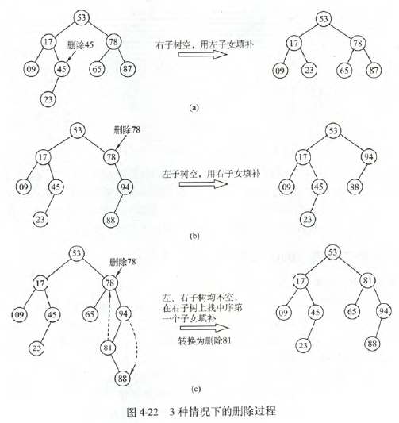

- 二叉排序树的查找效率分析：高度为h的二叉排序树，其插入和删除操作的事件都是O(h).若二叉排序树是一个只有右(左)孩子的单支树，平均查找长度和单链表相同，为O(n)。若左右子树的高度之差的绝对值不超过1，则这样的二叉排序树称为平衡二叉树，平均查找长度为$O(log_2n)$

[例]

$ASL_a=(1+2\times2+3\times4+4\times3/10=2.9)$

$ASL_b=(1+2+3+4+5+6+7+8+9+10)/10=5.5$

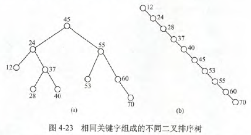

### 平衡二叉树

- 平衡二叉树的定义：左右子树高度差的绝对值不超过1.定义左右子树的高度差为该结点的平衡因子，则平衡二叉树结点的平衡因子的值只可能是-1、0或1。
- 平衡二叉树的插入（每次调整的对象都是不平衡子树，即最近的平衡因子大于1的结点为根的子树）
  - LL平衡旋转：由于在结点A的左孩子的左子树上插入了新结点。将A的左孩子B向右上旋转代替A成为根结点，将A结点向右下旋转成为B的右子树的根结点，而B的原右子树则作为A结点的左子树。
  - RR平衡旋转：由于在结点A的右孩子的右子树上插入了新结点。将A的右孩子B向上旋转代替A乘坐根结点，将A结点向左下旋转成为B的左子树的根结点，而B的原左子树则作为A结点的右子树。
  - LR平衡旋转：由于在结点A的左孩子的右子树上插入新结点。先左旋后右旋。先将A结点的左孩子B的右子树的根结点C向左上旋转提升到B结点的位置，然后再将C结点向右上旋转提升到A结点的位置。
  - RL平衡旋转：由于在结点A的右孩子的左子树上插入新节点。先右旋后左旋。先将A结点的右孩子B的左子树的根结点C向右上旋转提升到B结点的位置，然后再将C结点向左上旋转提升到A结点的位置。


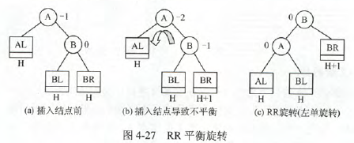

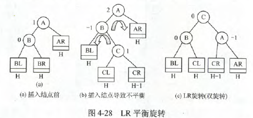

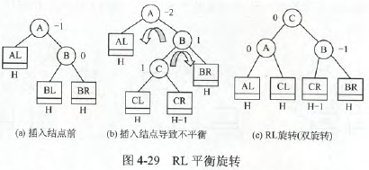

- 平衡二叉树的查找：$O(log_2n)$

### 哈夫曼树和哈夫曼编码

- 哈夫曼树的定义：带权路径最小的二叉树成为哈夫曼树，也称最优二叉树

【例】三棵二叉树都有4个叶子结点a,b,c,d，分别带权7，5，2，4

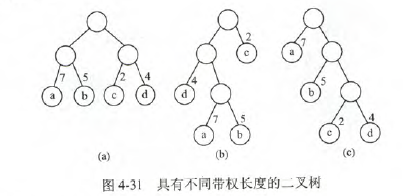

$WPL_a=7*2+5*2+2*2+4*2=36$

$WPL_b=7*3+5*3+2*1+4*2=46$

$WPL_c=7*1+5*2+2*3+4*3=35$(哈夫曼树)

- 哈夫曼树的构造
  - 从结点中选出两个最小的结点，构成一个新节点，权为两结点之和
  - 重复上述

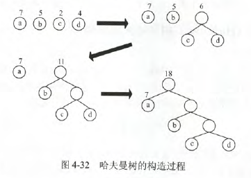

特点：1.每个初始结点最终都成为叶结点，且权值越小的结点到根结点的路径长度越大。2.构造过程中共新建了n-1个结点(双分支结点)，因此哈夫曼树中的结点总数为2n-1。3.每次构造都选择2棵树作为新结点的孩子，因此哈夫曼树中不存在度为1的结点。

- 哈夫曼编码：最长度最短的二进制前缀编码。
