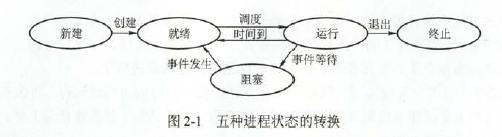
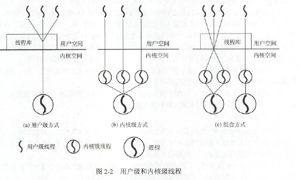
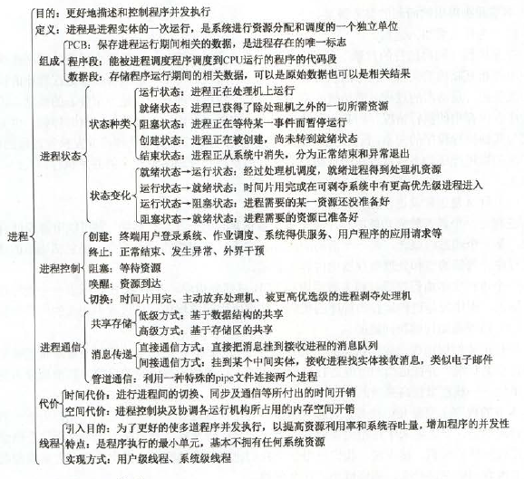
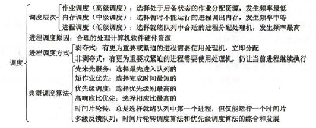
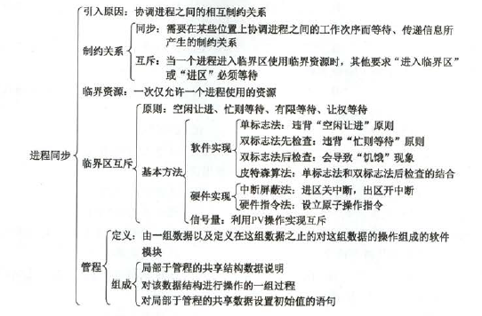
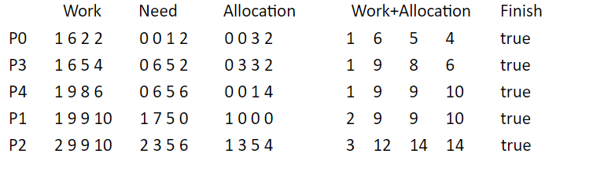
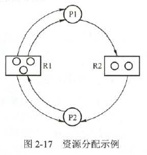
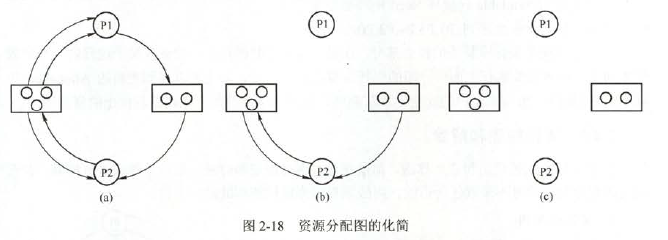
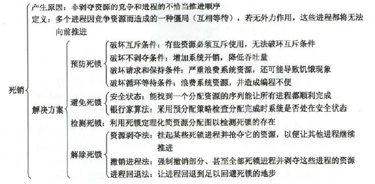

# 进程管理

### 进程与线程

进程：进程控制块。由程序段、相关数据段和PCB三部分构成了进程映像(进程实体)。所谓创建进程，实质上是创建进程映像中的PCB；而撤销进程，实质上是撤销进程的PCB。进程映像是静态的，而进程是动态的。同样，程序是静态的，进程是动态的。

**PCB是进程存在的唯一标志**

### 进程的状态与转换



- 就绪态->运行态：得到处理机调度
- 运行态->就绪态：时间片用完；更高优先级的进程就绪时，可以调度优先级更高的程序执行
- 运行态->阻塞态：请求资源失败
- 阻塞态->就绪态：资源来了

一个进程由运行态到阻塞态是主动的行为，而阻塞态变成就绪态是被动行为，需要其他相关进程的协助。

### 进程控制

- 进程的创建：允许一个进程创建另一个进程。子进程可以继承父进程所拥有的资源。子进程撤销时，应将从父进程处获得的资源还给父进程。撤销父进程时，必须同时撤销其所有的子进程。终端用户登录、作业调度、系统提供服务、用户程序的应用请求等都会引起进程的创建。创建过程
  - 为新进程分配一个唯一的进程标识号，并申请一个空白的PCB(PCB是有限的)。
  - 为进程分配资源，为新进程的程序和数据及用户栈分配必要的内存空间。**若资源不足，则并不是创建失败，而是而出处于“阻塞态”，等待的是内存这个资源**
  - 初始化PCB，包括初始化标志信息、初始化处理及状态信息和初始化处理及控制信息，以及设置进程的优先级等。
  - 若进程就绪队列能接纳新进程，则将新进程插入就绪队列。
- 进程的终止：正常结束；异常结束；外界干预。撤销过程：
  - 根据终止进程的标识符，检索PCB，从中读出该进程的状态。
  - 若被终止进程处于执行状态，立即终止该进程的执行，将处理机资源分配给其他进程
  - 若进程有子进程，则将子进程全部终止
  - 将该进程所有资源归还父进程或操作系统
  - 将PCB从所在队列中删除
- 进程的阻塞和唤醒：阻塞时进程自身的一种主动行为，也因此只有处于运行态的进程才可能将其转换为阻塞态。**唤醒是一种被动行为。**阻塞原语和唤醒原语
  - 找到将要被阻塞进程的标识号对应的PCB
  - 若该进程为运行态，则保护其现场，将其转换为阻塞态
  - 把该PCB插入相应事件的等待队列
  - (唤醒原语)在该事件的等待队列中找到相应进程的PCB
  - 将其从等待队列中溢出，改成就绪态
  - 该PCB插入就绪队列，等待调度
- 进程切换：从一个进程切换到另一个进程，**一定会产生中断，即从用户态到内核态再到用户态**
  - 保存处理机上下文，包括程序计数器和其他寄存器
  - 更新PCB信息
  - 把进程的PCB移入相应的队列，如就绪、在某事件阻塞等队列
  - 选择另一个进程执行，更新其PCB
  - 更新内存管理的数据结构
  - 恢复处理机上下文

### 进程的组织

- 进程控制块：PCB是进程实体的一部分，是进程存在的唯一标志。操作系统通过PCB表来管理和控制进程。
- PCB信息：
  - 进程描述信息：进程标识符：标志各个进程，每个进程都有一个唯一的标识号。用户标识符：进程归属的用户，用户标识符主要为共享和保护服务
  - 进程控制和管理信息：进程当前状态：描述进程的状态信息，作为处理机分配调度的依据。进程优先级：描述进程抢占处理机的优先级，优先级高的进程可优先获得处理机
  - 资源分配清单，用于说明有关内存地址空间或虚拟地址空间的状况，所打开文件的列表和所使用的输入/输出设备信息
  - 处理机相关信息，主要指处理机中各寄存器的值，当进程被切换时，处理机状态信息都必须保存在相应的PCB中，以便在该进程重新执行时，能从断点继续执行
- 程序段:CPU执行的代码段。程序可能被多个进程共享，即多个进程可以运行同一个程序。
- 数据段：可以是原始数据，也可以是程序执行的中间或最终结果

### 进程的通信

- 共享存储：低级方式的共享是基于数据结构的共享；高级方式的共享则是基于存储区的共享。进程内的线程是自然共享进程空间的。
- 消息传递：直接通信方式：发送进程直接把消息发送到接收进程。间接通信方式:发送进程把消息发送到某个中间实体，接收进程从中间实体取得消息。这种中间实体一般称为信箱
- 管道通信：所谓“管道”，就指用于连接一个读进程和一个写进程以实现它们之间的通信的一个**共享文件**，又名pipe文件。【注意】：管道读数据是一次性操作，数据一旦被读取，他就从管道中被抛弃，释放空间以便写更多的数据。管道只能采用半双工通信。要实现父子进程双方互动通信，要建立两个管道。

### 线程概念和多线程模式

（线程能创建和撤销另一个线程）

是一个基本的CPU执行单元，也是程序执行流的最小单元。由线程ID、程序计数器、寄存器集合和堆栈组成。是被独立调度和分配的基本单位。自己不拥有资源，但能与同属一个进程的多个线程之间共享进程所拥有的全部资源。线程也有就绪、阻塞和运行三种状态。

引入线程后，进程只作为CPU外的系统资源的分配单元，线程则作为处理机的分配单元。

进程与线程的比较：

- 调度：线程是独立调度的基本单位，进程是有用资源的基本单位。同一进程中的线程切换不会导致进程切换，不同进程中的线程切换会导致进程切换。
- 拥有资源：线程不拥有系统资源（其实只有一点），线程可以访问其隶属进程的系统资源。
- 并发性：不仅进程间可以并发执行，多个线程之间也能并发执行
- 系统开销：进程切换的开销远大于创建或撤销线程的开销
- 地址空间和其他资源：进程的地址空间相互独立，同一进程的各线程间共享进程资源，而进程内的线程对其他进程不可见
- 通信方面：进程间通信需要进程同步和互斥手段辅助。线程间可以直接读写进程数据段(全局变量)来进行通信

线程的属性：

- 是一个轻型实体，不拥有系统资源。每个线程都有一个唯一标识符和线程控制块，线程控制块记录了线程执行的寄存器和栈等现场状态。
- 不同线程可以执行相同程序
- 同一进程各个共享进程资源
- 线程是处理机调度的独立单位。多CPU系统中，线程可以同时占用多个CPU
- 线程的生命周期经过就绪、堵塞和运行状态。

线程的实现方式：

- 用户级线程：**有关线程的所有操作都由应用程序完成，内核意识不到线程存在**
- 内核级线程：**应用程序没有进行线程管理的代码，只有一个到内核级线程的编程接口**



多线程模式：

- 多对一模式：多个用户级线程映射到一个内核级线程，线程管理在用户空间完成。优点：效率高，缺点：一个线程被阻塞，整个进程被阻塞；多个线程不能并行地运行在多处理机上
- 一对一模式：一个用户级线程对应一个内核级线程。优点：线程被阻塞后，允许另一个线程继续运行。缺点：创建线程的开销较大。
- 多对多模式：n个用户级进程映射到m个内核级进程上，m<=n.折中。



# 处理机调度

### 调度的概念

调度层次：

- 作业调度：又称高级调度，内存与辅存之间的调度。将外存的作业调度到内存称为就绪进程，即创建进程
- 中级调度：又称内存调度，作用是提高内存利用率和系统吞吐量。把不能运行的进程挂起到外存，把外存上某些已具备运行条件的就绪进程再重新调入内存，并修改为就绪状态。这里是和外存的对换区进行调度。即改为就绪状态和改为挂起状态。
- 进程调度：又称低级调度，把处理机分配给内存中就绪的进程。**是最基本的调度方式，必不可少**

三种调度关系

- 作业调度为进程活动做准备，进程调度使进程正常活动起来，中级调度将暂时不能运行的进程挂起，再把它弄回来。
- 作业调度次数少，中级略多，进程调度频率最高
- 进程调度使最基本的，不可或缺的。

### 调度的时机、切换与过程

**进程调度和切换程序是操作系统内核程序**。

不能进行进程调度与切换的情况

- 在处理中断的过程中
- 进程在操作系统内核程序的临界区
- 其他需要完全屏蔽中断的原子操作过程中。

应该进行进程调度与切换的情况

- 发生引起调度条件且当前进程无法继续运行下去时，可以马上进行调度与切换
- 中断处理结束或自陷处理结束后

### 进程调度方式

- 非剥夺调度方式：又称非抢占方式。指正在运行时，有更重要的进程来了，也不让。除非运行完或发生阻塞
- 剥夺调度方式：抢占式。与上述相反。对提高系统吞吐率和响应效率有明显的好处。

### 调度的基本准则

- CPU利用率
- 系统吞吐量：单位时间内CPU完成作业的数量
- 周转时间：从作业提交到完成的时间。即等待时间+执行时间。带权周转：周转/运行
- 等待时间：进程处于等待处理机状态时间之和
- 响应时间：用户提交请求到系统首次响应所用的时间

### 典型的调度算法

- 先来先服务：不可剥夺算法。对长作业有利，对短作业不利。有利于CPU繁忙型作业，不利于IO繁忙型
- 短作业优先(SJF)：对长作业不利，长作业可能出现饥饿现象。平均等待时间，平均周转时间最少。可剥夺算法
- 优先级调度算法：一般来说，系统进程>用户进程，交互型进程>非交互性进程，IO型进程>计算型进程(IO中断之后就io去了，可以把处理机让出来)
  - 非剥夺优先级调度
  - 剥夺优先级调度
  - 静态优先级
  - 动态优先级
- 高响应比优先调度：响应比=(等待时间+要求服务时间)/要求服务时间。克服了饥饿状态，兼顾了长作业
- 时间片轮转：主要用于分时系统，可抢占的。
- 多级反馈队列：动态调整优先级和时间片。思想如下
  - 设置多个就绪队列，并为各个队列赋予不同的优先级
  - 优先级越高，进程时间片越少
  - 一个新进程进入内存后，放入第1级队列的末尾。若在一个时间片内未完成，放入第二个队列队尾。
  - 仅当第一级队列为空时，才调用第二级



# 进程同步

### 基本概念

- 临界资源：许多物理设备都属于临界资源，许多变量、数据等都被若干进程共享，也属于临界资源。
- 同步：直接制约关系，如缓冲。
- 互斥：间接制约关系，如临界资源。为禁止两个进程同时进入临界区（临界区：进程中用于访问临界资源的代码，又称临界段），同步机制应遵循以下原则
  - 空闲让进
  - 忙则等待
  - 有限等待
  - 让权等待

### 实现临界区互斥的基本方法

软件实现：

- 单标志法：用turn表示允许进入临界区的进程编号，如turn=1，则1号允许。违背让步原则
- 双标志法先检查：违反忙则等待
- 双标志法后检查：会导致饥饿现象
- 皮特森算法：单标志发和双标志后检查法的结合

硬件实现：

- 中断屏蔽方法：**CPU只在发生中断时引起进程切换**，  当一个进程正在使用处理机执行它的临界区代码时，要防止其他进程再进入其临界区访问的最简单的方法是：禁止一切中断发生，或称之为屏蔽中断、关中断。但将关中断权力交给用户很不明智，若一个进程关中断之后不再开中断，则系统可能会因此终止。
- 硬件指令方法：TestAndSet指令。读出指定标志后该标志设置为真。(java cas(compare and swap))

```C
boolean TestAndSet(boolean *lock){
    boolean old;
    old=*lock;
    *lock=true;
    return old;
}

while TestAndSet(&lock);
进程的临界区代码段
lock=false;
进程的其他代码段
```

优点：适用于任意数目的进程。可以支持进程内多个临界区，每个临近区设置一个lock。缺点：不能实现让权等待，可能会导致饥饿现象

### 信号量

**太重要了！！！！！！！！！！！！！！！！！！！！！：**

PV操作在同步互斥中的应用：**在同步问题中(缓冲区，大小允许多个)**，若某个行为要用到某种资源，则这个行为前面P这种资源一下；若某个行为会提供某种资源，则在这个行为后面V这种资源一下。**在互斥问题中**，P、V操作要紧夹使用互斥资源的那个行为，中间不能有其他冗余代码。

利用信号量实现前驱关系

为保证$S_1->S_2,S_1->S_3$的前驱关系，设置信号量a1,a2.保证$S_2->S_4,S_2->S_5,S_3->S_6,S_4->S_6,S_5->S_6$，应设置b1,b2,c,d,e

```C
// 注意，初始为0
semaphore a1=a2=b1=b2=c=d=e=0;
S1(){
    ...;
    V(a1);
    V(a2);
}
S2(){
    P(a1);
    ...;
    V(b1);
    V(b2);
}
S3(){
    P(a2);
    ...;
    V(c);
}
S4(){
    P(b1);
    ...;
    V(d);
}
S5(){
    P(b2);
    ...;
    V(e);
}
S6(){
    P(c);
    P(d);
    P(e);
}
```

### 管程

管程是由一组数据及定义这组数据之上的对这组数据的操作组成的软件模块，这组操作能初始化并改变管程中的数据和同步进程。

组成

- 局部于管程的共享数据结构说明
- 对该数据结构进行操作的一组过程
- 对局部于管程的共享数据设置初始值的语句

**基本特性**：

- 局部于管程内的数据只能被局部于管城内的过程所访问。
- 一个进程只有通过调用管程内的过程才能进入管程访问共享数据
- 每次仅允许一个进程在管程内执行某个内部过程



# 死锁

死锁原因：

- 系统资源的竞争
- 进程推进顺序非法
- 死锁产生的必要条件
  - 互斥条件
  - 不剥夺条件
  - 请求并保持条件
  - 循环等待条件

若系统中每类资源都只有一个资源，则资源分配图含圈就变成了系统出现死锁的充要条件

### 死锁的处理策略

- 死锁预防：破坏产生死锁四个必要条件中的一个或多个，以访发生死锁
- 避免死锁：资源动态分配过程中，防止系统进入不安全状态(银行家算法)
- 死锁的检测及解除：无需采取限制性措施。

|措施|资源分配策略|各种可能模式|主要优点|主要缺点|
|-----|-----|-----|-----|-----|
|死锁预防|保守，宁可闲置资源|一次请求所有资源，资源剥夺，资源按序分配|适用于突发式处理进程，不必进行剥夺|效率低；剥夺次数过多|
|死锁避免|预防和检测折中(在运行时判断是否可能死锁)|寻找可能的安全允许序列|不必进行剥夺|必须直到将来的资源需求；进程不能被长时间阻塞|
|死锁检测|宽松，只要允许就分配资源|定期检查死锁是否已经发生|不延长进程初始化时间，允许对死锁进行现场处理|通过剥夺解除死锁，造成损失|

### 死锁预防

- 破坏互斥条件：不可行
- 破坏不可剥夺条件：当某些进程有不可剥夺条件时不被满足，必须放弃自己所持的资源
- 破坏请求并保持条件：采用预先静态分配方法，在运行之前一次性把它所需的资源给它
- 破坏循环等待条件：采用顺序分配法。给系统资源编号，每个进程只能按编号递增的顺序请求资源

### 死锁避免

- 系统安全状态
- 银行家算法



### 死锁检测和解除

资源分配图：P进程，R资源。如图，$P_1$已经分配两个$R_1$又在请求$R_2$



死锁定理：S状态的资源分配图是不可完全化简的，该条件为死锁定理



死锁解除：

- 资源剥夺法：挂起某些死锁进程，并抢占它的资源，将这些资源分配给其他死锁进程。
- 撤销进程法：强制撤销**部分甚至全部**死锁进程，并剥夺这些进程的资源
- 进程回退法：让一个或多个进程回退到足以回避死锁的地步，**进程回退时资源释放资源，而非被剥夺**.要求系统保持进程的历史信息，设置还原点。




# 

# 

- 
- 
- 作业调度、进程调度的区别在理解一下。
- 多道批处理系统的调度算法是不是只能用抢占式的？
- 高响应比调度算法是否可以被剥夺？怎么就适用于分时系统了？
- 多级反馈队列调度算法会产生饥饿吗？
- 两种甘特图的画法。
- 皮特森算法的缺点？
- 整理饥饿。

- 循环等待和死锁条件的区别。
- 