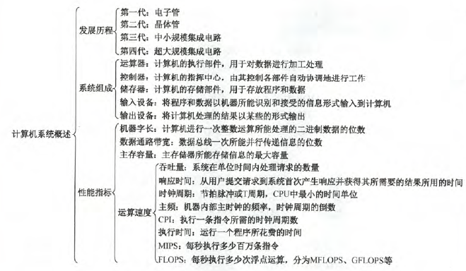

# 1.1

5.到目前为止，计算机中所有的信息仍以二进制方式表示的理由是(C)

- A.节约原件
- B.运算速度快
- C.由物理器件的性能决定
- D.信息处理方便

# 1.2

2.冯诺依曼机的基本工作方式是(控制流驱动方式)

4.冯诺依曼计算机中指令和数据均以二进制形式存放在存储器中，CPU区分它们的依据是(指令周期的不同阶段)

6.存放欲执行指令的寄存器是(IR)

8.CPU不包括(C)

- A.地址寄存器
- B.指令寄存器
- C.地址译码器(存储器中)
- D.通用寄存器

17.下列叙述正确的是(C)

- A.寄存器的设置对汇编语言是透明的
- B.实际应用程序的测试结果是能够全面代表计算机的性能
- C.系列机的基本特征是指令系统向后兼容
- D.软件和硬件在逻辑功能上是等价的

20.关于相联存储器，下列说法中正确的是(C)

- A.只可以按地址寻址
- B.只可以按内容寻址
- C.即可按地址寻址又可按内容寻址
- D.以上说法均不完善

记住就行

# 1.3

10.在CPU寄存器中，(B)对用户是完全透明的

- A.程序计数器
- B.指令寄存器
- C.状态寄存器
- D.通用寄存器

12.CPU的CPI与下列(A)因素无关

- A.时钟频率
- B.系统结构
- C.指令集
- D.计算机组织

``` java
CPI是执行一条指令所需的时钟周期数，时钟频率不会影响CPI，但可以加快指令的执行速度。例如执行一条指令需要10个时钟周期(CPI=10)，则主频为1GHz的CPU比100MHz的CPU快。
```

18.假定基准程序A在某计算上的运行时间为100s，其中90s为CPU时间，其余为I/O时间。若CPU速度提高50%，I/O速度不变，则运行基准程序A所耗费的时间是(70s).

``` java
CPU速度提高50%,变成150%.时间由90s变成60s，I/O时间是10s，加在一起是70s。
```

19.程序P在机器M上的执行时间是20s，编译优化后，P执行的指令数减少到原来的70%，而CPI增加到原来的1.2倍，则P在M上的执行时间是(16.8s)

```java
20*0.7*1.2=16.8s
```

20.假定计算机M1和M2具有相同的指令集体系结构(ISA)，主频分别为1.5GHz和1.2GHz。在M1和M2上运行某基准程序P，平均CPI分别为2和1，则程序P在M1和M2上运行时间的比值是(1.6)

```java
2/1.5  / 1/1.2 =1.6
```