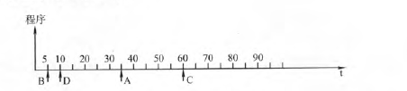
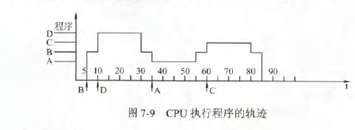
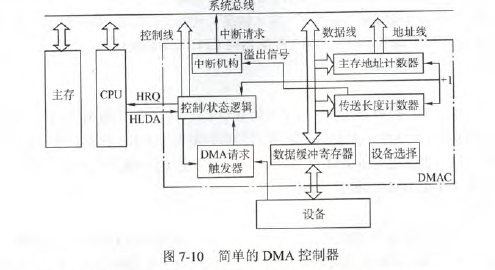
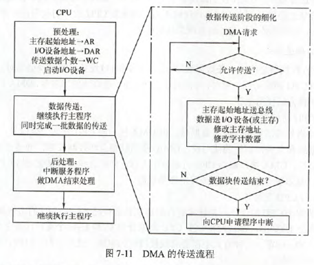

# I/O系统基本概念

### 历史演变

- 早期阶段(程序查询)
- 接口模块和DMA阶段(中断方式和DMA方式)
- 具有通道结构的阶段
- 具有IO处理器的阶段

### 输入/输出系统

基本概念：

- 外部设备：包括输入/输出设备及通过输入/输出接口才能访问的外存储设备。
- 接口：在各个外设与主机之间传输数据时进行各种协调工作的逻辑部件。协调包括传输过程中速度的匹配、电平和格式转换等
- 输入设备
- 输出设备
- 外存设备：如磁盘、光盘等。

I/O系统包括I/O软件和I/O硬件

- I/O软件：包括驱动程序、用户程序、管理程序、升级补丁等。通常采用I/O指令和通道指令实现CPU与I/O设备的信息交换。
- I/O硬件：包括外部设备、设备控制器和接口、I/O总线等。通过设备控制器来控制I/O设备的具体动作；通过I/O接口与主机(总线)相连。

### I/O控制方式

- 程序查询方式：CPU通过程序不断查询I/O设备是否以做好准备，从而控制I/O设备与主机交换信息
- 程序中断方式：只在I/O设备准备就绪并向CPU发出中断请求时才给予响应
- DMA方式：主存和I/O设备之间有一条直接数据通路，当主存和I/O设备交换信息时，无需调用中断服务程序
- 通道方式：在系统中设有通道控制部件，每个通道都挂接若干外设，主机执行I/O命令时，只需启动有关通道，通道将执行通道程序，从而完成I/O操作。

其中，方式1，2主要用于数据传输率较低的外设，方式3，4主要用于数据传输率较高的外设。

# 外部设备

### 输入设备

- 键盘：以矩阵的形式排列按键。每个键相当于一个开关，按下键时，电信号联通；松开键时，弹簧弹起键，电信号断开。主要有三个步骤
  - 查出按下的是哪个键
  - 将该键翻译成能被主机接收的编码，如ASCII码
  - 将编码传送主机
- 鼠标：鼠标在平面上移动时，其底部传感器把运动的方向和距离检测出来，从而控制光标做相应的运动。

### 输出设备

- 显示器：显示存储器(VRAM):VRAM容量=分辨率\*灰度级位数。VRAM带宽=分辨率\*灰度级位数\*帧频
  - 阴极射线管显示器(CRT)：具有可视角度大、无坏点、色彩还原度高、色度均匀、可调节的多分辨率模式、响应时间极短等LCD难以超过的优点。
    - 字符显示器。显示字符以点阵为基础。将点阵存入ROM构成的字符发生器中，在CRT进行光栅扫描的过程中，从字符发生器中依次读出某个字符点阵，按照点阵中0、1代码的不同控制电子束的开或关，从而显示字符。所需显示的ACSII码存放在VRAM中，以备刷新。
    - 图形显示器。为保留持久稳定的图像，需要按一定的频率对屏幕反复刷新。
  - 液晶显示器(LCD)：体积小、重量轻、省电、无辐射、绿色环保、画面柔和、不伤眼等。
  - LED显示器(发光二极管)：与LCD相比，LED显示器在亮度、功耗、可视角度和刷新速度等方面都更具有优势。
- 打印机。
  - 针式打印机：擅长多层复写打印，实现各种票据或蜡纸等的打印
  - 喷墨式打印：打印噪声小，可实现高质量彩色打印，打印速度比针式快；防水性差，高质量打印需要专用打印纸
  - 激光打印：打印质量高、速度快、噪声小、处理能力强；耗材多、价格贵、不能复写打印多份，对纸张要求高。
### 外存储器

又称辅助存储器，目前主要使用磁表面存储器。优点：存储容量大，位价格低；记录介质可重复使用；记录信息可长期保存而不丢失，甚至可以脱机存档；非破坏性读出，读出时不需要再生。缺点：存取速度慢；机械结构复杂，对工作环境要求较高。

磁盘存储器的组成

- 存储区域：一个硬盘包含若干记录面，每个记录面划分为若干磁道，而每条磁道又划分为若干扇区，扇区是磁盘读写的最小单位。
  - 磁头数：即记录面数，表示硬盘共有多少个磁头，一个记录面对应一个磁头
  - 柱面数：表示硬盘每面上有多少条磁道。
  - 扇区数：每条磁道上有多少个扇区。
- 硬盘存储器的组成
  - 磁盘驱动器：核心部分是磁头组件和盘片组件
  - 磁盘控制器：硬盘存储器和主机的接口，IDE、SCSI、SATA等

磁盘的性能指标：

- 磁盘的容量：非格式化容量是指磁盘记录表面可以利用的磁化单元总数，格式化容量是指按照某种特定的记录格式所能存储信息的容量。
- 记录密度：盘片单位面积上记录的二进制信息量，通常以道密度、位密度和面密度表示。道密度是沿磁盘半径方向单位长度的磁道数，位密度是磁道单位长度上能击落的二进制代码位数，面密度是位密度与道密度的乘积。
- 平均存取时间：由寻道时间、旋转延迟时间和传输时间构成。
- 数据传输率：磁盘存储器在单位时间内向主机传送数据的字节数。假设磁盘转数为r转/秒，每条磁道容量为N个字节，则数据传输率为$D_r=rN$

硬盘工作过程：读写操作是串行的，不可能在同一时刻既读又写，也不可能在同一时刻读两组数据或写两组数据。

- 寻址
- 读盘
- 写盘

磁盘阵列：RAID是指将多个独立的物理磁盘组成一个独立的逻辑盘，数据在多个物理盘上分割交叉存储、并行访问，具有更好的存储性能、可靠性和安全性

- RAID0：无冗余和无校验的磁盘阵列
- RAID1：镜像磁盘阵列
- RAID2：采用纠错的海明码的磁盘阵列
- RAID3：位交叉奇偶校验的磁盘阵列
- RAID4：块交叉奇偶校验的磁盘阵列
- RAID5：无独立校验的奇偶校验磁盘阵列

光盘存储器：由光盘片、光盘驱动器、光盘控制器和光盘驱动软件组成。

- CD-ROM：只读型光盘
- CD-R：只可写入一次信息，之后不能修改
- CD-RW：可读写光盘，可重复读写
- DVD-ROM：高容量的CD-ROM。

固态硬盘：采用高性能的Flash Memory作为硬盘。

# I/O接口(I/O控制器)

I/O接口的功能

- 实现主机和外设的通信联络控制
- 进行地址译码和设备选择
- 实现数据缓冲
- 信号格式的转换（串并转换）
- 传送控制命令和状态信息

I/O接口的基本结构：CPU与外设之间的信息交换，实质上是对接口中的某些寄存器进行读或写，这些寄存器成为I/O端口。

- 内部接口：与系统总线相连，实质上是与CPU、内存相连。**数据传输方式只能是并行传输**
- 外部接口：通过接口电缆与外设相连，外部接口的数据传输可能是串行传输，因此I/O接口需要具有串/并转换功能。

接口和端口是不同的概念。端口是指接口电路中可以进行读/写的寄存器，若干端口加上相应的逻辑控制才可以组成接口

I/O接口类型：

- 按数据传送方式分为并行接口和串行接口
- 按主机访问I/O设备的控制方式分为程序查询接口、中断接口和DMA接口
- 按功能选择的灵活性分为可编程接口和不可编程接口

I/O端口及其编址：CPU能对数据端口执行读写操作，但对状态端口只能执行读操作，对控制端口只能执行写操作。（一个IO接口可以有很多地址，因为一个IO接口中可能有多个用户可访问的寄存器，也就是多个IO端口，而每个IO端口有一个地址，所以一个IO接口可能有多个地址。）

- 统一编址：又称存储器映射方式，把I/O端口当作存储器的单元进行地址分配。**这种方式CPU不需要设置专门的I/O指令，用统一的访存指令就可以访问I/O端口**
- 独立编址：又称I/O映射方式，I/O端口地址与存储器无关，**独立编址CPU需要设置专门的输入输出指令访问端口**

# I/O方式

### 程序查询方式

接口中设置一个数据缓冲寄存器(数据端口)和设备状态寄存器(状态端口)。

过程如下

- CPU执行初始化程序，并预置传送参数
- 向I/O接口发送命令字，启动I/O
- 从外设接口读取其状态信息
- CPU不断查询IO设备状态，直到外设准备就绪
- 传送一次数据
- 修改地址和计数器参数
- 判断传送是否结束，若未结束转到第三步，直到计数器为0.

CPU有"踏步"等待现象，CPU与IO串行工作。  

硬盘以32位字长为单位传输数据，即每32位被CPU查询一次。

### 程序中断方式

中断方式的工作流程

中断分类：

- 内中断和外中断：中断系统需要对每个中断源设置中断请求标记触发器INTR，当其状态为1时，表示中断源有请求。
  - 外中断：处理器和内存以外的部件引起的中断，包括I/O设备发出的I/O中断、外部信号中断(如用户按下ESC)，各种定时器引起的时钟中断等。外中断在狭义上一般称为中断。
  - 内中断：处理器和内存内部产生的中断，包括程序运算引起的错误。
- 硬件中断和软件中断
  - 硬件中断：通过外部硬件产生的中断。硬件中断属于外中断
  - 软件中断：通过某条指令产生的中断。软件中断是内中断。
- 非屏蔽中断和可屏蔽中断（均是硬件中断和外中断）
  - 非屏蔽中断：是一种硬件中断，通过不可屏蔽中断请求NMI控制，不受中断标志位IF的影响。
  - 可屏蔽中断：也是一种硬件中断，受中断请求标记触发器INTR控制，且受中断标志位IF的影响。

中断判优：中断系统在任一时刻只能相应一个中断源的请求。判优可用硬件、软件实现。硬件实现是通过硬件排队器实现的，它既可以设置在CPU中，又可以分散在各个中断源中，软件实现是通过查询程序实现的。

一般来说，硬件中断属于最高级，其次是软件中断，非屏蔽中断优于可屏蔽中断，DMA请求优于I/O设备传送的中断请求，高速设备优于低速设备，输入设备优于输出设备，实时设备优于普通设备等。

CPU响应中断的条件：

- 中断源有中断请求
- CPU允许中断即开中断
- 一条指令执行完毕，并且没有更紧迫的任务

**CPU响应中断的时间是在每条指令执行阶段的结束时刻**这里说的中断仅指外中断，内中断不属于此类情况。

中断隐指令：由硬件直接实现的。

- 关中断：不允许新的中断打断。
- 保存断点：程序计数器(PC)的内容保存下来
- 引出中断服务程序：取出中断服务程序入口的地址并传送给程序计数器(PC)

中断服务程序

- 中断向量：中断服务程序入口地址。
- 中断向量表：把系统中的全部中断向量集中存放到存储器的某个区域内，这个存储区就叫中断向量表，即中断服务程序入口地址表。

**中断向量是中断服务程序的入口地址，中断向量地址是指中断服务程序的入口地址的地址**

中断处理过程

- 关中断
- 保存断点
- 引出中断服务程序
- 保存现场和屏蔽字：现场信息指程序状态字、中断屏蔽寄存器和CPU中某些寄存器的内容
- 开中断：允许更高级中断请求得到响应，实现中断嵌套
- 执行中断服务程序：核心
- 关中断：回复现场和屏蔽字时不被打断
- 恢复现场和屏蔽字
- 开中断、中断返回：中断服务程序的最后一条指令通常是中断返回指令，返回到源程序的断点处，以便继续执行源程序。

中断屏蔽技术主要用于多重中断。CPU满足一下条件具有多重中断的功能：

- 在中断服务程序中提前设置开中断指令(第五步)
- 优先级别高的中断源有权中断优先级别低的中断源。

**中断屏蔽字**：每个中断源都有一个屏蔽触发器，1表示屏蔽该中断源的请求，0表示可以正常申请，所有屏蔽触发器组合在一起构成一个屏蔽字寄存器，内容称为屏蔽字。

[例]设某机有四个中断源A、B、C、D，其硬件排队优先次序为A>B>C>D，现要求将中断处理次序改为D>A>C>B

- 写出每个中断源对应的屏蔽字
- 按照图所示的时间轴给出四个中断源的请求时刻，画出CPU执行程序的轨迹。每个中断源的中断服务程序时间均为20us

（1）D最大，故1111，A次之，故1110，C：0110，B：0100

（2）

### DMA方式

DMA方式具有中断的优点，即在数据准备阶段，CPU与外设并行工作。DMA方式在外设与内存之间开辟一条“直接数据通道”，信息传送不再经过CPU。

这种方式适用于磁盘机、磁带机等高速设备大批量数据的传送，它的硬件开销比较大。在MDA方式中，中断的作用仅限于故障和正常传送结束时的处理。

工作特点：

- 主存与CPU的固定联系脱钩，主存既可以被CPU访问，又可被外设访问
- 在数据块传送时，主存地址的确定、传送数据的计数等都由硬件电路直接实现
- 主存中要开辟专用缓冲区，及时供给和接收外设的数据
- DMA传送速度快，CPU和外设并行工作
- DMA在传送开始前要通过程序进行预处理，结束后要通过中断方式进行后处理。

#### DMA控制器

DMA控制器的功能

- 接受外设发出的DMA请求，并向CPU发出总线请求。
- CPU响应此总线请求，发出总线响应信号，接管总线控制权，进入DMA操作周期
- 确定传送数据的主存单元地址及长度，并自动修改主存地址计数和传送长度计数。
- 规定数据在主存和外设间的传送方向，发出读写等控制信号，执行数据传送操作。
- 向CPU报告DMA操作的结束

DMA控制器结构

- 主存地址计数器：存放要交换数据的主存地址
- 传送长度计数器：传送数据的长度，计数溢出时，数据即传送完毕，自动发中断请求信号
- 数据缓冲寄存器：暂存每次传送的数据
- DMA请求触发器：每当I/O设备准备好数据后，给出一个控制信号，使DMA请求触发器置位。
- “控制/状态”逻辑：由控制和时序电路及状态标志组成，用于指定传送方向，修改传送参数，并对DMA请求信号和CPU响应信号进行协调和同步
- 中断机构：当一个数据块传送完毕后，向CPU提出中断请求。

DMA传送方式

- 停止CPU访问主存：要求CPU放弃总线使用权
- DMA与CPU交替访存：适用于CPU的工作周期比主存存取周期长的情况。如CPU的工作周期1.2，主存的存取周期小于0.6，则可将一个CPU周期分为$C_1$$C_2$两部分，$C_1$专门供DMA访存，$C_2$专供CPU访存。**这种方式不需要总线使用权的申请、建立和归还过程**，总线使用权是通过$C_1C_2$分时控制的。
- 周期挪用(周期窃取)：当I/O设备有DMA请求时，会遇到三种情况
  - 此时CPU不访存，不冲突
  - CPU正在访存，此时必须待存取周期结束后，CPU再将总线占有权让出
  - I/O和CPU同时请求访存，CPU要暂时放弃总线占有权，由I/O设备挪用一个或几个存取周期

DMA传送过程

- 预处理:首先CPU执行几条IO指令，测试IO设备的状态，向DMA控制器的有关寄存器赋初值、设置传送方向、启动该设备等。CPU继续执行原来程序，直到IO准备好发送的数据或接收的数据，IO设备向DMA控制器发送DMA请求，再由DMA控制器向CPU发送总线请求，用于传输数据。
- 数据传送：数据传送阶段完全由DMA控制
- 后处理：DMA向CPU发送中断请求，CPU执行中断服务程序做DMA结束处理。包括校验送入主存的数据是否正确、测试传送过程中是否出错及决定是否继续使用DMA软送其他数据块等。

DMA和中断方式的区别：

- 中断方式是程序的切换，需要保护和恢复现场，而DMA方式除了预处理和后处理，其他时候不占用CPU的任何资源
- 中断请求响应只能是每条指令直接完毕时；DMA请求的响应可以发生在每个机器周期结束时，只要CPU不占用总线就可被响应
- 中断传送过程需要CPU的干预；而DMA传送过程不需要CPU的干预，故数据传输率非常高，**适合高速外设的成组数据传送**
- DMA请求的优先级高于中断
- 中断方式具有对异常事件的处理能力，而DMA方式仅局限于数据块的传送
- 中断方式靠程序传送，DMA方式靠硬件传送
- DMA一次传输一块数据，中断一次传输一个数据

DMA小结：与程序中断相比，DMA方式有以下特点：

- 从数据传送来看，程序中断方式靠程序传送，DMA方式靠硬件传送
- 从CPU响应时间来看，程序中断方式是在一条指令执行结束时响应，而DMA方式可以在指令周期的任意存储周期结束响应。
- 程序中断方式有处理异常事件的能力；DMA方式没有这种能力，主要用于大批数据的传送。
- DMA的优先级比程序中断的优先级高。
- 程序中断方式需要中断现行程序，故需保护现场；DMA方式不需要中断现行程序，无需保护现场。

