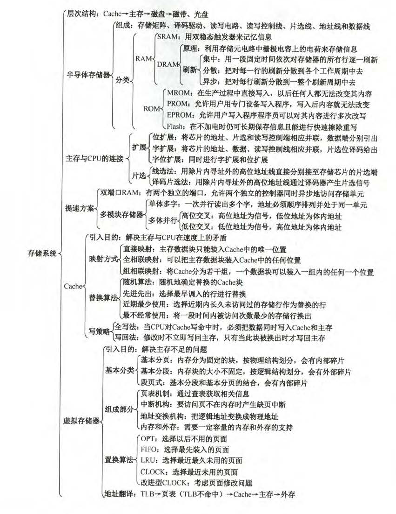
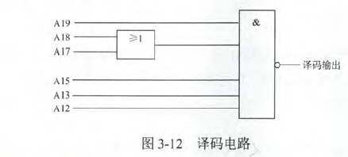
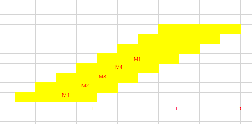

# 3.1存储系统的层次结构

2.磁盘属于()类型的存储器

- A.随机存取存储器(RAM)
- B.只读存储器(ROM)
- C.顺序存取存储器(SAM)
- D.直接存取存储器(DAM)

5.相联存储器是按(内容指定方式和地址指定方式相结合)进行寻址的存储器

6.在计算机系统，其操作系统保存在硬盘上，其内存储器应该采用(RAM和ROM)

# 3.3半导体随机存储器

1.某一SRAM芯片，其容量为1024*8位，出电源和接地端外，该芯片的引脚的最小数目为(A)

- A.21
- B.22
- C.23
- D.24

【解析】地址10根，数据8根，片选1根，读写控制2根，共21(详情见[存储器一节的图](第三章存储系统.md)).注：读写控制也可以1根，但选项没有20.

5.动态RAM采用(分散刷新)不会有死时间

【解析】集中刷新会存在很长的死时间，而异步刷新时集中与分散的中间，故也存在死时间。分散刷新，每次读写后都会刷新，存取周期会增加。

9.某一DRAM芯片，采用地址复用计数，其容量为1024*8位，除电源和接地端外，该芯片的引脚数最少是(17)(读写为两根)

【解析】采用地址复用技术，故将1024位分成32*32，32根行地址，32根列地址。故5+2+8+2=17. 5是5根地址线，2是行通选和列通选(片选可用行通选替代)，8是数据线，2是读写。

10.某容量为256MB的存储器由若干4M*8位的DRAM芯片构成，该DRAM芯片的地址引脚和数据引脚总数是(19)

【解析】共需要64片，数据线8根，地址22根，而地址复用，故11根。所以19根。

14.U盘属于(C)类型的存储器

- A.高速缓存
- B.主存
- C.只读存储器
- D.随机存取存储器

【解析】U盘采用的是Flash Memory技术，在EPROM上发展来的。注意：**随机存取与随机存取存储器(RAM)不同，只读存储器(ROM)也是随机存取的，因此，支持随机存取的存储器不一定是RAM**

16.下列说法正确的是(B)

- A.EPROM是可改写的，故可以作为随机存储器
- B.EPROM是可改写的，但不能尊为随机存储器
- C.EPROM是不可改写的，故不能作为随机存储器
- D.EPROM只能改写一次，故不能作为随机存储器

【解析】AB同上。CD本来就错了，EPROM能改写。

# 3.4CPU与主存的连接

11.地址总线$A_0$(高位)~$A_15$(低位)，用4K*4位的存储芯片组成16KB存储器，则产生片选信号的译码器的输入地址线应该是($A_2A_3$)

【解析】16KB，故须8片，前15~4根用作芯片内寻址，如果数据是4位，需要三根片选线，但是选项只有两根，所以数据是8位，故8/2=4片需要片选。所以$A_3A_2$

12.若内存地址区间为4000H~43FFH，每个存储单元可存储16位二进制数，该内存区域用4片存储器芯片构成，构成该内存所用的存储器芯片的容量是(C)

- A.512*16bit
- B.256*8bit
- C.256*16bit
- D.1024*8bit

```java
【解析】
4000H~43FFH
0100 0000 0000 0000
0100 0011 1111 1111
每个存储单元存储16位，故数据至少为16位，BD排除。
第9位和第10位用于片选，正好满足4片存储器。剩下8位用于芯片内寻址。故256*16bit
```

15.如图，若低地址位($A_0$~$A_{11}$)接在内芯片地址引脚上，高位地址($A_{12}$~$A_{19}$)进行片选译码，(其中$A_{14}、A_{16}$未参加译码)，且片选信号低电平有效，则对图中所示的译码电路，不属于此译码空间的地址是(D)

- A.AB000H~ABFFFH
- B.BB000H~BBFFFH
- C.EF000H~EFFFFH
- D.FE000H~FEFFFH



【解析】由译码电路有，译码输出为$\overline{A_{19}(A_{18}+A_{17})A_{15}A_{13}A_{12}}$.并且低电平有效，所以$A_{19},A_{15},A_{13},A_{12}$必须都为1，$A_{18},A_{17}$至少一个为1，才能保证与的结果为1，非之后变成0.所以111x1x11或110x1x11或101x1x11。D选择E为1110，不符合题意。

# 3.5双端口RAM和多模块存储器

4.一个四体并行低位交叉存储器，每个模块的容量是64K*32位，存取周期为200ns，总线周期为50ns，在下述说法中，(B)是正确的

- A.在200ns内，存储器能向CPU提供256位二进制信息
- B.在200ns内，存储器能向CPU提供128位二进制信息
- C.在50ns内，每个模块能向CPU提供32位二进制信息
- D.以上都不对

5.某机器采用四体低位交叉存储器，现分别执行下述操作：1、读取6个连续地址单元中存放的存储字，重复80次；2、读取8个连续地址单元中存放的存储字，重复60次。则1、2花费时间之比为(C)

- A.1:1
- B.2:1
- C.4:3
- D.3:4

```java
第一种：四体低位，

     2222
    1111
   4444
  3333
 2222
1111
所以存储一个需要2T，共需要80次

第二种：也是2T，共需要60次
```

6.下列说法正确的是

- 1.高位多体交叉存储器能很好地满足程序的局部性原理(错)
- 2.高位四体交叉存储器可能在一个存储周期内连续访问4个模块(对，完全流动起来)
- 3.双端口存储器可以同时访问同一区间、同一单元(对，两幅总线)

7.某计算机使用四体交叉编址存储器，假定在存储器总线上出现的主存地址(十进制)序列为8005、8006、8007、8008、8001、8002、8003、8004、8000，则可能发生访存冲突的地址是(8000,8004)

【解析】四体交叉编址，模4后为存储体号。分别是1、2、3、0、1、2、3、0、0.所以最后两个可能冲突。

8.某计算机主存按字节编址，由4个64M*8位的DRAM芯片采用交叉编址方式构成，并与宽度为32位的存储器总线相连，主存每次最多读写32位数据。若double变量x的主存地址为804001AH，则读取x需要的存储周期是(3)

```java
【解析】
DRAM说明是位扩展。每个DRAM有8位，double要64位，故需要读出8个模块。而流水线完全流动，一个周期读4个，两个周期读完。这要考虑结尾，所以3个周期
```
实际如图



需要2.75个周期

# 3.6高速缓冲存储器

- 直接映射地址结构：主存地址标记-Cache字块地址-字块内地址
- 全相联映射：主存字块标记-字块内地址
- 组相联映射：主存字块标记-组地址-字块内地址

3.某计算机的Cache共有16块，采用二路组相联映射方式(即每组2块)。每个主存块大小为32B，按字节编址，主存129号单元所在主存块应装入的Cache组号是(3)

```java
【解析】
129号对应的二进制为10000001
每个主存块大小32B，字节编址。故5位块内地址
100 00001
剩下高三位为块号。即块号是4.
对应为3组。(01 23 45)
```

6.关于Cache的更新策略，下列说法中正确的是(D)

- A.读操作时，写全法和写回法在命中时应用
- B.写操作时，写回法和写分配法在命中时应用
- C.读操作时，全写法和写分配法在失效时应用
- D.写操作时，写分配法、非写分配法在失效时应用

【解析】Cache更新策略只在写时有用。其中全写法和写回法是命中时的策略，写分配法和非写分配法在未命中时(失效)应用。

7.某虚拟存储器系统采用页式内存管理，使用LRU页面替换算法，考虑下面的页面访问地址流()：1 8 1 7 8 2 7 2 1 8 3 8 2 1 3 1 7 1 3 7，假定内存容量为4个页面，开始时是空的，则页面失效率是(30%).

```java
【解析】
1 缺
1 8 缺
8 1
8 1 7 缺
1 7 8
1 7 8 2 缺
1 8 2 7
1 8 7 2
8 7 2 1
7 2 1 8
2 1 8 3 缺
2 1 3 8
1 3 8 2
3 8 2 1
8 2 1 3
8 2 3 1
2 3 1 7 缺
2 3 7 1
2 7 1 3
2 1 3 7
缺页6次，共20次，6/20
```

8.某32位计算机的Cache容量为16KB，Cache行的大小为16B，若主存与Cache地址映射采用直接映射方式(只放入固定位置)，则主存地址为0x1234E8F8的单元装入Cache的地址是(10100011111000)

```java
【解析】
直接映射方式，主存与Cache一一映射。每块大小为16B，共1k块。所以需要10位块地址，块大小16B，故4位块内地址。
主存地址是0001 0010 0011 0100 1110 1000 1111 1000
所以块内地址是1000
块地址是10 1000 1111
主存标识符是 0001 0010 0011 0100 11
主存标识的作用是，直接映射中，主存的很多块共抢同一个Cache块，为了Cahce标识是哪个主存块占用的Cache，所以需要一个主存标识。标识的长度是主存地址长度-Cache地址长度
```

10.某存储系统中，主存容量是Cache容量的4096倍，Cache被分为64个块，当主存地址和Cache地址采用直接映射方式时，地址映射表的大小应为(D)(不考虑一致性维护和替换算法)

- A.6*4097bit
- B.64*12bit
- C.6*4096bit
- D.64*13bit

【解析】
主存容量是Cache的4096倍，说明主存地址长度比Cache地址长度多$2^{12}$,即12位，所以主存标识符应为12位。又要考虑有效位，所以每行13位。故13*64bit

11.有效容量为128KB的Cache，每块16B，采用8路组相联，字节地址为1234567H的单元调入该Cache，则其Tag应为(048DH)

```java
【解析】
按字节编址，块内地址为4位，共有8K块。8路组相联，共分为1k组。组号占10位

地址为0001 0010 0011 0100 0101 0110 0111
                 11 0100 0101 0110(组号) 0111(块内地址)
00 0100 1000 1101
所以留下的是048DH。
```

12.有一主存-Cache层次的存储器，其主存容量为1MB，Cache容量为16KB，每块有8个字，每个字32位，采用直接地址映射方式，若主存地址为35301H，且CPU访问Cache命中，则在Cache的第(152)字块中(十进制，Cache起始字块为0)

```java
【解析】
Cache块为32B，故块内地址5位。Cache16KB,共有512块。所以块地址为9位。
主存地址0011 10(主存标识))  01 0011 000(块号)  0 0001(块内)
块号决定了在第几块中，010011000 为128+16+8=152，152<512，所以就存在152块
```

13.有如下C语言段

```C
for(k=0; k<1000; k++){
     a[k]=a[k]+32;
}
```

若数组a和变量k均为int型，int型数据占4B，数据Cache采用直接映射方式，数据区大小为1KB、块大小为16B，该程序执行前Cache为空，则该程序段执行过程中访问数组a的Cache缺失率约为(C)

- A.1.25%
- B.2.5%
- C.12.5%
- D.25%

【解析】int型占4B，执行a[k]=a[k]+32读取一次，保存一次同一位置。块大小16B，即取出一块取出4个int型。故访问8次(4*2)，只有读取第一次时丢失，所以缺失率为1/8

15.采用指令Cache与数据Cache分离的主要目的是(D)

- A.降低Cache的缺失损失
- B.提高Cache的命中率
- C.降低CPU平均访存时间
- D.减少指令流水线资源冲突

【解析】缺失损失，$T=T_c*H_C+T_m*(1-H_c)$或$T=T_c*H_c+(T_m+T_c)*(1-H_c)$,即未命中的时间$T_m$。A通过减少访存时间，B不能解决。C通过AB解决。王道考研P149.指令Cache和数据Cache。指令和数据可以分别存储在不同的Cache中(L1 Cache一般会这么做)，这种结构页称哈佛Cache,其特点是允许CPU在同一个Cache存储周期内同时取指令和数据，由于指令执行过程取指和取数据都有可能访问Cache，因此这一特征可以保证不同的指令同时访存。

17.设有8页的逻辑空间，每页有1024B，它们被映射到32块的物理存储区中，则按字节编址逻辑地址的有效位是(13),物理地址至少是(15)位。

【解析】8页，故3位页号，1024B，10位页内地址，所以13位。物理地址5+10.

# 3.7虚拟存储器

3.虚拟存储器的常用管理方式有段式、页式、段页式，对于它们在与主存交换信息时的单位，以下表述正确的是(D)

- A.段式采用“页”
- B.页式采用“块”
- C.段页式采用“段”和“页”
- D.页式和段页式均采用“页”

【解析】段页式采用页！！！！

11.假定编译器将赋值语句"x=x+3"，转换为指令“add xaddr 3”，其中xaddr是x对应的存储单元地址。若执行该指令的计算机采用页式虚拟存储管理方式，并配有相应的TLB，且Cache使用直写方式，则完成该指令功能需要访问主存的次数至少是(1)

【解析】页表用于主存和辅存，Cache用于CPU和主存。所以访问数据地址时，通过TLB找到主存位置，然后主存被复制到Cache中，所以直接读取Cache就行，0访存。但是直写方式，所以修改x后要存回主存。

12.假定主存地址为32位，按字节编址，主存和Cache之间采用直接映射方式，主存块大小为4个字，每字32位，采用回写方式，则能存放4K字数据的Cache的总容量的位数至少是(C)

- A.146K
- B.147K
- C.148K
- D.158K

【解析】块大小是4\*32/8=16B，块内地址4位，共有4\*4KB的Cache容量，所以Cache有1K块。块间地址10位，所以18位主存标识符。写回方式1位，有效位1位。所以每块再加20位标识。(块内地址和块间地址不需要存储)。所以共有1K\*16*8+20=1K\*148=148K
