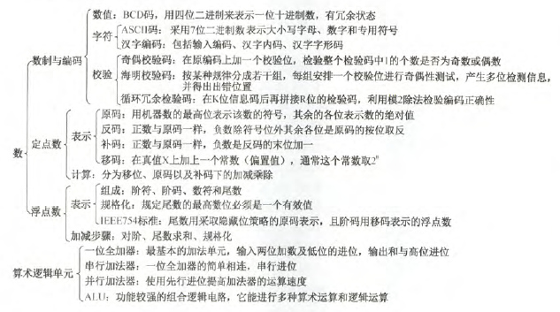
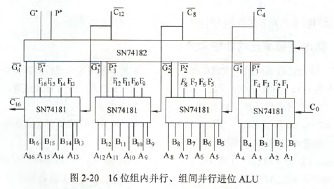

# 2.1 数制与编码

9.在按字节编址的计算机中，若数据在存储器中以小端方案存放。假定int型变量i的地址为08000000H，i的机器数为01234567H，地址08000000H单元的容量是(67H)

```java
小端存储，按字节编址。一个地址存储一个字节。小端说明存储的是低字节。及67H。
```

13.用1位奇偶校验能检测出1位主存错误的百分比为(100%)

16.能发现两位错误并能纠正1位错误的编码是(B)

- A.CRC码
- B.汉明码
- C.偶校验码
- D.奇校验码

```java
奇偶校验码都不能纠错；CRC码可以发现并纠正信息串行读/写、存储或传送中出现的一位或多位错(与多项式的选取有关);海明码能发现两位错误并纠正1位错。
```

17.在CRC中，接收端检测出某一位数据错误后，纠正的方法是(D)

- A.请求重发
- B.删除数据
- C.通过余数值自行纠正
- D.以上均可

# 2.2定点数的表示与运算

3.某计算机存储器按字节编址，采用小端方式存放数据。假定编译器规定int和short型长度分别为32位和16位，并且数据按边界对齐存储。某C语言程序段如下：

```C
struct{
    int a;
    char b;
    short c;
}record;
record.a=273;
```

若record变量的首地址为0xC008，则地址0xC008中的内容及record.c的地址分别为(D)

- A.0x00、0xC00D
- B.0x00、0xC00E
- C.0x11、0xC00D
- D.0x11、0xC00E

```java
【解析】
a=273=256+16+1=0000 0000 0000 0000 0000 0001 0001 0001=0x00000111.小端存储，所以11.

边界对齐：起始地址能被自身长度整除。
C008 C009 C00A C00B C00C C00D C00E C00F
01   01   01   00   b    -    c    c
D为13，显然不能被16整除，所以C00D空出。
```

5.有如下C语言

```C
short si = -32767;
unsigned short usi = si;
```

执行上述两句后，usi的值是(32769)

【解析】$2^{15}=32768,2^{16}=65536$,所以si源码为111111111(第一个1为符号位)，补码为10000001。转换成unsigned short还是10000001，只不过无符号，就是源码，即32768+1=32769 .

16.n位定点整数(有符号)表示的最大值是($2^{n-1}-1$)

【解析】数值只有n-1位，最高位为符号位，故能表示0~$2^{n-1}-1$

19.5位二进制定点小数，用补码表示时，最小负数是(D)

- A.0.111
- B.1.0001
- C.1.111
- D.1.0000

```java
【分析】
这是表示-1. 1.0000，1代表符号位，为负。数值位取反1111，加一10000，即负一。
```

21.设$[x]_补=1.x_1x_2x_3x_4$，当满足(D)时，x<-1/2成立

- A.$x_1$必须为1，$x_2x_3x_4$至少有一个为1
- B.$x_1$必须为1，$x_2x_3x_4$任意
- C.$x_1$必须为0，$x_2x_3x_4$至少一个为1
- D.$x_1$必须为0，$x_2x_3x_4$任意

```java
【分析】
1.1000 为-0.5源码
补码1.1000 为补码。
1.1100 为-0.75源码
补码1.0100 为补码
1.0100 为-0.25源码
补码1.1100 为补码
可见若x<-0.5，(如-0.75),第一位必须为0，其余随意。
```

|编码方式|最小值编码|最小值|最大值编码|最大值|取值范围|
|-----|-----|-----|-----|-----|-----|
|无符号定点小数|0.00……00|0|0.11……11|$1-2^{-n}$|$0<=x<=1-2^{-n}$|
|源码定点小数|1.11……11|$-1+2^{-n}$|0.11……11|$1-2^{-n}$|$-1+2{-n}<=x<=1-2^{-n}$|
|补码定点小数|1.00……00|-1|0.11……11|$1-2^{-n}$|$-1<=x<=1-2^{-n}$|
|反码定点小数|1.00……00|$-1+2^{-n}$|0.11……11|$1-2^{-n}$|$-1+2^{-n}<=x<=1-2^{-n}$

22.若$[x]_补=1,x_1x_2x_3x_4x_5x_6$，其中$x_i$取0或1，若要x>-32,应当满足(C)

- A.$x_1$为0，其他各位任意
- B.$x_1$为1，其他各位任意
- C.$x_1$为1，$x_2……x_6$至少有一位为1
- D.$x_1$为0，$x_2……x_6$至少有一位为1

```java
【分析】
显然x为负。
0100000 = 32
要让x>-32，|x|<32
即x1为0，x补码，x1必须为1.所以排除A，D。当B时，即1,100000，其表示-32.所以不满足，选C
```

23.设x为整数，$[x]_补=1,x_1x_2x_3x_4x_5$,若x<-16,$x_1$~$x_5$应满足的条件是(C)

- A.$x_1$~$x_5$至少已有一个为1
- B.$x_1$必须为0，$x_2$~$x_5$至少有一个为1
- C.$x_1$必须为0，$x_2$~$x_5$任意
- D.$x_1$必须为1，$x_2$~$x_5$任意

```java
【分析】
010000为16，x<-16,|x|>16，即x1必须为0.若100000，为-32，符合题意，所以选C。
```

**由22，23得，整数补码负数得话，先写出源码，若x<-n，则x>|n|,即最高位不变，后面随意，若x>-n,则x<|n|，即最高位取反，后面不能全0**

24.已知定点小数X得补码为$1.x_1x_2x_3$，且x<=-0.75，则必有(C)

- A.$x_1$=1,$x_2$=0,$x_3$=1
- B.$x_1$=1
- C.$x_1$=0,且$x_2x_3$不全为1
- D.$x_1$=0,$x_2$=0,$x_3$=0

```java
【分析】
x<=-0.75
当源码1.110时，x=-0.75.
补码1.010,x=-0.75.所以A，B，D排除。
C:补码1.011,源码1.101，为-0.625，错误

也可这样想：x源码大于等于0.75，即1.11X,X随意。变成补码
1.00X+01，可能为1.001或1.010，所以C。当1.000时，源码1.111+1=-1满足。
```

25.一个8位寄存器内数值位11001010，进位标志寄存器C为0，若将此8位寄存器循环左移(不带进位位)1位，则该8位寄存器和标志寄存器内得数值分别为(C)

- A.10010100 1
- B.10010101 0
- C.10010101 1
- D.10010100 0

【分析】**不带进位位循环左移，最高位移至最低位和进位标志位**

26.设机器数字长8位(含一位符号位),若机器数BAH为源码，算术左移1位和算数右移1位分别得(F4H,9DH),若BAH为补码，则分别是(F4H,DDH)

```java
【分析】
源码：
BAH->10111010b
左移 11110100b F4H
右移 10011101b 9DH

补码：
BAH->10111010b
左移 11110100b F4H
右移 11011101b DDH
```

28.设x为真值，$x^*$为其绝对值，满足$[-x^*]_补=[-x]_补$，当且仅当(D)

- A.x任意
- B.x为正数
- C.x为负数
- D.以上说法都不对

```java
【解析】
绝对值肯定大于等于0，加负号小于等于0.

所以，当x为0或正数时，满足条件
```

32.关于模4补码，下列说法正确的是(B)

- A.模4补码和模2补码不同，它更容易检查乘除运算中的溢出问题
- B.每个模4补码存储时只需1个符号位
- C.存储每个模4补码需要2个符号位
- D.模4补码，在算数与逻辑部件中为一个符号位

```java
【分析】注意：模4补码也叫双符号位。。。。。。
模4补码具有模2补码的全部优点且更易检查加减运算中的溢出问题。A错
任何一个正确的数值，模4补码的两个符号位总是相同的，故仅需一个符号位。
只在把两个模4补码的数送往ALU完成加减运算时，才把每个符号位的值同时送到ALU的双符号位中，即只在ALU中采用双符号位。
```

36.若寄存器内容为11111111，若它等于+127,则为(D)

- A.反码
- B.补码
- C.源码
- D.移码

【解析】
若反码，11111111源码为10000000为-0;若补码，11111111源码10000001为-1;若源码，11111111为-127

移码，因为同一数值的移码和补码，除最高位相反，其他各位相同，$[+127]_补$=01111111，故$[+127]_移$=11111111或者$[+127]_移$=$2^7+01111111$

40.下列为8位移码机器数$[x]_移$，求$[-x]_移$时，(B)将会发生溢出。

- A.11111111
- B.00000000
- C.10000000
- D.01111111

【分析】B对应-128，移码不能表示+128.故会产生溢出。(补码也不能表示)。1000 0000为B对应的补码，即-128.

42.判断加减法溢出时，可采用判断进位的方式，若符号位的进位为$C_0$，最高位的进位为$C_1$，则产生溢出的条件是(D)

1.$C_0$产生进位； 2.$C_1$产生进位； 3.$C_0,C_1$都产生进位； 4.$C_0,C_1$都不产生进位； 5.$C_0$产生进位，$C_1$不产生进位； 6.$C_0$不产生进位，$C_1$产生进位。

- A.1和2
- B.3
- C.4
- D.5和6

【分析】溢出条件为$C_0\bigoplus C_1$

48.x、y为定点整数，其格式为1为符号位、n位数值位，若采用补码一位乘法实现乘法运算，则最多需要(n+1)次加法运算

【解析】**补码一位乘法中，最多需要n次移位，n+1次加法运算。源码乘法移位和加法运算最多均为n次。**

51.实现N位(不包括符号位)补码一位乘时，乘积为(2N+1)位。

【解析】乘积2N位，+1位符号位

52.在源码不恢复余数法(又称源码加减交替法)的算法中(D)

- A.每步操作后，若不够减，则需恢复余数
- B.若为负商，则恢复余数
- C.整个算法过程中，从不恢复余数
- D.仅当最后一步不够减时，才恢复一次余数

53.下列关于补码除法的说法中，正确的是(B)

- A.补码不恢复除法中，够减商0，不够减商1
- B.补码不恢复余数除法中，异号相除时，够减商0，不够减商1
- C.补码不恢复除法中，够减商1，不够减商0

58.某32位计算机按字节编址，采用小端方式。若语句“int i = 0;”对应指令的机器代码为"C7 45 FC 00 00 00 00",则语句“int i=-64;”对应指令的机器代码是(C7 45 FC C0 FF FF FF FF)

```java
【解析】
-64 源码 1000 0000 0000 0000 0000 0000 0100 0000
    补码 1111 1111 1111 1111 1111 1111 1100 0000
    小端存储，故C0 FF FF FF(按字节存储)
```

# 2.3浮点数的表示与运算

3.float f = 1.5678E3,double d =1.5E100,则(d+f)-d=f(错)

```java
【解析】
d+f的时候，有一步要对阶。显然f阶较小，所以将f对成和d阶相同。阶数+1，小数点后算数右移一位。而float最多表示小数点后23位，而要移动97位，故f=0，即d+f=d
```

4.IEEE 754单精度浮点数格式。float x=-8.25，则存储器内容是(C1040000H)

```java
【解析】
-8.25=-1000.01=-1.00001E3
所以阶码为3+127=130，小数部分为00001(省掉高位)
故1 10000010 00001000000000000000000
1100 0001 0000 0100 0000 0000 0000 0000
C1040000H
```

10.浮点数规格如下：7位阶码，1位数符，8位尾数。若阶码用移码，尾数用补码，则浮点数范围是($-2^{(63)}$~$(1-2^{-8})*2^{63}$)

【解析】阶码用移码，类似float，8位阶码，移码偏移量为127($2^7-1$),故偏移量为($2^6-1=63$),而8位补码(不包括符号位)表示最大的范围为$-1$~$1-2^{-8}$,所以范围是$-2^{(63)}$~$(1-2^{-8})*2^{63}$

12.设浮点数阶的基数是8，尾数用模4补码表示。下列浮点数中(C)是规格化的

- A.11.111000
- B.00.000111
- C.11.101010
- D.11.111101

【解析】**因为基数是8，而$2^3=8$，故浮点数为正数时，数值位前3位不全为0时，是规格化数；当浮点数为负数时，数值位前3位不全为1，是规格化数。模4补码表示有两位符号位。**若尾数是源码的话，不管正负，尾数不能三个0开头

23.假设采用IEEE 754标准中的单精度浮点数表示一个数为45100000H，则该数的值为($(+1.125)_{10}*2^{11}$)

````java
【分析】
451000000H
0 10001010 001 0000 0000 0000 0000
0正数
10001010-01111111=11,阶数为11
001为0.125，加上省略的1，为1.125 ，所以答案如上。
````

24.设浮点数共12位。其中阶码含1位阶符共4位，以2为底，补码表示；尾数含1位数符共8位，补码表示，规格化。则能表示的最大正数是($2^7-1$)

【分析】
阶码表示最大正数是$2^7$。

尾数范围是$-1$~$1-2^{-7}$

所以最大整数是$2^7 * (1-2^{-7})$

28.已知$X=-0.875 * 2^1$,$Y=0.625*2^2$,设浮点数格式为阶符1位，阶码2位，数符1位，尾数3位，通过补码求出Z=X-Y的二进制浮点数规格化结果(0111011)

```java
【解析】
X 0 01 1 001
Y 0 10 0 101

X对阶
X 0 10 1 100 (阶码+1，尾数右移)

X-Y= X+(-Y)

Y转换成负数
Y 0 10 1 011

尾数相加
1100+1011=10111

规格化
尾数右移一位1011，阶码+1
最后结果为0 11 1011
```

29.下列关于各种移位的说法正确的是：

- 1.假设机器数采用反码表示，当机器数为负时，左移时最高位丢0，结果出错，右移时最低为丢0，影响精度。(对)
- 2.在算数移位的情况下，补码左移的前提条件是其原高有效位与原符号位要相同。(对)
- 3.在算数移位的情况下，双符号位的移位操作只有低符号位需要参加移位操作。(对)

30.舍入

- 舍入不一定产生误差(对)
- 浮点数的舍入包括两种情况，对阶和右规格化

31.下列说法都正确

- 对阶操作不会引起阶码上溢或下溢。(对阶只是小向大看齐，这里的大也是没有溢出的)
- 右规和尾数舍入都可能引起阶码上溢(阶码+1)
- 左规时可能引起阶码下溢(阶码-1)
- 尾数溢出时结果不一定溢出(尾数溢出时把溢出的转向阶码)

32.IEEE 754 单季度浮点格式表示的数中，最小的规格化正数($1.0*2^{-126}$)

【解析】
1位符号，8位阶码，23位尾数。最小正数，尾数为1(因为本来就省略一个1，而且是源码表示，也就是尾数应全为0)，阶数偏移量127，即0111 1111.全为0时机器零，全为1时无穷大，故阶数范围$2^{-126}$~$2^{127}$.-126为00000001，127-1；127为11111110，254-127

# 2.4算数逻辑单元

ALU属于组合逻辑电路

4.加法器中每位的进位产生信号g为($X_iY_i$).

【解析】对加法器的每位都生成两个信号，进位信号g和进位传递信号p，其中$g=X_iY_i，p=X_i\bigoplus Y_i$

5.用8片74181和两片74182可组成(二级先行进位结构的32位ALU)

【解析】74181是4位的内部先行进位的ALU芯片，74182是4位的先行进位芯片，每四片74181与一片74182相连，可组成一个二级先行进位结构的16位ALU，两个这种结构的16位ALU串行进位构成两级先行进位的32位ALU。

