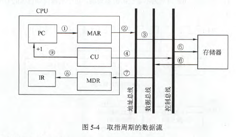
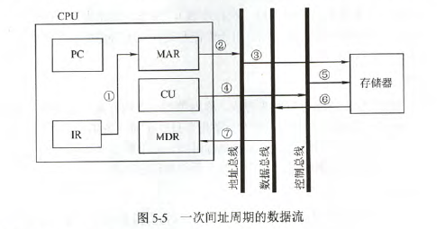
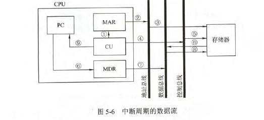
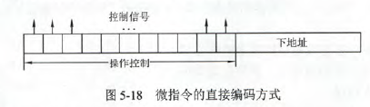
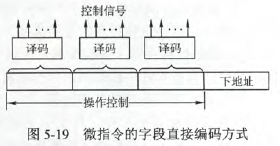
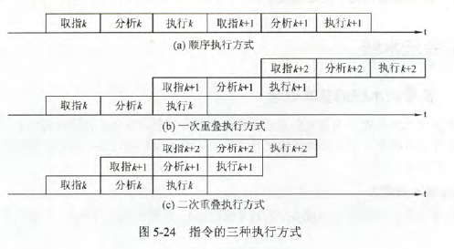
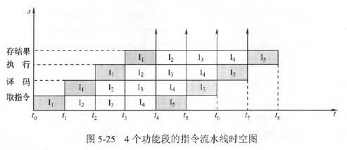
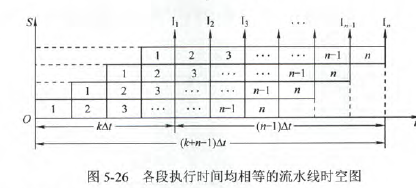
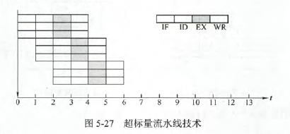
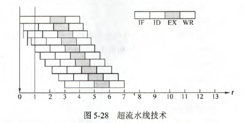

# CPU的功能和基本结构

### CPU的功能
CPU组成：

- 运算器：对数据进行加工
- 控制器：包括取指令、分析指令和执行指令

CPU功能：

- 指令控制
- 操作控制
- 时间控制
- 数据加工
- 中断处理

### CPU的基本结构

- 运算器：运算器接收从控制器送来的命令并执行相应的动作，对数据进行加工和处理。
  - 算术逻辑单元(ALU)：主要功能是进行算数\逻辑运算。
  - 暂存寄存器：用于暂存从主存读来的数据，该数据不能存放在通用寄存器中，否则会破坏原有内容。暂存寄存器对应用程序员透明。
  - 累加寄存器：通用寄存器，用于暂存ALU运算的结果，可以作为加法运算的一个输入端。
  - 通用寄存器组：AX、BX、CX、DX、SP等。用于存放操作数和各种地址信息。SP是堆栈指针，用于指示栈顶的地址。
  - 程序状态字寄存器：保留由算数逻辑运算指令或测试指令的结果而建立的各种状态信息。如溢出标志(OF)、符号标志(FS)、零标志(ZF)、进位标志(CF)等。
  - 位移器：对操作数或者结果进行位移运算。
  - 计数器：控制乘除运算的操作步数。
- 控制器：控制器的基本功能是执行指令，每条指令的执行是由控制器发生的一组微操作实现的。**分为硬布线控制器和微程序控制器**
  - 程序计数器(PC)：用于指出下一条指令在主存的存放地址。有自增功能
  - 指令寄存器(IR)：用于保存当前正在执行的那条指令
  - 指令译码器：仅对操作码字段进行译码，向控制器提供特定的操作信号
  - 存储器地址寄存器：用于存放所要访问的主存单元的地址
  - 存储器数据寄存器：用于存放向主存写入的信息或从主存中读出的信息
  - 时序系统：用于产生各种时序的信号，由统一时钟(CLOCK)分频得到
  - 微操作信号发生器：根据IR、PSW的内容及时序信号，产生控制整个计算机系统所需的各种控制信号，其结构有组合逻辑型和存储逻辑型

CPU寄存器可以分为两大类：
- 用户可见(可编程)：通用寄存器组、程序状态寄存器
- 用户不可见(对用户透明)：存储器地址寄存器、存储器数据寄存器、指令寄存器

# 指令执行过程


### 指令周期

指令周期由若干机器周期组成，一个机器周期又包含若干时钟周期。每个指令周期内机器周期数可以不等，每个机器周期内的节拍数也可以不等。

一个完整的指令周期包括**取指周期、间址周期、执行周期、中断周期**，这是四个机器周期

这四个机器周期都有CPU访存操作。取指周期为了取指令，间址周期为了取有效地址，执行周期为了取操作数，中断周期为了保存程序断点。

为了区别不同的周期，在CPU内部设置四个标志触发器。FE(取指)、IND(间址)、EX(执行)、INT(中断)

**中断周期的进栈操作是将SP-1**

### 指令周期的数据流
- 取指周期：根据PC中的内容从主存中取出指令代码并存放在IR中。

  PC->MAR->地址总线->主存

  CU发出控制信号->控制总线->主存

  主存->数据总线->MDR->IR

  CU发出读命令->PC内容加1



- 间址周期：取操作数有效地址。
  
  Ad(IR)(或MDR)->MAR->地址总线->主存

  CU发出读命令->控制总线->主存

  主存->数据总线->MDR(存放操作数的有效地址)



- 执行周期：根据IR中的指令字的操作码和操作数通过ALU操作产生结果。
- 中断周期：处理中断请求(在条指令执行结束相应中断请求)。

  CU控制将SP-1，SP->MAR

  CU发出写命令->控制总线->主存

  PC->MDR

  MDR->M(MAR)

  CU(中断服务程序入口地址)->PC



### 指令执行方案

- 单指令周期：所有指令都选用相同的执行时间来执行。指令周期取决于执行时间最长的指令的执行时间。会降低整个系统的运行速度
- 多指令周期：不同类型的指令选用不同的执行步骤来完成。指令之间串行执行，即下一条指令只能在该指令执行结束后执行。
- 流水线方案：指令之间并行执行，追求的目标是了力争在每个时钟脉冲周期完成一条指令的执行过程。这种方案通过在每个时钟周期启动每一条指令，尽量让多条指令同时运行，但各自处在不同的执行步骤中。

# 数据通路的基本功能和基本结构

### 数据通路的功能

数据在功能部件之间传送的路径称为数据通路.数据通路的功能是实现CPU内部的运算器与寄存器即寄存器之间的数据交换。

### 数据通路的基本结构

- CPU内部单总线方式。将所有寄存器的输入端和输出端连接到一条公共通路上。
- CPU内部三总线方式。将所有寄存器的输入端和输出端都连接到多条公共通路上。
- 专用数据通路方式。根据指令执行过程中的数据和地址的流动方向安排连接线路，避免使用共享的总线，性能较高，但硬件量大。

**内部总线是指同一部件内部各器件之间连接的总线，系统总线是指同一台计算机系统的各部件，地址、数据、控制**

- 寄存器之间的数据传送：通过CPU内部总线完成。以PC寄存器为例，把PC内容送至MAR
  
  PC->Bus    PCout有效，PC内容送总线
  
  Bus->MAR   MARin有效，总线内容送MAR

- 主存与CPU之间的数据传送：也要借助CPU内部总线完成，以CPU从主存读取指令为例

  PC->Bus->MAR    PCout和MARin有效，现行指令地址->MAR

  1->R            CU发出读命令

  MEM(MAR)->MDR   MDRin有效

  MDR->Bus->IR    MDRout和IRin有效，现行指令->IR
  
- 执行算数或逻辑运算：**ALU本身没有内部存储功能的电路，执行加法运算，相加的两个数必须在ALU的两个输入端同时有效**。先将一个操作数经CPU内部总线送入暂存器Y保存，Y的内容在ALU的左输入端始终有效，再将另一个操作数经总线直接送到ALU的右输入端。运算结果暂存在暂存器Z中。

  Ad(IR)->Bus->MAR    MDRout和MARin有效

  1->R                CU发出读命令

  MEM->数据线->MDR    操作数从存储器->数据线->MDR

  MDR->Bus->Y         MDRout和Yin有效，操作数->Y

  (ACC)+(Y)->Z        ACCout和ALUin有效，CU向ALU发出加命令，结果->Z

  Z->ACC              Zout和ACCin有效，结果->ACC


只能出的只有Z暂存器。

只能进的有MAR  Y暂存器   ALU

IR的操作码部分只能进不能出，操作数部分能进能出

# 控制器的功能和工作原理

### 控制器的功能和结构

控制器的主要功能：
- 从主存中取出一条指令，并指出下一条指令在主存中的位置
- 对指令进行译码或测试，产生相应的操作控制信号，以便启动规定的动作
- 指挥并控制CPU、主存、输入和输出设备之间的数据流动方向

控制器可分为硬布线控制器和微程序控制器

### 硬布线控制器

基本原理：根据指令的要求、当前的时序以及外部和内部的状态，按时间的顺序发送一系列微操作控制信号。由组合逻辑电路和触发器构成，又叫组合逻辑控制器。

CU的输入信号来源：
- 经指令译码器译码产生的指令信息。
- 时序系统产生的机器周期信号和节拍信号。
- 来自执行单元的反馈信息，即标志。
- 来自系统总线的控制信号，如中断请求、DMA请求

硬布线控制器的时序系统：
- 时钟周期
- 机器周期：所有指令执行过程中的一个基准时间。访问一次存储器的时间是固定的，因此通常以存取周期作为基准时间，即内存中读取一个指令字的最短时间作为机器周期。
- 指令周期
- 微操作命令分析

一条指令主要分为三个工作周期
- 取指周期
```asciiarmor
PC -> MAR      现行指令地址->MAR
1 -> R         命令存储器读
M(MAR) -> MDR  现行指令从存储器中读至MDR
MDR -> IR      现行指令->IR
OP(IR) -> CU   指令的操作码->CU译码
(PC)+1 -> PC   形成下一条指令的地址
```
- 间址周期
```c#
Ad(IR) -> MAR  将指令字中的地址码(形式地址)->MAR
1 -> R         命令存储器读
M(MAR) -> MDR  将有效地址从存储器读至MDR
```
- 执行周期

CPU的控制方式：控制单元控制一条指令执行的过程，实质上是依次执行一个确定的微操作序列的过程
- 同步控制方式：系统有一个时钟，所有的控制信号均来自这个统一的时钟信号。以最长的微操作序列和最繁琐的微操作作为基准。
- 异步控制方式：不存在基准时标信号，各部件按自身固有的速度工作，通过应答方式进行联络。
- 联合控制方式：介于同步和异步之间的折中。

### 微程序控制器
微程序设计思想就是将每条机器指令编写成一个微程序，每个微程序包含若干微指令，每条微指令对应一个或几个微操作命令。
- 微命令与微操作：一条机器指令可以分解成一个微操作序列，这些微操作是计算机中最基本的、不可再分解的操作。将控制部件向执行部件发出的各种控制命令称为微命令，它是构成控制序列的最小单位。微命令是微操作的控制信号，微操作是微命令的执行过程。(在组合逻辑控制器中也存在微命令与微操作这两个概念)
- 微指令与微周期：微指令是若干微命令的集合。一条微指令通常包含两大部分信息：操作控制字段(微操作码字段)；顺序控制字段(微地址码字段)
- 主存储器与控制存储器：主存储器用来存放数据和程序，在CPU外部，由RAM实现。控制存储器用于存放微程序，在CPU内部，由ROM实现
- 程序与微程序：程序是指令的有序集合，微程序是微指令的有序集合。一条指令的功能由一段微程序来实现。

微指令的编码方式

- 直接编码方式：无需进行译码，微指令的微命令字段中每位都代表一个微命令。优点：简单，直观，执行速度快，操作并行性好。缺点：微指令字长过长，n个微命令就要操作字段有n位。



- 字段直接编码方式：将微指令的微命令字段分成若干小字段，把互斥性微命令（不能同时执行）组合在同一字段中，把相容性微指令组合在不同字段中。原则
  - 互斥性微命令分在同一段内，相容性微命令分在不同段内
  - 每个小段中包含的信息位不能太多，否则将增加译码线路的复杂性和译码时间
  - 一般每个小段还要留出一个状态，表示本字段不发出任何微命令。因此，当某字段的长度为3时，最多只能表示7个互斥的命令，通常用000表示不操作。
  - 字段间接编码方式：一个字段的某些微命令需由另一个字段中的某些微命令来解释。



微指令的地址形成方式：

- 直接由微指令的下地址字段指出。又称断定方式
- 根据机器指令的操作码形成。机器指令取至指令寄存器后，微指令的地址由操作码经微地址形成部件形成。

第一条微指令的地址可由专门的硬件电路产生，也可由外部直接向CMAR输入微指令的地址，这个地址即为取指周期微程序的入口地址。

微指令的格式
- 水平型微指令：直接编码、字段直接编码、字段间接编码和混合编码都属于水平型微指令。指令字中的一位对应一个控制信号，有输出时为1，否则为0.一条水平型微指令定义并执行几种并行的基本操作。优点是为程序短，执行速度快；缺点是微指令长，编写微程序较麻烦
- 垂直型微指令：采用类似机器指令的方式，设置微操作码字段。基本指令格式为微操作码-目的地址-源地址。垂直型微指令指令格式的优点是微指令短、简单、规整；缺点是微程序长，执行速度慢，工作效率低
- 混合型微指令：在垂直型的基础上增加一些不太复杂的并行操作。

|对比项目|微程序控制器|硬布线控制器|
|-----|-----|-----|
|工作原理|为操作控制信号以微程序的形式存放在控制存储器中，执行指令时读出即可|微操作控制信号由组合逻辑电路根据当前的指令码、状态和时序，即使产生|
|执行速度|慢|快|
|规整性|较规整|繁琐、不规整|
|应用场合|CISC CPU|RISC CPU|
|易扩展性|易扩充修改|困难|

# 指令流水线

### 基本概念

假设将指令执行过程分解为：取指，分析，执行过程。可以采用以下三种方式：
- 顺序执行方式：T=3nt
- 一次重叠执行：T=(1+2n)t
- 二次重叠执行：T=(2+n)t



流水线的表示方法：如图，第一条指令$I_1$在$t_0$时刻进入流水线，在时刻$t_4$流出流水线。第二条指令$I_2$在时刻$t_1$进入流水线，在时刻$t_5$流出流水线。以此类推，每经过一个$\Delta t$时间，便有一条指令进入流水线，从时刻$t_4$开始有一条指令流出流水线。当$t_8=8\Delta t$时，流水线上便有5条指令流出。若采用串行方式执行指令，当$t_8=8\Delta t$时，只能执行2条指令。



流水线方式的特点：
- 把一个任务分解为几个有联系的子任务，每个子任务由一个专门的功能部件来执行，并依靠多个功能部件并行工作来缩短程序的执行时间
- 流水线每个功能段部件后面都要有一个缓冲寄存器，或称锁存器，齐作用是保存本流水段的执行结果，供给下一流水段使用。
- 流水线中各功能段的时间应尽量相等
- 只有连续不断地提供同一种任务时才能发挥流水线的效率，所以在流水线中处理的必须是连续任务
- 流水线需要有装入时间和排空时间。装入时间是指第一个任务进入流水线到输出流水线的时间。排空时间是指最后一个任务进入流水线到输出流水线的时间。

### 流水线的分类

- 部件功能级、处理机级和处理机间级流水线：部件功能级流水线将复杂的算数逻辑运算组成流水线，如浮点加法操作；处理机级流水是把一条指令解是分解成多个子过程；处理机间流水是一种宏流水，其中每个处理机完成某一项专门任务，各个处理机得到的结果需存放在下一个处理机共享的存储器中。
- 单功能流水线和多功能流水线：单：只能实现一种固定的专门功能的流水线；多：通过各段间的不同连接方式可以同时或不同时地实现多种功能地流水线。
- 动态流水线和静态流水线：静：在同一时间内，流水线的各段只能按同一种功能的连接方式工作。动：同一时间内，当某些段正在实现某种运算时，另一些段却正在进行另一种运算。
- 线性流水线和非线性流水线：线性：从输入到输出，每个功能段只允许经过一次，不存在反馈回路；非线性：存在反馈回路，从输入到输出的过程中，某些功能段将数次通过流水线，这种流水线适合进行线性递归的运算。

### 影响流水线的因素

- 结构相关：多条指令在同一时刻征用同一资源而形成的冲突称为结构相关。
  - 前一指令访存时，使用后一条相关指令暂停一个时钟周期
  - 资源重复配置
- 数据相关：一个程序中，存在必须等前一条指令执行完才能执行后一条指令的情况。
  - 把要到数据相关的指令及其后续指令都暂停一至几个时钟周期
  - 设置相关专用通路，下一条指令直接把前一条指令的ALU的计算结果作为自己的输入数据开始计算。
  - 通过编译器优化，调整指令顺序
- 控制相关：遇到转移指令或其他改变PC值的指令造成断流
  - 对转移指令进行分支预测，尽早生成转移目标地址。
  - 预取转移成功和不成功两个控制流方向上的目标指令
  - 加快和提前形成条件码
  - 提高转移方向的准确率

### 流水线的性能指标

- 流水线的吞吐率：在单位时间内流水线所完成的任务数量，或输出结果的数量。

$TP=n/T_k$

n是任务数，$T_k$是处理完n个任务所用的时间。



$TP=n/(k+n-1)\Delta t$

n->$\infty$时,$TP_{max}=1/\Delta t$

- 流水线的加速比

完成同样一批任务，不使用流水线所用的时间与使用流水线所用的时间之比，称为流水线的加速比

$S=T_0/T_k$

$S=kn\Delta t/(k+n-1)\Delta t$

n->$\infty$时，$S_{max}=k$
- 流水线的效率

流水线的设备利用率称为效率。在时空图上，流水线效率定义为n个任务占用的时空的有效面积，与n个任务所用的时间以及k个流水线段所围成的时空去总面积之比。

$E= \frac{n个任务占用的时空区有效面积}{n个任务所用的时间与k个流水段所围成的时空区总面积}=\frac{T_0}{kT_k}$

n->$\infty$时，$E_{max}=1$

### 超标量流水线的基本概念
- 超标量流水线技术：每个时钟周期并发多条独立指令，为此需配置多个功能部件。(不能调整指令的执行顺序，因此通过编译优化技术)


- 超流水线技术：将一个时钟周期再分段，在一个时钟周期内一个功能部件使用多次。(不能调整指令的执行顺序，靠编译程序解决优化问题)



- 超长指令字：由编译程序挖掘出指令间潜在的并行性，将多条能并行操作的指令组合成一条具有多个操作字段的超字长指令字(可达几百位)，为此需要采用多个处理部件。

# 控制器


取指令

分析指令，根据系统当前状态和操作码分析出诸多控制信号

执行指令，由这些控制信号来控制整个系统的运行


运算器是一个组合逻辑电路。控制器是一个时序逻辑电路。


具体的实现过程不需要深究。

知道有这几个步骤还有第一步的微操作序列即可。

# 微程序


微命令是微操作的控制信号。微操作是微命令的执行过程。

一个微操作对应一组微命令。


控制这前两条微操作执行的微命令叫做相容性微命令，图中没有说清楚。

后两条微操作虽然在之前的设计中放到了同一时钟周期执行，但那是因为这两条命令都很短，实际上是存在着先后顺序的。

一条机器指令对应多条微操作命令，相容性微命令编写为同一微指令。多条微命令组成一个微程序。即一条机器指令对应一个微程序。

每条微指令除了要完成自己的任务外，还要能指出下一条微指令对应的地址。


上图超重要。

每个机器指令其实就是执行周期，每个执行周期结束后自动转入取指周期，取下一条指令。中断周期结束后也是自动转入取指周期，取下一条指令。

间址周期结束后自动转入执行周期微程序。


上图了解即可。背下来就可。


重点掌握第2种，第3种了解即可。


只看前两种就行。重点掌握断定方式就可。


注意一下最后一步不同。


T1 T3 是自动读出下一条微指令

T5 是控制转入下一周期


只看一二步，三四步了解即可。


上图了解即可。


# 指令流水线


1/At 的含义就是每隔At的时间就会有一个任务完成提交。


取指、译码、执行、访存、写回五个阶段。

图中把取指、访存访问的存储器分开了。


其实就是同步问题。

第一种相当于是阻塞等待。第二种就是半路截胡，不用在等到用存储器里了，直接用旁路把数据从半路传过来。


后两个都是乱序。第二个是可能乱序发射。第三个是即使不乱序发射，但一个快，一个慢，最终也可能导致乱序。


