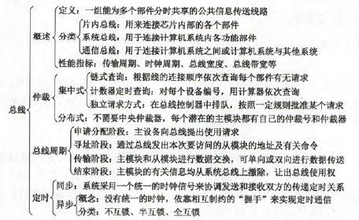

# 总线概述

2.假设某系统总线在一个总线周期中并行传输4字节信息，一个总线周期占用2个时钟周期，总线时钟频率为10MHz，则总线带宽是(20MB/s)

【解析】时钟周期为1/10MHz=0.1us。4/2*0.1=20MB/s

3.某同步总线的时钟频率为100MHz，宽度为32位，地址/数据线复用，每传输一个地址或数据占用一个时钟周期。若该总线支持突发(猝发)传输方式，则一次“主存写”总线事务传输128位数据所需要的时间至少是(50ns)

【解析】128位数据，每次32位，故需要四次时钟周期，40ns。猝发式指可以连续传送地址连续的数据。传一次地址，要一个时钟周期，故总共50ns

4.某同步总线采用数据线和地址线复用方式，其中地址/数据线有32根，总线时钟频率为66MHz，每个时钟周期传送两次数据(上升沿和下降沿各传送一次数据)，该总线的最大数据传输率(总线带宽)是(528MB/s)

【解析】32位为4B。一次4B。总线时钟频率66MHz，即1s66次，每次传两个，等价于1s 132次。故132*4B=528MB/s

5.一次总线事务中，主设备只需给出一个首地址，从设备就能从首地址开始的若干连续单元读出或写入多个数据。这种总线事务方式称为(C)

- A.并行传输
- B.串行传输
- C.突发传输
- D.同步传输

【解析】突发传输，在一个总线周期内，可以传输多个存储地址连续的数据，即一次传输一个地址和一批地址连续的数据；并行传输是在传输中有多个数据位同时在设备之间进行的传输，串行传输是指数据的二进制代码在一条物理信道上以位为单位按时间顺序逐位传输的方式；同步传输是指传输过程由统一的时钟控制。

10.计算机使用总线结构便于增减外设，同时(C)

- A.减少信息传输量
- B.提高信息的传输速度
- C.减少信息传输线的条数
- D.提高信息传输的并行性

【解析】没有总线的话，任何两个有数据交互的器件都要有线相连

11.间址寻址第一次访问内存所得到的信息经系统总线的(数据总线)传送到CPU。

13.单周期处理器中所有指令的指令周期为一个时钟周期。下列关于单周期处理器的叙述中，错误的是(A)

- A.可以采用单总线结构数据通路
- B.处理器时钟频率较低
- C.在指令执行过程中控制信号不变
- D.每条指令的CPI为1

【解析】A，单总线结构的话，多个部件只能争用唯一的总线，且不支持并发传送操作。单周期处理器并不能采用单总线结构数据通路。C，控制信号指PC中的内容，在指令执行过程中PC内容不变

16.主存通过(总线的类型)来识别信息是地址还是数据

18.传输一幅分辨率为640*480像素、颜色数量为65536的照片，设有效数据传输率为56kb/s，大约需要的时间是(87.77s)

【解析】640\*480\*16 / 56\*1024=87.77s.16位表示颜色

19.某总线有104根信号线，其中数据线(DB)为32根，若总线工作频率为33MHz，则其理论最大传输率为(132MB/s)

【解析】32/8*33M=132MB

21.微机中控制总线上完整传输的信号有(B,C)

- A.存储器和I/O设备的地址码
- B.所有存储器和I/O设备的时序信号与控制信号
- C.来自I/O设备和存储器的响应信号

【解析】A中的地址码是在地址总线中传输的。

22.下列关于总线定时的叙述中，错误的是(C)

- A.异步通信方式中，全互锁协议最慢
- B.异步通信方式中，非互锁协议的可靠性最差
- C.同步通信方式中，同步时钟信号可由各设备提供
- D.半同步通信方式中，握手信号的采用由同步时钟控制

【解析】在同步通信方式中，系统采用一个统一的时钟信号，而不是由各设备提供。

23.下列关于总线设计的叙述中，错误的是(A)

- A.并行总线传输比串行总线传输速度快
- B.采用信号线复用技术可减少信号线数量
- C.采用突发传输方式可提高总线数据传输率
- D.采用分离事务通信方式可提高总线利用率

【解析】D是总线复用方式中的一种。A不一定

24.下列关于多总线结构的叙述中，错误的是(D)

- A.靠近CPU的总线速度较快
- B.存储器总线可支持突发传递方式
- C.总线之间须通过桥接器相连
- D.PCI-Express*16采用并行传输方式

【解析】D中是串行传输方式。

25.下列选项中，可提高同步总线数据传输率的是(A,B,C)

- A.增加总线宽度
- B.提高总线工作频率
- C.支持突发传输
- D.采用地址/数据线复用

【解析】D能降低成本，但不能提高传输率

# 6.2总线仲裁

2.“总线忙”信号的建立者是(A)

- A.获得总线控制权的设备
- B.发出总线请求信号的设备
- C.总线控制器
- D.CPU

7.计数器定时查询方式不需要总线同意信号

# 6.3总线操作和定时

2.某机器I/O设备采用异步串行传送方式传送字符信息，字符信息格式为1位起始位、7位数据位、1位校验位和1位停止位。若要求每秒传送480个字符，则设备的数据传输率为(4800b/s)

【解析】10位*480b/s=4800b/s

5.以下各项中，(B)是同步传输的特点

- A.需要应答信号
- B.各部件的存取时间比较接近
- C.总线长度较长
- D.总线周期长度可变

6.异步总线中，传送操作(按需分配时间)

# 总线标准

2.下列关于USB总线特征的描述中，错误的是(D)

- A.可实现外设的即插即用和热插拔
- B.可通过级联方式连接多台外设
- C.是一种通信总线，连接不同外设
- D.同时传输2位数据，数据传输率高

【解析】D：USB是串行总线，不能同时传输2位数据

3.下列总线标准中属于串行总线的是(B)

- A.PCI
- B.USB
- C.EISA
- D.ISA

5.在现代微机主板中，采用局部总线技术的作用是(A)

- A.节省系统的总带宽
- B.提高抗干扰能力
- C.抑制总线终端反射
- D.构成紧耦合系统

6.下列不属于计算机局部总线的是(D)

- A.VESA
- B.PCI
- C.AGP
- D.ISA

【解析】ISA是系统总线