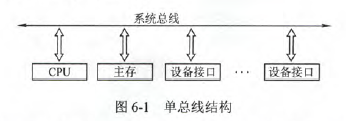
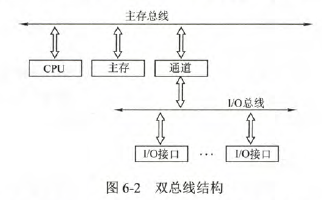
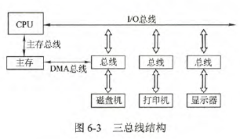
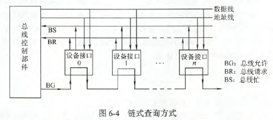
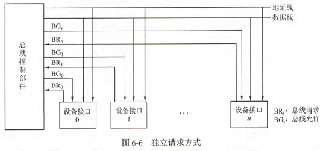

# 总线概述

### 总线基本概念

总线是一组能为多个部件分时共享的公共信息传送线路。

- 分时：同一时刻只允许有一个部件向总线发送信息。
- 共享：总线上可以挂接多个部件，各个部件之间互相交换的信息可以通过这组线路分时共享。（在某一时刻只允许有一个部件向总线发送信息，但多个部件可同时从总线上接收相同的信息）

总线设备：

- 主设备：获得总线控制器的设备
- 从设备：被主设备访问的设备，它只能相应从主设备发来的各种总线命令。

总线的猝发传输方式：在一个总线周期内传输存储地址连续的多个数据字的总线传输方式，称为猝发传送。一次猝发式传送总线周期通常由一个地址期和一个或几个数据周期组成。

### 总线特征

- 机器特征：尺寸、形状
- 电气特征：传输方向和有效的电平范围
- 功能特征：每根传输线的功能（如传送地址、还是传送数据、传送控制信号）
- 时间特征：信号的时序关系(哪根线在什么时间内有效)

### 总线的分类

- 片内总线：芯片内部的总线，比如CPU芯片内部寄存器与寄存器之间、寄存器与ALU之间的公共连接线。
- 系统总线：计算机系统内各功能部件之间相互连接的总线。连接五大部件之间的信息传输线。
  - 数据总线：用来传输各功能部件之间的数据信息，**双向传输总线**，其位数与机器字长、存储字长有关(数据通路表示的是数据流经的路径，数据总线是承载的媒介)
  - 地址总线：指出数据总线上的源数据或目的数据所在的主存单元或I/O端口的地址，**单向传输总线**，地址总线的位数与主存地址空间的大小有关。
  - 控制总线：传输的是控制信息，包括CPU送出的控制命令和主存返回CPU的反馈信息。
- 通信总线：计算机系统之间或计算机系统与其它系统之间传送信息的总线，通信总线也称外部总线。

###  系统总线的结构

- 单总线结构：将CPU、主存、I/O设备都挂在一组总线上，允许IO设备之间，IO设备与CPU之间或IO设备与主存之间交换信息。**单总线结构并不是只有一根信号线，系统总线按传送信息的不同可细分为地址总线、数据总线和控制总线**。带宽低，负载重，不支持并发传送。使用单总线结构不能解决CPU、主存、IO设备之间传输速率不匹配的问题。（**由于IO设备与主存共用一组地址线，因此主存和IO设备是统一编址的，CPU就可以像访问内存一样访问外部设备**）

- 双总线结构：一条是主存总线，用于在CPU、主存和通道之间传送数据；另一条是I/O总线，用于在多个外部设备与通道之间传送数据。优点：将低速I/O设备分离出来。缺点：要增加通道等硬件设备。

- 三总线结构：分别是主存总线、I/O总线和直接内存访问(DMA)总线。DMA总线用于在内存和高速外设之间直接传送数据。优点：提高I/O设备性能。缺点：系统工作效率较低。（在三总线结构中，任一时刻只能使用一种总线。主存总线与DMA总线不能同时对主存进行存取，I/O总线只有在CPU执行I/O指令时才能用到）

### 总线的性能指标

- 总线的传输周期：一次总线操作所需的时间，简称总线周期。通常由若干总线时钟周期构成。
- 总线时钟周期：机器的时钟周期。
- 总线的工作频率：为总线周期的倒数。实际上指1s内传送几次数据。
- 总线的时钟频率：机器的时钟频率，为机器周期的倒数。
- 总线宽度：又叫总线位宽，总线上同时传输的数据位数，通常指数据总线的根数，如32根称为32位总线。
- 总线带宽：总线的数据传输率，即单位时间内总线上可传输数据的位数。总线的带宽=总线工作频率*(总线宽度/8)   (工作频率为每秒多少次，宽度为每次多少位，所以相乘即为每秒多少位，b/s。)
- 总线复用：是指一种信号线在不同的时间传输不同的信息，因此可以使用较少的线传输更多的信息。
- 信号线数：**地址总线、数据总线和控制总线3种总线的总和称为信号线数**

# 总线仲裁

总线作为一种共享设备，不可避免地会出现同一时刻有多个主设备同时竞争主线控制权地问题。为解决这一问题，应当采用总线仲裁部件，以某种方式选择一个主设备优先获得总线控制权。

### 集中仲裁方式

- 链式查询方式：总线上所有部件共用一根总线请求线。总线控制器检查总线是否忙，若总线不忙，则立即发总线响应信号。依次查询，若到达部件无总线请求，则信号传到下一个部件，若有，则被截住，不再传下去。**越靠近总线控制器，优先级越高**，优点：优先级固定，结构简单，容易扩充。缺点：对硬件电路的故障敏感，且优先级不能改变。

- 计数器定时查询方式：采用计数器控制总线使用权，对比上面，多了**一组设备地址线，少了一根总线响应线BG**。仍共用一根总线请求线，当总线控制器收到总线请求信号并判断总线空闲时，计数器开始计数，计数值通过设备地址线发向各个部件。当地址线上的计数值与请求使用的总线设备的地址一致时，该设备获得总线使用权，同时中止计数器的计数及查询。优点：计数从“0”开始，此时优先级固定，0，1，2……；计数也可由上一次的终点开始，采用一种循环方法；计数器的初值还可以程序设置。缺点：增加了控制线数，若设备有n个，则大致需要$\lceil\log_2(n)\rceil+2$条控制线。

- 独立请求查询：每个设备均有一堆总线请求线$BR_i$和总线允许线$BG_i$。使用总线时，各自发送请求信号，在总线控制器中排队。优先：响应速度快；缺点：控制线多，若设备有n个，需要2n+1条控制线，加的那条线是BS线，作用是让设备向总线控制部件反馈已使用完总线。

|对比项目|链式查询|计数器定时查询|独立请求|
|-----|-----|-----|-----|
|控制线数|3(总线请求:1；总线忙:1；总线允许:1)|$\lceil\log_2(n)\rceil+2$(总线请求:1；总线忙:1；设备地址线：$\lceil\log_2(n)\rceil$)|2n+1(总线请求:n；总线允许:n；总线忙:1)|
|优点|优先级固定，结构简单，扩充容易|优先级灵活|响应速度快，优先级灵活|
|缺点|对电路故障敏感，优先级不灵活|控制线多，控制复杂|控制线多，控制复杂|

### 分布仲裁方式

不需要中央仲裁器，每个主模块都有自己的仲裁号和仲裁器，多个仲裁器竞争使用总线。

### 总线操作和定时

总线定时是指总线在双方交换数据的过程中需要时间上配合关系的控制，这种控制成为总线定时，其实只是一种协议或规则，主要有同步和异步两种基本定时方式。

总线传输的四个阶段（总线周期）：

- 申请分配阶段：可细分为传输申请和总线仲裁两个阶段
- 寻址阶段：取得使用权的主模块通过总线发出本次要访问的从模块的地址及有关命令，启动参与本次传输的从模块。
- 传输阶段：主模块和从模块进行数据交换
- 结束阶段：主模块的有关信息均从系统总线上撤除，让出总线使用权。

总线通信控制主要解决通信双方如何获知传输开始和传输结束，以及通信双方如何协调和如何配合。分为以下几种：

同步定时方式：采用统一的时钟信号来协调发送方和接受发的传送定时关系。时钟产生相等的时间间隔，每个间隔构成一个总线周期，在一个总线周期中，发送方和接收方可以进行一次数据传送。优点：传送速度快，具有较高的传输速率；总线控制逻辑简单。缺点：主从设备属于强制性同步；可靠性差。同步通信适用于纵线长度较短及总线所接部件的存取时间比较接近的系统。

异步定时方式：没有统一时钟，完全依靠传送双方相互制约的“握手”信号来实现定时控制。优点：总线周期长度可变，能保证两个工作速度相差很大的部件或设备之间可靠地进行信息交换，自动适应时间的配合。缺点：复杂，速度比同步定时方式慢。

- 不互锁方式：主模块的请求信号和从模块的回答信号没有相互的制约关系。主设备发出"请求"信号后，不必等到接到从设备的“回答”信号，而是经过一段时间便撤销“请求”信号。从设备接收请求信号后，同样等一段时间就撤销“回答”信号
- 半互锁方式：主模块的请求信号和从模块的回答信号有简单的制约关系。主设备发出“请求”信号后，必须在接到从设备的“回答”信号后。才撤销“请求”信号，回答信号与上相同
- 全互锁方式：主模块的请求信号和从模块的回答信号有完全的制约关系。主设备发出“请求”信号后，必须在从设备“回答”后才撤销；从设备发出“回答”信号后，必须在获知主设备“请求”信号已撤销，再撤销其“回答”信号。

# 总线标准

- ISA：最早出现的微型计算机的**系统总线**，应用在IBM的AT机上。
- EISA：**扩展的ISA**，总线是为配合32位CPU而设计的扩展总线，EIAS对ISA完全兼容
- VESA：是一个32位标准的计算机**局部总线**，针对多媒体PC要求高速传送**活动图像**的大量数据应运而生的。
- PCI（最常用）：高性能的32位或64位总线，是专为高度集成的外围部件、扩充插板和处理器/存储器系统设计的互联机制。目前常用的PCI适配器有显卡、声卡、网卡等。即插即用，属于**局部总线**。PCI总线可以通过桥连接实现多层CPI总线。**与CPU无关**
- PEC-Express：最新的总线和接口标准，它将**全面取代PCI和AGP**
- AGP:一种**视频接口标准**，专用于连接主存和图形存储器，属于**局部总线**。1
- **以下全是设备总线**
- RS-232C：**串行通信总线**，应用于串行二进制交换的数据终端设备和数据通信设备之间的标准接口
- USB：**通用串行总线**，连接外部设备的I/O总线，属于设备总线。即插即用，热插拔。
- PCMCIA：应用广泛的笔记本电脑的接口标准，是一个用于扩**展功能的小型插槽**。即插即用
- IDE：更准确地称为ATA，是一种IDE接口磁盘驱动接口类型。
- SCSI：是一种用于计算机和智能设备(硬盘、软盘、光驱、打印机等)之间系统级接口的独立处理器标准。SCSI是一种智能的通用接口标准
- SATA：是一种既有行业标准的串行硬盘驱动器接口。
- 

### 同一个总线能既采用同步方式又采用异步方式通信吗？

半同步总线可以。

### 一个总线再某一时刻可以有多对主从设备进行通信吗？

不可以。否则会发生数据冲突。