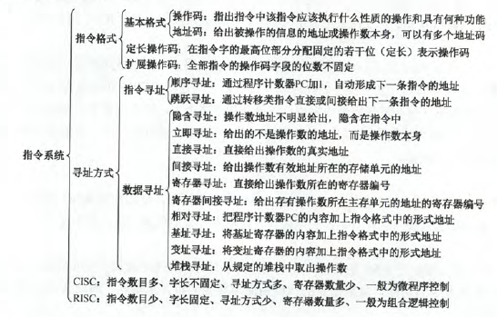

# 4.1指令格式

1.以下有关指令系统的说法中，错误的是(D)

- A.指令系统是一台机器硬件能执行的指令全体
- B.任何程序运行前都要先转换成机器语言程序
- C.指令系统是计算机软/硬件的界面
- D.指令系统和机器语言是无关的

【解析】指令系统可以认为是软件对底层和硬件最高层。这个界面不是GUI，而是软硬件的交界处。

7.堆栈计算机中，有些堆栈零地址的运算类指令在指令格式中不给出操作数的地址，参加的两个操作数来自(C)

- A.累加器和寄存器
- B.累加器和暂存器
- C.堆栈的栈顶和次栈顶单元
- D.堆栈的栈顶单元和暂存器

【解析】就是C。。。暂存器是用于提供ALU的操作数。（输入输出各一个），累加器，存放中间结果。**堆栈指令的访存次数，分为硬堆栈和软堆栈，若软堆栈(堆栈区由内存实现)，则对于双目运算要访问4次内存，取指令，两个操作数和保存结果，若是硬堆栈，(堆栈区由寄存器构成)，只在取指时访问一次**

12.在指令格式中，采用扩展操作码设计方案的目的是(C)

- A.减少指令字长度
- B.增加指令字长度
- C.保持指令字长度不变而增加指令的数量
- D.保持指令字长度不变而增加寻址空间

【解析】扩展操作码并没有改变指令字长度，而是会增加指令的数量

# 4.2指令寻址方式

|寻址方式|有效地址|访存次数|
|-----|-----|-----|
|隐含寻址|程序指定|0|
|立即寻址|A即是操作数|0|
|直接寻址|$EA=A$|1|
|一次间接寻址|$EA=(A)$|2|
|寄存器寻址|$EA=R_i$|0|
|寄存器间接一次寻址|$EA=(R_i)$|1|
|相对寻址|$EA=(PC)+A$|1|
|基址寻址|$EA=(BR)+A$|1|
|变址寻址|$EA=(IX)+A$|1|

2.指令系统中采用不同寻址方式的目的是(B)

- A.提供扩展操作吗的可能并降低指令译码的难度
- B.可缩短指令字长、扩大寻址空间，提高编程的灵活性
- C.实现程序控制
- D.三者都正确

【解析】A显然错误，这样做只会增加指令译码的难度。所以D错。C，程序控制是靠转移指令而非寻址方式实现的。

3.直接寻址的无条件转移指令的功能是将指令中的地址码送入(程序计数器(PC))

【解析】直接寻址，地址码就是有效地址，即下一条指令的地址。所以将地址码部分放到PC中即可。

5.简化地址结构的基本方式是尽量采用(B)

- A.寄存器寻址
- B.隐地址
- C.直接寻址
- D.间接寻址

【解析】隐地址给出明显的操作数地址，而在指令中隐含操作数的地址，故可以简化地址结构，如零地址指令。

11.相对寻址方式中，指令所提供的相对地址实质上是一种(D)

- A.立即数
- B.内存地址
- C.以本条指令在内存中首地址为基准位置的偏移量
- D.以下条指令在内存中首地址为基准位置的偏移量

【解析】指令周期分为取指周期->间址周期->执行周期->中断周期。其中取指周期是取指令，假设取指令A，取完后PC+1，此时指向了指令B的地址，间址周期是取有效地址，在此步用(PC)+Ad(IR)进行计算EA，此时的PC已经是下条指令在内存中的位置，所以D对。

12.一维数组适合用**变址寻址**

13.在多道程序设计中，最重要的寻址方式是(相对寻址)

【解析】多道程序，主存中多个程序并行工作。为了多个软件并行工作，程序需要浮动(程序经常变化)，所以相对寻址有利于程序浮动。相对寻址是根据PC内容转变的，随着软件的切换，其指令地址也会发生变化。

15.某机器字长为16位，主存按字节编址，转移指令采用相对寻址，由两个字节组成，第一个字节为操作码字段，第二个字节为相对位移量字段。假定取指令时，每取一个字节PC自动加1，若某转移指令所在主存地址为2000H，相对位移字段的内容为06H，则转移指令成功转移后的目标地址是(2008H)

【解析】转移指令主存地址2000H，在执行该指令时，PC为2000H。首先取操作码，(因为有两个字节且题目说明了每取一个字节PC自动加1)，PC为2001H，再取操作数后，PC为2002H，此时间址，实际地址是2008H

==16.某机器有一个标志寄存器，其中有进位/借位标志CF、零标志ZF、符号标志SF和溢出标志OF，条件转移指令bgt(无符号整数比较大于时转移)的转移条件是(C)==

- A.$CF+OF=1$
- B.$\overline{SF}+ZF=1$
- C.$\overline{CF+ZF}=1$
- D.$\overline{CF+SF}=1$

【解析】CF是在本次运算中发生进位、借位，标志为1.ZF运算结果为0时为1.SF为有符号操作数运算时使用，结果符号为1，该位为1.OF溢出时为1.运算时是A-B。若小于等于，小于的话CF为1，等于ZF为1，那么大于就是CF=0且ZF=0.也显然，有OF。

17.某计算有16个通用寄存器，采用32位定长指令字，操作码字段(含寻址方式)为8位，Store指令的源操作数和目的操作数分别采用**寄存器直接寻址和基址寻址方式**。若**基址寄存器可以使用任一通用寄存器**，且偏移量用补码表示，则Store指令中偏移量的取指范围是(-32768~+32767)

【解析】基址寻址，基址存放在寄存器中，16个通用寄存器，选取寄存器要用4位，8位操作码。Store指令需要两个操作数，源操作数4位解决，目的操作数4位选寄存器，所以剩下32-8-4-4=16位用来表示偏移量，偏移量用补码，所以1位符号位，剩下的补码范围为$-2^{15}$~$2^{15}-1$

18.某机器指令字长为16位，主存按字节编址，取指令时，每取一个字节PC自动+1.当前指令地址为2000H，指令内容为相对寻址的无条件转移指令，指令中的形式地址为40H。则取指令后及指令执行后PC的内容为(2002H,2042H)

【解析】每取一个字节PC+1，指令字长16位，故需自加2次。取指令要取两个字节，所以PC+2，为2002H。执行指令后，PC=(PC)+40

22.假设某条指令的第一个操作数采用寄存器间接寻址方式，指令中给出的寄存器编号为8，8号寄存器的内容为1200H，地址为1200H的单元中的内容为12FCH，地址为12FCH的单元中的内容是38D8H，而地址38D8H的单元中的内容是88F9H，则该操作数的有效地址为(1200H)

【解析】寄存器间接寻址，寄存器的内容为操作数实际地址，EA=(R),所以是1200H.真实操作数应该是1200H中的内容，为12FCH

24.设相对寻址的转移指令占3B，第一个字节为操作码，第二、第三个字节为相对位移量(补码表示)，而且数据在存储器中采用以低字节为字地址的存放方式。每当CPU从存储器取出一个字节时，即自动完成(PC)+1->PC。若PC的当前值为240(十进制)，要求转移到290(十进制)，则转移指令的第二、三字节的机器代码是(2FH,00H)；若PC的当前值为240(十进制)，要求转移到200(十进制)，则转移指令的第二、三字节的机器代码是(D5H,FFH)

```java
【解析】
第一个，当前是240，取指结束后变成243(三字节指令)，所以偏移量应为290-243=47=32+8+4+2+1. 0000 0000 0010 1111，即002F，又因为低字节为字地址，所以低字节在前，即2F00.
第二个，当前是240，取指结束后是243，偏移量为200-243=-43，32+8+2+1.源码1000 0000 0010 1011 补码1111 1111 1101 0101为FFD5H，所以D5FFH
```

26.按字节编址的计算机中，某double型数组A的首地址为2000H，使用变址寻址和循环结构访问数组A，保存数组下标的变址寄存器的初值为0，每次循环取一个数组元素，其偏移地址为变址值乘以sizeof(double)，取完后变址寄存器的内容自动加1.若某次循环所取元素的地址为2100H，则进入该次循环时变址寄存器的内容是(32)

【解析】取完后变址寄存器的内容才+1，按字节变址，double64位，8字节，所以2000H为0号，2008H为1号，以此类推，2100H-2000H=100H=$16^2$=256,故以取了256个字节，256/8=32，所以第32个。注意2100H为16进制！！！！！！还有取2008H时，2008-2000=8H，就是8，8/8=1，2008H正好对应下标是1。==(有时不容易判断边界，依靠小点的值去判断)==

# 4.3RISC和CISC的基本概念

3.下列指令系统的特点中，有利于实现指令流水线的是(1，2，3)

- 1.指令格式规整且长度一致
- 2.指令和数据按边界对齐存放
- 3.只有Load/Store指令才能对操作数进行存储访问

【解析】这些都是RISC的特征，RISC必须流水线。对3来说，少点访存指令，能有效减少指令的等待时间，加快直流流转

4.下列描述中，不符合RISC指令系统的特点的是(B)

- A.指令长度固定，指令种类少
- B.寻址方式种类尽量减少，指令功能尽可能增强
- C.增加寄存器的数目，以尽量减少访存次数
- D.选取使用频率最高的一些简单指令，以及很有用但不复杂的指令

【解析】B中前半句对，但功能尽可能增强错， 指令功能应该尽可能简单，多个简单指令构成功能复杂的指令。
