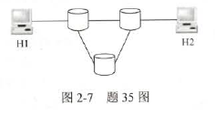

1.计算机网络的资源主要是指(计算机硬件、软件与数据)

2.局域网和广域网的差异不仅在于它们所覆盖的范围不同，还主要在于它们(所使用的协议不同，链路层广域网PPP，HDLC，局域网CSMA、CSMA/CD、CSMA/CA、ALOHA协议等)，

3.**局域网是基于广播技术发展起来的网络，广域网是基于交换技术发展起来的网络。**【局域网的一些协议都是在一个冲突域的】

4.计算机网络拓扑结构主要取决于它的(通信子网)【下三层】

5.广播式网络也需要服务访问点【层与层之间的接口】

6.定义功能执行的方法不是对网络模型进行分层的目标。【只是将网络隔离开来，其目标是提供标准语言、定义标准界面、增加功能之间的独立性】

7.数据链路层不具有拥塞控制功能【拥塞控制是对整个网络来说的，链路层要尽可能快传，网络层和传输层有该功能，流量控制是链路、网络和传输】

8.数据链路层的功能是保证数据正确的顺序与完整性【通过窗口和重传保证】

9.会话层：防止中间出现网络故障而重传整个文件，可在文件中插入同步点解决。

10.在数值上，波特率等于比特率与每符号所含的比特数的比值。

11.把语音信号转成数字信号的技术是(脉冲编码调制)

12.利用模拟通信信道传输数字信号的方法是频带传输

13.波特率等于每秒可能发生的信号变化次数

14.某信道波特率为1000Baud，数据传输率达到4Kb/s，则一个信号码元所取得有效离散值个数为(16).【一个波特为4比特，共能表示16种数据】

15.已知某信道的信号传输速率为64Kb/s，一个载波信号码元有4个有效离散值，该信道的波特率为(32kBaud)【4个有效值，共需要2bit，所以一个波特为2比特，即64k/2】

**16**.**二进制**信号在信噪比为127：1的4kHz信道上传输，最大的数据速率可以达到(8000b/s)【二进制信号代表每个信号包含2级，所以两个定理：香农$4k*log_2(127+1)=32k$,奈奎斯定理$2*4K*log_2(2)=8k$,两者取最小】

17.一个信道每1/8s采样一次，传输信号共有16种变化状态，最大数据传输率是(32b/s)【1/8s采样一次，即8Baud,16种变化状态，共4b，所以4*3=32】

18.将1路模拟信号分别编码为数字信号后，与另外7路数字信号采用同步TDM方式复用到一条通信线路上。1路模拟信号的频率变化范围为0~1kHz，每个采样点采用PCM方式编码为4位的二进制数，另外7路数字信号的数据率均为7.2kb/s。复用线路需要的最小通信能力是(64kb/s)【最大频率1kHz，根据采样定理可知采样频率至少2kHz，所以数据传输率8kb/s。**复用的每条支路速率要想等**，所以8*8kb/s=64kb/s】

19.为了使数据在网络中的传输时延最小，首选的是(电路交换)；为保证数据误差错地传送，不应选用地交换方式是(电路交换)【不存在检错功能】；在出错率很高地传输系统中，数据报方式更合适。【虚电路不合适，因为虚电路某一结点出错，就完了】

20.同一报文中的分组可以由不同的传输路径通过通信子网的方法是(数据报)【分组交换不对，因为分组包括数据报和虚电路】

21.虚电路提供的服务既有永久性的，也有临时性的。

22.如图所采用的存储-转发方式的分组交换网络中，所有链路的数据传输率为100Mb/s，分组大小为1000B，其中分组头大小为20B。若主机H1向H2发送一个大小为980000B的文件，则在不考虑分组拆分时间和传播延迟的情况下，从H1发送开始到H2接收完为止，需要的时间至少是(80.16ms)【一共1000个分组，每个分组1k，所以1M数据。1M\*8/100Mb/s=80ms，H1发完最后一个数据。此时最后一个分组还要经过两次转发到H2，每次转发时间=1k\*8/100Mb/s=0.08ms，所以80.16ms】

23.主机甲通过1个路由器(存储转发式)与主机乙互联，两段链路的数据传输率为10Mb/s，主机甲分别采用报文交换和分组大小为10kb的分组交换向主机乙发送一个大小为8Mb的报文。若忽略链路传播延迟、分组头开销和分组拆装时间，则两种交换方式完成报文传输所需的总时间分别是(1600ms、801ms)【报文交换：直接8Mb发过去，时间为2\*8Mb/10Mb/s=1.6s;分组交换，分为800组，800*10kb/10Mb/s=800ms,H1发完报文，最后一个报文还要转发一次，10kb/10Mb/s=1ms,共801ms。这个好像流水线。。。。。。。。。。】

24.下列因素中，不会影响信道数据传输率的是(信号传播速度)（其余选项：信噪比、频率带宽、调制速率）【**信道数据传输率实际上是信号的发送速率，信号的传播速率是信号在信道上传播的速率，与发送率无关**】

