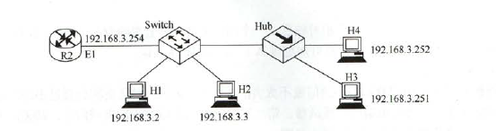

1.数据链路层协议的功能包括(定义数据格式、提供节点之间的可靠传输、控制对物理传输介质的访问)，不包括(为终端结点隐蔽物理传输的细节)

2.通过提高信噪比可以见若其影响的差错是(随机差错)

3.奇偶校验码只能检查出奇数个比特错误

4.汉明码纠错d位，需要码距为2d+1的编码方案；检错d位，需要码距为d+1.

5.一个信道的数据传输率为4kb/s，单项传播时延为30ms，如果使停止-等待协议的信道最大利用率达到80%，那么要求的数据帧长度至少为(960bit).【不会】

6.数据链路层采用了后退N帧的(GBN)协议，如果发送窗口的大小是32，那么只要需要（6）为的序列号才能保证协议不出错。【发送窗口大小32，序号至少33个（0~32），6位】

7.两台主机之间的数据链路层采用后退N帧协议传输数据，数据传输率为16kb/s，单向传播时延为270ms，数据帧长度范围是128~512字节，接收方总是以数据帧等长的帧进行确认。为了使信道利用率达到最高，帧序列的比特数至少是（4位）【求的是一个帧发送直到接收到确认的时间内，最多可以发送多少帧。要尽可能多发，要以短的数据帧进行计算。一帧时间是128\*8/16k=64ms,发送一个帧到收到确认为64+270\*2=668ms,这段时间能发668/64=10.4帧，所以4位。】

周期内发送完整帧的时间/这个周期的时间 = 信道利用率。周期就是两个往返时延+传输时间；周期内发送完整帧的时间就是帧的大小/16kb/s。假设帧长为xB，一个周期内发送完整帧的个数为n。$\frac{n*x*8}{16k}$

8.主机甲与主机乙之间使用后退N帧协议传输数据，甲的发送窗口尺寸为1000，数据帧长为1000字节，信道带宽为100Mb/s，乙每收到一个数据帧立即利用一个短帧进行确认，若甲、乙之间的单项传播时延是50ms，则甲可以达到的最大平均数据传输率为(80Mb/s)【最大数据传输率小于等于带宽。甲发送一个数据直到收到确认为止，共1k\*8/100M+50+50=100ms=0.1s。这段时间总共能发送1000\*1000B=1MB数据，所以最大10MB/s,80Mb/s】

9.主机甲通过128kb/s卫星链路，采用滑动窗口协议向主机乙发送数据，链路单项传播时延为250ms，帧长1000字节。不考虑确认帧的开销，为使链路利用率不小于80%，帧序号的比特数至少是(4)【信道利用率=传输有效数据的时间/一个传输周期。一个传输周期=1000*8/128k+500ms=0.5625s.这段时间纯发送数据的话设发送L帧，则L\*1000B/128kb=0.5625\*0.8=>L=7.2。所以4位】

10.主机甲采用停止-等待协议向主机乙发送数据，数据传输率是3kb/s，单向传播时延是200ms，忽略确认帧的传输时延。当信道利用率等于40%时，帧的数据长度是(800bit)【设帧长Lbit。T=L/3k+0.4 ；L/3k=T*0.4=>L=800】

11.TDM(时分复用)所用传输介质的性质是(介质的位速率大于单个信号的位速率)【时分复用，就是一会传这个信号一会传那个信号，比如传输四种，一段时间内介质位速率为n，则单个信号应该是n/4】

12.表面上看，FDM比TDM更好利用信道传输能力，而网络中多用TDM，因为(TDM能传播数字信号而FDM不行)【FDM频分复用，是模拟信号】

13.TDM不会发生碰撞(ALOHA会冲突，并且没措施，如果未收到，就认为碰撞了，就重发)

14.CSMA/CD协议中，争议期是指(信号在最远两个断点之间往返传输的时间)

15.以太网中，当数据传输率提高时，帧的发送时间会相应地缩短，这样可能会影响到冲突的检测。为了能有效地检测冲突，可以使用地解决方案有(减少电缆介质地长度或增加最短帧长)【最短帧长等于争用期发送的比特数。这个最短帧长，就是为了检测冲突，要在发送完帧之前收到自己发出去的数据。这样帧长越长越有可能，链路越短也越有可能(链路短，收回来的就快)。题目的意思是，发送时间会缩短，就是你加长了帧长度，就不缩短了】【最小帧长=2\*总线传播时延\*总线传播速率】

16.在一个采用CSMA/CD协议的网络中，传输介质是一个完整电缆，传输率为1Gb/s，电缆中的信号传播速率是200000km/s。若最小数据帧长度减少800比特，则最远的两个站点之间的距离至少需要(减少80m)【解析：最小帧长度少了，则距离一定缩短。列方程$2*\frac{x}{2*10^8}*10^9-800=2*\frac{x-a}{2*10^8}*10^9$=>a=80】

17.如下图所示，在Hub再生比特流的过程中会产生$1.535\mu s$延迟，信号传播速率为$200m/\mu s$,不考虑以太网帧的前导码，则H3和H4之间理论上可以相距的最远距离是(205m)【以太网最短帧64B，其中HUB为100BaseT集线器，线路的传输率为100Mb/s，单程传输延迟为64B/(100Mb/s)/2=2.56$\mu s$,除以2是因为最短帧长是双向求出来的。又Hub会有1.535$\mu s$延时，则单程时延2.56-1.535=1.025$\mu s$，所以H3与H4最远距离为200m/$\mu s$/1.025=205m】

18.站点A、B、C通过CDMA共享链路，A、B、C的码片序列分别是(1,1,1,1、1,-1,1,-1)和(1,1,-1,-1)。若C从链路上收到的序列是(2,0,2,0,0,-2,0,-2,0,2,0,2),则C收到A发送的数据是(101)【把收到的数据分四组(2,0,2,0)·(1,1,1,1)/4=4/4=1;(0,-2,0,-2)·(1,1,1,1)/4=-1;(0,2,0,2)·(1,1,1,1)/4=1,所以是101】

19.CSMA/CA进行信道预约的方法是(交换RTS与CTS帧)

20.同一个局域网中的两个设备具有相同的静态MAC地址时，则(在网络上的这两个设备都不能正常通信)

21.在一个以太网中，有A、B、C、D四台主机，若A向B发送数据，则(四台主机都能收到)

22.吉比特以太网，既可以用光纤，也可以用4对UTP5类线。

23.HDLC步属于TCP/IP协议组

24.对于100Mb/s的以太网交换机，当输出端口无排队，以直通交换方式转发一个以太网帧时，引入的转发时延至少是(0.48$\mu s$)【至少检索目的MAC，共6字节，48b/100Mb/s=0.48$\mu s$】

25.以太网交换机也不能隔离广播域

26若主机H2向主机H4发送一个数据帧，主机H4向主机H2立即发送一个确认帧，则除H4外，从物理层上能够收到该确认帧的主机还有(H2、H3)【H3属于同一冲突域中，一定能收到。而经过交换机转发后，直到H2的MAC和对应端口号，所以直接转发到H2，不会转到H1】

27.以太网交换机本质上是一个多端口网桥

