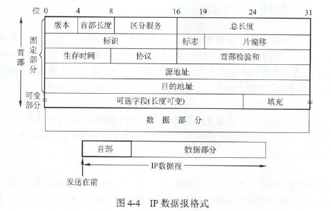
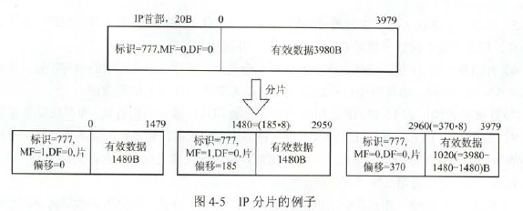
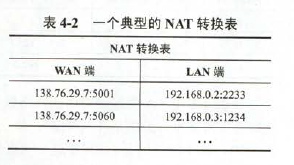
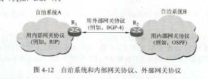
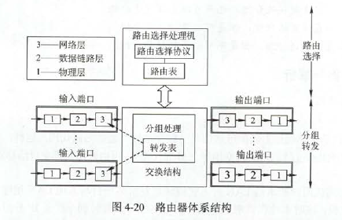
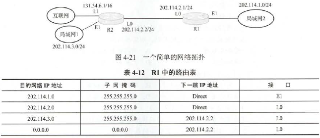
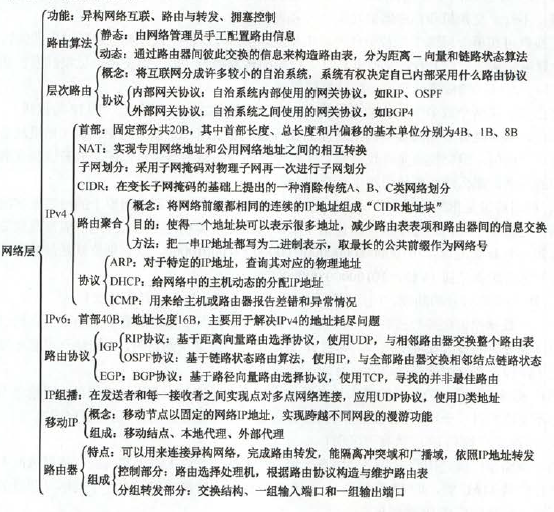

# 网络层的功能

### 异构网络互联

中间设备又称中继设备或中继系统。分为以下四类

- 物理层中继系统：中继器、集线器
- 数据链路层中继系统：网桥或交换机
- 网络层中继系统：路由器
- 网络层以上的中继系统：网关

### 路由与转发

路由器主要有两个功能：一是路由选择；二是分组转发。

- 路由选择:根据路由算法确定一个进来的分组应该被传送到哪一条输出路线上。如果子网内部使用数据报，那么对每一个进来的分组都要重新选择路径。如果子网内部使用虚电路，那么只有创建一个新的虚电路时，才需要确定路由路径。
- 分组转发：路由器根据路由表将IP数据报从合适的端口转发出去。

### 拥塞控制

方法（简单介绍，详见第五章）：

- 开环控制：事先考虑，一旦整个系统启动并运行，中途就不再需要修改
- 闭环控制：事先不考虑，基于反馈环路的概念，是一种动态的方法

拥塞控制流量控制有关系，但也有区别。拥塞控制必须确保通信子网能够传送待传送的数据，这是一个全局性问题，涉及所有主机、路由器以及导致网络传输能力下降的所有因素。而流量控制只与给定的发送端和接收端之间的点对点通信量有关。

# 路由算法

### 静态路由与动态路由

- 静态路由：手动配
- 动态路由：不断变化,主要有距离-向量路由算法和链路状态路由算法。

### 距离-向量路由算法

所有结点都**定期地**将它们的**整个路由选择表**传送给所有**与之直接相邻的结点**。这种路由选择表包括：每条路径的目的地；路径的代价。更新报文的大小与通信子网的结点个数成正比，大的通信子网将导致很大的更新报文。最常见的距离-向量路由算法是RIP算法，采用跳数作为距离的度量。

### 链路状态路由算法

要求每个参与该算法的结点都具有完全的网络拓扑信息。执行两项任务：主动测试所有邻接结点的状态；定期地将链路状态传播给所有其他结点。最典型的就是OSPF。

三个特征：

- 向本自治系统的**所有路由器**发送信息，使用的是泛洪法(泛洪时不再发给发送信息的路由器)
- 发送的信息是与路由器**相邻的所有路由器**的链路状态，这只是路由器所知道的部分信息。
- 当链路**发生变化时**，路由器才向所有路由器发送此消息。

链路状态路由器可以用于大型的或路由信息变化聚敛的互联网环境。主要优点是：每个路由节点都使用同样的原时状态数据独立地计算路径，不依赖中间结点的计算；链路状态报文不加改变的传播。具有更好的规模可伸展性。

它仅告诉它们与它直接相连的链路的费用，距离-向量可能遇到环路问题

### 层次路由

因特网划分成许多较小的自治系统，每个自治系统有权自主地决定本系统内应采用何种路由选择协议。

因此路由协议分为两大类：

- 内部网关协议：RIP和OSPF
- 外部网关协议：BGP

使用层次路由时，OSPF将一个自治系统再划分为若干区域，每个路由器都知道在本区域内如何把分组路由到目的地的细节。不知道其他区域情况。

# IPv4

### IPv4分组

分组格式：分为首部和数据两部分，首部前一部分长度固定，为20B。

- 版本：指IP版本，广泛使用是4
- 首部长度：4位。**以32位为单位**，最大值是60B。(15*4B)，最常用是20B，次时不需要任何可选字段
- 总长度：16位。**单位为字节**，因此数据报的最大长度为$2^{16}-1=65535B$，以太网的最大传输单元(MTU)为1500B，因此一个IP数据报封装成帧时，数据报的总长度(首部加数据)一定不能超过数据链路层的MTU（48~1500B）
- 标识：16位。是一个计数器，每产生一个数据报就+1.**但它的值不是序号**(IP是无连接服务)。**当一个数据报的长度超过MTU时，必须分片，因此每个数据报都复制一份标识，以便能正确重装成原来的数据报**
- 标志：3位。最低位为MF，MF=1表示后面还有分片，MF=0表示最后一个分片。标志中间字段DF，DF=0时才允许分片。目前只有前两位有意义。
- 片位移：13位。它指出较长的分组在分片后，**某片在原分组中的相对位置**。**以8字节为单位**，即每个分片长度一定是8B的倍数
- 首部校验和：16位。**IP数据报的首部校验和只校验分组的首部**，不校验数据部分
- 生存时间(TTL)：8位。数据报在网络中可通过的路由器数的最大值。路由器在转发分组**前**，先把TTL-1，若被减为0，则丢弃。
- 协议：8位。指数此分组携带的数据使用何种协议，即分组的数据应分给哪个**传输层协议**。值为6表示TCP，17表示UDP
- 原字段地址：4B,32位
- 目的地址：4B,32位

你不要总是拿1条假首饰(4)来骗(偏)我吧(8)

IP数据分片：

数据链路层能承载的最大数据量称为最大传送单元(MTU)。当IP数据报的总长度长于链路MTU时，就要将数据报分成较小的片。

片在**目的地的网络层**被重装(说明路上不重装)。使用IP数据报的标识，标志和片偏移来加成对片的重组。具体例子如下。

网络层转发分组的流程：

直接交付：若目的主机与路由器直接相连，路由器直接把数据报发送给目的主机，这就直接交付。即不再转发，因为目的地已经到了。

【很重要】得到下一跳的路由器的IP地址后并不是直接将该地址填入待发送的数据报，而是**将该IP地址转换成MAC地址(ARP)**,将其放入MAC帧首部，然后根据这个MAC找到下一跳路由器。在不同网络中传送时，**MAC帧中的源地址和目的地址要发生变化**，**但是网桥在转发帧时，不改变帧的源地址。**

0.0.0.0 会被认为是默认目的地址，但不是目的地址，0.0.0.0不能作为目的地址。

### IPv4与NAT

分为ABCDE类。IP地址::={<网络号>，<主机号>}

特殊IP：

- 主机号全为0，表示网络本身
- 主机号全为1，表示网络广播地址
- 127.0.0.0保留为环路自检地址，此地址表示任意主机本身，目的地址为环回地址的IP数据报永远不会出现在任何网络上。
- 32位全0，0.0.0.0表示本网络上的本主机
- 32位全1，255.255.255.255表示整个TCP/IP网络的广播地址，又称受限广播地址。

由于路由器隔离广播域，所以255.255.255.255等效为本网络的广播地址。

常用IP地址范围

|网络类别|最大可用网络数|第一个可用的网络号|最后一个可用的网络号|每个网络中的最大主机数|
|-----|-----|-----|-----|-----|
|A|$2^7-2$|1|126|$2^{24}-2$|
|B|$2^{14}-1$|128.1|191.255|$2^{16}-2$|
|C|$2^{21}-1$|192.0.1|223.255.255|$2^8-2$|

六种特殊地址
|特殊地址|网络号|主机号|源地址或目的地址|
|-----|-----|-----|-----|
|网络地址|特定的|全0|都不是|
|直接广播地址|特定的|全1|目的地址|
|受限广播地址|全1|全1|目的地址|
|这个网络上的这个主机|全0|全0|源地址或默认目的地址（不是目的地址）|
|这个网络上的特定主机|全0|特定的|目的地址|
|环回地址|127|不是全0或全1|源地址或目的地址|

- 直接广播地址：路由器使用这种地址把一个分组发送到一个特定网络上的所有主机。
- 受限广播地址：这个地址用于定义当前网络(不是整个因特网)上的广播地址。局限于本地局域网。

所有LAN中的网络号必然相同

网络地址转换(NAT)：工作在传输层

私有IP地址网段：

- A类：1个A类网段，即**10**.0.0.0~**10**.255.255.255
- B类：16个B类网段，即**127.16**.0.0~**172.31**.255.255
- C类：256个C类网段，即**192.168.0**.0~**192.168.255**.255

所有路由器，对目的地址是私有地址的数据报一律不转发。NAT路由器至少一个有效的外部全球地址。

【普通路由器在转发IP数据报时，不改变其原IP地址和目的IP地址。而NAT路由器再转发IP数据报时，一定要更换其IP地址(转换源IP地址或目的IP地址)。普通路由器仅工作在网络层，而NAT路由器转发数据报时需要查看和转换传输层的端口号。】

### 子网划分与子网验码、CIDR

**子网主机号全0的地址为子网的网络号，全1的地址为子网的广播地址。**

子网掩码：将IP地址与其对应的子网掩码进行“与”运算，即可得到网络号。

所有路由器在相互之间交换路由信息时，必须把自己所在网络的子网掩码告诉对方。

无分类域间路由选择(CIDR):将网络号更细分，用206.1.0.0/17这样的形式表示。

### ARP、DHCP与ICMP

分别对应了网络层、应用层、网络层协议

IP数据报在被路由器转发时，其数据链路层封装所使用的MAC地址是不断改变的。这也决定了无法使用MAC地址跨网通信。路由器不仅有多个IP地址，还有多个硬件地址。

- ARP：地址解析协议。每台主机都有一个ARP告诉缓存，用来存放本局域网上各台主机和路由器的IP地址到MAC地址的映射表，称ARP表。**ARP工作在网络层**。如果缓存中没有目的MAC地址的信息，就通过使用目的地址为FF-FF-FF-FF-FF-FF的MAC帧广播ARP请求。ARP是找同一个局域网的主机MAC，如果不在同一局域网，就找到尾域本局域网上的某个路由器的硬件地址，然后把分组发给路由器。四种典型情况：
  - 发送方是主机，如果IP目的地址就是本局域网，就直接根目硬件地址发过去
  - 发送方是主机，目的IP不在本局域网，查到某路由器MAC，交给路由器去处理
  - 发送方是路由器，目的IP本网络的一台主机，发过去
  - 发送方是路由器，目的IP外网的一台主机，找到对应路由器的MAC，交给它。
- 动态主机配置协议(DHCP)：基于UDP的，应用层协议。使用CS模式。工作过程如下：。租用期的数值由DHCP服务器决定，DHCP客户也可以在自己发送的报文中提出对租用期的要求。(不可能用TCP。因为当时连IP地址都没有，咋建立socket)
  - DHCP客户机广播“DHCP发现”消息，找DHCP服务器
  - DHCP服务器收到“DHCP发现”消息后，向网络中广播“DHCP提供”消息，包括DHCP客户机的IP地址和相关配置信息
  - DHCP客户机收到“DHCP提供”消息，接受所提供的参数，则通过“DHCP请求”消息向DHCP服务器请求提供IP地址
  - DHCP服务器广播“DHCP确认”消息，将IP地址分给DHCP客户机。
- 网际控制报文协议(ICMP):为了提高IP交付成功的机会。让主机或路由器报告差错或异常情况。**ICMP报文作为IP数据报的数据**。分类两类：
  - 差错报告报文：终点不可达；源点抑制：出现拥塞时；时间超时；参数问题；改变路由。以下情况不发：对ICMP差错报告报文不再发送ICMP差错报告报文；对第一个分片的数据报片的所有后续数据报片都不发；对具有组播地址的数据报不发；对特殊地址不发。
  - 询问报文：回送请求和回答报文、时间戳请求和回答报文、掩码地址请求和回答报文、路由器询问和报告报文。PING使用了ICMP回送请求和回答报文，Tracert使用了ICMP时间超过报文

# IPv6

主要特点：

- 只有在包的源结点才能分片，路由器不能分片。一般来说，IPv6不允许分片
- 首部长度是8B的倍数，IPv4是4B的倍数
- 增大了安全性，身份验证和保密功能是关键

IPv4->IPv6:

- 双协议栈：使一部分主机或路由器装有两个协议栈，即一个IPv4一个IPv6，通过双协议栈进行转换
- 隧道技术：将整个IPv6的数据报封装到IPv4的数据报的数据部分，使用IPv6可以在IPv4隧道中传输

# 路由协议

### 自治系统

一组内置路由器。自己内部有路由协议

### 域内路由与域间路由

- 内部网关协议：自治系统内部路由协议，如RIP，OSPF
- 外部网关协议：自治系统间路由协议，如BGP

### 路由信息协议(RIP)

每个路由器都要维护从它自身到其他**每个目的网络**的距离记录。允许一条路径最多有15个路由器。默认任意两个使用RIP的路由器之间每隔30s广播依次RIP路由信息，自动建立并维护路由表。网络出现故障时，RIP要经过很长时间才能把信息传送到所有路由器，收敛慢，坏事传得慢。
特点：

- 仅和相邻路由器交换信息
- 交换路由器所知道的全部信息
- 每隔固定时间间隔交换路由信息，如每隔30s

是应用层协议，采用UDP。不一定是时间最短的，只是路由最少的。

### 开发最短路径优先(OSPF)

与RIP的区别：

- OSPF对本自治系统的所有路由器都发送信息，使用的是泛洪法
- 发送的信息是与本路由器相邻的所有路由器的链路状态(有意思哈，全发的只发一点，发一点的全发)
- 只有链路状态发生变化时,采用泛洪法
- 是网络层协议，直接用IP数据报传送。

除上述以外，其他特点：

- OSPF对于不同类型的业务可计算出不同的路由
- 如果到目的网络有多条相同代价的网络，那么可以将通信量分配给这几条路径，负载平衡
- 所有在OSPF路由器之间交换的分组都有鉴别功能。
- 支持可变长度的子网划分和CIDR
- 每个链路状态上都有32位序列号，序列号越大，状态越新。

OSPF将一个自治系统再划分成若干更小的范围，称为区域。

五种分组类型（了解）：

- 问候分组：用来发现和维持邻站的可达性
- 数据库描述分组：向邻站给出自己的链路状态数据库中所有的链路状态项目的摘要信息
- 链路状态请求分组：向对方请求发送某些链路状态项目的详细信息
- 链路状态更新分组：用泛洪法对全网更新链路状态
- 链路状态确认分组：对链路更新分组的确认

### 边界网关协议(BGP)

只能力求寻找一条能够到达目的网络且比较好的路由，而非寻找一条最佳路由。应用层协议，基于TCP。

每个自治系统选出一个路由器作为BGP发言人，发言人之间通过TCP交路由信息，发言人既要运行BGP，又要运行内部网关协议。

特点：

- BGP交换路由信息的结点数量级是自治系统的数量级，要比这些资质系统中的网络数少很多。
- 每个自治系统中的BGP发言人的数目是很少的。
- 支持CIDR
- 刚运行时，BGP的邻站要交换整个BGP路由表，以后只需在发生变化时更新有变化的部分。

三种路由协议的比较

|协议|RIP|OSPF|BGP|
|-----|-----|-----|-----|
|类型|内部|内部|外部|
|路由算法|距离-向量|链路状态|路径-向量|
|传递协议|UDP|IP|TCP|
|路径选择|跳数最少|代价最低|较好、非最佳|
|交换结点|和本结点相邻的路由器|网络中的所有路由器|和本结点相邻的路由器|
|交换内容|当前本路由器知道的全部信息，即自己的路由表|与本路由器相邻的所有路由器的链路状态|首次：整个路由表；非首次：有变化的部分|

# IP组播

一次发送的单个分组，被用一个组地址标识的若干目标主机正确接收。组播一定仅应用于UDP

组播时仅发送一条数据，只有数据在传送路径出现分岔时才将分组复制后继续转发。组播需要路由器的支持，支持的路由器称为组播路由器。

### IP组播地址

使用D类地址：224.0.0.0~239.255.255.255.组播数据报使用D类IP地址作为目的地址，并且首部中的协议字段是2，表示使用IGMP。也是尽最大努力交付；组播地址只能用于目的地址；组播数据报不产生ICMP差错报文。并非所有D类地址都能作为组播地址。

### IGMP与组播路由算法

IGMP视为TCP/IP的一部分。

两阶段：

- 某台主机加入新的组播组时，向组播组发送IGMP报文，组播组收到后，将组成换关系转发给因特网上的其他组播路由器
- 组播路由器要周期性地探寻本地局域网上的主机，以便知道这些主机是否仍继续是组的成员。

主要三种路由算法：基于链路状态的路由选择；基于距离-向量的路由选择；可以建立在任何路由器协议之上，协议网关的组播。

# 移动IP

### 移动IP的概念

是指移动结点以固定的IP地址实现跨越不同网段的漫游功能，能保证基于网络IP的网络权限在漫游过程中不发生任何改变。

### 移动IP通信过程

移动结点时，本地地址是不变的。移动到外地网络时，移动结点需要向本地代理注册当前的位置地址，这个位置地址就是转交地址。移动到另一个外网时，只需向本地代理更新注册的转交地址，就可继续通信。移动IP为移动主机设置了两个IP地址，即主地址和辅地址(转交地址)。

# 网络层设备

### 路由器的组成和功能

多个逻辑网络(多个广播域)互联时必须使用路由器。也可作为最基础的包过滤防火墙应用。

### 路由表和路由转发

标准的路由表四项：目的网络IP地址、子网验码、下一跳IP地址、接口

转发表是由路由表得到的。格式不同，一一对应。**路由表总是用软件来实现的；转发表可以用软件来实现，甚至可以用特殊的硬件实现**

转发是路由器根据转发表把收到的IP数据报从合适的端口转发出去，仅涉及一个路由器。路由选择涉及很多路由器，路由表是许多路由器协同工作的结果。

