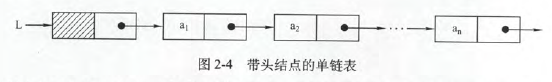
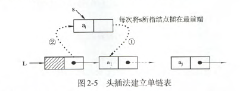
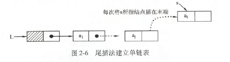
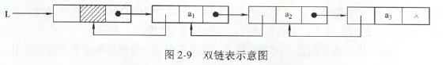
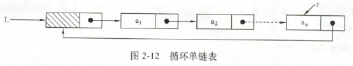
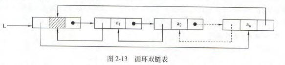
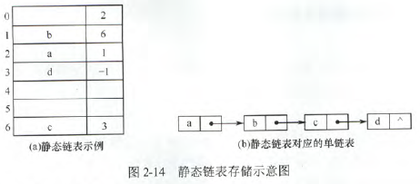

# 线性表的定义和基本操作

### 线性表的定义

线性表是具有相同数据类型的n个数据元素的有限序列，其中n为表长，当n=0时该线性表是一个空表。

特点如下

- 表中元素的个数有限
- 表中元素具有逻辑上的顺序性
- 表中元素都是数据元素，每个元素都是单个元素
- 表中元素的数据类型相同，意味着每个元素占用相同大小的存储空间
- 表中元素具有抽象性，即仅讨论元素间的逻辑关系

# 线性表的顺序表示

### 顺序表的定义

线性表的顺序存储又称顺序表。特点是元素的逻辑顺序与其物理顺序相同。

**线性表中元素的位序是从1开始的，而数组中元素的下标是从0开始的**

顺序表定义

```C
# define MaxSize 50
typedef struct{
    ElemType data[MaxSize];
    int length;
}
```
可以静态分配也可以动态分配。最主要的特点是随机访问，即通过首地址和元素序号可在时间O(1)内找到指定的元素。存储密度高，每个结点只存储数据元素(不可拆)。插入删除时要移动大量元素。

### 顺序表上基本操作的实现

- 插入操作

```C
bool ListInsert(SqList &L,int i,ElemType e){
    if(i<1||i>L.length+1) // 判断i的范围是否有效
        return false;
    if(L.length>=MaxSize) // 当前存储空间已满
        return false;
    for(int j=L.Length;j>=i;j--) // 将第i个元素及之后的元素后移
        L.data[j]=L.data[j-1]
    L.data[i-1]=e; // 在位置i处放入e
    L.length++;
    return true;
}
```

时间复杂度:O(n)

- 最好情况：插入表尾，O(1)
- 最坏情况:插入表头，O(n)
- 平均情况:O(n/2)

- 删除操作

```C
bool ListDelete(Sqlist &L,int i,Elemtype &e){
    if(i<1||i>L.length){
        return false;
    }
    e=L.data[i-1];
    for(int j=i;j<L.length;j++){
        L.data[j-1]=L.data[j];
    }
    L.length--;
    return true;
}
```

时间复杂度：O(n)

- 最好情况：删除表尾，O(1)
- 最坏情况：删除表头，O(n)
- 平均情况：O((n-1)/2)

- 按值查找

```C
int LocateElem(Sqlist L,ElemType e){
    int i;
    for(i=0;i<L.length;i++){
        if(L.data[i]==e){
            return i+1;
        }
    }
    return 0;
}
```

时间复杂度：O(n)

- 最好情况：只比较一次，O(1)
- 最坏情况：比较n次，O(n)
- 平均情况：O((n+1)/2)

# 线性表的链式表示

不要求逻辑上相邻的两个元素在物理位置上也相邻

### 单链表的定义

```C
typedef struct LNode{
    ElemType data;          // 数据域
    struct LNode *next;     // 指针域
}LNode,*LinkList
```

单链表是**非随机存取的存储结构，即不能直接找到表中某个特定的结点**

头指针：通常用头指针来标识一个单链表，头指针为NULL时表示一个空表。

头结点：为了操作上的方便，在单链表第一个结点之前附加一个结点，称为头节点。头节点的数据域可以不设任何信息，也可以记录表长等信息。

头指针与头结点的区别：不管带不带头结点，头指针始终指向链表的第一个结点(头指针始终存在)，而头结点是带头结点的第一个结点。



引入头结点的优点：

- 由于开始结点的位置被存放在头结点的指针域中，链表第一个位置(第一个有效数据的位置)上的操作和其他位置操作一样，无需特殊处理
- 无论链表是否为空，其头指针都指向头结点的非空指针，因此空表和非空表的处理也得到了统一

### 单链表基本操作的实现

- 采用头插法创建单链表：每个新结点插入到第一个位置。即读入的顺序与链表顺序相反，最后读入的反而在链表首位。

```C
LinkList List_HeadInsert(LinkList &L){
    LNode *s;int x;
    L=(LinkList)malloc(sizeof(LNode));  //头结点
    L->next=NULL;
    scanf("%d",&x);
    while(x!=9999){
        s=(LNode*)malloc(sizeof(LNode));
        s->data=x;
        s->next=L->next;      // s的尾部接到L的尾部，即s的右面先连接链表
        L->next=s;            // L的尾部接入s，即s的左面连接链表
        scanf("%d",&x);
    }
}
```



- 采用尾插法创建单链表：需要一个尾指针r，指向链表尾部

```C
LinkList List_TailInsert(LinkList &L){
    int x;
    L=(LinkList)malloc(sizeof(LNode));
    LNode *s,*r=L;     // r为尾指针
    scanf("%d",&x);
    while(x!=9999){
        s=(LNode*)malloc(sizeof(LNode));
        s->data=x;
        r->next=s;  // 尾部的下一个为新的s，尾插  
        r=s;        // 新插入的成为新的尾部
        scanf("%d",&x);
    }
    r->next=NULL;  //创建完成后，尾部的NULL应该为空，没有这一步的话尾部的指针指向自己
    return L;
}
```



- 按序号查找结点值：时间复杂度O(n)

```C
LNode *GetElem(LinkList L,int i){
    int j=1;
    LNode *p=L->next;
    if(i==0){
        return L;
    }
    if(i<1){
        return NULL;
    }
    while(p&&j<i){
        p=p->next;  // 从第1个结点开始查找
        j++;
    }
    return p;       //返回第i个结点的指针，如果i大于表长，p=NULL，直接返回p即可
}
```

- 按值查找结点值：时间复杂度O(n)

```C
LNode *LocateElem(LinkList L,ElemType e){
    LNode *p=L->next;
    while(p!=NULL&&p->data!=e){
        p=p->next;
    }
    return p;
}
```

- 插入结点操作

```C
// 在p后插入
p=GetElem(L,i-1);  // 查找插入位置的前驱结点
s->next=p->next;   // s右部插入
p->next=s;         // s左部插入
```

```C
// 在p前插入,也可以按照上面的方法
s->next=p->next;
p->next=s;    // 先前插
temp=p->data;  // 再交换s和p的数据
p->data=s->data;
s->data=temp;
```

- 删除结点操作

```C
// 给定下标删除
p=getElem(L,i-1);  // 查找删除位置的前驱结点
q=p->next;
p->next=q->next;  // 删除q
free(q);
```

```C
// 删除特定结点P,通常做法是找到p的前驱，即q->next==p的结点，再删除，也可以删除p的后继节点，再把p的后继结点的数据放到p中。
q=p->next;
p->data=p->next->data;
p->next=q->next;
free(q);
```

- 求表长操作

遍历，每遍历一次计数器+1.算法的时间复杂度O(n).

### 双链表

双链表中有两个指针prior和next，分别指向前驱结点和后继结点。




```C
typedef struct DNode{
    ElemType data;
    struct DNode * prior,*next;
}DNode, *DLinklist;
```

- 插入

```C
s->next=p->next;  // 结点s插入到p之后
p->next-prior=s;
s->prior=p;
p->next=s;
```

顺序不是确定的，但1步和2步必须在4步之前。

- 删除

```C
p->next=q->next; // 删除q
q->next->prior=p;
free(q);
```

### 循环链表

- 循环单链表：和单链表的区别，表中最后一个结点的指针不是NULL，而改为指向头结点。表中没有指针域为NULL的结点。若设有头指针，则对表头操作时间复杂度O(1)，对表尾操作时间复杂度却是O(n)，而若设有尾指针，对表头和表尾操作都是O(1).



- 循环双链表：头结点的prior指向尾指针，为节点的next指向L；当循环双链表为空时，其头结点的prior和next都等于L。



### 静态链表

用数组来描述线性表的链式存储结构，结点也有数据域data和指针域next，这里的指针是结点的相对地址(数组下标)，又称游标。和顺序表一样，静态链表也要预先分配一块连续的内存空间。



```C
# define MaxSize 50
typedef struct{
    ElemType data;
    int next;
} SLinkList[MaxSize];
```

静态链表next==-1作为结束标志。

### 顺序表和链表的比较

|比较方式|顺序表|链表|
|-----|-----|-----|
|存取方式|顺序存取，随机存取|顺序存储|
|逻辑结构与物理结构|逻辑相邻的，物理也要相邻|逻辑相邻，物理不一定相邻|
|查找|按值无序：O(n),按值有序：O($log_2n)$,按序号O(1)|O(n)|
|插入、删除|O(n)|O(1)，空间大，存储密度小|
|空间分配|静态|动态扩充|

实际应用时的选取：

- 基于存储的考虑：难以估计线性表的长度和存储规模时，不宜采用顺序表；但链表的存储密度较低
- 基于运算的考虑：常用按序号访问，线性表优于链表；插入、删除扫做多，链表优于线性表
- 基于环境：顺序表易于实现，链表基于指针的，不易实现
