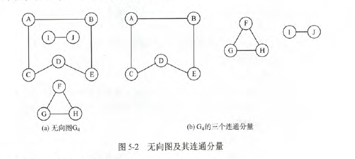

#  ·图的基本概念

### 图的基本定义

图G由顶点集V和边集E组成，G=(V,E)。V={$v_1,v_2,...,v_n$},E={$(u,v)|u\in V,v\in V$}.图不能是空图，图中不能一个定点都没有，但边集E可以为空。

- 有向图：E是有向边的集合，如$E_1$={<1,2>,<2,1>,<2,3>}
- 无向图：E是无向边的集合，如$E_2$={(1,2),(1,3),(2,3)}
- 简单图：满足不存在重复边，不存在顶点到自身的边。**数据结构只讨论简单图。**
- 多重图：两个结点的边数多余一条，且允许有顶点到自身的边。与简单图相对
- 完全图(简单完全图)：**在无向图中**，若任意两个顶点之间都存在边，则称该图为无向完全图。n个顶点的无向完全图有n(n-1)/2条边。有向图中，任意两个顶点之间都存在方向相反的两条弧，称为有向完全图。含有n个顶点的有向完全图有n(n-1)条边。
- 子图：有两个图G=(V,E),G'=(V',E'),若V'是V的子集且E'是E的子集，则称G'是G的子图。若V(G')=V(G)，则称其为G的生成子图(包含全部顶点)
- 连通、连通图和连通分量：在无向图中，若任意两个顶点都是连通的，则称G为连通图。无向图中的极大连通子图称为连通分量。若一个图有n个顶点，且边数小于n-1，则必是非连通图。



- 强连通图、强连通分量：**在有向图中**，若顶点v到w和w到v都有路径，称为强连通。若图中任意两点都是强连通的，称为强连通图。有向图中极大强连通子图称为强连通分量。


- 生成树、生成森林：**连通图**的生成树是包含全部顶点的极小连通子图。若顶点为n，则有n-1条边。**在非连通图中**，连通分量的生成树构成非连通图的生成森林。包含无向图中全部顶点的极小连通子图，只有生成树满足条件。
- 顶点的度、入度和出度：在无向图中，顶点的度等于依附于顶点的边数。无向图的全部顶点的度的和等于边数的2倍。有向图中，分为入度和出度。入度是以顶点为终点的边，出度是以顶点为起点的边。顶点的度=入度+出度。有向图中的全部顶点的入度等于出度等于边数。
- 边的权和网：带权的图称为带权图，也叫网
- 稠密图、稀疏图：边很少称为稀疏图，相反为稠密图。通常|E|<|V|log|V|时，视为稀疏图
- 路径、路径长度和回路：顶点$v_p$到顶点$v_q$之间的一条路径是指顶点序列$v_p,v_{i_1},v_{i_2},...,v_{i_m},v_q$.路径上**边的数目**称为路径长度。第一个顶点和最后一个顶点相同的路径称为回路或环。若一个图n个顶点，并且有大于n-1条边，则此图一定有环。
- 简单路径、简单回路：顶点不重复出现的路径称为简单路径。除第一个顶点和最后一个顶点外，其余顶点不重复出现的回路称为简单回路。
- 距离：从顶点u到顶点v的**最短路径**存在，则此路径的长度称为u到v的距离。若u到v不存在路径，则记该距离为无穷。
- 有向树：一个顶点的入度为0、其余顶点的入度均为1的有向图，称为有向树。入度为0的则是根，入度为1代表只有一个双亲结点。

# 图的存储及基本操作

主要有两种方法：邻接矩阵和邻接表。前者属于图的顺序存储结构，后者属于图的链接存储结构

### 邻接矩阵法

用二维数组存储图中边的信息。结点数为n的图G=(V,E)的邻接矩阵A是n*n的。将G的顶点编号为$v_1,v_2,...,v_n$.若$(v_i,v_j)\in E$,则A[i][j]=1,否则A[i][j]=0.对于带权图来说，若$v_i$和$v_j$之间有边相连，则邻接矩阵中存着对应的权值，否则用无穷。


```C
# define MaxVertexNum 100
typedef char VertexType;
typedef int EdgeType;
typedef struct{
    VertexType Vex[MaxVertexNum];
    EdgeType Edge[MaxVertexNUm][MaxVertexNum];
} MGraph;
```

特点：

- 无向图的邻接矩阵一定是一个对称矩阵(并且唯一)。实际只需存储邻接矩阵的上(或下)三角元素。
- 对于无向图，邻接矩阵的第i行(或第i列)非零元素的个数正好是第i个顶点的度。
- 对于有向图，邻接矩阵的第i行(或第i列)非零元素的个数正好是第i个顶点的出度(或入度)。
- 用邻接矩阵，很容易判断任意两个顶点之间是否有边相连。但是想要确定有多少条边，则必须按行、按列对每个元素进行检测。
- **稠密图适合用邻接矩阵的存储表示**
- 邻接矩阵为A，$A^n$的元素$A^n[i][j]$等于顶点i到顶点j的长度为n的路径的数目。
- 任何一个图能唯一确定一个邻接矩阵，任何一个邻接矩阵能唯一确定一个图

### 邻接表法

邻接表：对图G中的每个顶点$v_i$建立一个单链表，第i个单链表中的结点表示依附于顶点$v_i$的边。边表采用顺序表。


```C
#define MaxVertexNum 100
typedef struct ArcNode{
    int adjvex;         // 该弧指向的顶点的位置
    struct ArcNode *next;
} ArcNode;
typedef struct VNode{
    VertexType data;
    ArcNode *first;
} VNode,AdjList[MaxVertexNum];
typedef struct{
    AdjList vertices;
    int vexnum,arcnum;
} ALGraph;
```

邻接表的特点：

- 若G为无向图，所需的存储空间为O(V+2E),有向图，O(V+E)。
- 稀疏图适合使用邻接表表示
- 在邻接表中，给定一顶点，很容易找到它的临边。但是，若确定两个顶点是否有边，就要慢点
- 有向图的邻接表中，求一个给定顶点的出度只需计算其邻接表中的结点个数；但求其顶点的入度则需要遍历全部的邻接表
- 图的邻接表表示并不唯一。因为每个顶点对应的单链表中，个边结点的连接次序可以是任意的，即任何一个邻接表能唯一确定一个图，但任何一个图有多种邻接表。

### 十字链表

**是有向图的一种存储结构**十字链表中，每个弧有个结点，每个顶点也有一个结点。


弧结点有五个域：尾域和头域分别指示弧尾和弧头这两个顶点的位置；链域hlink指向弧头相同的下一条弧；链域tlink指向弧尾相同的下一条弧；info域指向该弧的相关信息。

顶点结点有3个域：data存放信息；firstin和firstout分别指向以该顶点为弧头或弧尾的第一个弧结点。


十字链表中，既容易找到$v_i$为尾的弧，又容易找到$v_i$为头的弧，因而容易得到各顶点的入度和出度。图的十字链表表示法不唯一，但一个十字链表唯一表示一个图。

### 邻接多重表

**是无向图的一种存储结构**。在邻接表中，容易求得顶点和边的各种信息，但在邻接表中求两个顶点之间是否存在边而对边执行删除等操作时，需要分别在两个顶点的边表中进行遍历，效率较低。


mark为标记域，用来标记该边是否被搜索过；ivex和jvex为依附于这条边两个顶点的位置；ilink指向下一条依附于顶点ivex的边；jlink指向下一条依附于顶点jvex的边；info为边信息


data存储信息，firstedge指示第一条依附于该顶点的边。

**每条边只有一个顶点，即边不需要重复**


# 图的遍历

广度优先搜索会优先考虑最早被发现的顶点，也就是说离起点越近的顶点其优先级越高。深度优先搜索会优先考虑最后被发现的顶点。

### 广度优先搜索

类似于二叉树的层序遍历。基本思想是：首先访问起始顶点v，接着由v出发，依次访问v的各个未访问过的邻接顶点$w_1,w_2,...,w_i$,然后依次访问$w_1,w_2,...,w_i$的所有未被访问过的邻接顶点；再从这些访问过的顶点出发，访问它们所有未被访问过的邻接顶点……。Dijkstra和Prim最小生成树算法也用了此类思想

为了实现逐层访问，必须借助一个辅助队列，用来记忆正在访问的顶点的下一层顶点.其实存的全是访问过的结点，之所以存进去，就是因为里面的结点还都没扩展，存进去后再循环挨个扩展里面结点的邻接结点

```C
bool visited[MAX_VERTEX_NUM];  // 访问标记数组
void BSFTraverse(Graph G){
    for(i=0;i<G.vexnum;++i){
        visited[i]=false;
    }
    InitQueue(Q);
    for(i=0;i<G.vexnum;i++){
        if(!visited[i]){
            BFS(G,i);
        }
    }
}
void BFS(Graph G,int v){
    visit(v);
    visited[v]=true;
    Enqueue(Q,v);
    while(!isEmpty(Q)){
        DeQueue(Q,v);
        for(w=FirstNeighboor(G,v);w>=0;w=NextNeighboor(G,v,w)){
            if(!visited[w]){
                visit(w);
                visited[w]=true;
                EnQueue(Q,w);
            }
        }
    }
}
```

图的广度优先算法可用于求一些问题的最优解。

BFS性能分析：空间复杂度:$O(V)$,用来存结点的辅助队列。时间复杂度：邻接表：$O(V+E)$,邻接矩阵：$O(V^2)$

BFS求解单元最短路径：

```C
void BFS_MIN_Distance(Graph G,int u){
    for(i=0;i>G.vexnum;i++){
        d[i]=999999999;
    }
    visited[u]=true;d[u]=0;
    EnQueue(Q,u);
    while(!isEmpty(Q)){
        DeQueue(Q,u);
        for(w=FirstNeighbor(G,u);w>=0;w=NextNeighbor(G,u,w)){
            if(!visited[w]){
                visited[w]=true;
                d[w]=d[u]+1;
                EnQueue(Q,w);
            }
        }
    }
}
```

广度优先生成树：广度优先遍历的过程中，生成的树就是广度优先生成树。由于一定的图邻接矩阵表示法是唯一的，其广度优先生成树也是唯一的，但由于邻接表存储一个图不是唯一的，故其广度优先生成树也不是唯一的。

### 深度优先搜索

类似于树的先序遍历。基本思想：首先访问图中某一起始顶点v，然后由v出发，访问于v邻接且未被访问的任一顶点$w_1$,再访问与$w_1$邻接且未被访问的任一顶点$w_2$，重复上述过程。

```C
bool visited[MAX_VERTEX_NUM];
void DFSTraverse(Graph G){
    for(v=0;v<G.vexnum;++v){
        visited[v]=false;
    }
    for(v=0;v<G.vexnum;++v){
        if(!visited[v]){
            DFS(G,v);
        }
    }
}
void DFS(Graph G,int v){
    visit(v);
    visited[v]=true;
    for(w=FirstNeighbor(G,v);w>=0;w=NextNeighbor(G,v,w)){
        if(!visited[w]){
            DFS(G,w);
        }
    }
}
```

【注意】：对于同一个图，基于邻接矩阵的遍历所得到的DFS序列和BFS序列是唯一的。基于邻接表的遍历所得到的DFS序列和BFS序列不是唯一的。

DFS性能分析：空间：递归栈，所以$O(V)$,时间：邻接矩阵$O(V^2)$，邻接表$O(V+E)$.与BFS一样。

深度优先的生成树：对连通图调用DFS才能产生深度优先生成树，否则是深度优先生成森林。同样，用邻接表产生的不唯一。

### 图的遍历与图的连通性

对于无向图，调用BFS和DFS的次数等于它的连通分量数

有向图，非强连通分量调用一次BFS或DFS无法访问到该连通分量的所有顶点.

# 图的应用

### 最小生成树

性质:

- 不是唯一的.当图G中的各边权值不等时,是唯一的.
- 最小生成树的边的权值之和总是唯一的.而且是最小的
- 边数=顶点数-1

求解方式:

- Prim(普利姆)算法:由已选结点扩散.时间复杂度为$O(V^2)$,不依赖与E,适合求解边稠密的图的最小生成树


- Kruskal(克鲁斯卡尔)算法:找最小的边,类似贪心.时间复杂度$O(ElogE)$,适合边稀疏而顶点较多的图.


### 最短路径

单源最短路径:Dijkstra;每对顶点间的最短路径:Floyd-Warshall

- Dijkstra算法:(负值不适用)两个辅助数组:dist[],记录由源点$v_0$到各顶点当前的最短长度;path[]表示从源点到顶点i之间的最短路径的前驱结点.


时间复杂度为:$O(V^2)$,若求出所有结点的最短距离,即对每个结点应用一次,所以时间复杂度为$O(V^3)$
- Floyd算法:允许负值,但不允许包含负权值的边组成回路.产生一个n阶方阵序列$A^{(-1)},A^{(0)},...,A^{(k)},...,A^{(n-1)}$,其中$A^{(k)}[i][j]$表示从顶点$v_i$到$v_j$的路径长度,k表示绕行度k个顶点.$A^{(-1)}[i][j]=arsc[i][j]$,$A^{(k)}[i][j]=Min${$A^{(k-1)}[i][j],A^{(k-1)}[k][j]+A^{(k-1)}[k][j]$},k=0,1,...,n-1.这算法就是一个迭代的过程,每迭代一次,从$v_i$到$v_j$就要多考虑一个顶点.时间复杂度为$O(n^3)$


### 拓扑排序

AOV网:用有向无环图表示一个工程,其顶点表示活动,用有向边$<V_i,V_j>$表示活动$V_i$必须先于活动$V_j$进行的一种关系.

拓扑排序:有向无环图顶点组成的序列,满足以下条件:

- 每个顶点只出现一次
- 顶点A在序列中排在B前,则图中不存在B->A的路径

常用步骤:

- 从DAG图中选择一个没有前驱的顶点并输出
- 从图中删除该顶点和所有以它为起点的边
- 重复上述过程直到当前为空或不存在无前驱的顶点(有环)为止


时间复杂度为O(V+E)

注意一下问题:

- 工程可以从入度为0的顶点开始(不存在前驱)
- 若一个顶点有多个直接后继,通常排序结果不唯一
- 对于一般的图来说,其邻接矩阵是三角矩阵,则存在拓扑排序;反之不一定成立.

### 关键路径

AOE网:带权有向图中,以顶点表示事件,以有向边表示活动,以边上的权值表示完成该活动的开销.则称为AOE网

两个性质

- 只有在某个顶点所代表的事件发生后,从该顶点出发的各有向边所代表的活动才能开始
- 只有在进入某一顶点的各有向边所代表的活动都已结束时,该顶点做代表的事件才能发生

AOE网中只有一个入度为0的结点,称为开始顶点;只有一个出度为0的顶点,称为结束顶点.

具有最大路径长度的路径称为关键路径,而把关键路径上的活动称为关键活动.完成整个工程最短的时间就是关联路径的长度.

- 事件$v_k$的最早发生时间$v_e(k)$:该时间是从开始顶点V到该顶点的**最长路径长度**.$v_e(k)=Max${$v_e(j)+Weight(v_j,v_k)$},$Weight(v_j,v_k)表示<v_j,v_k>上的权值$.在计算$v_e(k)$时,是按从前往后的顺序计算的.
- 事件$v_k$的最迟发生事件$v_l(k)$:该时间是指在不推迟整个工程完成的前提下,即保证它所指向的事件$v_i$在$v_e(i)$时刻能够发生时,该时间最迟必须发生的时间.公式为:$v_l(j)=Min${$v_l(k)-Weight(v_j,v_k)$}$Weight(v_j,v_k)表示<v_j,v_k>的权值$.在计算$v_l(j)$时,是按从后往前的顺序计算的.
- 活动$a_i$的最早开始时间e(i):该时间是指该活动的起点所表示的时间最早发生的时间,若边$<v_k,v_j>$表示活动$a_i$,则e(i)=$v_e(k)$
- 活动$a_j$的最迟开始时间l(i):该时间是指活动的终点所表示事件的最迟发生时间于该活动所需时间只差.若边$<v_k,v_j>$表示活动$a_i$,则l(i)=$v_l(j)-Weight(v_k,v_j)$
- 一个活动$a_i$的最迟开始时间l(i)和最早开始时间e(i)的差额d(i)=l(i)-e(i):它表示该活动完成的时间余量,即在不增加完成整个工程所需总时间的情况下,活动$a_i$可以拖延的时间.若一个活动的时间余量为0,则说明该活动必须如期完成,称其为关键活动.

求关键路径的算法:

- 求所有$v_e()$
- 求所有$v_l()$
- 求所有e()
- 求所有l()
- 求所有d(),找出关键路径


注意以下几点:

- 关键路径所有活动都是关键活动
- 关键路径不唯一
- 加速某一关键活动不一定缩短整个工程的工期.因为AOE网中存在多条关键路径.可能存在称为"桥"的一种特殊关键活动,它位于所有的关键路径上,只有它加速才会缩短整个工期