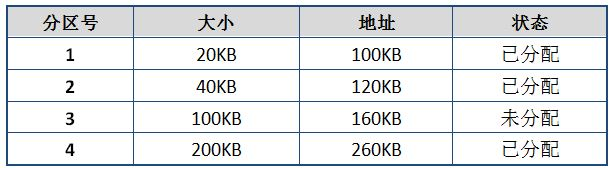
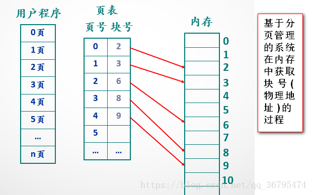
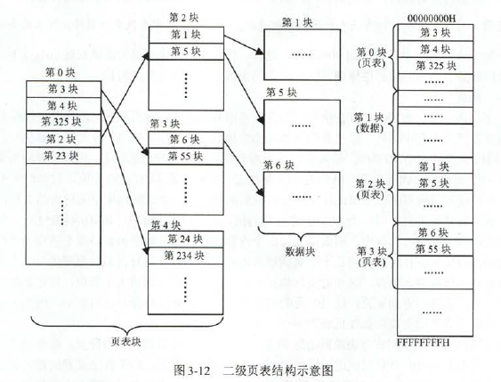
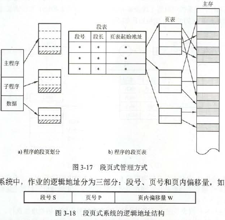

# 内存管理概念

### 内存管理的基本原理和要求

内存管理的功能：

- 内存空间的分配与回收
- 地址转换：逻辑地址与物理地址转换
- 内存空间的扩充：利用虚拟存储技术或其他自动覆盖技术，为用户提供比内存空间大的地址空间
- 存储保护

程序的装入和连接步骤：

- 编译：一般编译程序无法得知代码驻留在内存中的实际位置（即物理地址），一般都是从0号单元开始编址。
- 链接：多个模块都是由0号开始编址，当链接程序将多个模块链接为装入模块时，会按照各个模块的相对地址将其地址构成统一的从0号单元开始编址的相对地址。（即逻辑地址（相对地址）的形成是在链接阶段）
- 装入：当装入程序将可执行代码装入内存时，程序的逻辑地址和物理地址通常不同，这就需要地址转换，将逻辑地址转换成物理地址，这个过程叫做重定位。

链接的方式：

- 静态链接：程序运行之前，链接成一个完整的可执行程序
- 装入时动态链接：将应用编译程序后所得到的一组目标模块装入内存时采用边装入边链接的动态链接方式
- 运行时动态链接：直到程序允许过程中需要一些模块时，才对这些模块进行链接

装入内存方式：

- 绝对装入：逻辑地址与内存地址完全相同，不需要修改。只适用于单道程序环境
- 可重定位装入：又称静态重定位。多个目标模块的通常由0开始。地址变换通常是在装入时一次性完成的，之后不再改变，故又称静态重定位。只能将程序分配到连续的存储区
- 动态运行时装入：又称动态重定位。地址转换推迟到程序执行时进行。可以将程序分配到不连续的存储区。

动态与静态比较：动态重定位需要依靠硬件地址变换机构，最简单的形式是重定位寄存器，存基址。静态重定位无需硬件地址变换机构，但需要一个连续的存储区。静态重定位难以做到共享，动态重定位容易共享。（静态是一连串区域，而动态是多个区域，静态锁所有，动态锁一段）

内存保护：

- 在CPU中设置一对上下限寄存器
- 重定位寄存器和界地址寄存器。重定位寄存器是用来加的（基址），界地址寄存器是用来比的。

### 覆盖与交换

多道程序环境下用来扩充内存的两种方法。

- 覆盖：分为固定区和覆盖区。将经常活跃的部分放在固定区，其余部分按调用关系分段。首先将即将访问的段放入覆盖区，其他段放在外存中，在需要调用前，系统再将其调入覆盖区，替换覆盖区中原有的段。
- 交换：把处于等待状态的程序从内存移到辅存，把内存空间腾出来，这叫换出；把准备好竞争CPU运行的程序从辅存移到内存。**交换技术主要在不同进程之间进行，而覆盖则用于同一个程序或进程中**

### 连续分配管理方式

- 单一连续分配：内存中只永远只有一道程序。无外部碎片，存在内部碎片（内存只分为系统区和用户区，用户区只放一个作业，所以是内部碎片）。只能用于单用户，单任务的系统
- 固定分区分配：将用户内存空间划分成若干固定大小的区域，每个区域只装入一道作业。通常采用静态重定位的方法。分为大小相等和大小不等的情况。两个问题：一是程序太大无法放入的话，只能通过覆盖解决，另一个是内存利用率低。无外部碎片，有内部碎片，但不能实现多进程共享一个主存区，空间利用率低。

  

- 动态分区分配：不预先划分，在进程装入内存时，根据进程的大小动态地建立分区。这个方法刚开始很好，但是会渐渐地产生越来越多的外部碎片。在装入或换入主存时，若有多个足够大的块，则采用以下算法进行分配：
  - 首次适应算法：空间分区以地址递增的次序链接，大小能满足要求的第一个空闲空间
  - 最佳适应算法：空间分区以容量递增的方式形成分区链，找到第一个能满足要求的空间分区(也就是大小够用且最小的分区)
  - 最坏适应算法：也叫最大适应算法，空闲分区以容量递减的次序链接。找到第一个能满足要求的空现分区，挑选出最大的分区
  - 临近适应算法：循环首次适应，首次适应的改变，分配内存时从上次查找结束的位置开始继续查找

以上三种内存分区管理方法有一个共同特点：用户进程在主存中都是连续存放的。

### 非连续分配管理方式

需要额外的空间去存储它们的索引，使得非连续分配方式的存储密度低于连续存储方式。

- 基本分页存储管理方式：把主存空间划为大小相等且固定的块，块相对较小，作为主存的基本单位。进程只有为最后一个不完整的块申请一个主存块空间时，才产生内部碎片。**进程中的块称为页，内存中的块称为页框**。**页面地址分为页号和页内偏移量，根据块的大小确定页内偏移量的位数，然后在虚拟地址中减去低位的偏移地址，剩下的就是页号**。页表：页表项记录了内存对应的物理块号，一般存放在内存中。页表项第一项为页号，这个和逻辑地址一样。（通常不需要存储）但第二项记录了物理内存中的块号(前地址)，而地址的第二项是页内偏移地址。**页表项的物理内存块号与虚拟地址的偏移地址组合在一起构成了实际物理地址**。在系统中常设置一个页表寄存器，**存放页表在内存的起始地址F和页表长度M**。快表：存放若干页表项(不是全部)，是具有并行查找能力的高速缓冲存储器。有快表的访存方式：
  - CPU给出逻辑地址后，由硬件进行地址转换(把偏移地址去掉，拿出页号)，将页号送入快表
  - 若找到，根据快表中对应的页框号和偏移地址进行拼接，得到物理地址
  - 若未找到，去找页表(页表是包含所有，不会出现找不到的情况)，并把记录放入快表中，如果快表满了，则进行替换

- 两级页表：有时页表过多，为了防止这样，**构造一个页表的页表**。**顶级页表最多只能有一个页面**，这样逻辑地址就分为了一级页号，二级页号，页内偏移。可以通过页大小把页内偏移确定；然后根据页表项大小得到一级页号的位数，因为一级页表只能用一个页，那么一页大小/页表项大小就是一级页表中记录的个数。剩下就是二级页表的个数。一级页号位数与二级页号位数通常相等(因为每个页表也是用页存储的，具体见下图)

- 基本分段存储管理方式：提高内存利用率，提高计算机性能。满足了程序员。分段：逻辑地址分为段号和段内偏移量。分页中，这些对用户是透明的，但是分段中，段号和段内偏移地址必须用户显示提供，在高级程序设计语言中，由编译程序完成。段表：段表内容为段号、段长、本段在主存的始址。段表寄存器：存放段表起始地址F和段表长度M。段的共享：是通过两个作业的段表中响应表项指向被共享的段的同一个**物理副本**实现的。**不能修改的代码称为纯代码或可重入代码，这样的代码和不能修改的数据可以共享**。**每个段的长度是不固定的**
- 段页管理方式：作业的地址空间先被分为若干逻辑段，每段都有自己的段号，然后将每段分成若干固定的页。**在一个进程中，段表只有一个，而页表可能有多个**。

# 虚拟内存管理

### 虚拟内存的基本概念

传统存储管理方式的特征：

- 一次性：作业必须一次性装入内存后，才开始运行
- 驻留性：作业被装入内存后，就一直驻留在内存，其任何部分都不会被换出，直至作业运行结束。

引入虚拟内存的原理——局部性原理

- 时间局部性
- 空间局部性

虚拟存储器的特征：

- 多次行：一个作业可以多次调入内存
- 对换性：作业在运行过程中可以换入换出
- 虚拟性：从逻辑上扩充内存容量，用户可以使用的空间可以远大于实际内存容量

### 请求分页管理方式

在基本分页存储管理系统的基础上，增加了请求调页功能和页面置换功能。

页表项结构：页号-物理块号-状态位-访问字段-修改位-外存地址

- 状态位：用于判断页面是否存在主存中。每当进行主存访问时，根据该位判断要访问的页面是否在主存中，若不在主存，则产生缺页中断。
- 修改位：用于表示页面调入内存后是否被修改
- 外存地址：指出页面在外存上的存放地址，供调入页面时使用。

缺页中断：所访问页面不存在时，产生。将缺页的进程阻塞。与普通中断的区别：

- 在指令**执行前期**而非一条指令执行完后产生和处理中断信号，属于内部中断
- 一条指令在执行期间，**可能发生多次缺页中断**

### 页面置换算法

- 最佳置换算法(OPT):最长时间不再访问的页面，无法实现。
- 先进先出：会出现所分配的物理块增大而页故障数不减反增的情况。称为Belady异常。
- 最久最近未使用(LRU)：将最近最少使用的页面替换。需要寄存器和栈的硬件支持。
- 时钟置换算法：最近未用算法（NRU）。刚进入内存或刚被访问过的，访问位就设为1.用于替换的是个循环缓冲区，一个指针指向某一项，这一项被替换后，就指向下一项。这就体现了循环。当指针寻找被替换项时，若遇到1，就变成0，若遇到0，就直接换出。换出后指针指向下一个。如果全是1，则转一圈，都变成0，然后再开始，把第一个换出去。改进算法：使用位基础上增加一个修改位（u：use，m：modify）。改进算法的执行过程：
  - 从当前指针开始，扫描缓冲区，这次扫描不做任何修改，选择遇到第一个帧(u=0,m=0)用于替换。
  - 若第一步失败，重新扫描，找(u=0,m=1)的帧。选择遇到的第一个这样的帧用于替换，并在扫描过程中，对每个跳过的帧，把使用位设置为0.
  - 若第二步失败，重新扫描，这时所有的u都是0，重复第一步。

总结：若有未使用过的页面，先换出，若全部使用过，则优先换出未修改过的页面

### 页面分配策略

- 驻留集大小：给一个进程分配的物理页框的集合就是这个进程的驻留集。分配的三种策略
  - 固定分配局部置换：为每个进程分配一定数目的物理块，在运行期间**不改变**，发生缺页时，**只能从进程在内存中的页面中选出一页换出**。
  - 可变分配全局置换：最容易实现的。每个进程分配一定数目的物理块，操作系统自身页保持一个空现物理块队列。缺页时，系统从空现物理块队列中取出一个物理块分配给该进程。
  - 可变分配局部置换：为每个进程分配一定物理块，缺页时只能由自身内存页面中换出。若频繁却也，则再给进程增加一定物理块，若缺页率极低，则实当减少物理块。

【这个全局配置是指由新的空现队列(不属于任何进程)中添加一块。所以只能适用于可变分配，因为固定分配物理块数不变的，加进来一块就不是固定分配了】

- 调入页面的时机：
  - 预调页策略：将预计不久之后便会被访问的页面预先调入内存。主要用于进程的首次调用，这样调用多个是没问题的。
  - 请求调页策略：需要的时候调入，用这种方式调入的页肯定会被访问，缺点是每次只调入一页。一般情况下，两种策略同时使用。
- 从何处调入页面：对换区(swap)的磁盘IO速度比文件区更快。由三种情况
  - 系统有足够的对换区。全部由对换区调
  - 系统缺少足够的对换区。不会被修改的文件由文件区调用，换出时，由于没被修改不用再换出，直接替换就行了。但对于可能被修改的部分，将他们放入对换区，由对换区调入
  - UNIX方式。与进程有关的文件都放入文件区，故未运行过的页面都应从文件区调入。曾经运行过但又被换出的页面，由于存放在对换区，因此下次调入时应从对换区调入。即未运行过的由文件区，运行过的由对换区

### 抖动

刚刚换出的页面马上又换入主存，刚刚换入主存的又马上换出，这种频繁的页面调度称为抖动。主要原因是某进程频繁访问的页面数高于可用的物理页帧数目。

### 工作集

某段时间间隔内，进程要访问的页面集合。因为是集合，去掉重复的要小于工作集窗口大小(这玩意就是一段时间内访问页面数，如{1，3，4，5，3}，那么工作集就是{1，3，4，5})

若分配给进程的物理块小于工作集大小，则会频繁缺页。若所有进程的工作集之和超过了可用物理块的总数，则操作系统会暂停一个进程，将其页面调出并将其物理块分配给其他进程，防止出现抖动现象。
