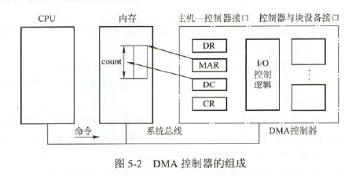
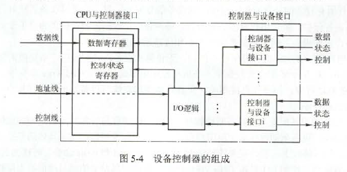
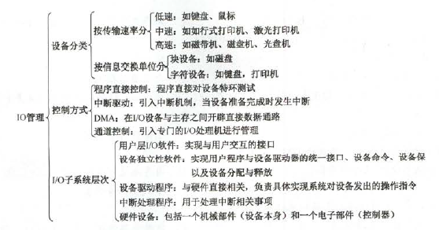
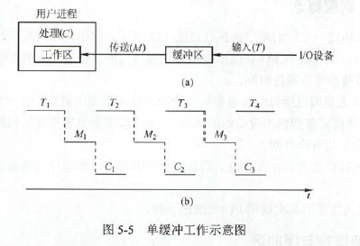
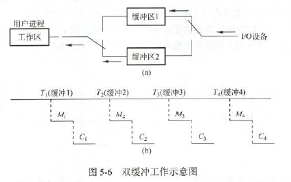
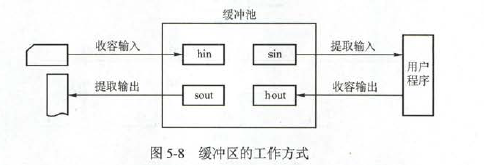
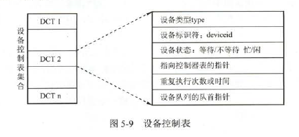
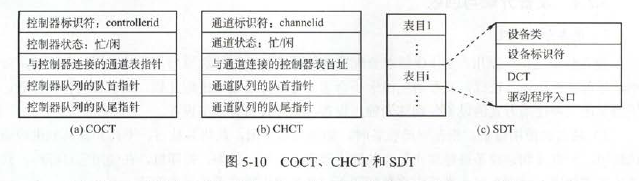
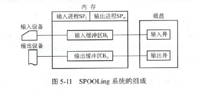
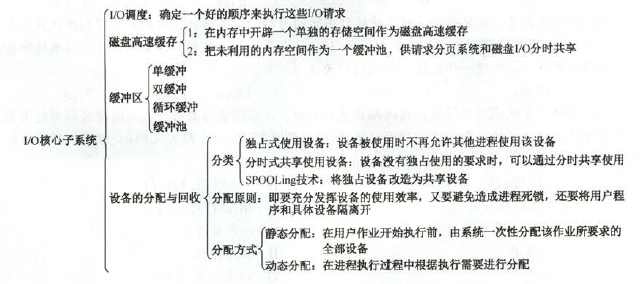

# IO管理概述

### IO设备

按速度分类：

- 低速设备：每秒几字节到数百字节，如键盘、鼠标等
- 中速设备：每秒数千字节至数万字节，如行式打印机、激光打印机等
- 高速设备：每秒百千字节到千兆字节，如磁带机，磁盘等

按信息交换单位分类

- 块设备：属于有结构设备，如磁盘等。传输速率高、可寻址
- 字符设备：基本传输的单位是字符，属于无结构类型，如交换式终端机、打印机等。传输速率低，不可寻址，在输入输出时采用中断驱动方式。

### IO控制方式

- 程序直接控制方式：CPU与IO只能串行工作。
- 中断驱动方式：一旦数据读入该IO控制器的数据寄存器，便通过控制线给CPU发一个中断信号，表述数据已准备好，等待CPU请求数据。中断方式比程序直接控制方式有效，但由于数据中的每个字在存储器与IO控制器之间的传输都必须经过CPU，导致了中断方式仍消耗较多的CPU
- DMA方式：基本思想是在IO和内存之间开辟一条通路，彻底解放CPU。特点如下：1.基本单位是数据块；2.所传送的数据直接送入内存，或者相反。3.仅在传送一个或多个数据块的开始和结束时，才需要CPU的干预，整块数据的传送是在DMA控制器的控制下完成的。中断与DMA的区别：中断需要**每个数据需要传输时中断CPU**，而DMA是在一批数据全部传输结束时才中断CPU；中断数据传送是在中断处理时由CPU控制完成的，而DMA控制方式是在DMA控制器的控制下完成的
  - CR:命令/状态寄存器，用于接收从CPU发来的IO命令或有关控制信息，或设备的状态
  - MAR：内存地址寄存器，输入时，存放数据从设备传送到内存的起始目标地址；输出时，存放由内存到设备的内存源地址
  - DR：数据寄存器，用于暂存从设备到内存或从内存到设备的数据
  - DC：数据计数器，存放本次要传送的字节数

- 通道控制方式：**IO通道是指专门负责输入输出的处理机**。可以进一步减少CPU的干预。当CPU想要数据时，只需向IO通道发送一条IO指令，给出所要执行的通道程序的首地址和访问的IO设备，通道接收指令后，执行通道程序即可完成IO任务，数据传送结束时向CPU发中断请求。
  - IO通道与一般处理机的区别：通道指令类型单一，没有自己的内存，所执行的通道程序是放在主机的内存终端，**通道与CPU共享内存**
  - IO通道与DMA方式的区别：DMA方式需要CPU控制传输数据块的大小，内存位置，而通道方式中，这些是通道控制的。另外，**每个DMA控制器对应一台设备与内存数据传递，而一个通道可以控制多台设备与内存的数据交换**

### IO子系统的层次结构

将整个IO自系统分为4个层次的系统结构

- 用户层IO软件：大部分IO软件都在操作系统内部，用户层软件必须通过一组系统调用来获取操作系统服务
- 设备独立性软件：用于实现用户程序与设备驱动器的统一接口、设备命令、设备保护及设备分配与释放等，同时为设备管理和数据传送提供必要的存储空间。为实现独立性，引入了物理设备和逻辑设备两个概念。应用程序中使用逻辑设备名来请求使用某类设备，系统执行时，必须将逻辑名映射成物理设备名使用。独立性软件的主要功能：
  - 执行所有设备的共有操作。如对设备的分配与回收；将逻辑名映射成物理名；对设备进行保护，禁止用户直接访问设备；缓冲管理；差错控制
  - 向用户层提供统一接口。例如对各种设备的读写操作，都统一使用read/write命令
- 设备驱动程序：与硬件直接相关，负责具体实现系统对设备发出的操作指令，驱动IO设备工作的驱动程序。
- 中断处理程序：用于保护被中断进程的CPU环境，转入相应的中断处理程序进行处理。
- 硬件设备：分配机器部件和电子部件。电子部件称为设备控制器，机器部件就是设备本身。设备控制器通过寄存器和CPU通信，有些计算机上，这些寄存器占用内存地址的一部分，称为内存映像IO，另一些计算机采用IO专用地址，寄存器独立编址。

设备控制器包含以下功能：

- 接收和识别CPU或通道发来的命令
- 实现数据交换，包括设备和控制器之间的数据传输
- 发现和记录设备及自身的状态信息
- 设备地址识别

为实现上述功能，设备控制器包含以下组成部分：

- 设备控制器和CPU的接口：该接口有三类线，数据线、地址线和控制线数据线通常与数据寄存器和控制状态寄存器相连
- 设备控制器与设备的接口：设备控制器链接设备需要相应数量的接口，一个接口连接一台设备。
- IO控制逻辑：通过一组控制线与CPU连接，对从CPU收到的IO命令进行译码。

# IO核心子系统

### IO子系统概述

IO核心子系统提供的服务主要有IO调度、缓冲与高速缓冲、设备分配与回收、假脱机、设备保护和差错处理

### IO调度概念

操作系统开发人员通过为每个设备维护一个请求队列来实现调度。磁盘调度算法就是IO调度的一种。

### 高速缓存与缓冲区

高速缓存：

磁盘高速缓冲逻辑上属于磁盘，物理上则是驻留在内存中的盘块。高速缓存在内存中分为两种：一种是在内存中开辟一个单独的存储空间作为磁盘高速缓存，大小固定；另一种是把未利用的内存空间作为一个缓冲池，共请求分页系统和磁盘IO共享

缓冲区:

目的：

- 缓和PCU和IO设备间速度不匹配的矛盾
- 减少对CPU的中断频率，放宽对CPU中断响应时间的限制
- 解决基本数据单元大小不匹配的问题
- 提高CPU和IO设备之间的并行性

实现方法：

- 硬件缓冲器：太贵
- 缓冲区(位于内存区域)：但缓冲区数据非空时，不能往缓冲区写入数据，只能从缓冲区把数据传出；当缓冲区为空时，能写入，但必须写满后，才能从缓冲区传出。

缓冲区类型

- 单缓冲：设备和处理机之间设置一个缓冲区。在CPU处理时可以向缓冲区写入数据。单缓冲处理每块数据的时间max(C,T)+M

- 双缓冲：根据单缓冲的特点，CPU在传送时间M处于空现状态(这时候数据已经处理完了)。双缓冲中，IO设备输入数据先填充到缓冲1，缓冲1满后，填缓冲2.于此同时处理机可以从缓冲1取数据并处理，当缓冲1数据处理完后，若缓冲2已满，则处理机从缓冲2取数据并处理，此时IO又在向缓冲1写。双缓冲处理一块数据的用时为max(C+M,T)

- 循环缓冲：包含多个大小相等的缓冲区，每个缓冲通过指针组成一个环。还需要两个指针in和out，指向输入和输出缓冲。
- 缓冲池：多个共用缓冲组成。可形成三个队列：空缓冲队列、装满输入数据的缓冲队列和装满输出队列的缓冲队列。

高速缓存与缓冲对比

||高速缓存|缓冲区|
|-----|-----|-----|
|相同点|都介于高速设备和低速设备之间|
|区别：存放数据|存放的是低速设备上的某些数据的复制数据，即高速缓存有的，低速设备上必然有|存放的是低速设备传递给高速设备的数据，而这些数据在低速设备上不一定有备份，这些数据再从缓冲区传到高速设备|
|区别：目的|高速缓存存放的是高速设备经常要访问的数据，若高速设备要访问的数据不再高速缓存中，则高速设备就需要访问低速设备|高速设备和低速设备的通信都要经过缓冲区，高速设备永远不会直接访问低速设备|

### 设备分配与回收

从设备的特性来看，采用下述三种使用方式的设备分别称为独占设备、共享设备和虚拟设备

- 独占式使用设备：若设备空现，则将其独占，不再允许其他进程申请，直到该设备释放。如打印机
- 分时式共享使用设备：通过分时共享提高设备利用率，如磁盘。
- 以SPOLLing方式使用外部设备：在批处理操作系统时代引入的，实质上是一种以空间换时间的计数。假脱机IO技术。

设备分配的数据结构有设备控制表、控制器控制表、通道控制表和系统设备表。

- 设备控制表(DCT)：一个设备控制表就表征一个设备，控制表中的表象就是设备的各个属性。每个DCT都需要一个表项来表示控制器，需要一个指向控制器控制表的指针，因此DCT与COCT一一对应。
- 控制器控制表(COCT)：每个控制器都配有这样一张控制器表，用来表示控制器的使用状态及通道的连接情况
- 通道控制表（CHCT）：每个通道都配有一张表，用来表示通道的状态
- 系统设备表（SDT）：整个系统一张，记录了所有物理设备的情况，每个物理设备占用一个表目

每个COCT必有一个表象存放指向相应通道控制表(CHCT)的指针，而一个通道可为多个设备服务，故CHCT与COCT是一对多的关系。系统设备表(SDT),每个整个系统只有一张SDT，记录已连接到系统中的所有物理设备的情况，每个物理设备占一个表目。

设备分配策略：

- 分配方式
  - 静态分配：主要用于独占设备的分配，在用户作业开始执行前，由系统依次性分配该作业所要求的全部设备、控制器。不会出现死锁，但设备使用效率低。
  - 动态分配：根据进程执行需求分配。可能造成死锁
- 分配算法：独占设备，既可采用动态分配，也可采用静态分配，但往往采用静态分配。共享设备通常采用动态分配

设备分配的安全性：

- 安全分配：每当进程发出IO请求就进入阻塞，直到IO操作完成时被唤醒。一旦进程获得某种设备后边阻塞，不再请求任何资源，阻塞时也不保持任何资源。优点是安全，缺点是CPU与IO串行工作（对同一进程而言）
- 不安全分配：发出IO请求后，需要时能发出第二个、第三个IO。仅当进程所请求的设备被其他进程占用，才会阻塞。

### 逻辑设备名到物理设备名的映射

为了实现设备独立性，在应用程序中使用逻辑设备名来请求使用某类设备。在系统中设置一张逻辑设备表，LUT表项包括逻辑设备名、物理设备名和设备驱动程序入口地址。当进程用逻辑设备名来请求分配设备时，系统为它分配相应的物理设备，并在LUT上建立一个表项，以后进程再利用逻辑设备名请求IO操作时，系统通过查找LUT来寻找相应的物理设备和驱动程序。可采用两种方式建表：整个系统一张；每个用户一张。

### SPOOLing(假脱机)技术

利用外围控制器，将低速的IO设备上的数据传送到高速磁盘上。

- 输入和输出井：在**磁盘**上开辟两个存储区域。输入井模拟脱机输入时的磁盘，用于收容IO设备输入的数据。输出井模拟脱机输出时的磁盘，用于收容用户程序的输出数据。
- 输入缓冲区和输出缓冲区：在**内存**中开辟两个缓冲区。输入缓冲区用于暂存由输入设备送来的数据，以后再传送到输入井。输出缓冲区用于暂存从输出井送来的数据，以后再传送到输出设备。
- 输入进程和输出进程：输入进程模拟脱机输入时的外围控制机，将用户要求的数据从输入机通过输入缓冲区再送到输入井。当CPU需要数据时，直接将数据从输入井读入内存。输出进程相反。

【例】打印机。SPOOLing只做两件事：1.由输出进程在输出井中为之申请一个空现磁盘块区，并把要打印的数据送入其中。2.输出进程再为用户进程申请一张空白的用户请求打印表，将用户的打印要求填入其中，再将该表挂到请求打印队列上。

SPOOLing技术主要特点：提高了IO的速度，**将独占设备改造为共享设备，实现了虚拟设备的功能**。

控制外设的两大步骤

