# 文件系统基础

### 文件的属性

- 名称：文件名唯一
- 标识符：系统内文件的唯一标签，通常为数字，对用户透明
- 文件类型
- 文件位置：指向文件的指针
- 文件的大小、建立时间、用户标识等

### 文件的操作

- 创建文件：先分配空间，在目录中建立目录项
- 删除文件：先删除目录项，使之成为空项，再释放空间
- 读文件：根据文件的外存地址设置一个读指针，读操作时更新读指针
- 写文件：根据文件的外存地址设置一个写指针，写操作时更新写指针
- 截断文件：当文件内容不再需要或者需要全部更新时，可以将文件删除重新创建；或者保持文件所有属性不变，删除文件内容，即将其长度设为0并释放其空间
- 设置文件的读/写位置：操作文件时不再由头开始，可以从某个特定位置开始
- 打开文件：将文件的属性从外存复制到内存，并设定一个编号（或索引）返回给用户。以后用户想操作文件时，通过编号即可。
- 关闭文件：将打开文件的编号删除，并销毁其文件控制块

### 文件的概念

文件的打开与关闭：系统调用open将文件从外存复制到内存打开文件表的一个表目中。**open调用完后，操作系统对该文件的任何操作都不再需要文件名，而只需要open调用返回的指针**。系统打开文件表的每个文件时，还用一个文件打开计数器，记录多少进程打开了该文件

### 文件的逻辑结构

文件的逻辑结构与存储介质特性无关，但文件的物理结构与存储介质的特性有很大关系。

- 无结构文件：流式文件。由于无结构文件没有结构，因而**对记录的访问只能通过穷举搜索的方式**。故不适用于大多数应用。但字符流的无结构文件管理简单，用户可以方便地对其进行操作。对基本单位操作不多的文件较适于采用字符流的无结构方式，如源程序文件、目标代码文件。UNIX系统中，所有文件均是流式文件。
- 有结构文件：记录式文件
  - 顺序文件：**顺序文件的效率是所有逻辑文件中最高的**。只有顺序文件才能存储在磁带上
  - 索引文件：为一个逻辑文件的信息建立一个索引表，索引表本身是定长记录的顺序文件。通过索引可以成百上千倍地提高效率。索引表和逻辑文件两者构成索引文件
  - 索引顺序文件：顺序与索引的结合。索引表只包含关键字和指针两个数据项；文件中记录分组排列，同一组中的关键字可以无序，但组与组之间的关键字必须有序。首先通过索引表找到其所在的组，然后在该组中使用顺序查找。顺序查找平均N/2次，假设N条记录分$\sqrt{N}$组，每组有$\sqrt{N}$条记录。查找时$\sqrt{N}/2$+$\sqrt{N}/2$=$\sqrt{N}$
  - 直接文件和散列文件：速度很高，可能会有冲突。不同关键字的散列函数值相同。

### 目录结构

包含文件的信息如属性、位置和所有权等，目录管理要实现“按名存取”。

文件控制块和索引结点：

- 文件控制块：文件控制块是用来存放控制文件需要的各种信息的数据结构，以实现“按名存取”。一个FCB就是一个文件目录项。包含以下信息：
  - 基本信息：文件名、文件的物理位置、文件的逻辑结构、文件的物理结构等
  - 存取控制信息：文件存取权限等
  - 使用信息：建立时间、修改时间等
- 索引节点：有些系统采用了文件名与文件描述信息分开的方法，将文件描述信息单独形成一个索引结点，简称i结点。文件目录中每个目录项仅由文件名和指向该文件i结点的指针构成。

目录结构

- 单级目录结构：整个文件系统中只建立一张目录表，每个文件占一个目录项。文件名不能一样。

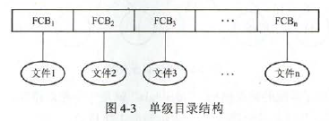

- 两级目录结构：将文件目录分成主文件目录和用户文件目录两级。主文件目录记录用户名及相应用户文件目录所在的存储位置。用户文件目录项记录该用户文件的FCB信息。既解决了重名问题，又一定程度上保证了文件的安全。

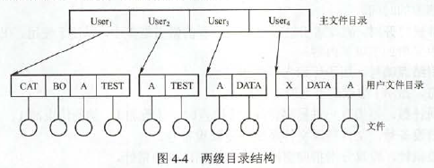

- 多级目录结构：如Linux,由根目录出发的是绝对路径。**进程对个文件的访问都是相对于当前目录进行的**。即相对路径

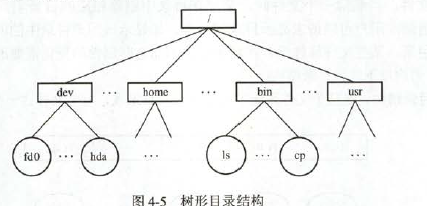

- 无环图目录结构：是为了实现文件共享。

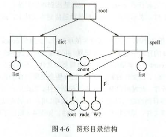

### 文件共享

系统中只需保留该文件的一个副本

- 基于索引结点的共享方式(硬链接)：这种共享方式，诸如文件的物理地址及其他的文件属性等信息，不再放在目录项中，而放在索引节点中。索引结点还有一个链接计数count，用于表示链接到本索引结点上的用户目录项的数目。

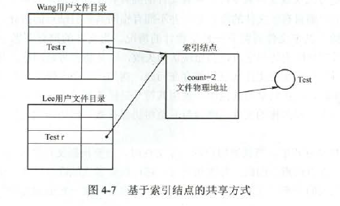

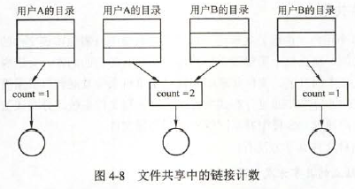

- 利用符号链实现文件共享(软链接)：创建一个LINK类型的新文件，名字一样。在新文件中只包含被链接文件F的路径名。**只有文件的拥有者才拥有指向其索引结点的指针，而共享文件的其他用户没有指针，也就是count不会增加。** 如一个文件采用链接式共享，当文件拥有者将其删除，而其他用户又在同样路径创建了同样的文件，那么LINK文件依然有效。一个很大的优点：即网络共享只需提供该文件所在机器的网络地址及该机器中的文件路径。

硬链接的查找速度比软连接快

### 文件保护

文件保护通过口令保护、加密保护和访问控制等方式实现。口令保护和加密保护是为了防止用户文件被他人存取或窃取，而访问控制则用于控制用户对文件的访问方式。

访问控制：

最常用的方法是根据用户身份进行控制。为每个文件和目录增加一个访问控制列表，以规定每个用户名及其所允许的访问类型。精简的访问列表有拥有者、组和其他三种用户类型。

口令的缺点是直接存在系统内部，不够安全。

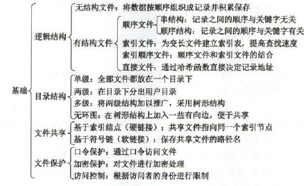

# 文件系统实现

### 文件系统层次结构

- 用户调用接口
- 文件目录系统
- 存取控制验证
- 逻辑文件系统和文件缓冲区：根据文件的逻辑结构将用户要读写的逻辑记录转换成文件逻辑结构内的相应块号
- 物理文件系统
- 辅助分配模块
- 设备管理程序模块

### 目录实现

目录的实现就是为了查找

- 线性表：存储文件名和数据块指针的线性表。采用链表结构可以减少删除文件的时间，其优点在于实现简单，不过由于线性表的特殊化，比较费时
- 哈希表：查找非常迅速。

### 文件实现

文件分配方式

- 连续分配：每个文件在磁盘上占用一组连续的块，磁盘地址定义了磁盘上的一个线性排序。这种排序使作业访问磁盘时需要的寻道数和寻道时间最小。文件目录包括开始地址和文件长度。无法动态增加，只能存储大小固定的文件
- 链接分配：
  - 隐式链接：每个文件对应磁盘块的链表，文件目录包括第一块的指针和最后一块的指针。写文件会通过空闲空间管理系统找到空闲块，将该块链接到文件尾部。
  - 显示链接：把用于链接文件各物理块的指针，从每个物理块的块末尾提取出来，显示地存放在内存地一张链接表中，**这个链接表整个磁盘仅设置一张**，查找下一块地址时，只需查找链接表中相应地位置。**该表称为文件分配表，FAT**

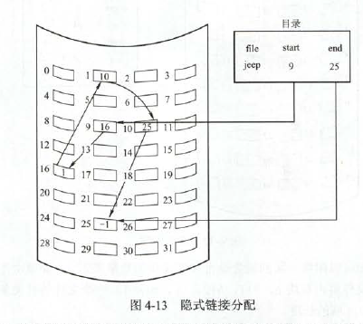

- 索引分配:把每个文件所有地盘块号集中放在一起构成索引表。每个文件都有索引块，这是一个磁盘块地址的数组。

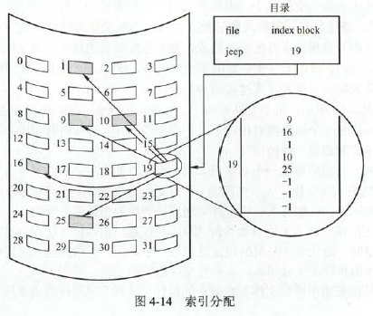

索引块的解决办法：

- 链接方案：一个索引块通常为一个磁盘块，因此它本身能直接读写
- 多层索引：第一层索引块指向第二层索引块，第二层再指向文件。例如4096B的块，能在索引块中存入1024个4B的指针，两层索引允许1024\*1024=1048576个数据块，即最大文件支持4GB。
- 混合索引：多种索引分配方式结合，既采用直接地址，又采用单级索引和两级索引

|对比项目|访问第n条记录|优点|缺点|
|-----|-----|-----|-----|
|连续分配|访问磁盘1次|顺序存取速度快，文件定长时可根据文件起始地址和记录长度进行随机访问|文件存储要求连续的存储空间，会产生碎片，不利用文件动态扩充|
|链接分配|需访问磁盘n次|可解决外存的碎片问题，提高外存空间的利用率，动态增长较方便|只能按照文件的指针链顺序访问，查找效率低，指针信息存放消耗外存空间|
|索引分配|m级需访问磁盘m+1次|可以随机访问，文件易于增删|索引表增加存储空间的开销，索引表的查找策略对文件系统效率影响较大|

此外，访问文件需要两次访问外存——首先要读取索引块的内容，然后访问具体的磁盘块，因而降低了文件的存取速度。通常将文件的索引块读入内存的缓冲区，以加快文件的访问速度。

文件存储空间管理

一个文件存储在一个文件卷中，一个文件卷中，文件数据信息的空间和存放文件控制信息FCB的空间是分离的。一个文件卷可以占用多个物理盘。

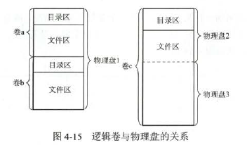

文件存储设备的管理

- 空闲表法：连续分配方式，为每个文件分配一块连续的存储空间。系统为外存空闲区创建一个空现盘块表。

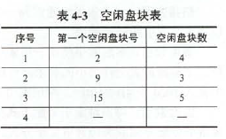

- 空闲链表法:将空现空间拉成一条空现链，分两种：
  - 空现盘块链：以盘块为单位，将回收的盘块依次插入空闲盘块链的末尾。为一个文件分配盘块时可能要重复多次(不止分配一个盘块)
  - 空现盘区链：以盘区为单位，每个盘区包含若干块。除了有指向下一个盘区的指针外，还应有指明本盘区大小的信息。
- 位视图法：分配盘块b=n(i-1)+j,i行j列，n是每行的位数.每个坐标为一个盘块，0代表空闲，1代表有东西

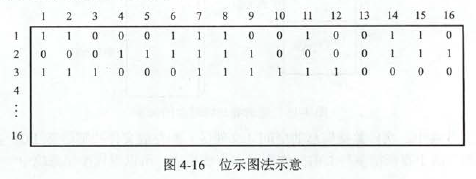

- 成组链接法：空闲表法和空现链表法都不适合大文件，该方法适合。思想如下：把顺序的n个空现扇区地址保存再第一个空闲扇区内，其后一个空闲扇区内则保存另一空闲扇区的地址，如此继续。系统只需保存一个指向第一个扇区的指针。

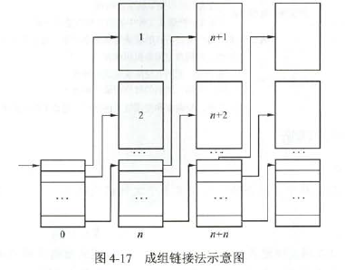

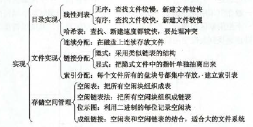

# 磁盘组织与管理 

### 磁盘的结构

磁盘盘面的数据存储在一组同心圆中，称为磁道。

磁道又划分成几百个扇区，每个扇区固定存储大小，通常称一个扇区为一个盘块。由于固定圆心角划分，并且扇区存储大小固定，所以存储密度由外向内递增。

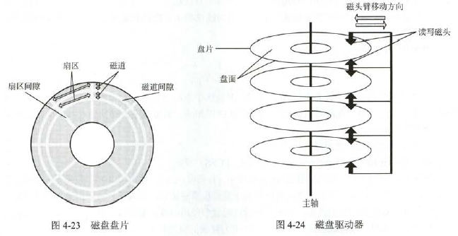

### 磁盘调度算法

一次磁盘的操作时间由寻找(寻道)时间、延迟时间和传输时间决定。

- 寻道时间：移动到指定磁道所需的时间。除跨越n条磁道的时间外，还包括启动磁臂的时间。$T_s=m*n+s$。m是与磁盘驱动器速度有关的常数。这个时间一般直接给
- 延迟时间：磁头转到某一扇区的时间，设磁盘转速为r。$T_r=1/2r$。平均时间，取1/2.
- 传输时间：从磁盘读出或写入的速度。取决于每次读写的字节数b和磁盘转速。$T_t=b/rN$.N为一个磁道的字节数。b/N为写了多少个磁道，再除以r代表转过这些磁道一共要多少时间

磁盘调度算法：

- 先来先服务算法：先来先服务。
- 最短寻找时间优先：优先处理与当前磁头位置最近的磁道，典型的贪心。会产生饥饿现象，不能雨露均沾
- 扫描(SCAN)算法：在当前移动方向上找最近的。比如向左，左面扫完后，反向向右扫。

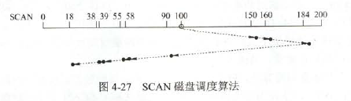

- 循环扫描：只能单向，即若方向向右，则扫到最右面后，回到最初的起点，再由左向右扫。

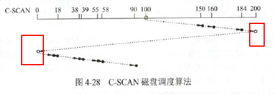

- LOOK调度和C-LOOK调度：再SCAN和C-SCAN的基础上，扫到最大的时候，不再向该方向走，而是直接返回。这样就省事了。

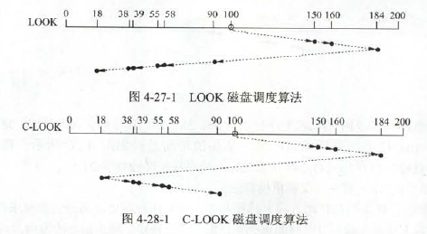

磁盘调度算法比较

|算法|优点|缺点|
|-----|-----|-----|
|FCFS|公平，简单|平均寻道时间大，仅应用在IO较少的场合|
|SSTF|性能比“先来先服务”好|不能保证平均寻道时间最短，可能出现饥饿现象|
|SCAN|寻道性能较好，可消除饥饿现象|不利于远离磁头一端的请求访问|
|C-SCAN|消除了对两端磁道请求的不公平|-|

### 磁盘的管理

- 低级格式化：分成扇区以便磁盘控制器能进行读写操作。为每个扇区创建了一个数据结构，包括头、数据区域(通常512B)和尾部组成。头部和尾部包含了一些磁盘控制器所使用的信息
- 逻辑格式化：创建文件系统

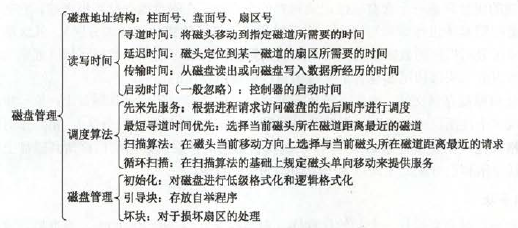

