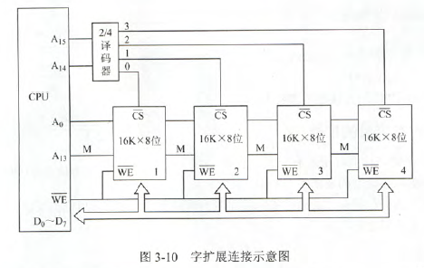
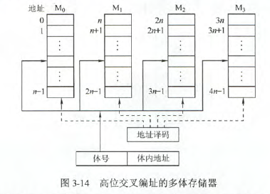
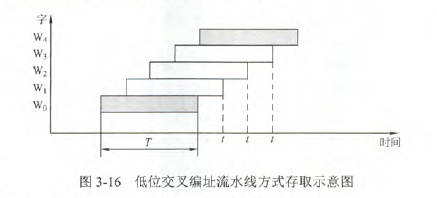

### 存储器的层次结构

##### 作用分类
- 主存储器
- 辅助存储器
- 高速缓冲存储器

##### 存取方式分类
- 随机存储器(RAM)，主要用作主存和高速缓冲存储器。又分为静态随机存储器(SRAM)和动态随机存储器(DRAM)
- 只读存储器(RON)，断电不会丢失
- 串行访问存储器，顺序存取存储器(磁带)，直接存取存储器(磁盘)

##### 存储器的性能指标
- 存储容量：存储字数*字长。存储字数表示存储器的地址空间大小，字长表示一次存取操作的数量
- 单位成本
- 存储速度：数据的传输率=数据的宽度/存取周期
    - 存取时间：启动一次存储器操作到完成该操作所经历的时间，分为读出时间和写入时间
    - 存取周期：又称读写周期或访问周期。指连续两次独立访问存储器操作之间所需的最小时间间隔，**大于存取时间**（在读写操作之后，总有一段恢复内部状态的复原时间）
    - 主存带宽：表示每秒从主存进出信息的最大数量

### 存储器的层次化结构
存储系统层次结构主要体现在“cache-主存”，“主存-辅存”层次

**主存和Cache之间的数据调动是由硬件自动完成的，对所有程序员均是透明的；而主存和辅存之间的数据调动则是由硬件和操作系统共同完成的，对应用程序员是透明的**

**这两个层次中，上一级的数据只是下一级的副本**

### 半导体随机存储器
组成：
- 存储矩阵（存储体）
- 译码驱动电路
- 读写电路
- 地址线
- 数据线
- 片选线
- 读写控制线


**数据线和地址线共同反应存储器容量的大小**

随机存储器类型：
- 动态存储器(DRAM):栅极电容构成，**采用地址线复用技术，地址线是原来的1/2，且地址信号分行列两次传送。**集成度高、功耗低、价位低、容量大，主要用于主存
- 静态存储器(SRAM):双稳态触发器构成，非破坏性读出，属于易失行半导体存储器。读取速度快，集成度低，功耗大，**一般作为高速缓冲存储器**


**动态存储器（DRAM）的刷新过程**

刷新原因：DRAM用电容存储信息，电容上的电荷会经过一段时间消失，通常是2ms，为了防止电荷消失，故需要刷新。

- 集中刷新：在一个刷新周期内，利用一段固定的时间，依次对存储器的所有行再生，此时间内处理器不能访问主存，称为“死时间”又称“死区”。优点是读写操作时不受刷新工作的影响，因此存储速度较高
- 分散刷新：把每行刷新分散到各个工作周期中，一个存储系统的工作周期分为两部分：1、正常读写和保持；2、刷新某一行。优点是没有死区，缺点是加长了系统的存储周期，降低了整机的速度。（没有死区的理解，这里规定的死区是周期外不能访问存储器的时间，而分散刷新将刷新放到存储周期中，故不算做死区）
- 异步刷新：结合前两种方法，将2ms除以行数，得到两次刷新之间的时间间隔t，利用逻辑电路每时间t产生一次刷新请求。即在电荷消失前完成全部刷新

刷新需注意的问题：

- 刷新对CPU是透明的，即刷新不依赖于外部的访问
- DRAM刷新的单位是行，故刷新操作仅需要行地址
- 刷新操作类似于读操作，但又有所不同。刷新只需补充电荷，不需要信息输出，刷新不需要片选

**易失性和刷新的区别：易失性是指断电后数据丢失，是RAM共有的特点，但只有DRAM需要刷新**

##### 存储器的读写周期

- RAM的读周期：读周期与读出时间是两个不同的概念，读周期时间表示存储芯片进行两次连续读操作时所必需的间隔的时间，它总是大于等于读出时间

|特点|SRAM|DRAM|
|-----|-----|-----|
|存储信息|触发器|电容|
|破坏性读出|非|是|
|需要刷新|不要|需要|
|送行列地址|同时送|分两次送|
|行列地址长度相同|不一定|相同|
|运行速度|快|慢|
|集成度|低(6个)|高|
|发热量(功耗)|大|小|
|存储成本|高|低|
|主要用途|高速缓存|主机内存、SDRAM、同步动态随机存储器|

### 主存储器与CPU的连接

位扩展：

**CPU的数据线与存储芯片的数据位数不一定相等，此时需要位扩展**如将8个8K\*1位的RAM芯片组成8K\*8位的RAM。

**采用位扩展时，各芯片选择地址线的方式相同，但连接数据线的方式不同，在某一时刻选中所有芯片，所以片选信号CS要连接到所有芯片**


字扩展：

字扩展时增加存储器中字的数量，而位数不变。**字扩展将芯片的地址线、数据线、读写控制线并联，而由片选信号来区分各芯片的地址范围**

**采用字扩展时，各芯片连接地址线的方式相同，连接数据线的方式也相同，但在某一时刻只需选中部分芯片，所以通过片选信号CS或采用译码器设计连接到相应的芯片**



字位扩展：

**采用字位扩展时，各芯片连接地址线的方式相同，但连接数据线的方式不同，而且需要通过片选信号CS或采用译码器连接到相应的芯片**


存储器与CPU的连接：

- 合理选择存储芯片
- 地址线的连接
- 数据线的连接
- 读写命令线的连接
- 片选线的连接

### 双端口RAM和多模块存储器

为了提高CPU访问存储器的速度，可以采用双端口存储器、多模块存储器等技术，它们都属于并行技术，前者为空间并行，后者为时间并行

##### 双端口RAM

指同一个存储器有左、右两个独立的端口，分别具有两组相互独立的地址线、数据线和读写控制线，允许两个独立的控制器同时异步的访问存储单元。当两端口地址不同时，在两端口进行读写操作一定不会冲突。

操作：

- 两个端口不同时对同一地址单元存储数据 ，没问题
- 两个端口同时对同一地质单元读出数据， 没问题
- 两个端口同时对同一地址单元写入数据， 写入错误
- 两个端口同时对同一地址单元操作，一个读出，一个写入， 读出错误

解决方法：置“忙”信号，由判断逻辑决定暂时关闭一个窗口，被延时。


##### 多模块存储器

- 单体多字存储器：只有一个存储体，每个存储单元存储m个字(正常只存储一个字)，总线宽度也为m个字。在一个存储周期内，从一个地址取出m个指令，即每隔1/m存取周期，CPU向主存取一条指令。缺点：**指令和数据必须连续存放，一旦遇到转移指令或操作数不能连续存放，这种方法的效果就不明显**     其实就是增加了一次存取操作所能取的字数，存取周期没变，但取的量增加了。
- 多体并行存储器：由多体模块组成，每个模块都有相同的容量和存取速度，各模块都有独立的读写控制电路、地址寄存器和数据寄存器。
    - 高位交叉编址：高位地址表示体号，低位地址为体内地址。**采用高位交叉编址的存储器仍是顺序存储器，因为低地址为体内地址**    高位交叉跟存储器按字扩展没啥区别，啥用没有。5
    - 低位交叉编址：低位地址表示体号，高位地址为体内地址。由于程序连续存放在相邻体中，因此称采用此编址方式的存储器为交叉存储器。




```
设模块字长等于数据总线宽度，模块存取一个字的存取周期为T，总线传送周期为r，为实现流水线方式存取，存储器交叉模块数应大于等于 m=T/r。m称为交叉存取度。
每经过r时间延迟后启动下一个模块，要求模块数必须大于等于m，即经过m*r时间后再次启动该模块时，其上次的存取操作已完成。

连续存取m个字所需的时间为
t1=T+(m-1)r
而顺序方式连续读取m个字所需时间为t2=mT
```



```
[例]：设存储器容量为32个字，字长为64位，模块数m=4，分别采用顺序方式和交叉方式进行组织。存储周期T=200ns，数据总线宽度为64位，总线传输周期r=50ns。在连续读出4个字的情况下，求顺序存储器和交叉存储器各自的带宽。
解：
顺序存储器和交叉存储器连续读出m=4个字的信息总量均是
q=64*4=256b
顺序存储器和交叉存储器连续读出4个字所需的时间分别是
t1=mT=4*200ns=800ns=8*10^-7s
t2=T+(m-1)r=200ns+3*50ns=350ns=35*10^-8
带宽分别是：
W1=q/t1=32*19^7b/s
W2=q/t2=73*10^7b/s
```

### 高速缓冲存储器

原理：程序访问的局部性原理

##### Cahce基本的工作原理

Cache和主存都被分为若干**大小相等**的块(Cache块又称Cache行)，每块由若干字节组成，块的长度称为块长。Cache中的块数远小于主存中的块数，仅保存主存中最活跃的若干块的副本。

CPU发出读命令时，若访问地址在Cache中命中，就将此地址转换成Cache地址，直接对Cache进行都操作，若不命中，则仍需访问主存，并在字所在的块一次性从主存调入到Cache。**CPU与Cache之间的数据交换以字为单位，而Cache与主存之间的数据交换则以Cache块为单位**

(某些计算机中也采用同时访问Cache和主存的方式，若Cache命中，则主存访问终止)


```
命中率：Cache的命中总次数位Nc,访问主存的总次数为Nm，命中率H=Nc/(Nc+Nm)

[例]:假设Cache的速度是主存的5倍，且Cache的命中率为95%,则采用Cache后，存储器性能提高多少(设Cache和主存同时被访问，若Cache命中和中断访问主存)？
解：设Cache的存取周期为t，主存的存取周期为5t，由H等于95%得系统得平均访问时间为：
Ta=0.95*t+0.05*5t=1.2t
性能为原来的5t/1.2t=4.17倍，故提高3.17倍

若先访问Cache，再访问主存
Ta=0.95*t+0.05*6t=1.25t
```

### Cache和主存的映射方式

在Cache中要为每块加一个标记，指明它是主存中哪一块得副本。为了说明标记是否有效，每个标记至少还应设置一个有效位，表示Cache映射得主存块数据是否有效。

- 直接映射：主存数据块只能装入Cache中的唯一位置。若这个位置已有内容，则产生块冲突，原来的块将无条件地被替换出去(**无需使用替换算法**)冲突率最高，空间利用率最低。地址映射为：主存字块标记-Cache字块地址-字块内地址

    Cache块号=主存地址块号除以Cache块数的余数

    对应的标记=主存地址块号除以Cache快数的商

    没有替换策略

- 全相联映射：可以把主存数据块装入Cache中的任何位置。优点：冲突概率低，空间利用率高，命中率也高；缺点是地址变换速度慢，实现成本高，**通常采用昂贵的按内容寻址的相连存储器进行地址映射**。全相联地址映射的地址结构：主存地址标志-字块内地址

- 组相联映射：将Cache空间分成大小相同的组，主存的一个数据块可以装入一组内的任何一个位置，**组间采取直接映射，组内采取全相联映射。**


```
组相联映射的关系可以定义为
j = i mod Q
j是缓存的组号，i是主存的块号，Q是Cache的组数。

当Q=1时变成全相联映射，当Q=Cache块数时变成直接映射。
```

每个Cache行对应一个标记项，包括有效位、标记位Tag、一致性维护位、替换算法控制位

组相联地址结构：主存字块标记-组地址-字块内地址

这里的计算题求行号都是直接除就行。

```
[例]：假设某个计算机的贮存地址空间大小为256MB，按字节编址，其数据Cache有8个Cache行，行长为64B
1)若不考虑用于Cache的一致性维护和替换算法控制位，并且采用直接映射方式，则该数据Cache的总容量为多少？
2)若该Cache采用直接映射方式，则主存地址为3200(十进制)的主存块对应的Cache行号是多少？采用二路组相联映射时又是多少？
3)以直接映射方式为例，简述访存过程(设访存的地址为0123456H)

解：
1)数据Cache的总容量为4256位。
Cache总容量包括：存储容量、标记阵列容量(有效位、标记位)

标记字段长度的计算：主存地址有28位(256MB=2^8B)，其中6位为块内地址(2^6B=64B)，3位为行号(2^3=8),剩余的28-3-9=19位为标记字段，总容量为8*(1+19+512)=4256b

(每个Cache行对应一个标记项(包括有效位、标记位Tag、一致性维护位、替换算法位)。查找Cache时就是查找标记阵列的标记项是否符合要求)

Cache行的存储容量：
1bit(有效位) 19bit(标记位) 512bit(每行存储的数据)

2)直接映射方式中，主存按照块的大小划分，主存地址3200对应的字块号为3200/64B=50.而Cache只有8行，则50mod8=2，故对应行号为2.

二路组相联：实质上就是将两个Cache行合并，内部采用全相联方式，外部采用直接映射。50mod4=2，对应组号为2，即对应行号为4或5.

3)直接映射方式中，28位主存地址可分为19位主存标记位，3位的块号，6位的块内地址，即0000 0001 0010 0011 0100 0101 0110， 0000 0001 0010 0011 010为主存标记位，001为块号，010110为块内地址。首先根据块号，查Cache(即001号Cache行)中对应的主存标记位，看是否相同。若相同，再看Cache行中的装入有效位是否为1，若是则表示有效，称次访问命中，按块内地址010110读出Cache行所对应的单元并送入CPU中，完成访存。
若出现标记位不相等或有效位为0的情况，则不命中，访问主存将数据取出并送往CPU和Cache的对应块中，把主存的最高19位存入001行的Tag中，并将有效位置1.
```

##### Cache中主存块的替换算法

**采用全相联映射和组相联映射时，才需要替换算法**

常用的替换算法有随机(RAND)算法、先进先出(FIFO)算法、近期最少使用(LRU)算法和最不经常使用(LFU)算法。

- 随机算法：随机地确定Cache块。未依据程序访问的局部性原理，命中率较低

- 先进先出算法：选择最早调入的行进行替换。未依据程序访问的局部性原理。

- 近期最少使用算法：依据程序访问的局部性原理选择近期内长久未访问过的存储行作为替换的行，命中率比FIFO高。**LRU算法为每行设置一个计数器，Cache每命中一次，命中行计数器清0，而其他行计数器均加1，替换时选择计数值最大的行**

    做题时把当前块号之前所有出现的块号都划掉，再找最近最少使用的块

- 最不经常使用算法：每行也设置一个计数器，新行建立后从0开始技术，每访问一次，被访问的行计数器加1，需要替换时比较各计数器，将计数值最小的行换出。


组相连的做题图

##### Cache写策略

- 全写法(写直通法)：必须把数据同时写入Cache和主存。当发生替换时，不必把这一块写回主存，用新调入的块直接覆盖即可。
    - 写缓冲：为减少全写法直接写入主存的时间损耗，在Cache和主存之间加一个写缓存。CPU同时写数据到Cache和写缓存中，写缓冲再控制将内容写入主存。写缓冲是一个FIFO队列，写缓冲可以解决速度不匹配的问题。若出现频繁写，回事写缓冲饱和溢出。
    - 
    
- 写回法：当CPU对Cache写命中时，只修改Cache的内容，不立即写入主存，只有被换出时才写回主存。这种方法减少了访存次数，但存在不一致的隐患。采用这种策略：每个Cache行必须设置一个标志位(脏位)，以反应此块是否被CPU修改过。
  这对应Cache写命中的情况。

  

写不命中时

- 写分配法：加载主存中的块到Cache中，然后更新这个Cache块。试图利用程序的空间局部性，但缺点是每次不命中都需要从主存中读取一块
- 非写分配法：只写入主存，不进行调换。

**非写分配法通常与写全法合用，写分配发通常与写回法合用**


### 虚拟存储器

对应用程序员透明，具有主存的速度和辅存的容量，提高了存储系统的性价比。

- 页式虚拟存储器：虚拟空间与主存空间都被划分成同样大小的页，主存的页称为实页，虚存的页称为虚页。虚页地址分为两个字段：虚页号和页内地址。**页表长久地保存到内存中** 页表基址寄存器存放当前运行程序地页表地起始地址，它和虚页号拼接成页表项地址。 每个页表项记录与某个虚页号对应的虚页号、实页号、装入位等信息，页面存在主存中，装入位为1. CPU访存时，先查页表，需访存一次。不命中时，还要进行页面替换和页表修改，因此访问主存的次数更多。
- 段式虚拟存储器：按程序的逻辑结构划分，各个段的长度因程序而异。 把虚地址划分为两块：段号和段内地址。段表每行记录与某个段对应的段号，装入位，段起点和段长等信息(段长可变)。 CPU访问时，首先根据段号与段表起始地址拼接成对应的段表行，然后根据段表行的装入位判断是否以调入主存。
- 段页式虚拟存储器：把程序按逻辑结构分段，每段再划分为固定大小的页，主存空间页划分为大小相等的页。以页为基本传送单位。**每个程序对应一个段表，每个段对应一个页表** 段地址分为段号、段内页号、页内地址三部分。CPU根据虚地址访存时，首先根据段号得到段表地址；然后从段表中取出该段页表的起始地址，与虚地址段内页号合成，的到页表地址；最后从页表中取出实页号，与页内地址拼接形成主存实地址。

***** 快表(TLB)
把页对应的页表项存放在高速缓冲器组成的快表中，则可以明显提高效率。相应的把存放在主存中的称为慢表。**快表只是慢表的一个副本，而且只存放了慢表中的很少一部分**

查找时，快表慢表同时进行，快表由于根据内容指定地址，一般使用相联存储器。

**TLB只是Page的一个很小的副本，所以若TLB命中则Page一定命中。**

在同时具有虚拟页式存储器(TLB)和Cache的系统中，访问顺序为TLB->页表->Cache->主存。CPU发出访存命令(逻辑地址)，先查找TLB和Page，将逻辑地址转换为物理地址，再查找对应的Cache块(与主存并行查找).**若Cache命中，则说明所需页面已调入主存，Page必然命中，但TLB不一定命中**，若Cache不命中，则并不能说明所需页面未调入主存，和TLB和Page命中与否没有联系。若Page不命中，则说明所需页面未调入内存，当然Cache和主存页不会命中，需要执行调页策略。

---

---


TLB是页表的副本，Cache 是主存的副本。

TLB中的标记项和组号是由虚页号拆分开来的，并不是实页号。

页表映射实际上就是直接映射的思路。

组相连的组和直接相连的行没有本质区别，计算时一样。


74LS138译码器


与或非、与非、或非、异或门。异或：相同为0，不同为1.