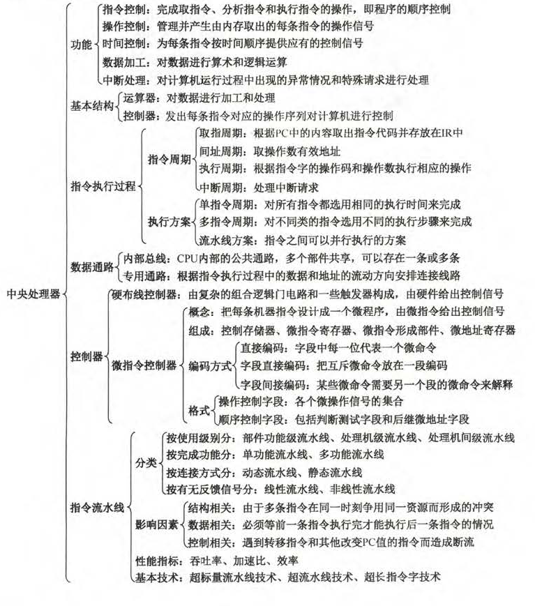
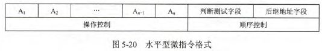
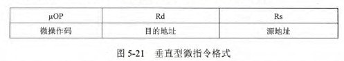
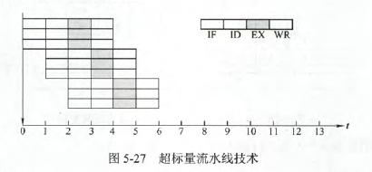
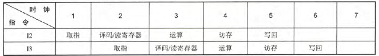

# 5.1CPU的功能和基本结构

1.下列寄存器中，汇编程序员可见的是(B)

- A.存储器地址寄存器(MAR)
- B.程序计数器(PC)
- C.存储器数据寄存器(MDR)
- D.指令寄存器(IR)

【分析】汇编程序员可见的是通用寄存器组，程序状态寄存器(标志寄存器)和程序计数器。

7.在所谓的n位CPU中，n是指(B)

- A.地址总线线数
- B.数据总线线数
- C.控制总线线数
- D.I/O线数

【解析】数据总线的位数与处理器的位数相同，它表示CPU一次能处理的数据的位数，即CPU的位数。一般来说与机器字长一致，也是寄存器的位数。

|概念|含义|
|-----|-----|
|MAR|存放访存地址|
|MDR|暂存要从存储器中读或写的信息|
|地址码长度|存储器地址的二进制位数|
|存储字长|存放一个存储单元中的二进制的位数|
|指令字长|一条指令的二进制位数|
|机器字长(计算机的位数)|计算机一次能处理的二进制位数，数据总线宽度，一般等于寄存器位数|
|操作系统位数|操作系统可寻址的位数|

22.间址周期结束时，CPU内寄存器MDR中的内容为(B)

- A.指令
- B.操作数地址
- C.操作数
- D.无法确定

【解析】间址周期，取得是操作数有效地址。

# 5.2指令执行过程

4.采用DMA方式传递数据时，每传送一个数据就要占用(存取周期)

【解析】CPU从主存中每取出并执行一条指令所需的全部时间称为指令周期，机器周期小于指令周期；时钟周期通常称为节拍或T周期，它是CPU操作的最基本单位；CPU周期也称机器周期，一个机器周期包含若干时钟周期(在指令字长等于存储字长的时候，机器周期通常等于取指周期)(在计算机中，为了便于管理，常把一条指令的执行过程划分为若干个阶段，每一阶段完成一项工作。例如，取指令、存储器读、存储器写等，这每一项工作称为一个基本操作。完成一个基本操作所需要的时间称为机器周期.)；存取周期是指存储器进行两次独立的存储器操作(连续两次读或写操作)所需的最小时间间隔。

8.在取指操作后，程序计数器中存放的是(D)

- A.当前指令的地址
- B.程序中指令的数量
- C.已执行的指令数量
- D.下一条指令的地址

【解析】==在指令周期的取指阶段，PC+1==

10.指令周期由一个到几个机器周期组成，第一个机器周期是(A)

- A.从主存中取出指令字
- B.从主存中取出指令操作码
- C.从主存中取出指令地址码  
- D.从主存中取出指令的地址

【解析】指令周期分为：取指周期、间址周期、执行周期、中断周期。取指周期就是根据PC将主存中的指令字取出，放入IR中。

17.(A)可区分存储单元中存放的是指令还是数据。

- A.控制器
- B.运算器
- C.存储器
- D.数据通路

【解析】在控制器的控制下，计算机在不同阶段对存储进行读写操作时，去除的代码也就有不同的作用。即在取指阶段读出的就是指令，执行阶段读出的就可能是数据

18.下列说法正确的是(B,C)

- A.指令字长等于机器字长的前提下，取指周期等于机器周期
- B.指令字长等于存储字长的前提下，取指周期等于机器周期
- C.指令字长和机器字长的长度没有任何关系
- D.为了硬件设计方便，指令字长和存储字长一样大

【解析】指令字长一般取存储字长的整数倍，若指令字长为存储字长两倍，需要访存两次，即两次机器周期。指令字长等于存储字长的前提下，取指周期等于机器周期。**指令字长取决于操作码的长度、操作数地址的长度和操作数地址的个数，与机器字长没有必然联系。(机器字长见上)**但为了硬件设计方便，指令字长一般取字节或存储字长的整数倍。

# 5.3数据通路的功能和基本结构

1.下列步属于CPU数据通路结构的是(C)

- A.单总线结构
- B.多总线结构
- C.部件内总线结构
- D.专用数据通路结构

【解析】ABD就是CPU数据通路的所有结构

3.采用CPU内部总线方式的数据通路的特点是：结构简单，容易实现，性能较低，存在较多的冲突现象。不采用CPU内部总线房虎成的数据通路的特点是：结构复杂，硬件量大，不易实现，性能高，基本不存在数据冲突现象。

4.CPU读/写控制信号的作用是:

- A.决定数据总线上的的数据流方向
- B.控制存储器操作的读/写类型
- C.控制流入、流出存储器信息的方向

# 5.4控制器的功能和工作原理

2.取指操作是控制器国有的功能，不需要再操作码控制下进行。

9.硬布线控制器与微程序控制器相比，微程序控制器的时序系统比较简单

10.在微程序控制器中， 控制部件向执行部件发出的某个控制信号称为(D)

- A.微程序
- B.微指令
- C.微操作
- D.微命令

【解析】控制部件向执行部件发出的控制信号称为微命令，微命令执行的操作称为微操作。微指令则是若干微命令的集合，若干微指令的有序集合称为微程序。

12.微指令格式分为水平型和垂直型，水平型微指令的位数(较多)，用它编写的微程序(较短)

【解析】水平型微指令定义并执行集中并行的基本操作，垂直型微指令采用类似机器指令操作码的方式。

14.某计算机的控制器采用微程序控制方式，为指令中的操作控制字段采用字段直接编码法，共有33个微指令，构成5个互斥类，分别包含7、3、12、5和6个微命令，则操作控制字段至少有(15位)

【解析】字段直接编码法将微命令字段分成若干小字段，互斥性微指令组合在同一字段中，相容性微指令分别在不同字段中。所以7个需要3位，以此类推，32433共15位。

15.某计算机采用微程序控制器，共有32条指令，公共的取指令微程序包含2条微指令，各指令对应的微程序平均由4条微指令组成，采用断定法(下地址字段法)确定下条微指令地址，则微指令中下地址字段的位数至少是(8)

【解析】计算机共有32条指令，各个指令对应的微程序平均为4条，则指令对应的微指令为128条，还有两条公共微指令，故130条，所以至少8位。

16.某带中断的计算机指令系统共有101种操作，采用微程序控制方式时，控制存储器中相应最少有(103)各微程序。

【解析】若指令系统中具有n种机器指令，则控制存储器中的微程序数至少是n+2个(增加1个位公共的取指微程序，1个为对应中断周期的微程序)

17.兼容性微命令指几个微命令(可以同时出现)

18.在微程序控制方式中，下列说法正确的是(B,D)

- A.采用微程序控制器的处理器称为微处理器
- B.每条机器指令由一段微程序来解释执行
- C.在微指令的编码中，效率最低的是直接编码方式
- D.水平型微指令能充分利用数据通路的并行结构

【解析】微处理器是相对于一些大型处理器而言的，微程序控制器则是相对于CPU的控制器而言的。“效率”可以理解为编码的效率和执行的效率，前者直接编码方式效率低，后者效率高。

20.通常情况下，一个微程序的周期对应一个(指令周期)

【解析】一条微指令包含一组实现一定操作功能的微命令。许多微指令组成的序列构成微程序，微程序则完成对应指令的解释执行。在采用微程序控制的CPU中，一条指令对应一个微程序，一个微程序由许多微指令构成，一条微指令会发出很多不同的微命令。

21.下列关于主存储器(MM)和控制存储器(CS)的叙述中，错误的是(B)

- A.MM在CPU外，CS在CPU内
- B.MM按地址访问，CS按内容访问
- C.MM存储指令和数据，CS存储微指令
- D.MM用RAM和ROM实现，CS用ROM实现

【解析】CS按照微程序的地址访问。

22.控制部件包括

- 指令寄存器
- 操作控制器
- 程序计数器

22.执行部件包括

- 存储器
- 运算器
- 外围设备

# 5.5指令流水线

4.下列关于超标量流水线的描述中，不正确的是(D)

- A.在一个时钟周期内一条流水线可执行一条以上的指令
- B.一条指令分为多段指令由不同电路单元完成
- C.超标量通过内置多条流水线来同时执行多个处理器，其实质是以空间换取时间
- D.超标量流水线是指运算操作并行

【解析】B所有流水线都要这样做。C超标量要配置多个处理器，拿资源(空间)换时间。D超标量所有操作都明星

5.下列关于超标量流水线特征的叙述中，正确的是(B,C)

- A.能缩短流水线功能段的处理时间
- B.能在一个时钟周期内同时发射多条命令
- C.能结合动态调整技术提高指令执行并行性

【解析】A错误，图如上，并没有缩短每段时间，只是增加并行性。B正确，如图。C，通过编译优化，即动态调整提高指令执行并行性

13.在无转发机制的五段基本流水线(取指、译码/读寄存器、运算、访写回寄存器)中，下列指令序列存在数据冒险的指令对是(B)

- $I_1$:add R1,R2,R3;(R2)+(R3)->R1
- $I_2$:add R5,R2,R4;(R2)+(R4)->R5
- $I_3$:add R4,R5,R3;(R5)+(R3)->R4
- $I_4$:add R5,R2,R6;(R2)+(R6)->R5

- A.$I_1$和$I_2$
- B.$I_2$和$I_3$
- C.$I_2$和$I_4$
- D.$I_3$和$I_4$

【解析】数据冲突：后续指令用到相关数据。$I_1$中，写入的R1没有指令用到。$I_2$中，R5会立即在$I_3$中用到，所以产生冲突。

14.下列关于指令流水线数据通路的叙述中，错误的是(A)

- A.包含生成控制信号的控制部件
- B.包含算术逻辑运算部件
- C.包含通用寄存器组和取指部件
- D.由组合逻辑电路和时序逻辑电路组合而成

【解析】五阶段流水线可以分为取指IF、译码/取数ID、执行EXC、存储器读MEM、写回Write Back。数字系统中，各个子系统通过数据总线连接形成的数据传送路径称为数据通路，包括程序计数器、算数逻辑运算部件、通用寄存器组、取指部件等，不包括控制部件

17.关于流水线技术的说法中，错误的是(B)

- A.超标连技术需要配置多个功能部件和指令译码电路等
- B.与超标量技术和超流水线技术相比，超长指令字技术对优化编译器要求更高，与其他硬件无关
- C.流水线按序流动时，在RAW,WAR和WAW中，只可能出现RAW相关
- D.超流水线技术相当于将流水线再分段，从而提高每个周期内功能部件的使用次数

【解析】超长指令字技术对Cache需求更大。B错。

