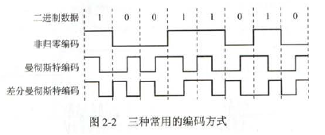
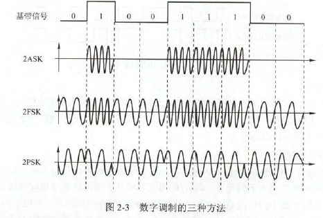
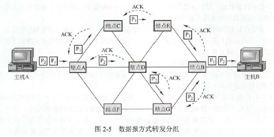
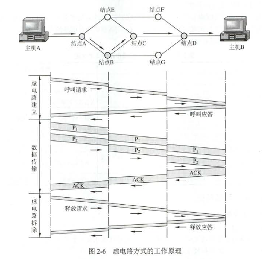

# 通信基础

### 基本概念

### 基本概念

数据是指传送信息的实体。信号是指数据的电气或电磁表现。

信源、信道与信宿：信源是产生和发送数据的源头。信道与电路并部等同，信道是信号的传输媒介。信道上传送的信号有基带信号和宽带信号之分。**基带信号在数字信道上传输(称为基带传输)；宽带信号在模拟信道上传输(称为宽带传输)**。

- 通信模式：单工通信，半双工通信和全双工通信。其中半双工通信与全双工通信都需要两条信道。
- 数据传输方式：串行传输，并行传输。串行适合远距离，并行适合短距离。
- 通信方式：同步通信，异步通信。同步通信：接收端和发送端的时钟频率相等。异步通信：发送数据以字节为单位。对每一个字节增加一个起始bit和终止bit，共10位。同步通信技术较复杂，价格昂贵，但通信效率高；异步通信开销较大，价格低廉，使用具有一般精度的时钟来进行数据通信。

速率、波特与带宽：速率也称数据率，指的是数据的传输速率，表示单位时间内传输的数据量。可分为码元传输速率和信息传输速率。码元传输速率（波特率，单位是波特）：单位时间内数字通信系统所传输的码元个数（脉冲个数或者信号变化的次数）。这里的码元可以是多进制的，也可以是二进制的，但码元速率与进制数无关。信息传输速率：比特率，b/s.

### 奈奎斯定理与香浓定理(相当重要！！！！！！！！！)

##### 奈奎斯定理

是在理想低通(没有噪声、带宽有限)的信道中，极限码元传输率为2W波特，其中W是理想低通信道的带宽（老带宽定义，例如，某通信线路允许通过的最低频率为300Hz，最高为3400Hz，则该通信线路带宽是3100Hz），单位为Hz。若用V表示每个码元离散电平的数目(码元的离散电平数目是指有多少种不同的码元，比如有16种不同的码元，则需要4位二进制，因此数据传输率是码元传输率的4倍)，则极限数据传输率为$理想低通信道下的极限数据传输率=2Wlog_2V(b/s)$.相当重要！！！

奈氏准则，可以得出以下结论：

- 在任何信道中，码元传输的速率（采样频率）是有上限的。其实数据传输率理论上来说是没有上限的，因为一个码元能携带二进制数越多，数据传输率越高
- 信道的频带越宽，就可用更高的速率进行码元的有效传输。

##### 香浓定理

香浓定理定义为$信道的极限数据传输率=Wlog_2(1+S/N)(b/s)$,W为信道的带宽，S为信道所传输的信号平均功率，N为信道内部的高斯噪声功率。S/N为信噪比，$信噪比=10log_{10}(S/N)$,如S/N=10时，信噪比为10dB，当S/N=1000时，信噪比为30dB。

香农定理可以得出以下结论：

- 要使信道上信息的极限传输速率提高，就要提高信噪比。信道上的信噪比固定，传输速率就固定。
- 只要信息的传输速率低于信道极限传输速率，就一定能找到某种方法来实现无差别的传输。
- 实际信道得传输速率要比极限速率低不少。

### 编码与调制

把数据变换为模拟信号的过程称为调制，把数据变换为数字信号的过程称为编码。

- 数字数据编码为数字信号：数字数据编码用于基带传输中，即在基本不改变数字数据信号频率的情况下，直接传输数字信号。主要有三种方式
  - 非归零编码：用两个电压代表两个二进制数字。没有检错能力，也无法判断一个码元的开始和结束
  - 曼彻斯特编码：前一个间隔为高电平而后一个间隔为低电平表示码元1；码元0的表示方法则正好相反。在每个码元的中间出现电平跳变，位中间的跳变既作为时钟信号(可用于同步)，又作为数据信号，但它所占的频带宽度是原始基带宽度的两倍。**以太网使用的编码方式就是曼彻斯特编码**
  - 差分曼彻斯特编码：**差分曼彻斯特编码常用于局域网传输**。规则是若码元位1，则前半个码元的电平与上一码元的后半个码元的电平相同。特点是：每个码元的中间都有一次电平的跳转，可以实现自同步。
  - 4B/5B编码：将欲发送数据流的每4位作为一组，然后按照4B/5B编码规则将其转换成对应的5位码。5位码16种作为不同的4位码，其他的16种作为控制码或保留。将四位转成五位。

- 数字数据调制为模拟信号：发送端将数字信号改为模拟信号，在接收端将模拟信号转换为数字信号。称为调制和解调过程。
  - 幅移键控(ASK):通过改变载波信号的振幅来表示数字信号1和0
  - 频移键控(FSK):通过改变载波信号的频率来表示数字信号1和0
  - 相移键控(PSK):通过改变载波信号的相位来表示数字信号1和0
  - 正交振幅调制(QAM):在频率相同的前提下，将ASK与PSK结合起来。

- 模拟数据编码为数字信号：对音频信号进行编码的脉码调制。主要包括三个步骤，即采样、量化和编码。采样频率$f_{采样}$必须大于等于最大频率$f$的两倍（奈奎斯定理）。
  - 采用是对模拟信号进行周期性扫描，把时间上连续的信号变成时间上离散的信号。当采样的频率大于等于模拟数据的频带带宽的两倍时，所得的离散信号可以无失真地代表倍采样的模拟数据。
  - 量化是采用取得的电平幅值按照一定的分及标度转化为对应的数字值并取整数，这样就把连续的电平幅值转换为了离散的数字量。采用和量化的实质就是分割和转换。
  - 编码是把量化的结构转换为与之对应的二进制编码。
- 模拟数据调制为模拟信号：这种调制方式还可以使用频分复用技术，充分利用带宽资源。电话机和本地局交换机采用模拟信号传输模拟数据的编码方法；模拟的声音数据是加载到载波信号中传输的。

### 电路交换、报文交换与分组交换

- 电路交换：两点之间必须先建立一条专用的物理通信路径，该路径可能经过很多中间结点。分为三阶段：建立连接、数据传输和连接释放。在数据传输的过程中，用户始终占用端到端的固定传输带宽。电路建立后，除源结点和目的结点外，电路上任何结点都采取“直通方式”接收数据和发送数据，不会存储转发
- 报文交换：数据交换的单位是报文。报文交换对报文的大小没有限制，这就要求网络结点需要较大的缓存空间。
- 分组交换：限制了每次传送的数据块的大小的上限，把大的数据块划分为合理的小数据块，再加上一些必要的控制信息，构成分组。缺点：存在传输延迟，需要传输额外的信息量(每个分组都要带源地址，目的地址分组编号等)。

要传送的数据量很大且其传送时间远大于呼叫时间时，采用电路交换。端到端的通路由多段链路组成时，采用分组交换传送数据较为合适。从提高整个网络的信道利用率上看，报文交换和分组交换优于电路交换，其中分组交换比报文交换时延小，尤其适用于计算机之间的突发式数据通信。

### 数据报与虚电路

分组交换进一步分为面向连接的虚电路防方式和无连接的数据报方式，这两种方式由网络层提供。

- 数据报：将上层报文拆成若干带有序号的数据单元，并在网络层加上地址等控制信息后形成数据报分组(网络层PDU)。不同分组可以走不同路径，也可以按不同顺序到达目的地。是不可靠传输

- 虚电路：数据报方式与电路交换方式结合起来。在分组发送之前，要求在发送方和接收方建立一条逻辑上相连的虚电路，并且连接一旦建立，就固定了虚电路所对应的物理路径。通信过程分为三个阶段：虚电路建立、数据传输与虚电路释放。对交互式应用和小量的短分组情况浪费，但对长时间、频繁的数据交换效率较高。有个致命缺点，即当网络中的某个结点或某条链路出现故障而彻底失效时，所经过该结点的虚电路将遭到破坏。分组首部不含目的地址，包含虚电路标识符(足够了)，每个结点到其他结点之间的链路可能同时有若干虚电路通过。

数据报与虚电路的比较

||数据报服务|虚电路服务|
|-----|-----|-----|
|连接的建立|不需要|必须有|
|目的地址|每个分组都有完整的目的地址|仅在建立连接阶段使用，之后每个分组使用长度较短的虚电路号|
|路由选择|每个分组独立地进行路由选择和转发|属于同一条虚电路地分组按照同一路由转发|
|分组顺序|不保证分组地有序到达|保证分组地有序到达|
|可靠性|不保证可靠通信，可靠性由用户主机来保证|可靠性由网络保证|
|对网络故障的适应性|出故障的结点丢失分组，其他分组路由选择发生变化时可以正常传输|所有经过故障结点的虚电路均不能正常工作|
|差错处理与流量控制|由用户主机进行流量控制，不保证数据报的可靠性|可由分组交换网负责，也可由用户主机负责|

# 传输介质

### 双绞线、同轴电缆、光纤与无线传输介质

- 双绞线：无屏蔽层的双绞线称为非屏蔽双绞线(UTP)。有屏蔽层的称为屏蔽双绞线(STP)，屏蔽双绞线进一步提高抗电磁干扰能力。双绞线的带宽取决于铜线的粗细和传输的距离。模拟传输和数字传输都能用双绞线。距离太远时，对于模拟传输用放大器放大信号，数字传输用中继器。
- 同轴电缆：$50\Omega$同轴电缆主要用于传送数字基带信号，又称基带同轴电缆，在局域网中广泛使用，$75\omega$同轴电缆主要用于传送宽带信号，又称宽带同轴电缆，主要用于有线电视系统。
- 光纤：带宽范围极大。分为单模光纤和多模光纤。单模不会产生多次反射，而多模光纤通过不同入射角，多次反射，传输更多。单模适合远距离
- 无线传输介质
  - 无线电波：具有较强的穿透能力，可以传输很长的距离。如无限手机通信、计算机网络中的无线局域网
  - 微博、红外线和激光：高带宽的三种主要方式，很强的方向性，都沿直线传播。频段范围也很广。

### 物理接口的特征

物理层考虑的是如何在连接到各台计算机的传输媒体上传输数据比特流，而不指具体的传输媒体。

- 机械特性：规格，引线数目，引脚数量等
- 电气特性：传输二进制时，线路上信号的电压高低、阻抗匹配、传输速率和距离限制等
- 功能特性：某一电平的电压表示何种意义，接口部件的信号线的用途等
- 规程特性：主要定义各条物理线路的工作规程和时序关系

# 物理层设备

### 中继器

是局域网环境下用来扩大网络规模的最简单、最廉价的互联设备。中继器连接的几个网段仍是局域网。互相串联的中继器不能超过4个。放大器是放大模拟信号，而中继器是再生数字信号

### 集线器

hub是多端口的中继器，工作在物理层。它在网络中只起信号放大和转发作用，目的是扩大网络的传输范围，而不具备信号的定向传送能力，即信号传输的方向是固定的，是一个标准的共享式设备。

它们都不能分割冲突域，用在共享式局域网中，现在基本不用了。