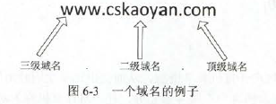
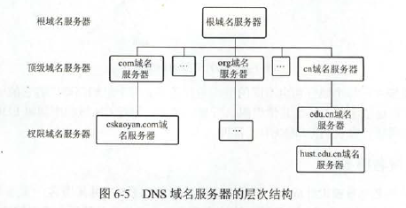
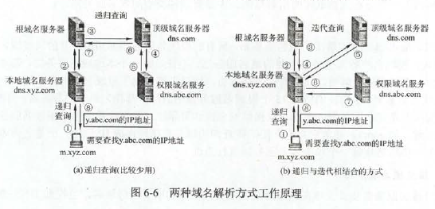
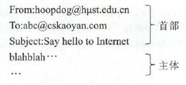
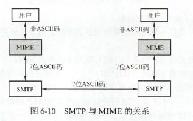

# 网络应用模型

### 客户/服务器模型

有一个总打开的主机-服务器，客户程序必须知道服务器地址，服务器不必知道主机地址。

特点

- 网络中各个计算机的地位不平等，服务器可以对用户限制权限
- 整个网络的管理工作由少量的服务器来承担
- 可扩展性不佳

### P2P模型

每个结点都具有上传下载的功能。

特点

- 繁重的计算机任务可以被分配到各个节点上
- 可扩展性好
- 网络更加健壮，不存在中心节点失效的问题

# 域名系统

DNS运行在UDP之上，采用53接口。可分为三部分：层次域名空间、域名服务器、解析器

### 层次域名空间

分为顶级、二级、三级等。

域名中的标号需注意：

- 英文不区分大小写
- 除-外不能出现其他符号
- 每个标号不能超过63个字符，完整域名不能超过255个字符
- 低级域名最左边，高级最右面

顶级域名三大类：

- 国家顶级域名：.cn表示中国，.us美国，.uk英国
- 通用顶级域名：.com公司，.net网络服务机构，.org非营利性组织，.gov美国政府部门
- 基础结构域名：这种顶级域名只有一个，只有arpa，用于反向域名解析

### 域名服务器

采用CS模式。主要有4类域名服务器

- 根域名服务器：最高层次的域名服务器，**所有的根域名服务器都知道所有的顶级域名服务器的IP地址**。本地域名服务器无法解析，就首先求助于根域名服务器。共13个根域名服务器，是冗余的。根域名服务器用来管理顶级域(如.com)，**通常它并不直接把待查询的域名直接转换成IP地址，而是告诉本地域名服务器下一步应当找哪个顶级域名服务器进行查询**
- 顶级域名服务器：管辖在该顶级域名服务器注册的所有二级域名。收到DNS请求时，结果可能是最终结果，也可能是下一步应当查找的域名服务器的IP。
- 授权域名服务器(权限域名服务器)：每台主机都必须在授权服务器处登记。许多域名服务器都同时充当授权和本地域名服务器。**授权域名服务器总能将其管辖的主机名转换为该主机的IP地址。**(终于有个办事的)
- 本地域名服务器：当一台主机发出DNS查询时，这个查询请求就先发送给该主机的本地域名服务器。

### 域名解析过程

域名->IP正向解析，否则反向解析。

有两种方式：递归查询和递归与迭代相结合查询。

1.主机向本地域名服务器的查询采用递归查询

主机向本地域名服务器没查到，则本地域名服务器就变成客户端，向根域名服务器去查。然后就如图(a)，进行递归查询。本地域名服务器得到根域名服务器告诉的IP地址，然后告诉主机。

2.本地域名服务器向根域名服务器的查询采用迭代查询

当根域名服务器收到本地域名服务器发出的迭代查询请求报文时，要么给出IP，**要么告诉本地域名服务器下一步向哪个顶级域名服务器进行查询。**，就是根域名服务器不管了。

具体步骤如下：

- 主机向本地域名服务器查询abc.com
- 本地域名服务器收到后，查缓存，若没有，则以DNS客户的身份向根域名服务器发出解析请求
- 根域名服务器收到后，判断属于.com域，将对应的顶级域名服务器dns.com的IP地址给本地域名服务器
- 本地域名服务器向顶级域名服务器dns.com发请求
- 顶级域名服务器判断属于abc.com域，将授权域名服务器dns.abc.com的IP地址返回给本地域名服务器
- 本地域名服务器向授权域名服务器dns.abc.com发请求
- 授权域名服务器将IP返回给本地域名服务器
- 本地域名服务器将结果保存到本地缓存，并发给主机

域名服务器广泛使用高速缓存。一个DNS服务器收到查询结果时，将其保存到缓存中，以便下次使用。由于主机名和IP之间的映射不是永久的，所以DNS服务器在一段时间后丢弃高速缓存中的信息。

# 文件传输协议(FTP)

CS模式，使用TCP

控制连接(21)和数据连接(20).服务端监听21端口。数据连接服务端是20端口，客户端不一定。控制信息都已7位ASCII码传送。使用FTP时，若要修改服务器上的文件，则需要将次文件传送到本地主机，然后再将修改后的文件副本传送到原服务器。

# 电子邮件

### 电子邮件系统的组成结构

主要有三部分：用户代理、邮件服务器和电子邮件使用协议，如SMTP、POP3.

- 用户代理：用户与电子邮件系统的接口。
- 邮件服务器：接收和发送邮件，向发件人报告邮件传送的情况。采用CS模式，能同时充当客户端和服务器。
- 邮件发送协议和读取协议：发送协议用于用户代理向邮件服务器发送邮件或在邮件服务器之间发送，通常使用SMTP；读取协议用于用户代理从邮件服务器读取邮件，若POP3.

### 电子邮件格式与MIME

- 格式：分为首部与主体。每个首部行是关键字：值的格式，如To:和Subject:。To必须。

- 多用途网际邮件扩充MIME：SMTP只能发送一定长度的ASCII码。MIME并未改动SMTP或取代它，只是增加了邮件主题的结构，并定义了传送非ASCII码的编码规则。（用户正常发送邮件，可以发送非ASCII码，通过MIME协议将非ASCII码编码为ASCII码，然后通过SMTP传送）

### SMTP和POP3

- SMTP：可靠且有效，控制两个相互通信的SMTP进程交换信息。使用CS模式。用TCP连接，端口25。通信三阶段
  - 连接建立：发件人邮件发送到发送方邮件服务器邮件缓存后，SMTP客户端就每隔一定时间对邮件缓存扫描一次。若有新邮件，就使用25端口与接受方邮件服务器SMTP服务器建立TCP连接，接收方SMTP服务器发出220 Serivce ready.SMTP客户向SMTP服务器发送HELO命令，附上发送方的主机名。**不使用中间服务器，不管多远，TCP总是在发送方和接收方服务器之间创建连接**
  - 邮件传送：若SMTP服务器准备接受，发250 OK。SMTP客户端发送一个或多个RCPT命令。作用是先弄清接收方系统是否已做好接收准备，然后才发邮件
  - 连接释放：发完后，客户端发送QUIT命令
- POP3：邮局协议，采用“拉”的通信方式，用户主动向服务器发出度邮件请求。在传输层使用TCP，端口号是110.

### 万维网(WWW)

### WWW的概念与组成结构

是一个资料空间，一样有用的事物称为资源，并由URL标识。

内核部分的三个标准：URL，HTTP，HTML

URL格式：<协议>://<主机>:<端口>/<路径>

### 超文本传输协议(HTTP)

TCP 80端口。

过程：

- 浏览器分析连接所指向页面的URL(http://www.tinghua.edu.cn/chn/index.htm)
- 浏览器向DNS请求解析www.tsinghuw.edu.cn的IP
- DNS解析成功
- 浏览器与服务器建立TCP连接，80端口
- 浏览器发出HTTP请求，GET /chn/index.htm
- 服务器通过HTTP相应把文件index.htm发给浏览器
- TCP连接释放
- 浏览器显示

HTTP特点：

- 无状态，使服务器容易支持大量并发请求
- 无连接。
- 既可以用非持久连接，也可以用持久连接(HTTP/1.1).持久连接分为非流水线和流水线，默认流水线。非流水线的话用户收到响应后才能发下一个请求。

HTTP报文结构：

面向文本，每个字段都是一些ASCII码串。

CR和LF分别代表回车和换行

常见应用层协议

|应用程序|FTP数据连接|FTP控制连接|TELNET|SMTP|DNS|TFTP|HTTP|POP3|SNMP|
|-----|-----|-----|-----|-----|-----|-----|-----|-----|-----|
|使用协议|TCP|TCP|TCP|TCP|UDP|UDP|TCP|TCP|UDP|
|熟知端口号|20|21|23|25|53|69|80|110|161|