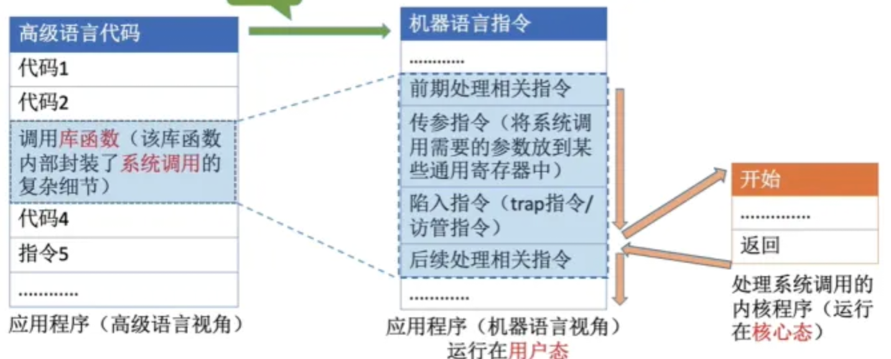

## day1

第一节 操作系统的特征

1. 操作系统的四大特征是什么?

   - 并发
   - 共享
   - 虚拟(实际上没变大，但在感觉上变大了)
   - 异步 (异步是指，在多道程序环境下，允许多个程序并发执行，但由于资源有限，进程的执行不是一贯到底的，而是走走停停，以不可预 知的速度向前推进)

2. 并发性和并行性的区别是什么?(必背)

   - 并发性是指两个或多个活动在同一时间段内发生。
   - 并行性是指两个或多个活动在同一时发生。

3. 操作系统的两大基本特征是什么?

   并发和共享。
   共享是以程序的并发执行为先决条件，若系统不允许程序饿到并发执行，那就不存在共享。

4. 程序的并发性主要体现的两方面是?

   - 用户程序与用户之间
   - 用户程序与操作系统之间

5. 共享有哪两种资源的复用方式?

   - 互斥共享方式(系统中的资源，虽然可以提供给多个进程使用，但一个时间段只允许一个进程访问该资源
   - 同时访问方式 (系统中的资源，允许一个时间段内由多个进程“同时”对它们进行访问)

6. 操作系统利用那两种方式实现虚拟技术?

   时分复用技术和空分复用技术

7. 操作系统的功能是什么?

   - 作为资源的管理者一处理机管理 存储器管理 文件管理 设备管理
   - 向用户提供服务一用户接口(联机命令接口、脱机命令接口、图形命令接口) 程序接口
   - 对硬件机器的扩展一扩充机器

   注意:用户可以通过命令接口和系统调用两种方式来使用计算机。

   程序接口由一组系统调用组成，即操作系统提供给应用程序的接口是系统调用 (2010)

8. 处理器管理的主要功能是什么 (4种)?

   进程控制;进程同步;进程通信;进程调度

9. 存储器管理的主要功能是什么 (4种)?

   内存分配;内存保护;地址映射;内存扩充

10. 文件管理的主要功能是什么 (4种) ?

    文件存储空间管理;目录管理;文件读写管理;文件保护

11. 设备管理的主要功能是什么 (4种)?

    缓冲管理;设备分配;设备处理;虚拟设备

第二节 操作系统的发展

1. 操作系统的发展 (两个阶段两系统)是什么?

   - 手工操作阶段 (此阶段无操作系统)
   - 批处理阶段 (单道批处理系统、多道批处理系统) 中断技术使得多道批处理系统的I/O设备可与 CPU并行工作
   - 分时操作系统 (特征:同时性、交互性、独立性、及时性)
   - 实时操作系统 (硬实时操作系统、软实时操作系统)
     实时操作系统必须在被控制对象规定时间内处理来自外部的事件
     实时操作系统的主要特点是及时性和可靠性 (资源利用率x)
   - 网络操作系统
   - 分布式操作系统 (分布性和并行性)
     要求快速响应用户是导致分时操作系统出现的主要原因
   - 个人计算机操作系统

2. 请从同时性、独立性、及时性、交互性和可靠性方面比较分时系统和实时系统的主要区别。

   - 同时性:两者都具有同时性，分时系统按分时原则为多个终端用户服务，而实时控制系统是对多路的现场信息进行采集以及对多个执行机构进行控制。
   - 独立性:两者都具有独立性，在分时系统中，每个终端用户向系统提出的服务请求是被此独立进行的。而在实时系统控制系统中，信息的采集和控制化是彼比独立进行的。
   - 及时性:分时系统的响应时间是以人能够接受的等待时间为标准，而实时系统对响应时间要求比较严格，它是以控制过程或信息处理中所能接受的延迟为标准。
   - 交互性:分时系统能使用户和系统进行人-机对话，实时系统也具有交互性，但人与系统的交互仅限于访问系统中的某些特定的专用服务程序。
   - 可靠性:实时系统要求系统可靠性要比分时系统高。在实时系统中往往采用多级容错措施，来保证系统的安全及数据的安全。

3. 多道程序系统的主要优点有什么?(2017)

   - CPU的利用率高。在多道程序环境下，多个程序共享计算机资源，当某个程序等待I/O操作时，CPU可以执行其它程序，大大提高了CPU的利用率。
   - I/O设备的利用率高。在多道程序环境下，多个程序共享系统的设备，大大提高了系统设备的利用率。
   - 系统的吞吐量大。在多道程序环境下，减少了程序的等待时间，提高了系统的吞吐量。

4. 什么是批处理系统?单道批处理系统与多道批处理系统的区别? (这是操作系统发展过程中非常重要的阶段)

   批处理是指用户将一批作业提交给操作系统后就不再干预，由操作系统控制它们自动运行。这种采用批量处理作业技术的操作系统称为批处理提作系统。

   批处理操作系统分为单道批处理系统和多道批处理系统。批处理操作系统不具有交互性，它是为了提高CPU的利用率而提出的一种操作系统。

   单道批处理:内存中仅有一个作业运行，程序自动运行，无需干预，磁带上的各个作业按顺序地进入内存，先调入就先完成，可以看成是串行的。

   多道批处理:内存中存放多道程序，当某道程序因某种原因如执行I/O操作时而不能继续运行放弃CPU时，操作系统便调度另一程序运行，这样CPU就尽量忙碌，达到提高系统效率的目的。

## day2

第三节 操作系统运行机制

1. 操作系统的运行机制“两指令、两状态、两程序”是什么?

   - 两种指令:特权指令，非特权指令
   - 两种处理状态: 用户态 (运行用户自编程序);核心态 (运行操作内核程序)
   - 两种程序:内核程序，应用程序

2. 操作系统的内核包含 4方面内容是什么?

   时钟管理;中断机制;原语;系统控制的数据结构及处理

3. 如何处理中断?

   不同的中断信号，需要用不同的中断处理程序来处理。当CPU检测到中断信号后，会根据中断信号的类型查询“中断向量表”，以此来找到相应的中断处理程多在内存中的存放位置.

4. 为什么不能缺少中断机制?

   操作系统的发展过程大体上就是一个想方设法不断提高资源利用率的过程，而提高资源利用率就需要在程序并未使用某种资源时，把它对那种资源的占有权释放，而这一行为就需要通过中断实现。

5. 中断和异常的分类?(必背)5

   - 中断 (外中断)--不可屏蔽中断，可屏蔽中断
   - 异常 (内中断)--故障，自陷，终止

6. 硬件中断响应主要的做三件事?

   - 发现中断源，响应中断请求
   - 保护现场
   - 启动处理中断事件的中断处理程序

7. 系统调用的 5种功能是什么?(必背)

   设备管理; 文件管理;进程控制;进程通信;内存管理

8. 补充用户态转向核心态的例子:(辅导书上的细节)

   - 用户程序要求操作系统的服务，即系统调用。
   - 发生一次中断。
   - 用户程序中产生了一个错误状态。
   - 用户程序中企图执行一条特权指令
   - 从核心态转向用户态由一条指令实现，这条指令也是特权命令，一般是中断返回指令。

   注意:从用户态进入核心态，不仅状态需要切换。而且所用的堆线也可能需要由用户堆找切级为系统堆线，但这个系统堆栈也是属于该进程的。若程序的运行由用户态转到核心态，则会用到访管指令，访管指令是在用户态使用的，所以它不可能是特权指令。核心态到用户态是由操作系统程序执行后完成的，用户态到核心态是由硬件完成的。

9. 访管中断是什么?

   - 用户程序在用户态下要使用特权指令引起的中断.

10. 举例在核心态下执行的指令 (特权指令).(重点)

    - 置时钟指令、广义指令(调用在用户态，执行在核心态)、输出/输入、缺页处理程序、进程调度程序、时钟中断处理程序、关中断指令、I0指令。	

11. 举例在用户态下运行的指令或程序 (非特权指令)(重点)

    - 读时钟指令、取数指令、寄存器清零、命令解释程序、trap指令、跳转指令、压栈指令。
      考试中常见的问题:”不能在用户态执行/只能在内核态执行“，就应该选择选项中的特权指令。

12. 系统调用的作用是什么?个(必背)

    - 系统调用会使处理器从用户态进入核心态
    - 应用程序通过系统调用来请求获得操作系统的服务

13. 系统调用的过程是什么 (4步) ?(必背)

    - 传递系统调用参数
    - 执行陷入指令
    - 执行相应的服务程序
    - 返回用户态

14. 系统调用和库函数的区别是什么?(必背)

    - 系统调用的是系统内核的服务，是操作系统的入口，调用发生在用户空间，开销比较大。 (服务入口开销大)
    - 库函数调用是函数库中的一段程序并在用户空间进行执行，调用开销小。 (函数程序开销小)

15. 外中断处理过程是什么? (了解)

    每条指令执行结束后，CPU检查是否有外部中断信号若有外部中断信号，则需要保护中断进程的 CPU 环境根据中断信号类型转入相应的中断处理程序恢复原进程的 cpu环境并退出中断，返回原进程执行。

16. 什么是上下文切换?(必背)

    - 是指将CPU 资源从一个进程 (线程) 分配到另一个进程 (线程) 的机制.

17. CPU能判断出指令类型，但是它怎么区分此时正在运行的是内核程序还是应用程序? (必背)

    - CPU中有一个寄存器叫程序状态字寄存器，其中有个二进制位，1表示“内核态”，0表示“用户态”.

18. 时钟中断后，由时钟中断服务程序更新的部分内容有什么? (2018) (必背)

    - 内核中时钟变量的值
    - 当前进程占用 CPU的时间
    - 当前进程在时间片内的剩余执行时间

19. 用户态切换到内核态主要有两种原因:(必背)

    - 系统调用
    - 中断/异常

20. 发生中断或异常应该如何处理?(必背)

    - 关中断

    - 保存断点

    - 中断服务程序寻址以

      上三个功能由中断隐指令完成，中断隐指令是硬件，即以上三个步骤是由硬件完成，不是操作系统完成。

    

    - 保存现场和屏蔽字

    - 开中断

    - 执行中断服务程序

    - 关中断

    - 恢复现场和屏蔽字

    - 开中断

    - 中断返回

      以上7个过程由操作系统完成，所以处理中断或异常并非全部由操作系统完成

