# 第2章 进程与线程
## 2.1进程与线程
### 2.1.1 进程的概念和特征

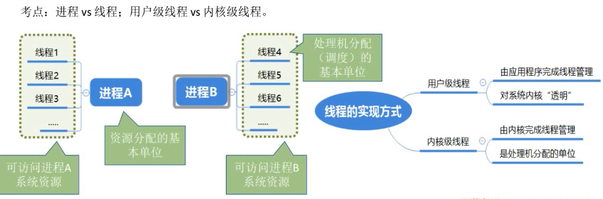

### 2.1.2 进程的状态与转换

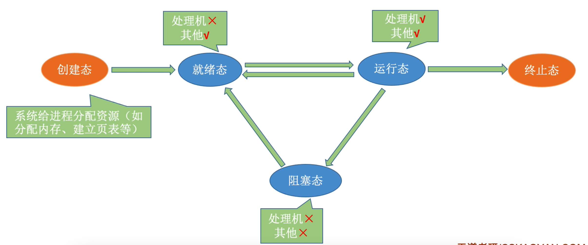

### 2.1.3 进程的组成

> 进程：PCB、程序段、数据段
>
> 数据段：包含的是与程序逻辑本身相关的数据，如全局变量
>
> 程序段：执行的代码数据
>
> PCB：管理控制进程所需的参数一定放在PCB

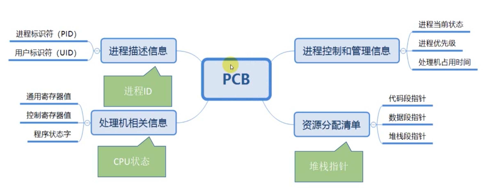

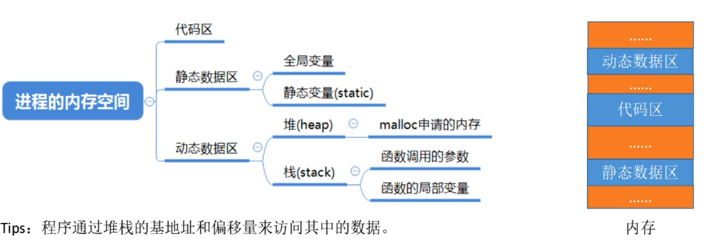

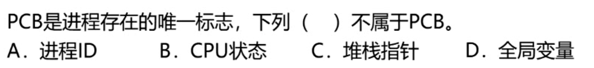

 

答案【D】


### 2.1.4 进程控制

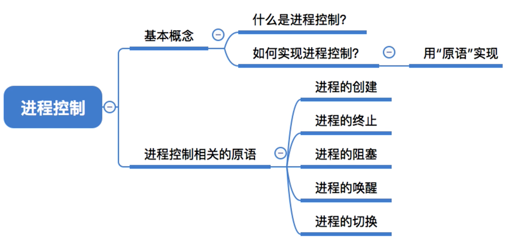


### 2.1.5 进程的通信

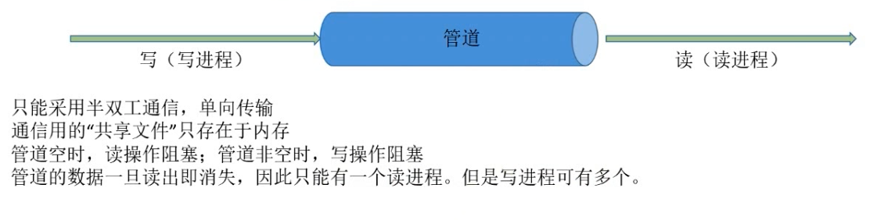

### 2.1.6 线程和多线程模型
## 2.2处理机调度
### 2.2.1 调度的概念

> 对处理机进行分配--就绪队列按照**一定算法**选择一个进程将处理机分配给她

#### 三个层次

- 高级调度 -- 作业调度 -- 频率最低
- 中级调度 -- 内存调度 -- 频率其次
- 低级调度 -- 进程调度 -- 频率最高

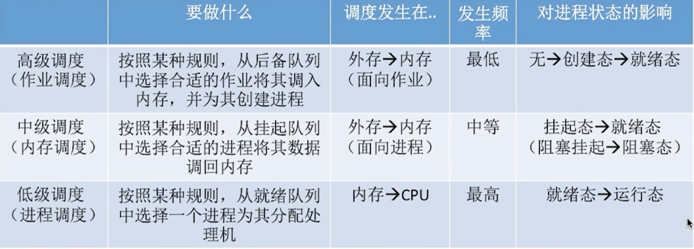


#### 进程的挂起与七状态模型

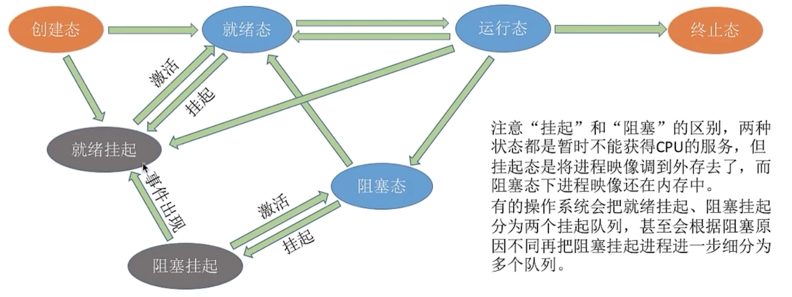


### 2.2.2 调度的目标

#### 评价指标

1. CPU利用率 = 忙碌时间/总时间
2. 系统吞吐量：单位时间内完成作业多数量
   - =总共完成了多少道作业/总共花了多少时间
3. 周转时间：从作业被提交给系统开始到作业完成为止
   - 周转时间=作业完成时间- 作业提交时间
   - 平均周转时间=各作业周转时间之和/作业数
   - **带权周转时间=作业周转时间/作业实际运行时间( >=1)**
   - **平均带权周转时间=各作业带权周转时间之和/作业数**
4. 等待时间：作业/进程处于等待处理机状态时间之和
   - 
5. 响应时间：用户提交请求到首次响应的时间


### 2.2.3 调度的实现

#### 进程调度的时机

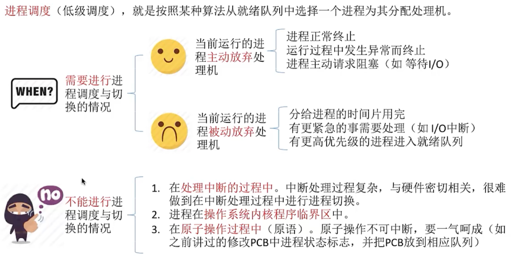


进程在**操作系统内核程序临界区**中**不能**进行调度与切换

> 临界资源：一个时间段内只允许一个进程使用的资源。各进程需要互斥的访问临界资源。
>
> 临界区：访问临界资源的那段代码

> 内核程序临界区一般是用来访问某种内核数据结构的，比如进程的就绪队列。
>
> 普通的临界区--如打印机，可以进行进程调度也切换的。


#### 进程调度方式

- 非剥夺调度方式--非抢占方式
  - 适合早期的批处理系统
- 剥夺调度方式--抢占方式
  - 适合分时、实时操作系统


### 2.2.4 典型的调度算法

> 1. 算法思想
> 2. 算法规则
> 3. 用于作业调度还是进程调度
> 4. 抢占式还是非抢占式
> 5. 优缺点
> 6. 是否会饥饿：某进程/作业长期得不到调用

#### 先来先服务（FCFS）

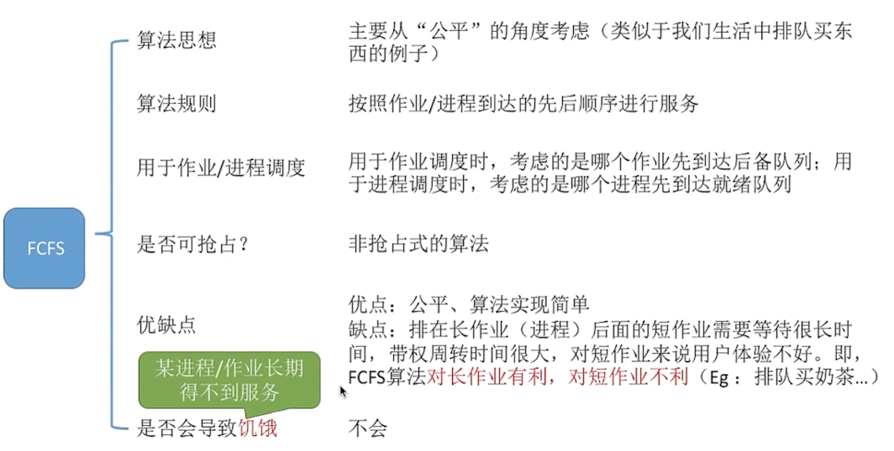

#### 短作业优先（SJF）

> 每次调度时选择**当前已达**到且**运行时间最短**的作业/进程
>
> 

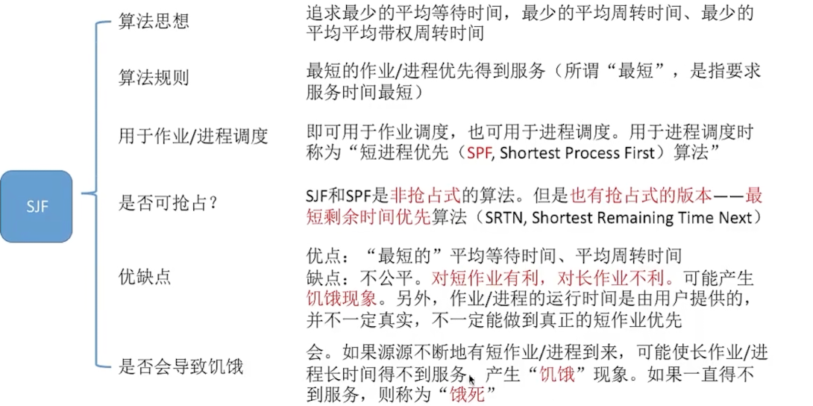

  

#### 高响应比优先（HRRN）

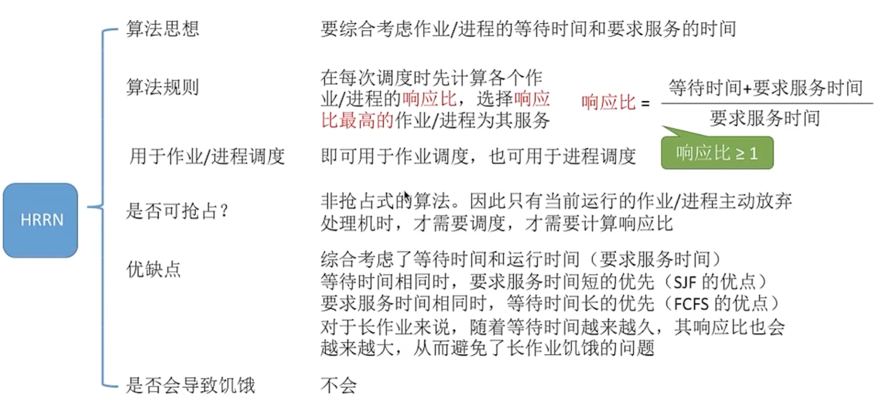


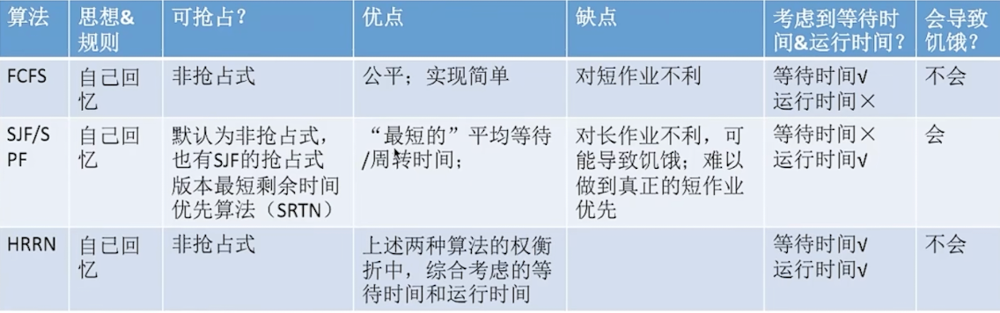


#### 时间片轮转调度算法（RR）

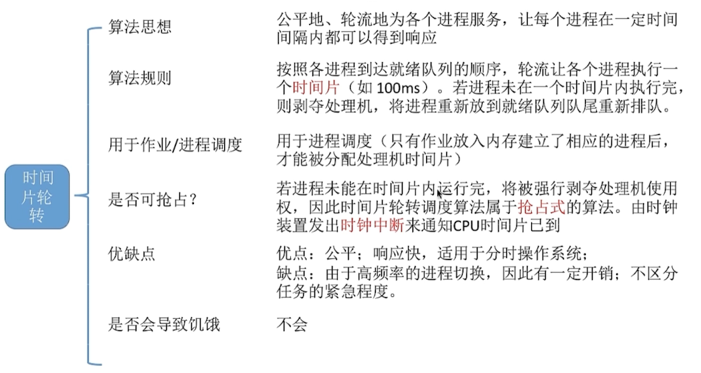

#### 优先级调度算法

> 非抢占式优先级调度算法：每次调度时选择当前已到达且优先级最高的进程。当前进程主动放弃处理机时发生调度。
>
> 抢占式优先级算法：除非抢占式，当就绪队列发生改变时也需要检查是否会发生抢占。
>
> 优先级：静态优先级和动态优先级
>
> 系统进程优先级高于用户进程、前台进程优先级高于后台进程、操作系统更偏好I/O进程

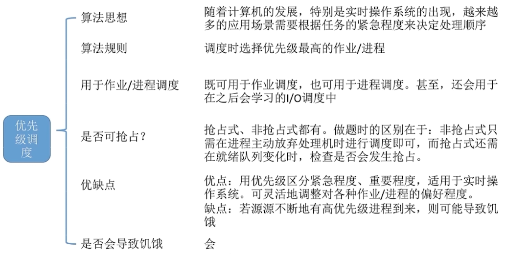


#### 多级反馈队列调度算法

> P2优先级低于P3时，会将抢占CPU，此时P2没有运行完，会返回到第二级队列
>
> 若第三级队列上的进程使用完CPU之后，没有结束会继续排在第3级队列后面

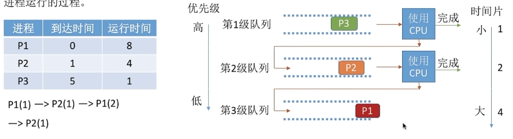

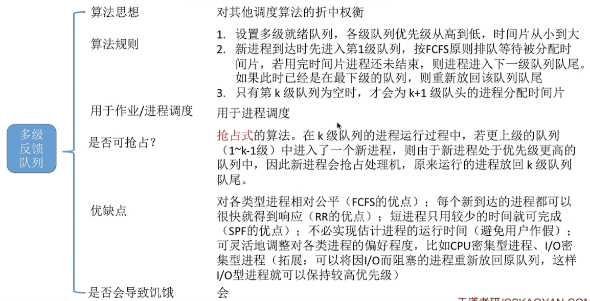

 

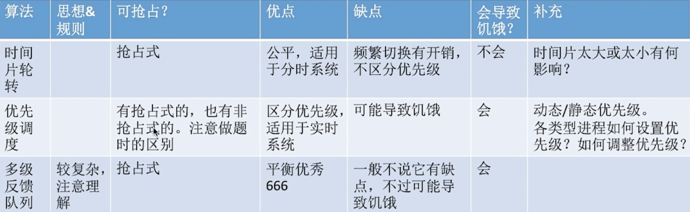


#### 多级队列调度算法

> 多个队列优先级：系统进程>交互式进程>批处理进程
>
> 分配时间50%，40%，10%
>
> 不同队列可以采取不同的调度策略

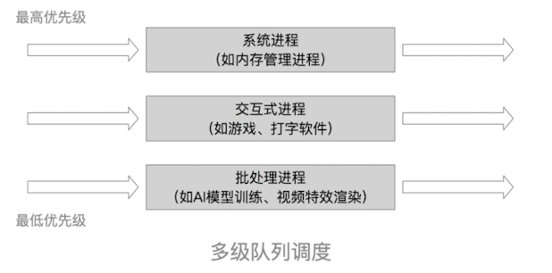


### 2.2.5 进程切换

#### 进程切换与过程

> 1. 保存原来运行的各种数据 数据-->PCB
> 2. 对新的进程各种数据的恢复 PCB --> 数据
>
> 进程切换是有代价的，不可过于频繁。


## 2.3同步与互斥·
### 2.3.1 同步与互斥的基本概念

> 临界资源：一段时间内只允许一个进程使用，进程互斥访问。如物理设备（摄像头、打印机）

同步：进程之间直接合作

互斥：

~~~c
do {
  entry section; //进入区 可进入，则设置正在访问临界资源的标志（“上锁”） 
  critical section; //临界区 访问临界资源的那段代码
  exit section; // 退出去 解除正在访问临界资源的标志（“解锁”）
  remainder section; // 剩余区 其他处理 
} while(true)
  
// 临界区是访问临界资源的代码段
// 进入区和退出区是负责实现互斥的代码段
~~~

原则

- 空闲让进
- 忙则等待
- 有限等待
- 让权等待


### 2.3.2 实现临界区互斥的基本方法

#### 软件实现

> 重要‼️
>
> - 单标志法
> - 双标志先检查
> - 双标志后检查
> - Peterson 算法

- 单标志法
  - 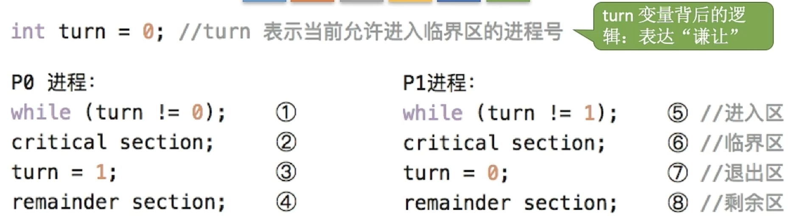
  - 如果P0使用时，一直不访问临界资源，就违背了 空闲让进的原则
- 双标志先检查
  - 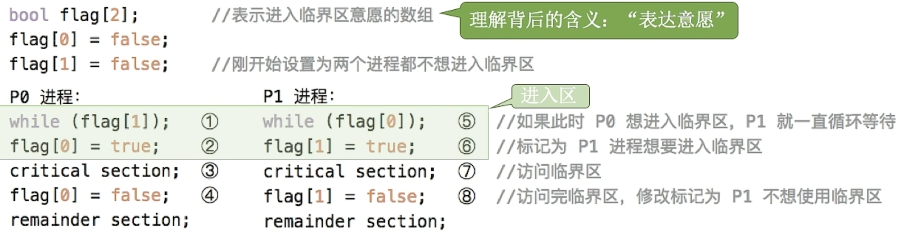
  - 先检查再上锁
  - 当P0使用设置flag为true时，时间片到了，P1此时也会进入访问临界区，违反了忙则等待原则
  - 原因：检查和上锁不是一气呵成
- 双标志后检查
  - 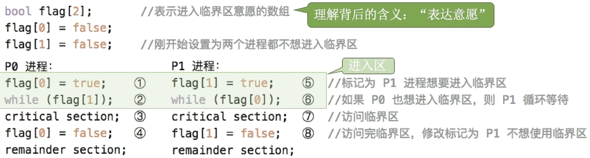
  - 先上锁再访问
  - 进程并发执行时，容易造成两者的flag都是true，违背了空闲让进和有限等待原则
  - 产生饥饿现象
- Peterson
  - 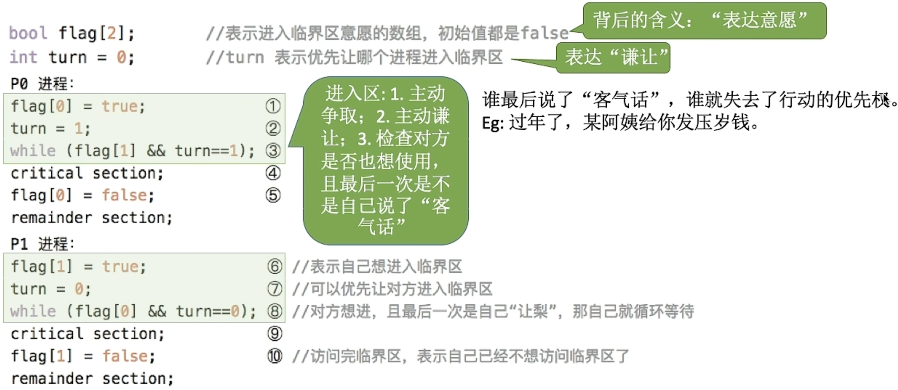
  - 没有遵循让权等待-不满足进入临界资源，但是仍在CPU上运行

#### 硬件实现

> 中断屏蔽方法
>
> TestAndSet(也叫TS指令/TSL指令)
>
> Swap指令(也叫XCHG指令，Exchange指令)

- 中断屏蔽方法
  - 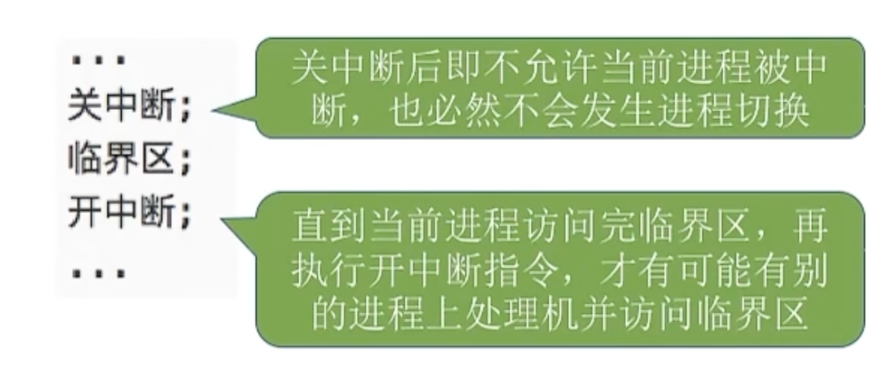
  - 不适合多处理机、不适合用户进程
- TestAndSet
  - 功能是：读出指定标志后把该标志设置为真
  - 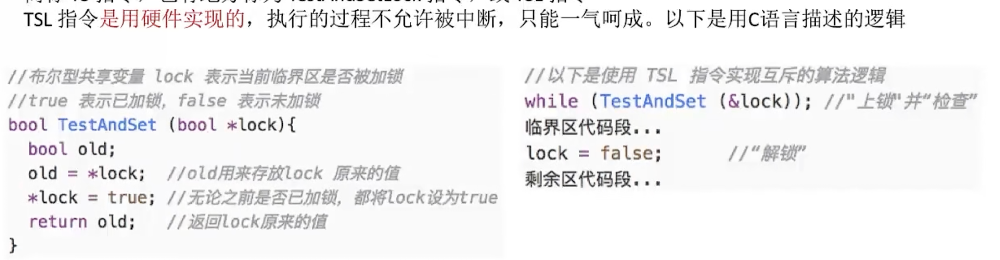
  - 右边代码为执行代码，当进程检测到lock为true时就一直死循环，当另一个进程进程访问完后，就释放临界资源lock=false，然后TS指令检测到之后，给进程跳出while循环执行下面的，并且将lock=true
  - 不满足让权等待

- Swap
  - 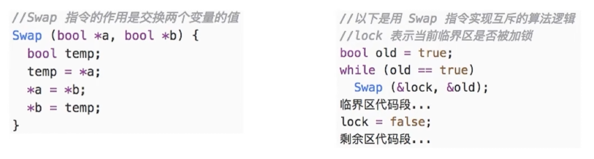
  - 和TS指令逻辑一样，当lock为false时才可以访问临界资源
  - 不满足让权等待


### 2.3.3 互斥锁

mutex lock 也叫自旋锁，acquire()和release()为原子操作

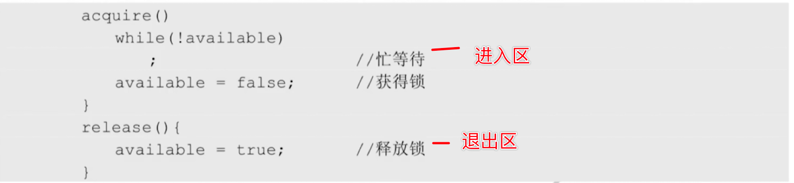

- 需要忙等，违反了让权等待
- 等待期间不切换进程上下文，多处理器系统中，若上锁时间短，则代价很低
- 多处理机中，一个忙等，另一个快速释放临界资源后继续运行，不适合单处理机。


### 2.3.4 信号量

> Dijkstra 提出	
>
> 信号量是一个变量(可以是一个整数也可以是一个更复杂的记录型变量)，可以用一个信号量表示系统中某种资源的数量
>
> 一对原语：wait(S),signal(S) S-函数调用的时候传入的一个参数。
>
> - 简称P，V（荷兰语proberen、verhogen）
> - P(S),V(S)

#### 整型记录量

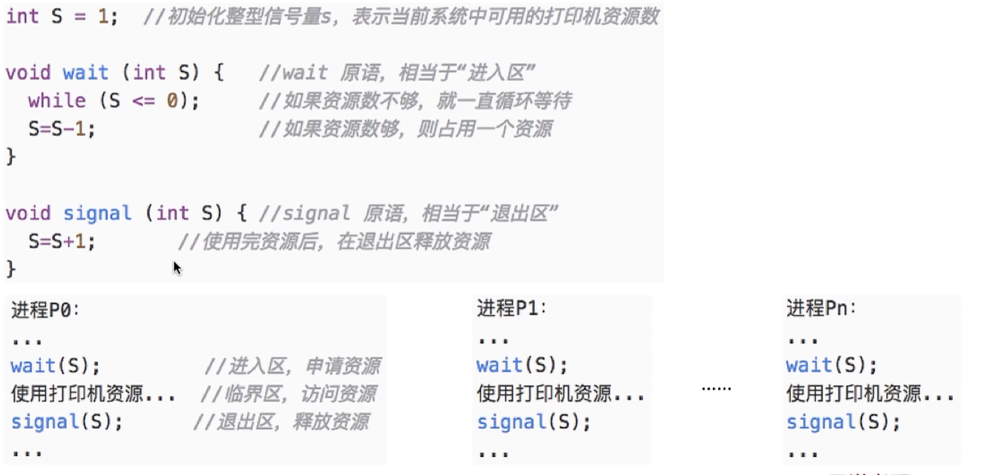

不满足让权等待，会出现忙等


#### 记录型记录量 超级重要‼️

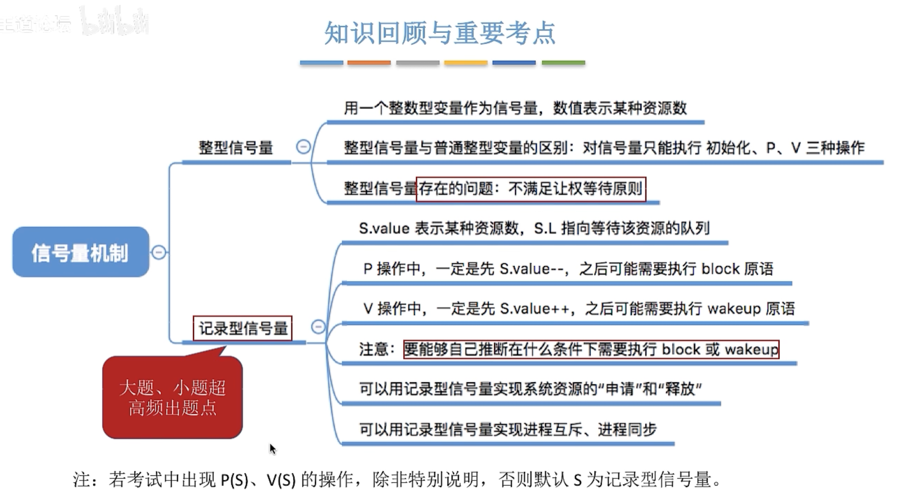


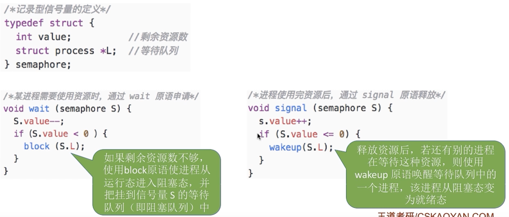

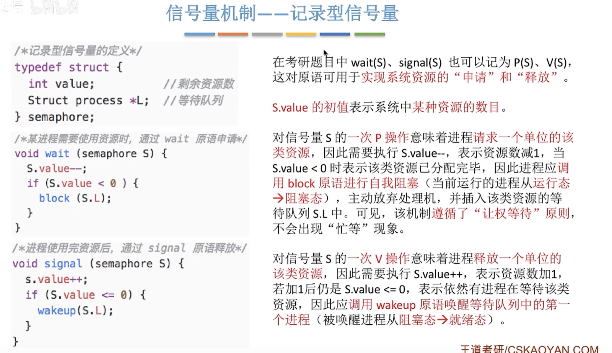


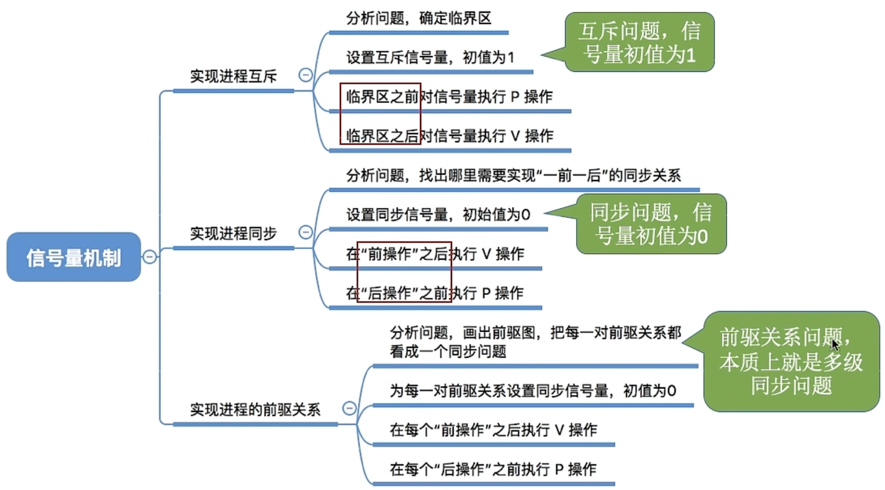


#### 生产消费者问题

> 问题描述：
>
> - 一组生产者和一组消费者共享一个缓冲区（初始为空，大小为n）
> - 缓冲区没满时，生产者把消息放入
> - 缓冲区不空时，消费者取出消息
>
> 问题分析：
>
> - 关系：生产者和消费者对缓冲区互斥，两者之间为协作和同步关系
> - 思路：互斥和同步关系，PV
>   - 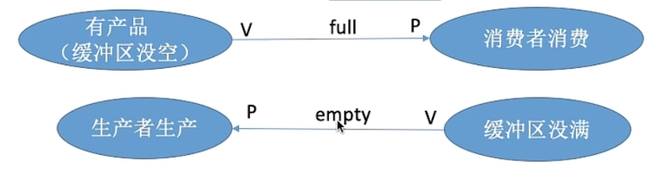
> - 信号量：
>   - semaphore mutex =1;// 互斥信号量，实现对缓冲区的互斥访问
>   - semaphore empty =n;// 同步信号量，空闲缓冲区的数量
>   - semaphore full =0;// 同步信号量，产品的数量--非空缓冲区的数量

```c
semaphore mutex =1;// 互斥信号量，实现对缓冲区的互斥访问
semaphore empty =n;// 同步信号量，空闲缓冲区的数量
semaphore full =0;// 同步信号量，产品的数量--非空缓冲区的数量

//生产者
producer(){
  while(1){
    produce an item in nextp;//生产一个产品
    P(empty); //使用一个空缓冲区
    P(mutex); //互斥访问
    add nextp to buffer; //把产品放入缓冲区
    V(mutex);
    V(full); //释放一个非空缓冲区
  }
}

//消费者
consumer(){
  while(1){
    P(full); //使用非空缓冲区
    P(mutex);
    remove an item from buffer;//从缓冲区取走产品
    V(mutex);
    V(empty); //释放一个空缓冲区
  }
}

// 互斥和同步信号量顺序不能改变，不然会发生死锁
// 总共两对同步信号量（前V后P），一个互斥信号量
// 易错点：实现互斥的P一定要在实现同步的P操作之后，不然会死锁
```


#### 多生产者多消费者问题

> 问题描述：
>
> - 桌子上一个盘子（缓冲区为1），每次只能向其中放入一个水果
> - 爸爸放苹果，女儿吃苹果
> - 妈妈放橘子，儿子吃橘子
> - 只有是自己需要的水果，儿子女儿才能取
>
> 问题分析：
>
> - 关系：
>   - 互斥：对缓冲区互斥访问
>   - 同步（一前一后）：爸爸和女儿，妈妈和儿子
>   - 盘中为空（由儿子女儿触发），爸爸妈妈才能放水果
> - 思路：
>   - 互斥：临界区前后PV
>   - 同步：前V后P
>   - 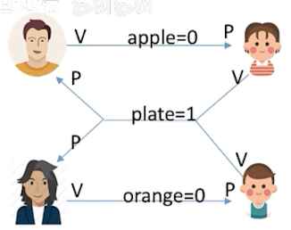
> - 信号量：
>   - semaphore mutex = 1; //实现互斥访问盘子
>   - semaphore apple = 0; //盘子中苹果数量
>   - semaphore orange = 0; //盘子中橘子数量
>   - semaphore plate = 1; //盘子中还有多少水果

```c
// semaphore mutex = 1; //实现互斥访问盘子
// 可以不要互斥信号量
// 原因：缓冲区为1，当同时访问时，其他要访问的进程会阻塞
//易错点：实现互斥的P一定要在实现同步的P操作之后，不然会死锁

semaphore apple = 0; //盘子中苹果数量
semaphore orange = 0; //盘子中橘子数量
semaphore plate = 1; //盘子中还有多少水果

//爸爸
dad(){
  while(1){
    prepare an apple;
    P(plate);
    put the apple on the plate;
    V(apple);
  }
}
//妈妈
mom(){
  while(1){
    prepare an orange;
    P(plate);
    put the orange on the plate;
    V(apple);
  }
}

//儿子
son(){
  while(1){
    P(orange);
    take an orange from the plate;
    V(plate);
    eat the orange;
  }
}
//女儿
daughter(){
  while(1){
    P(apple);
    take an apple from the plate;
    V(plate);
    eat the apple;
  }
}
```

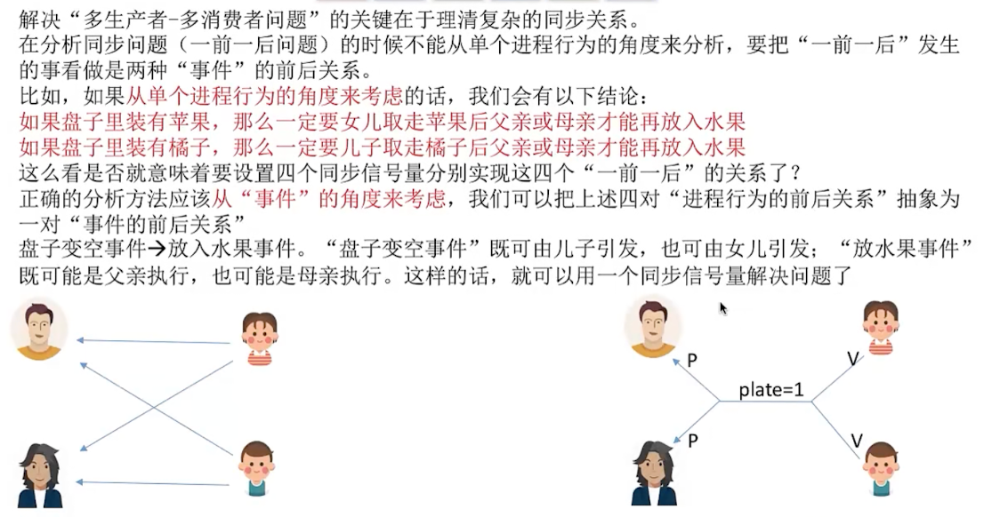


#### 吸烟者问题

> 问题描述：
>
> - 三个吸烟者进程和一个供应者进程
> - 抽烟者需要三种材料：烟草、纸和胶水
> - 三个抽烟者各拥有其中一种，供应者提供随机两种
> - 满足三种材料的取走使用，并返回一个完成信号，供应者继续
> - 过程一直重复
>
> 问题分析：
>
> - 关系：供应者和三个抽烟者之间为同步关系，三个抽烟者抽烟是互斥
>   - 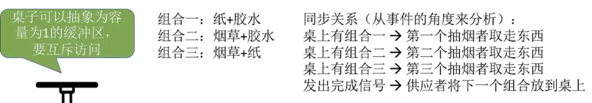
> - 思路：
>   - 前V后P
>   - 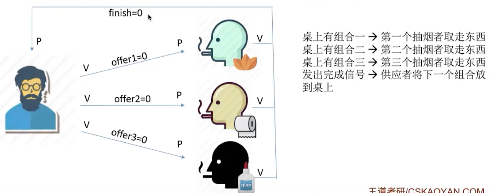
> - 信号量设置
>   - semaphore offer1 = 0；//组合一
>   - semaphore offer2 = 0；//组合二
>   - semaphore offer3 = 0；//组合三
>   - semaphore finish = 0 ; //抽烟是否完成
>
> 

```c
semaphore offer1 = 0；//组合一 烟草+纸
semaphore offer2 = 0；//组合二 烟草+胶水
semaphore offer3 = 0；//组合三 纸+胶水
semaphore finish = 0 ; //抽烟是否完成
int num =0; //用于实现同时抽烟

//供应者
provider(){
  while(1){
    num++;
    num=num%3;
    if(num == 1)
      V(offer1);
    else if(num == 2)
      V(offer2);
    else
      V(offer3);
    任意两种组合放桌上; //offer123对应的材料
    P(finish);
  }
}

//烟鬼1 --拥用烟草
smoke1(){
	while(1){
    P(offer3); 
    拿起组合三，卷起烟，抽调;
    V(finish);
  }  
}
//烟鬼2 -- 拥有纸
smoke1(){
	while(1){
    P(offer2); 
    拿起组合二，卷起烟，抽调;
    V(finish);
  }  
}
//烟鬼3 -- 拥有胶水
smoke1(){
	while(1){
    P(offer1); 
    拿起组合一，卷起烟，抽调;
    V(finish);
  }  
}

```


#### 读者写者问题

> 解决复杂的互斥问题
>
> 问题描述：
>
> - 有读者和写者两组并发进程（每组有多个）
> - 可以多个进程同时读，只允许一个进程写
> - 写操作时不准读，写操作时保证已有读者和写者全部退出
>
> 问题分析：
>
> - 关系：写者与读者是互斥的，写者和读者是互斥的，读者之间不互斥
> - 思路：PV操作，读者和写者、读者之间一对PV无法解决，用到一个计数器，读者对计数器的访问也是互斥的
> - 信号量：
>   - semaphore rw =1; // 用于实现对共享文件的互斥访问
>   - int count = 0; //记录当前有几个读进程在访问

```c
int count = 0; //用于记录当前读者的数量
semaphore mutex = 1; //保证更新count变量的互斥
semaphore rw = 1; //保证读者写者互斥访问文件

//写者
writer(){
  while(1){
    P(rw);
    writing;
    V(rw);
  }
}

// 读者
reader(){
  while(1){
    P(mutex);
    if(count == 0)
      P(rw);
    count++;
    V(mutex);
    reading;
    P(mutex);
    count--;
    if(count == 0)
      V(rw);
    V(mutex)
  }
}

// 问题：只要有读进程在读写进程就要一直阻塞等待，可能饿死
//此算法是读进程优先

```


```c
//实现写优先-本质是先来先服务

int count = 0; //用于记录当前读者的数量
semaphore mutex = 1; //保证更新count变量的互斥
semaphore rw = 1; //保证读者写者互斥访问文件
semaphore w = 1; //用于实现写优先--其实本质就是先来先服务
//写者
writer(){
  while(1){
    P(w);
    P(rw);
    writing;
    V(rw);
    V(w);
  }
}

// 读者
reader(){
  while(1){
    P(w);
    P(mutex);
    if(count == 0)
      P(rw);
    count++;
    V(mutex);
    V(w); //恢复对文件的访问 当下个写进程过来时候，因为读进程有P(rw),写进程不会访问，第二个读者会堵塞在P(w) 读者--写者--读者 ==》队列
    reading;
    P(mutex);
    count--;
    if(count == 0)
      V(rw);
    V(mutex)
  }
}
```


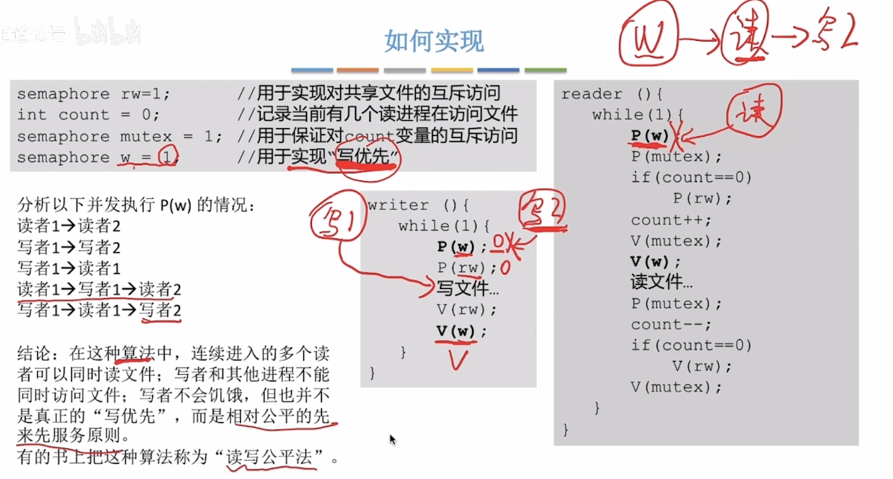

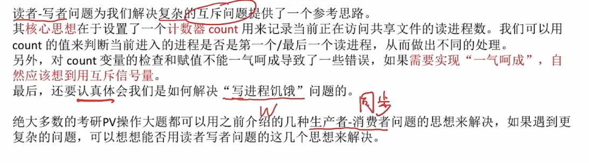


#### 哲学家进餐问题

> 问题描述：
>
> - 五位哲学家五根筷子，哲学家要不在思考，要不在吃饭
> - 筷子一根根地拿起，有两根筷子才可以吃饭，吃完就放下筷子思考
> - 只能拿左手右手边的筷子
>
> 问题分析：
>
> - 关系：两位哲学家对中间筷子访问是互斥的
> - 思路：重点是避免死锁现象-每个哲学家都拿一根筷子
>   - 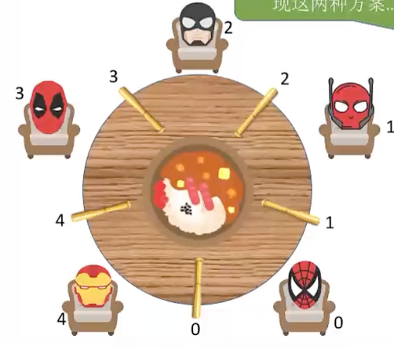
> - 信号量：
>   - semaphore chopstick[5]={1,1,1,1,1};
>
> 

```c
// 死锁现象-每个哲学家都拿一根筷子
// 死锁解决方法：1.最多允许4个哲学家同时进餐
// 2.要求奇数哲学家先拿左边筷子，再拿右边筷子。偶数相反
// 3.当左右有筷子才能拿起筷子

//选用 当左右都有筷子才拿筷子，哲学家互斥进程
semaphore chopstick[5]={1,1,1,1,1};
semaphore mutex = 1; //取筷子的信号量

Pi(){
  do{
    P(mutex); //获取访问筷子信号量
    P(chopstick[i]);//取左边筷子
    P(chopstick[(i+1)%5]); //取右边筷子
    V(mutex);
    eat；//进餐
    V(chopstick[i]);
    V(chopstick[(i+1)%5]);
    think;
  }while(1); 
}
```

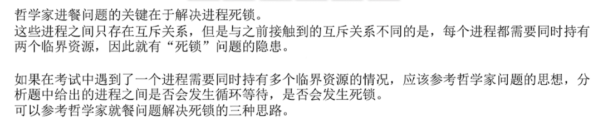

### 2.3.5 管程

> 实现共享和同步
>
> - 只能一个线程或进程访问（只能通过特定入口访问）
> - 封装思想 

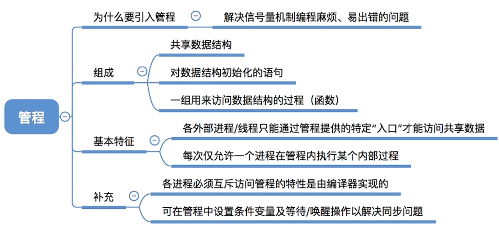

### 用管程解决生产者消费者问题

```c
//类c语言
moitor ProducerConsumer
  condition full,empty;//条件变量用来实现同步-排队-消费进程排在empty后面
	int count=0;//缓冲区中产品数
	void insert(Item item){ //把产品item放入缓冲区
    if(count==N)
      wait(full);//等待
    count++;
    insert_item(item);
    if(count==1)
      signal(empty);//唤醒 
  }

	Item remove(){ //从缓冲区中取走一个产品
    if(count==0)
      wait(empty);
    count--;
    if(count == N-1)
      signal(full);
    return remove_item();
  }
end monitor;

//生产者进程
producer(){
  while(1){
    item = 生产一个产品;
    ProdecerConsumer.insert(item);
  }
}

//消费者进程
consumer(){
  while(1){
    item=ProducerConsumer.remove();
    消费产品item;
  }
}
```


### 2.3.6 经典同步问题
## 2.4死锁
### 2.4.1 死锁的概念

> 死锁：各进程等待对方手里的资源，导致相互阻塞--不能上CPU
>
> 饥饿：长期得不到想要的资源 --不能上CPU
>
> 死循环：跳不出某个循环，bug导致 --可以上CPU

死锁的条件

- 互斥条件
- 不剥夺条件
- 请求并保持条件-保持一个资源还请求其他资源
- 循环等待-循环等待链


### 2.4.2 死锁预防

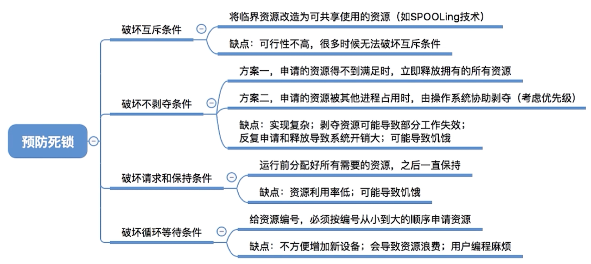


- 破坏互斥条件--如SPOOLing技术
- 破坏不剥夺条件
  -  当一个进程得不到自己的资源的时候，会释放保持的资源
  -  操作系统为高优先级进程剥夺需要的资源
- 破坏请求保持条件
  - 静态分配方法-一次申请完所需要的全部资源

- 破坏循环等待条件
  - 顺序资源分配法--给系统资源编号，进程按编号递增的顺序请求资源


### 2.4.3 死锁避免

> Dijkstra 提出

安全状态一定不会死锁

不安全状态可能发生死锁

发生死锁一定是不安全状态

#### 银行家算法

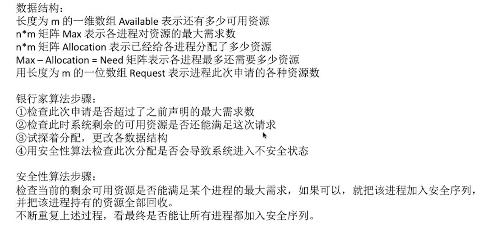

### 2.4.4 死锁检测和解除

  时间多多话可以结合数据结构写死锁检测算法


