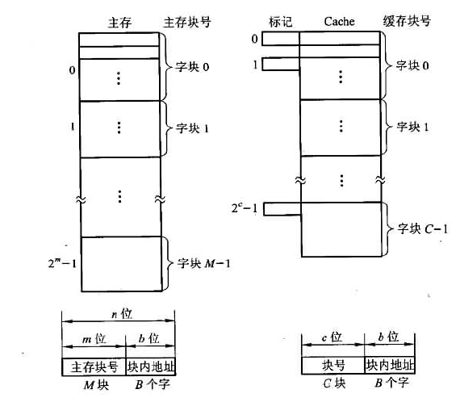
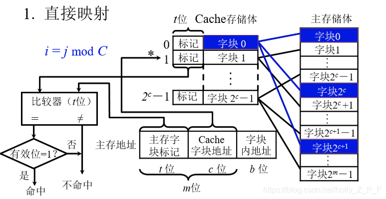

## cache理解

可参考：http://t.csdn.cn/3NMpu

cache-主存存储空间的基本结构：

首先补充下按字编址（如1字=32，则为4B）和按字节（1B）编址，编址其实就是对存储单元进行编号，如上图的字块。

由于C要比M小很多，因此可见cache的物理地址是要比主存的物理地址少若干位的，因此cache和主存的物理地址是不相等的（这个做题的时候容易搞不清楚）。

先看主存，一个字块是由若干个字组成，也就是里面有许多的存储单元，应为cache对应主存是映射关系，所以两者的字块是一样的，上图的块内地址就都是B个字

- 然后用2进制表示2^b,b位就可以表示这些地址（比如3位二进制就可以表示8个编号，注意现在是在编址对应的物理地址不是字块里面的内容，也就是这个块里面有8个字）。
- 再看主存块号M，也就是把这个主存分成了M块，同样编号的时候，二进制表示就是m位（比如分成8块，用3位二进制在物理地址中就可以表示了）
- 整个物理编址就是告诉你，我把主存分成了M块，每一块里面有B个字，具体怎么定位到这个字，就要把地址的编号拿出来看了。

再看cache，由于cache比主存小得多，C<<M的，所以块号编址的时候就没有那么多位数，也就导致cache的编号长度是小于主存的。

- cache主要由**标记项**和**数据项**组成，标记项用来匹配判定，数据项就是主存中的数据
- 标记项的组成，标记位就是计算时主存物理地址计算中多出来的哪几位。

| 有效位 | 标记位       | 脏位 | 替换控制位     |
| ------ | ------------ | ---- | -------------- |
| 1bit   | 主存字块标记 | 1bit | 与替换算法有关 |

明白了编址，下面再看看直接映射的组成

还是先分清主存地址和字块的区别：主存地址只是一个编号，具体表示字块里面的存储单元。

- 由于M>>C，所以映射的时候，**主存块号 % cache总行数**进行映射，也就是主存的字块0，字块2^c都会存在cache第0行，冲突就采用替换算法。用主存中低c位表示cache行号（为什么是后三位还不明白）。
- 由于CPU发出的指令是主存的物理地址，所以操作主要是对这个地址的。
- 首先通过cache字块地址进行定位到cache行号，可以看下上面cache标记项的组成，如果标记位匹配+有效位为1则cache命中，这里注意有两个比较。

其他两种方式也是这样，有时间再来总结，今天总结的主要是解决对主存地址中的标记位和cache标记项的理解混乱

- 主存地址和cache地址不等长
- cache行位数=标记项+cache块位数（=主存字块位数）
- 主存的字块标记在cache标记项中属于子模块，用于判断是否字块匹配，同时还需要cache标记项中的有效位一起。

