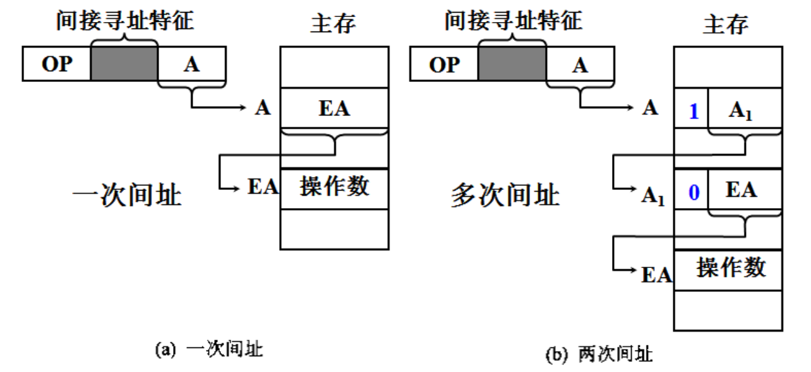
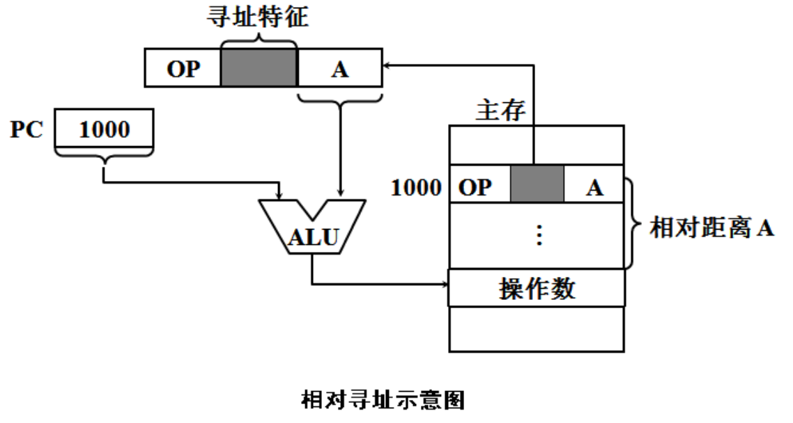

指令寻址：顺序寻址（PC）和跳跃寻址（转移指令）

## 数据寻址

操作码+寻址特征+形式地址A

真实地址EA

### 1.立即寻址

A就是操作数

寻址特征 #

数据用补码存放

### 2.直接寻址

EA=A，限制了操作数的寻址范围

### 3.隐含寻址

操作数隐藏在操作码或者某个寄存器中（如ACC），有利于缩短指令字长

### 4.间接寻址

一次间接寻址 EA=(A),

两次间接寻址，会留一位数表明是否需要继续翻存寻址，1-继续，0-当前EA就是，寻址范围就是2^(n-1)

优点：扩大了寻址范围，便于编制程序

缺点：指令执行过程访存两次（一次间址）或多次（多次间址）

### 5.寄存器寻址

OP+寻址特征+Ri，操作数就是Ri指向的寄存器内，无需访存主存，指令字短-节省存储空间

### 6.寄存器间接寻址

EA=(Ri),操作数在主存中，比间接寻址少访问一次主存

### 7.基址寻址

基地址寄存器BR（base register，对应OS中的可重定位寄存器）

EA=A+(BR) 加法用ALU完成

BR不变，用户改变A，主要为程序或数据分配空间

显式：在一组通用寄存器中，指定寄存器做基址寄存器

隐式：专门设置一个基址寄存器，使用时用户不需要指定。

基址寄存器的位数可以大于形式地址A的位数，因此可以扩大操作数的寻址范围，--首地址放寄存器，位移量放A中

使用于多道程序，-通过指定基地址，使程序的逻辑地址转化为某一空间的物理地址-函数调用

### 8.变址寻址

EA=A+(IX) 

A不变，用户设定IX的值，程序运行时可以改变，主要用于处理数组问题，有利编制循环程序--减少指令所占的存储空间

可与其他寻址方式结合使用

### 9.相对寻址

EA=(PC)+A

相对距离A，操作数位置与当前指令的距离 因此相对寻址一般用来做转移指令，A可正可负，补码表示 

转移地址随PC的值变化，对编写浮动程序有利

### 10.堆栈寻址

硬堆栈：寄存器组

软堆栈：主存的一部分空间，堆栈指针SP(Stack Point)指出栈地址，进栈PUSH，出栈POP，

PUSH： (SP)- X ---> SP，

POP:      (SP)+X--->SP

X 的取值和主存编制方式有关，按字编制X=1，按字节编制，如字长16，X=2

