鼠标键盘的中断过程

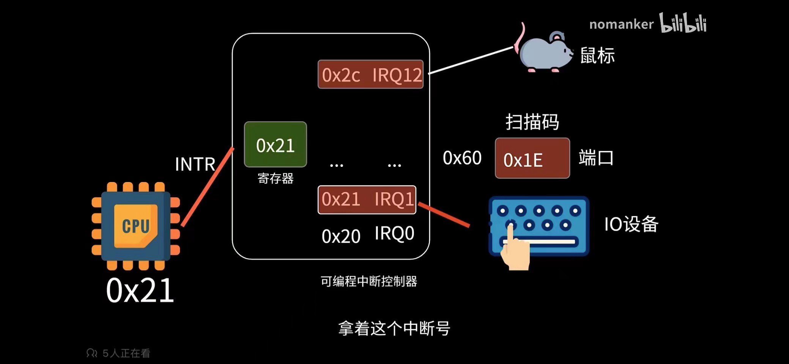

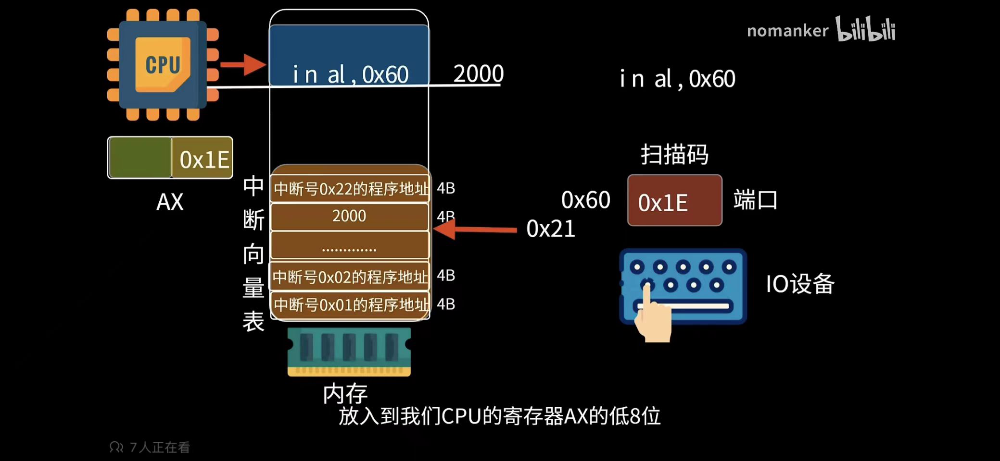


# 第七章  I/O设备

I/O系统由I/O软件和I/O硬件组成。

I/O软件：驱动程序--采用I/O指令和通道指令实现CPU和I/O设备的信息交换。

I/O硬件：设备控制器来控制设备具体操作，I/O接口与主机总线相连。

I/O控制方式：程序查询、程序中断、DMA方式和通道方式。

显示器：

- 屏幕大小、分辨率、灰度级、刷新频率和显示存储器(VRAM)

- VRAM容量=分辨率*灰度级**位数**

- VRAM带宽=容量*帧频

打印机：

- 工作方式分：针式打印机（票据）、喷模式打印机、激光打印机
- 原理分：击打式和非击打式
- 能否打汉字：点阵式和活字式


## I/O接口

I/O接口作用

- 数据缓冲：通过数据缓冲寄存器（DBR）达到主机和外设工作速度的匹配
- 错误或状态监测：通过**状态寄存器**反馈设备的各种错误、状态信息，供CPU查用
- 控制和定时：接收从控制总线发来的控制信号、时钟信号
- 数据格式转换：串-并、并-串 等格式转换
- 与主机和设备通信：实现 主机—I/O接口—I/O设备 之间的通信

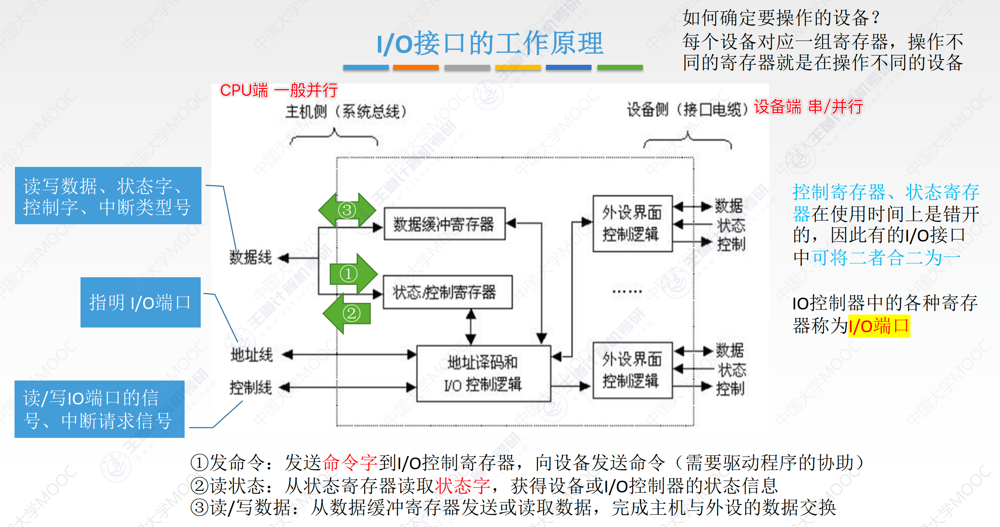

模拟CPU控制打印机：【状态/控制寄存器】- 两个寄存器合为一个，因为两种不一起使用可以合一起

1.通过数据线向【状态/控制寄存器】中的的状态寄存器发送命令字(控制字，一串二进制)存储，然后通过【I/O控制逻辑】对命令读取执行，此时通过打印机接口启动了打印机并且将打印机状态存到【状态/控制寄存器】。

2.CPU对【状态/控制寄存器】进行状态检测，如果打印机准备就绪，就向数据缓冲寄存器中输入数据，同样数据在【I/O控制逻辑】的作用下对打印机进行数据传输（匹配速度）。

3.打印机完成后会向控制寄存器中反馈信息，CPU通过读取状态寄存器检测传输完成

- 对应对I/O方式
- CPU一直轮询的检测状态寄存器
- 通过控制线向CPU发一个中断请求信号
  - 说明：打印机发出的中断可以是完成后的请求也可能是设备故障的请求，这时候打印机同时会向数据缓冲寄存器中发送一个【中断类型号】，CPU结合发过来的中断信号进行不同的处理

4.一个I/O接口可以对应多台打印机，那么需要通过通过【地址线】发送【地址码】进行【地址译码】选择打印机

- I/O接口中的**各种寄存器就是I/O端口**
- CPU对端口的操作：数据端口-读写，状态端口-读，控制端口-写


串行：**一位**一位的传（USB）

**并行**：一个字节或一个字所有位一起传输

ASCII7位+1位奇偶验证码，故键盘的缓冲区DBR一般式8位。 其他情况若涉及到起始位则再+2.


| 统一编址                           | 独立编址                                    |
| :--------------------------------- | :------------------------------------------ |
| 访存指令访问                       | 专门的I/O指令                               |
| 靠地址码区分内存和设备             | 靠指令区分内存和设备                        |
| 占用主存地址空间，主存地址空间变小 | 不占用主存地址空间，地址位数少，译码快      |
| 较大的编编址空间，读写控制电路简单 | I/O指令少，只能对端口读写，程序设计灵活性差 |
| 内存地址和I/O地址不同              | 内存地址和I/O地址可能相同                   |

I/O指令只能在OS内核中使用，属于特权指令。通常是对数据、状态控制寄存器的访问操作，实现的数据传输发生在CPU的通用寄存器和I/O端口之间。

磁盘驱动器不是I/O接口


## I/O方式

### 直接查询方式

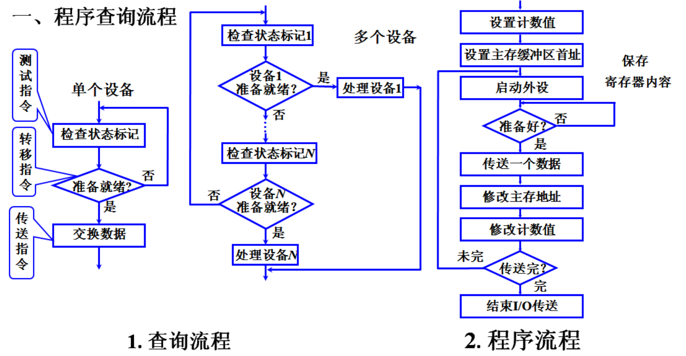

当I/O设备较多的时候，CPU按优先级进行查询，需要用到三个指令：测试指令、转移指令、传送指令。转移指令：当检测到当前指令没有准备就绪就向下一个设备跳转。

查询整个流程如上图，补充：

- 传送数据是在CPU的【寄存器】和I/O接口的【数据缓冲寄存器】之间，因此要先将CPU的寄存器原来的内容保存起来。
- 由于传输的数据往往是一批数据，因此要设置一个计数值，如果用原码表示，每次-1，如果用计数值为负数的补码，则每次+1，当计数值为0的时候表示数据传输完成。
- 由于数据是从主存中传输过去，因此还要设置一个主存缓冲区的首地址。
- 接口电路中有两个触发器表示设备工作状态：D-完成触发器  B-工作触发器  D=1就绪 、B=1工作

结合I/O接口理解：通过数据总线查询I/O接口的状态寄存器的状态，其中包括通过地址线传输地址码选择设备过程，传输过程就是在CPU的寄存器和接口的数据缓冲寄存器之间。


### 程序中断方式

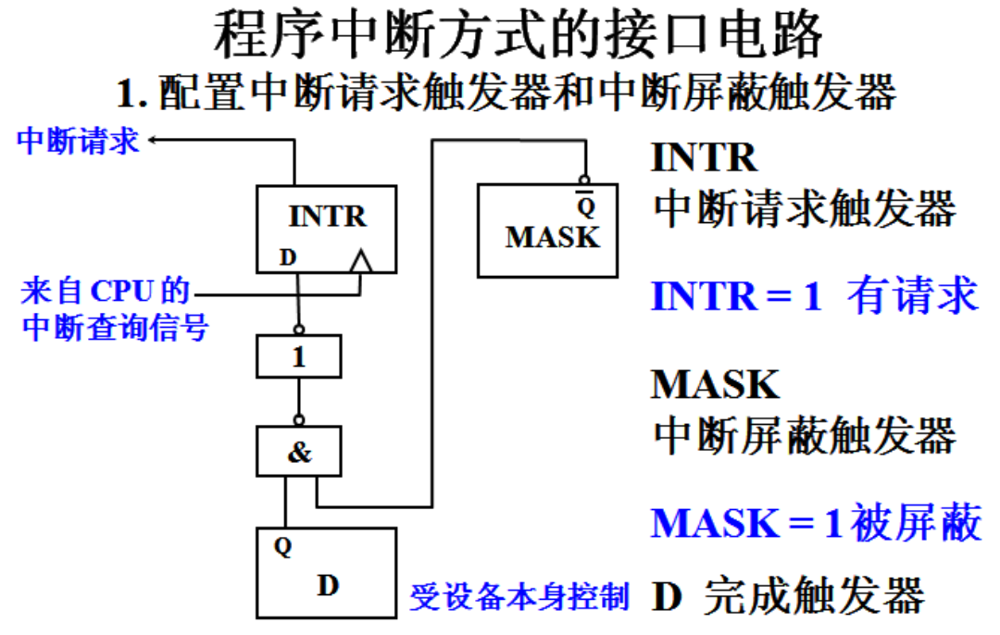

中断请求触发器 INTR=1 向CPU发送中断、中断屏蔽触发器MASK=1表示被屏蔽

可见当D=1 和 MASK=0 时候出发 INTR=1

**每条指令执行阶段结束前向接口发送查询信号**

链式排队器-根据优先级选择电路：

- 不可屏蔽中断>内部异常>可屏蔽中断
- 内部异常中，硬件故障>软件中断
- DMA中断>I/O中断
- 高速设备>低速设备

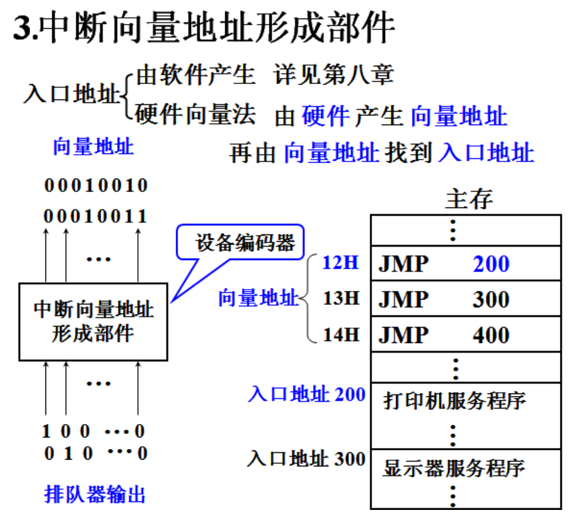

向量中断：CPU响应中断--获得中断型号--计算中断向量地址存入PC（向量地址中存放的是无条件转移指令，直接跳转到入口地址）--执行中断服务程序

1. 中断处理过程：

   - 整体中断周期：中断响应-程序断点进栈-关中断-向量地址存到PC

   - 细节：设备工作结束后 D=1 MASK=0时，且指令执行阶段的结束时刻，由CPU发出查询信号。INTR=1向CPU发出中断请求，INTR进入排队器进行中断判优(看优先级决定是否响应)。CPU允许中断(EINT=1)，进入**中断响应阶段**，中断响应信号INTA将排队器输出送到编译器形成向量地址，找到中断服务程序并且执行。

   - 补充：中断响应过程其实就是执行了中断隐指令:关中断-保存断点(将原程序的断点PUSH进栈或保存在特定寄存器中)-引出中断服务程序(识别中断源--硬件向量法和软件查询法)。
   - 补充：**异常断点**-没有成功执行指令因此要重新执行，断点就是当前指令地址。**中断的断点**是下一条指令的地址。
   - 关注点：CPU是的开/关中断，多重中断CPU的开/关中断变化，多重中断的优先级
   - 多重中断：中断源+屏蔽字的表格 MASK=1表示中断源A屏蔽中断源B，会画出CPU执行程序的过程。

2. 中断服务程序流程：

   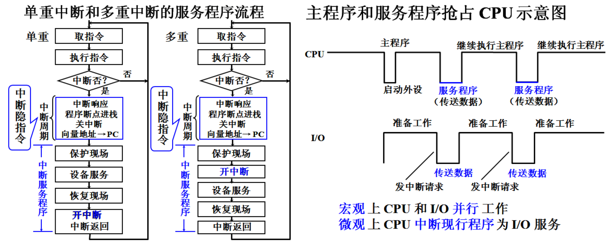

   - 保护现场
     - 程序断点-由隐指令在中断周期完成
     - 保存通用寄存器和状态寄存器的内容-由中断程序完成- Push到堆栈或保存到存储器
   - 开中断（多重中断才有）
   - 设备服务-就是对打印机或者显示器这些设备的操作
   - 恢复现场-Pop堆栈
   - 开中断 中断返回

### DMA方式

主要节约的时间是I/O准备数据的时间而不是I/O存到主存的时间

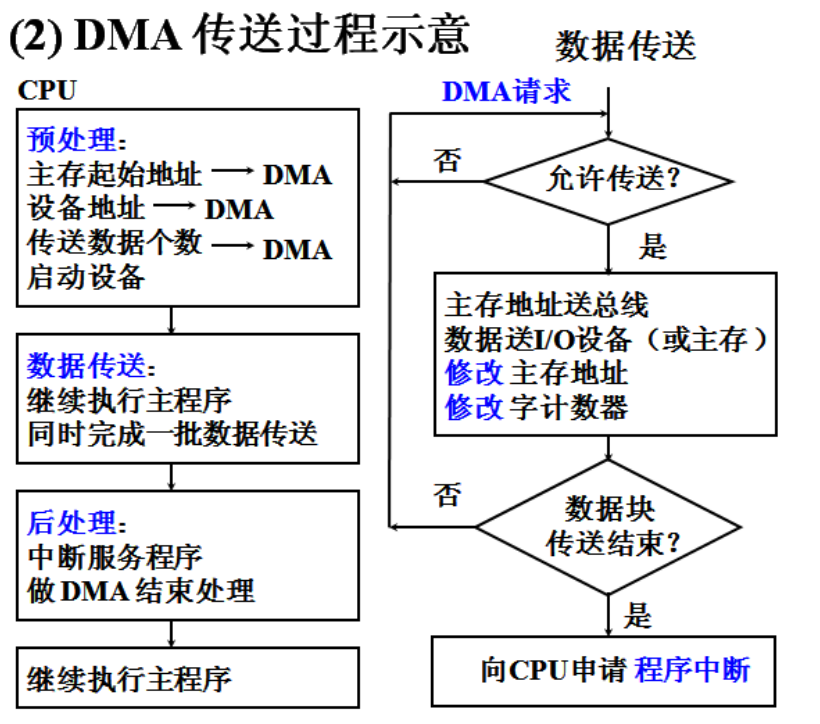

- 预处理
  - 指明数据是输入还是输出
  - 向DMA设备地址寄存器DAR送入设备号，并启动设备。DAR--表示设备信息存储区的寻址信息，如磁盘的区号，盘面号和柱面号。
  - 向主存地址寄存器AR送入交换数据的主存地址。 AR--将主存中的首地址送到AR
  - 给字计数器WC赋值交换数据的个数。 -- WC通常以补码表示，传输一个字就+1，传输完成就溢出为全0
- 数据传输

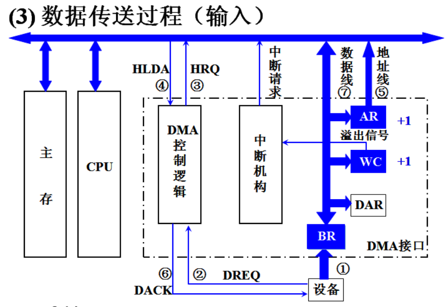

BR-数据缓冲寄存器 

DMA接口<=>主存 以字传输 

DMA接口<=>设备 以字节或位传输

传输过程：

1. 准备好一个字，选择设备，将该字读到DMA的BR，BR满（如果是一位一位传，传到一个字就会满）
2. 同时设备向DMA接口发送请求DREQ
3. DMA接口向CPU申请总线控制权HRQ
4. CPU发送HLDA允许
5. 将AR中的主存地址送到地址总线，写命令
6. 通知设备已被授予一个DMA周期（DACK），准备下一个字
7. 将BR中的数据送至数据总线
8. 将BR的数据写到AR指定的地址
9. 修改AR，WC的值
10. 继续传输直到结束


- 后处理

检验送入主存的数是否正确、是否继续使用DMA、测试传送过程是否正确。

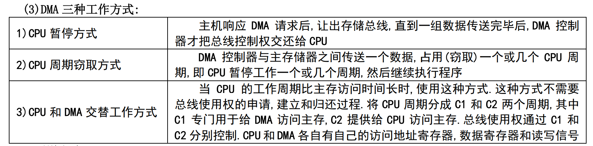

DMA访存优先级高于CPU，因为不立即访存就会丢失数据。

交替工作方式适用于CPU的工作周期比主存存取周期长的情况。

存取周期-整个环节

存储周期-一个环节


### 三种方式比较

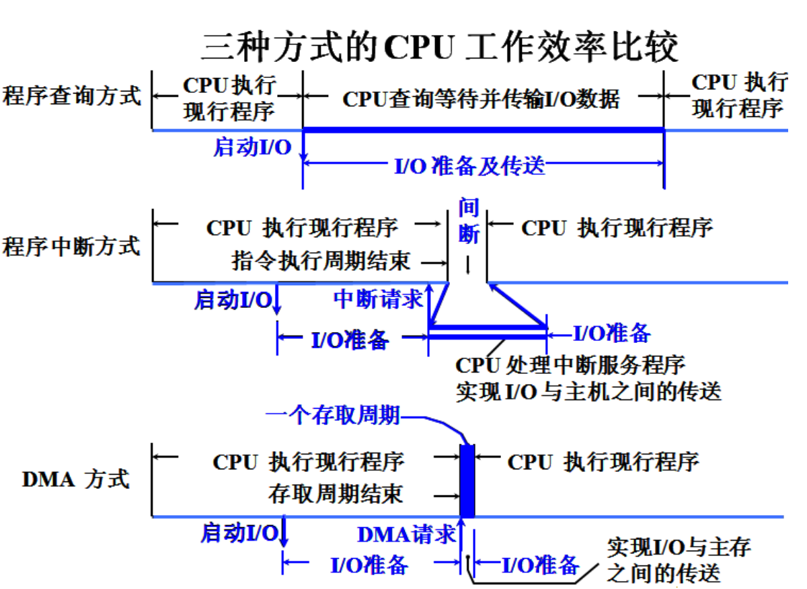

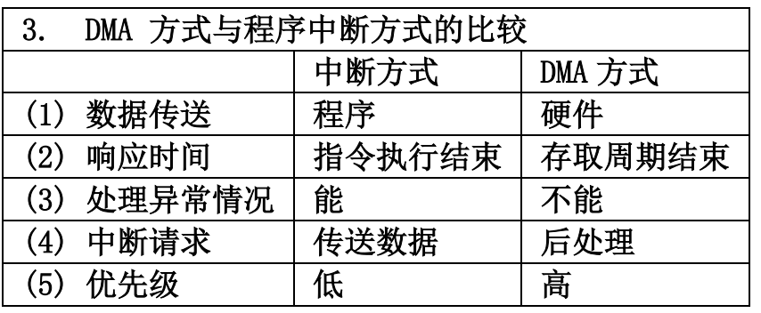


# 第三章 存储

[存储系统](存储系统.md) 

[Cache](cache总结.md)


# 第二章 数据运算

标志位的生成

无论有符号还是无符号都会产生标志位，用的一套电路

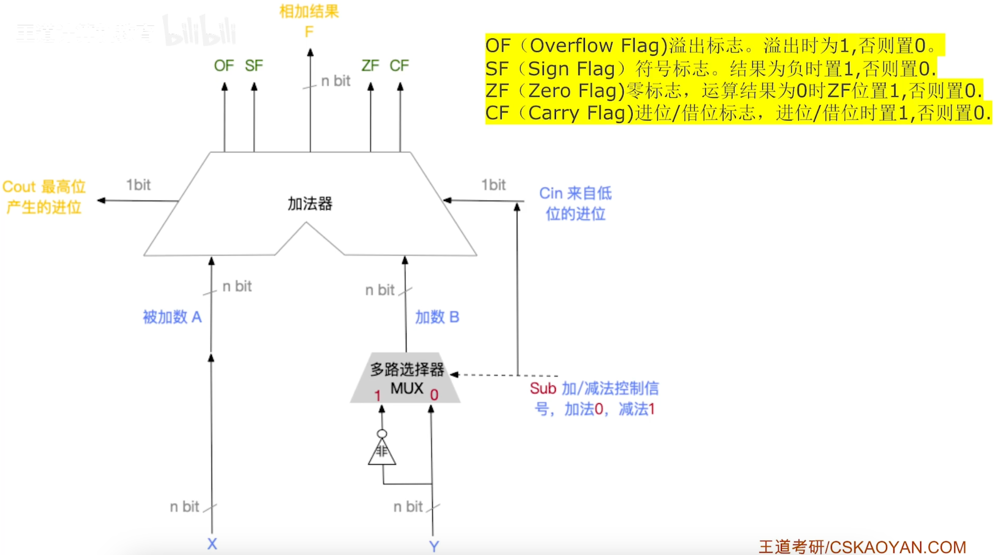

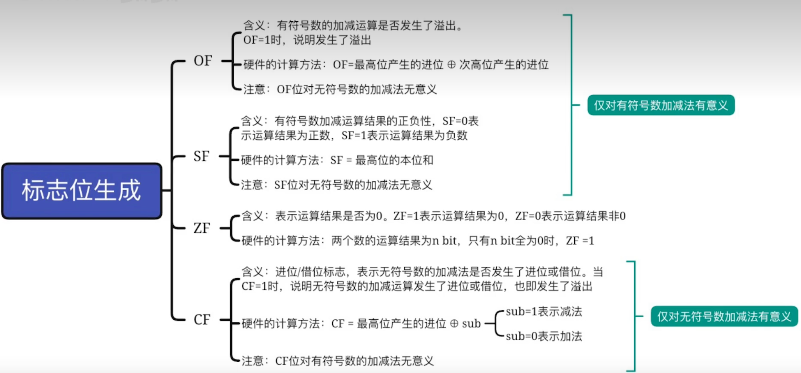

 


# 第四章 指令系统

## 常见的的X86

常用的寄存器

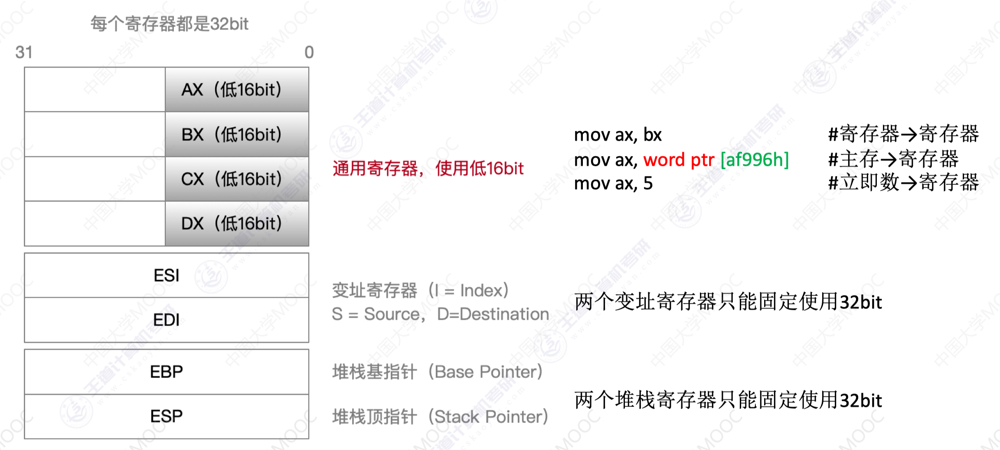

| 16bit | 32bit | 说明                      |
| :---: | :---: | :------------------------ |
|  AX   |  EAX  | 累加器Accumulator         |
|  BX   |  EBX  | 基地址寄存器Base Register |
|  CX   |  ECX  | 计数寄存器Count Register  |
|  DX   |  EDX  | 数据寄存器 Data Register  |
|       |  ESI  | Index Register            |
|       |  EDI  | Index Register            |
|       |  EBP  | 堆栈基指针Base Pointer    |
|       |  ESP  | 堆栈顶指针Stack Pointer   |


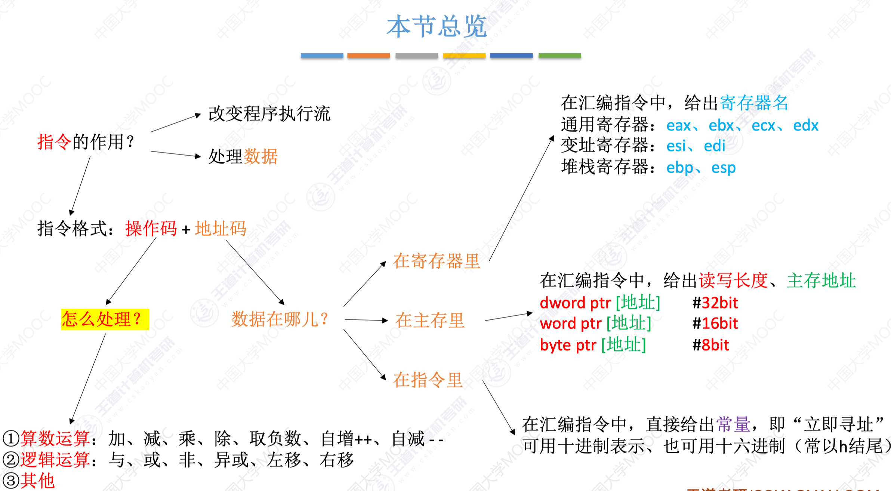


### 1.算数指令

目的操作数d不可以是常数，可以是主存和寄存器

不可以两个操作数同时来自主存

| 功能 |   英文   | 汇编指令 | 注释                                           |
| :--: | :------: | :------: | ---------------------------------------------- |
|  加  |   add    | add d,s  | 计算d+s，结果存入d                             |
|  减  | subtract | sub d,s  | 计算d-s，结果存入d                             |
|  乘  | multiply | mul d,s  | 无符号数d*s，乘积存入d                         |
|      |          | imul d,s | 有符号数d*s，乘积存入d                         |
|  除  |  divide  |  div s   | 无符号数除法 edx:eax/s，商存入eax，余数存入edx |
|      |          |  idiv s  | 有符号数除法 edx:eax/s，商存入eax，余数存入edx |
| 取负 | negetive |  neg d   | 将d取负数，结果存入d                           |
| 自增 | increase |  inc d   | 将d++，结果存入d                               |
| 自减 | descrese |  dec d   | 将d--，结果存入d                               |

除法指令：运算前被除数要进行扩展32->64,因此需要两个寄存器 edx:eax  结果商放eax 余数放edx


### 2.逻辑运算

| 功能 |     英文     | 汇编指令 | 注释                                     |
| :--: | :----------: | :------: | ---------------------------------------- |
|  与  |     and      | and d,s  | 将 d、s 逐位相与，结果放回d              |
|  或  |      or      |  or d,s  | 将 d、s 逐位相或，结果放回d              |
|  非  |     not      |  not d   | 将 d 逐位取反，结果放回d                 |
| 异或 | exclusive or | xor d,s  | 将 d、s 逐位异或，结果放回d              |
| 左移 |  shift left  | shl d,s  | 将d逻辑左移s位，结果放回d（通常s是常量） |
| 右移 | shilt right  | shr d,s  | 将d逻辑右移s位，结果放回d（通常s是常量） |


### 3. 其他

实现分支结构、循环结构的指令：cmp、test、jmp、jxxx 

实现函数调用的指令：push、pop、call、ret 

实现数据转移的指令：mov 

mov-不支持两个操作数同时来自主存


### 4. AT&T Intel

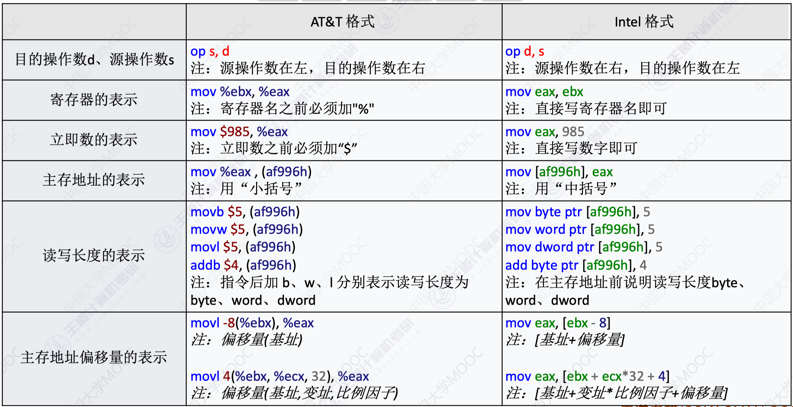

byte ptr - 8bit

word ptr - 16bit

dword ptr - 32bit

未指明则默认32bit


常用偏移量格式--结合数组考察

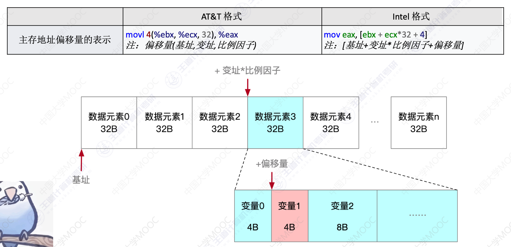

[ebp-4] [ebp-8] 局部变量

[ebp+4] [ebp+8] 调用参数 -- 上一层函数传过来的参数

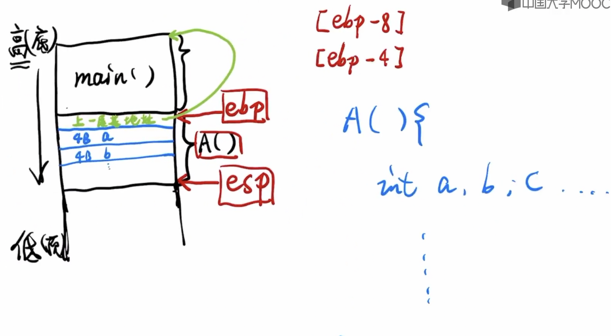


### 5.选择语句的机器级表示

X86处理器中PC(Program Counter)也用IP(Instruction Pointer)表示


无条件转移指令

```c
jmp <地址>  #PC无条件指向至<地址> PC当前指向jmp的下一条指令
//<地址> 可以是主存，寄存器，常数 也可以用标号锚定
jmp 128
jmp eax
jmp [999]
jmp NEXT  //NEXT: 标号位置，使得编程灵活，一般会以函数名作为NEXT 
```

条件转移指令 jxxx

~~~c
//一般和cmp一起使用
cmp a,b 
je <地址> //jump when equal
jne <地址> //jum when not equal 
jg <地址> //jump when greater than
jge <地址> // jump when greater than or equal to
jl <地址>  // jump when less than 
jle <地址> //jump when less than or equal to 

//正确套路
cmp eax,ebx
jp NEXT
~~~


示例

~~~c
if(a>b){
  c=a;
}else{
  c=b;
}


mov eax,7
mov ebx,6
cmp eax,ebx
jle NEXT //a<=b
mov ecx,eax
jmp END
NEXT:
mov ecx,ebx
END:
~~~

cmp中标志位的应用

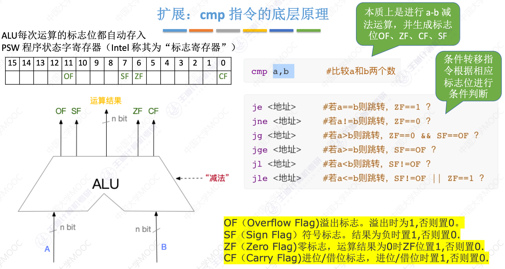


### 6.循环语句的机器级表示

条件转移指令实现

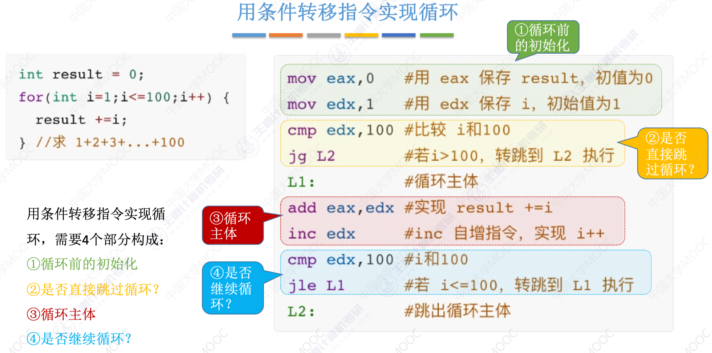

loop指令实现

只能用ecx配合使用

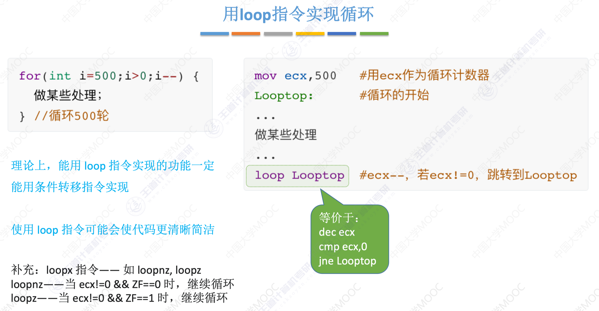


### 7.函数调用的机器级表示

函数的栈帧：保存函数{}中定义的局部变量、保存函数调用的相关信息

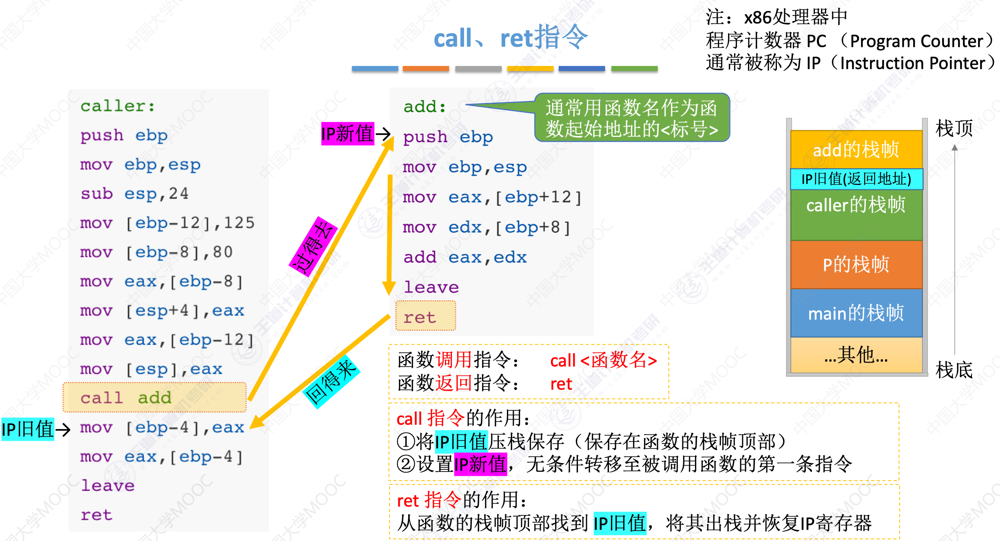


call：call+标号=调用函数

- 将IP旧值（也就是call的下一条指令）压栈
- 设置IP新值（调用函数的第一条指令），无条件转移

ret：返回函数 call的下一条指令

- 找到IP旧值并还原值IP寄存器（PC）


函数调用栈在内存中的位置

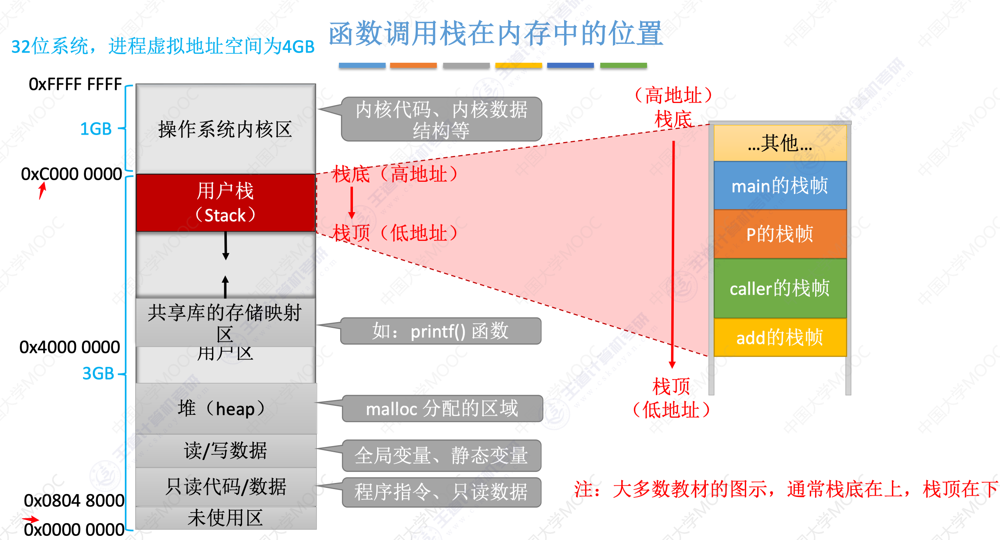

X86中函数调用栈道操作单位为4字节 - Pop Push 

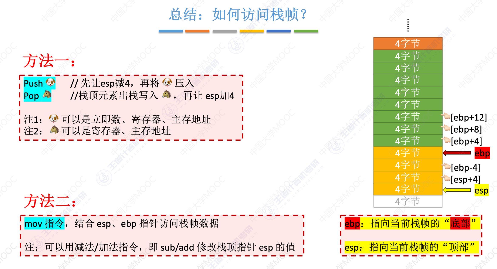

函数调用时切换栈帧

> push ebp  #把ebp压入栈（也是之前ebp的地址）
>
> mov ebp,esp #基址ebp指向esp

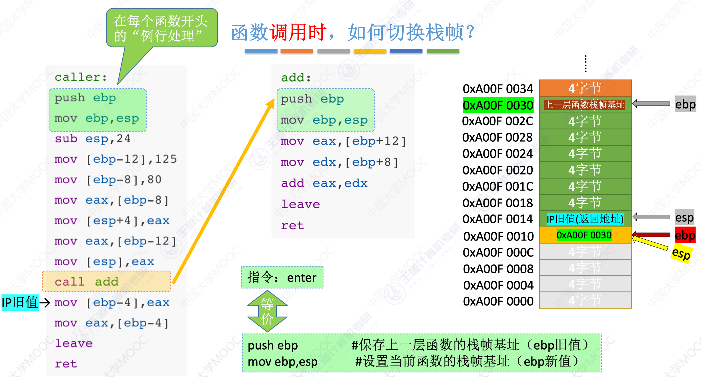

函数返回时

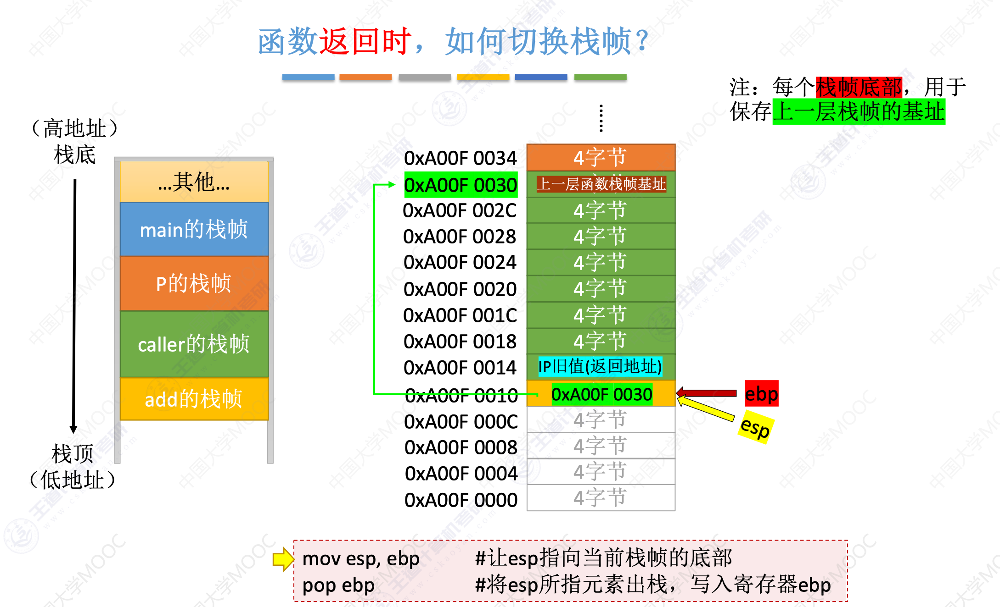

> 等价于leave指令
>
> mov esp,ebp # 让esp指向ebp
>
> pop ebp # 把ebp出栈 到原来位置

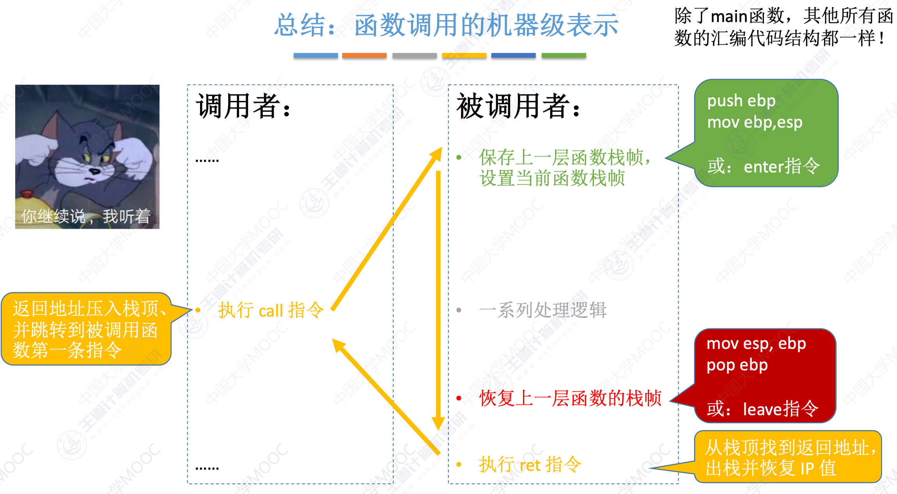


栈帧中包含哪些内容

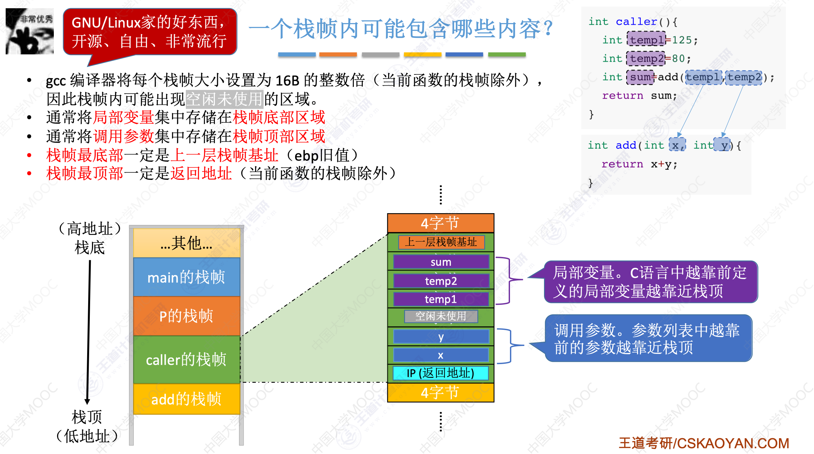

c语言中，越靠前定义的局部变量越靠近栈顶 

局部变量通常在栈底区域 //[ebp-4]调用局部变量

调用参数在栈顶区域 //[ebp+4] 调用上一层函数的x

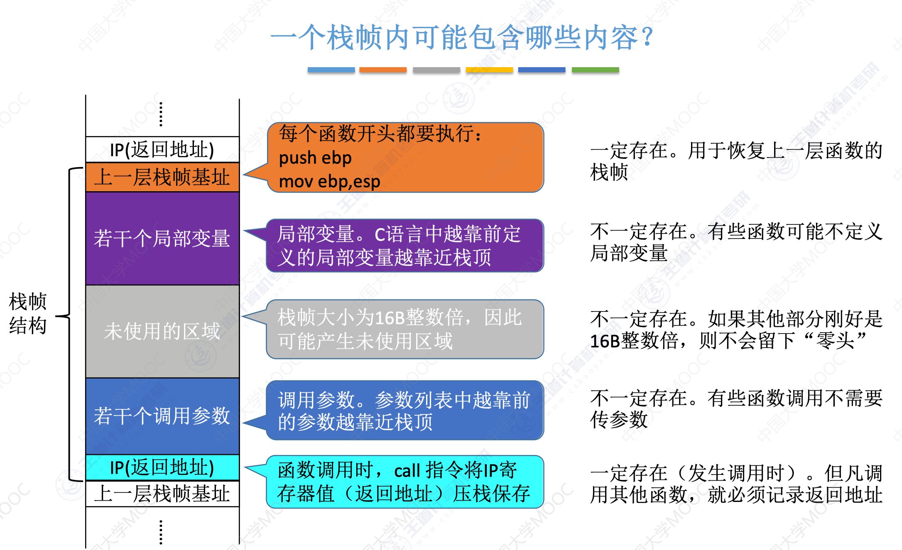

汇编实战：


框架

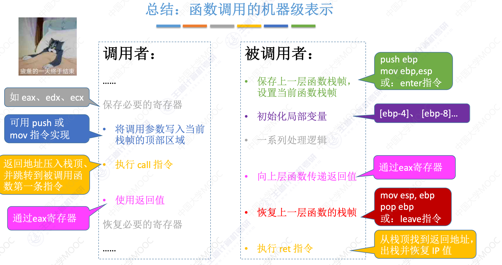


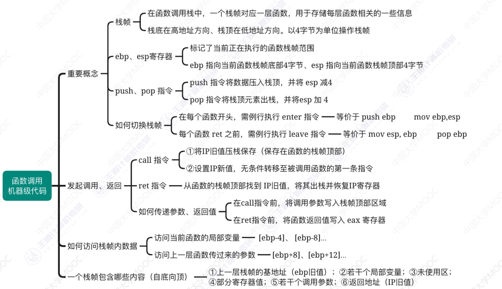


## MIPS

指令字长固定


# 第五章 CPU

一条指令

- 取指-所有指令都一样

  - 把PC所指的指令取出来放到IR
  - PC-->MAR,M(MAR)-->MDR-->IR
  - 注意点：PC+"1"(指令字长相关)
    - 硬件实现方式：ALU/加法器/有自增功能的寄存器

- 执行

  - 数据传输类指令 mov load store

    - 寄存器-->寄存器/主存/暂存寄存器
    - 主存-->寄存器
    - 立即数-->寄存器/主存
    - 注意1 如果有主存关注读写主存
      - CU发出读写信号
      - 读：地址-->MAR;M(MAR)-->MDR这一步发出读信号;MDR-->目的地址;
      - 写：地址-->MAR;数据-->MDR;MDR-->M(MAR)这步发出写信号
    - 注意2 关注总线占用(总线是临界资源)

  - 运算类指令（加、减、乘、除、移位、与、或） 

    - 无符号--逻辑移位 带符号--算数移位

    | 指令            | 加法器 | ALU  | 带自增自减的寄存器 | 乘除法器 | ALU移位运算器 | 带移位功能的寄存器 | 门电路 | 带取反功能的寄存器 | 特殊功能寄存器 | 符号扩展器 |
    | --------------- | ------ | ---- | ------------------ | -------- | ------------- | ------------------ | ------ | ------------------ | -------------- | ---------- |
    | 加减            | ✅      | ✅    |                    |          |               |                    |        |                    |                |            |
    | 自增自减        | ✅      | ✅    | ✅                  |          |               |                    |        |                    |                |            |
    | 乘除            |        | ✅    |                    | ✅        | ✅             | ✅                  |        |                    |                |            |
    | 移位            |        | ✅    |                    |          |               | ✅                  |        |                    |                |            |
    | 与/或/异或等    |        | ✅    |                    |          |               |                    | ✅      |                    |                |            |
    | 非              |        | ✅    |                    |          |               |                    | ✅      | ✅                  |                |            |
    | 求补码/负数     |        | ✅    |                    |          |               |                    |        |                    | ✅              |            |
    | 符号扩展/零扩展 |        |      |                    |          |               |                    |        |                    | ✅              | ✅          |

  - 转移类指令 jmp jxxx
    - 可能改变PC值（重点题2013-43）
    - 条件转移
      - cmp前置(本质是A-B，生成标志位OF CF ZF SF)
      - 根据标志位判断是否转移(指令中会给地址码)
        - 转移的话注意1 指令的寻址方式
          - 相对寻址(PC+偏移量)--偏移量可能以字节/字为单位
          - 直接寻址(少)
        - 注意2 PC的值
          - RISC(指令长度相同) -- 以字节/字为单位都可
          - CISC(复杂 指令长度不同) -- 只能以字节为单位

守门员

- 三态门 0/1
- 多路选择器MUX --守住多条路只让一个通过


