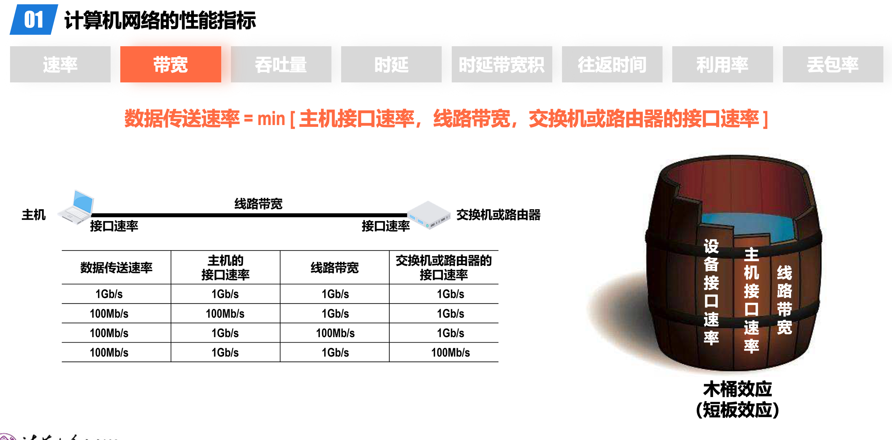
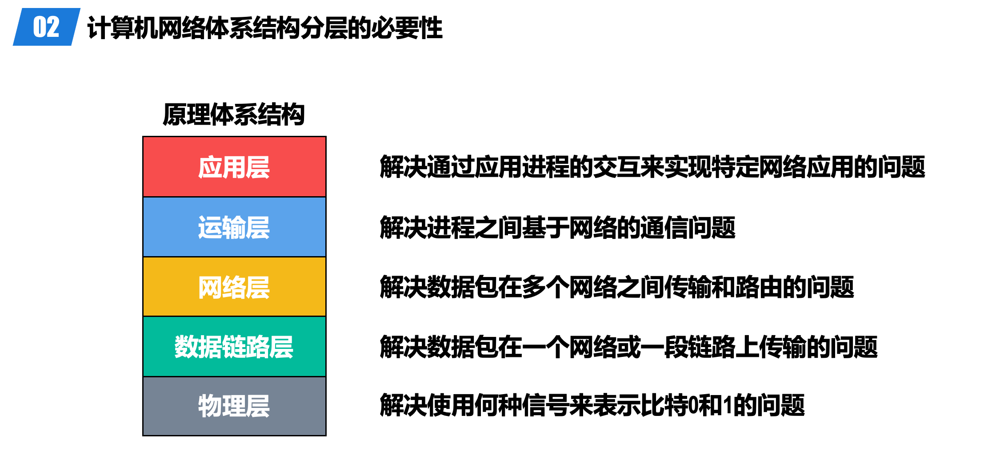
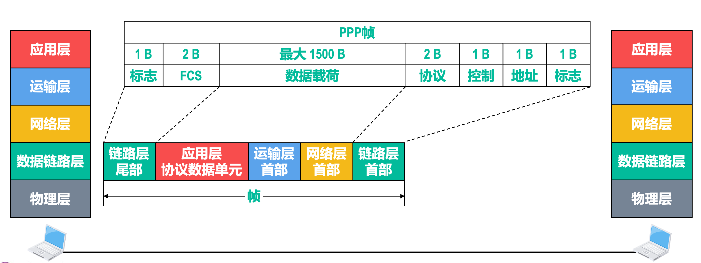
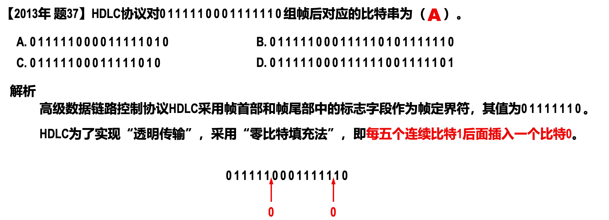
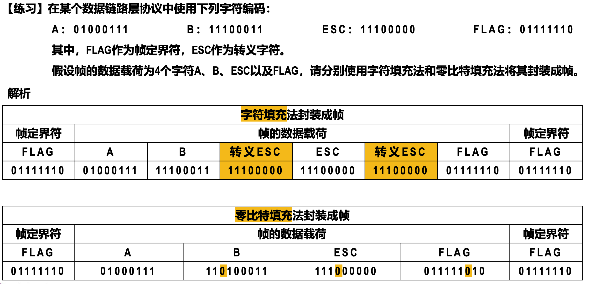
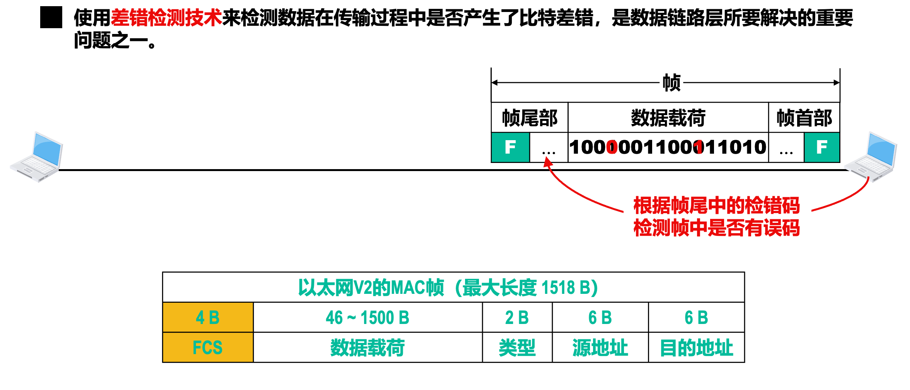
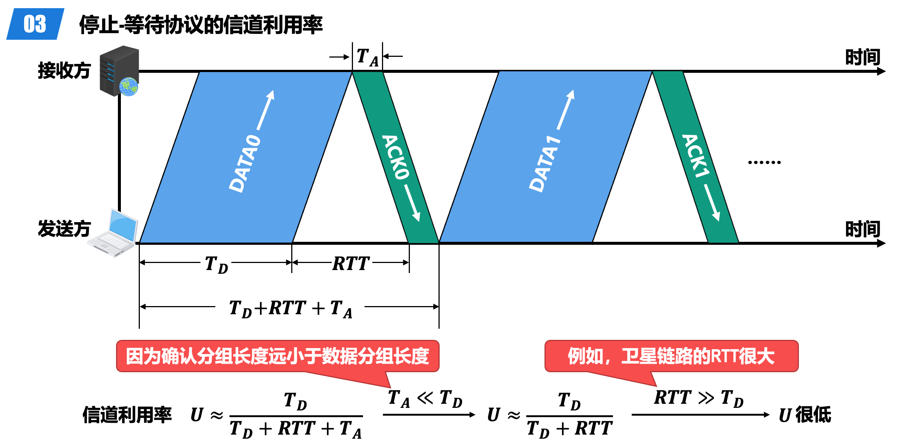
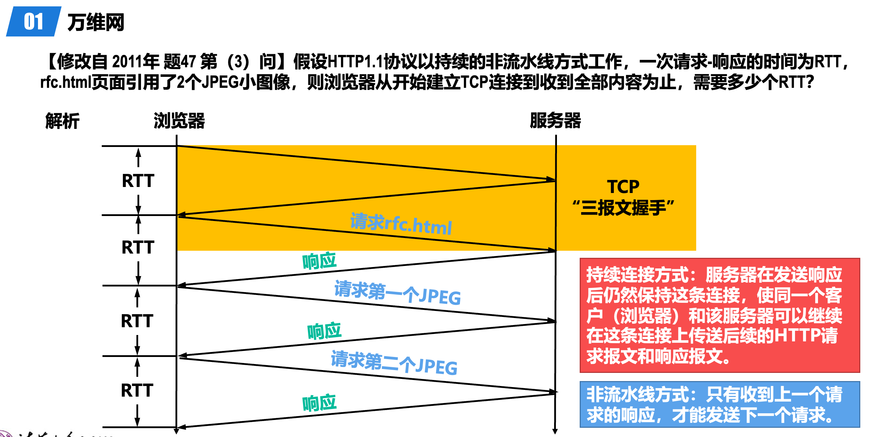

# 概述

## 计算机网络性能指标

RTT

## 层次结构

物理层有前导码

三要素

> 语法-头部格式

# 物理层

> 差分，有跳变表示0

> 码间串扰

奈斯准则 - 求的都是信息传输速率

> 数据传输速率(比特/秒)=波特率 * log V(底为2,比特/码元)
>
> 

信道复用

不同站点之间码片序列正交 

> 叠加之后发过去

> 分别内积拿出自己对应的数据比特，如A

为0 就是没有收到

# 数据链路层

## 概念

> 路径就是多条链路

> Frame 帧

## 三个KEY

> 封装成帧和透明传输、差错检测、可靠传输
>
> 

## 封装成帧

> 前导码中含有帧界定符

> MTU 最大传输单元 1500B

> 因为其帧界定符为01111110，六个1，因此每5个后面插入一个就可以不会被认定为帧界定符 

> 字符填充就是在前面加转义字符，零比特填充就是按照帧界定来--每5个1填充0

## 差错检测

> 异或
>
> 不要忘记最后一个1
>
> 检查就是把接受到的数据算冗余码，然后比较最后三位是否一样

## 可靠传输

> 考试常考

> 后退N帧

> 实际上是求最大时延问题的转化
>
> 注意:一个数据帧就是1000B

> 大致快速浏览

> 选择重传没有采用累积确认

## PPP

# 传输层

16bit 0～65535

三次握手

四次挥手

### TCP流量控制与拥塞

慢开始和避免算法

快重传和快恢复

连续收到三个重复 确认

可靠传输

# 应用层

## DHCP

> 应用层 使用UDP

## 域名

## FTP

控制连接一直打开 TCP

21端口-控制连接

20端口-数据连接 - 主动模式下，服务端向客服端发起 -被动模式由客服端和服务端自行决定，且为客服端发起

## 电子邮件

读取除了POP3，端口110，还可以用IMAP4，端口143都是基于TCP连接

MIME也适合HTTP

 

直接看PPT
