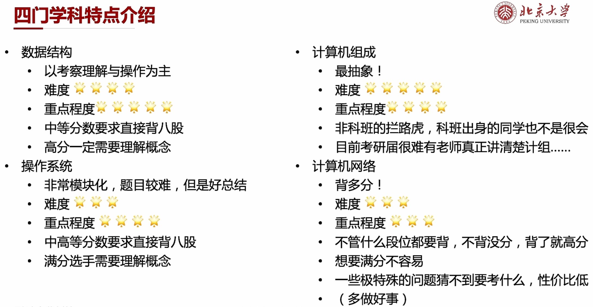
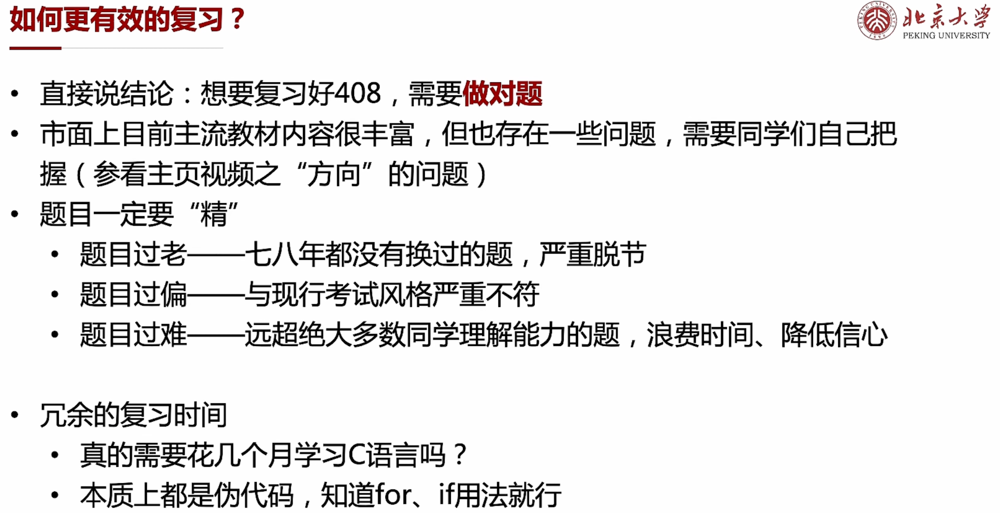
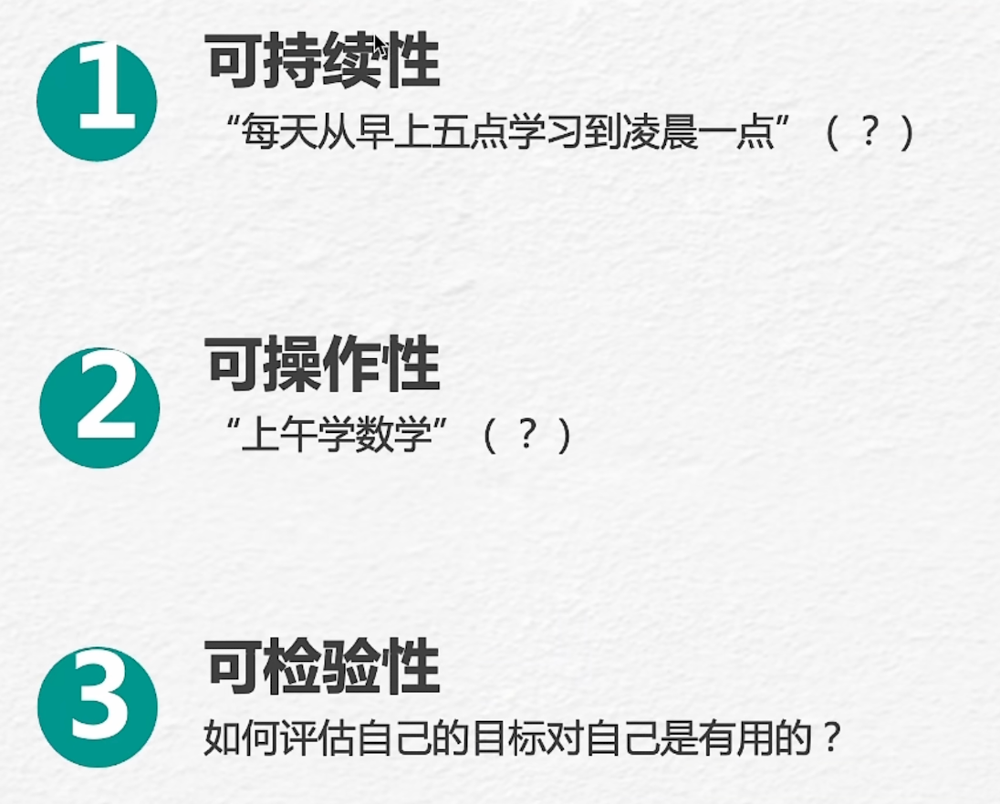
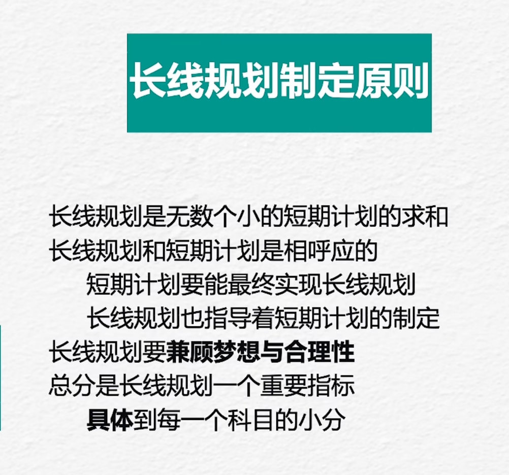

1. 目标设定：明确要实现的目标，确保目标具体、可衡量、可实现和与整体愿景一致。
2. 目标分解：将主要目标分解为具体的、可操作的子目标，以便更好地管理和实现它们。
3. 优先级排序：根据目标的重要性和紧迫性，确定每个目标的优先级，以确保资源的合理分配。
4. 制定行动计划：为每个目标制定详细的行动计划，包括具体的任务、时间表、责任人和资源需求。
5. 资源分配：分配适当的资源，包括人力、财力、技术和设备，以支持目标的实现。
6. 监测和评估：定期监测目标的进展，并进行评估和调整。识别问题和挑战，并采取必要的纠正措施。
7. 激励和奖励：提供适当的激励和奖励机制，以鼓励团队成员积极参与和实现目标。
8. 持续改进：不断反思和改进目标规划过程，以提高效率和成果。

落地：

- 目标要落实
- 目标要具体
- 目标要实际
- 目标要极限

短期目标：一天或者一周--具体到每个时间段

- 可持续
- 可操作
- 可检验

长期目标：

- 无数个小目标
- 兼顾梦想和合理性
- 总分是个重要指标
- 具体到每个科目的小分

好的规划：

- 一个刚刚好可以完成
- 做完有成就感
- 自己最合适

“三天一个单位”--一天学习+一天做题+一天复盘/预习

> 针对408每个章节

比较稳的分数400

- 数学：130 
- 408：120
- 英语：75
- 政治：75

| 日期   | 时间            | 学习内容                      |
| ------ | --------------- | ----------------------------- |
| 第一天 | 下午1:00 - 1:45 | 学习3.1 存储器概述            |
|        | 下午1:45 - 2:30 | 学习3.2 主存储器              |
|        | 下午2:30 - 3:00 | 复习前面学习内容，整理笔记    |
| 第二天 | 下午1:00 - 1:45 | 学习3.3 主存储器与 CPU 的连接 |
|        | 下午1:45 - 2:30 | 学习3.4 外部存储器            |
|        | 下午2:30 - 3:00 | 复习前面学习内容，整理笔记    |
| 第三天 | 下午1:00 - 1:45 | 学习3.5 高速缓冲存储器        |
|        | 下午1:45 - 2:30 | 学习3.6 虚拟存储器            |
|        | 下午2:30 - 3:00 | 复习前面学习内容，整理笔记    |

