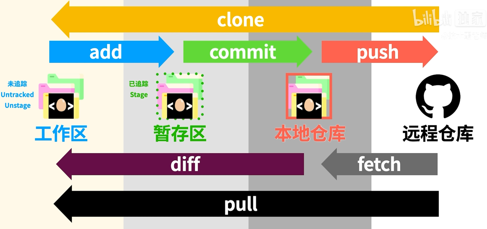

# Troy_Notes

```python 
# Github 上传 简易上传
echo "# Troy_Notes" >> README.md   
git init
git add . # 要上传到文件或者文件夹
git commit -m "重新创建文件夹"  # 上传时给的备注
git remote add origin https://github.com/TuTroy/Troy_Notes.git # 建立连接
git push -u origin master # 上传到master分支
```



~~~bash
#设置个人信息，以便知道是谁操作
git config --global user.name "Troy Tu"
git config --global user.email 1139129258@qq.com
git init # 告诉文件夹需要进行版本控制
echo "README.md" >> README.md
git status # 查看当前状态
git add README.md # 把文件从工作区加到缓存区
git commit -m "version1" # 也可以git commit 进入vim操作
git log # 查看日志 q退出
touch .gitignore # 创建忽略的文件，讲要忽略的文件名+后缀写进去
git branch XX # 创建分支
git branch # 查看是否创建成功
git checkout XX # 切换到分支名上
git branch -D XX # 删除分支 -d 会提示确定 -D直接删除
git commit -a -m "XX" #-a参数可以将所有已跟踪文件中的执行修改或删除操作的文件都提交到本地仓库
git checkout -b XX # 创建并进入新分支
git merge XX1 # 在当前分支把XX1分支合并过来
git commit -am "XX" # 直接提交到本地仓库
## 拷贝
git clone "https://XX" 
git remote -v # 查看本地仓库和远程仓库有什么联系
origin --默认表示远程仓库的名字 push的时候用origin代替url
git push # 之后输入用户名 和token settings-->Developer settings生成
git fetch # 更新到本地，暂时不会发生变化
git diff origin/master # 本地和远程仓库的区别
git pull # 直接到工作区
git checkout branch2 -- XX #把另个分支的文件XX移到当前分支

~~~

