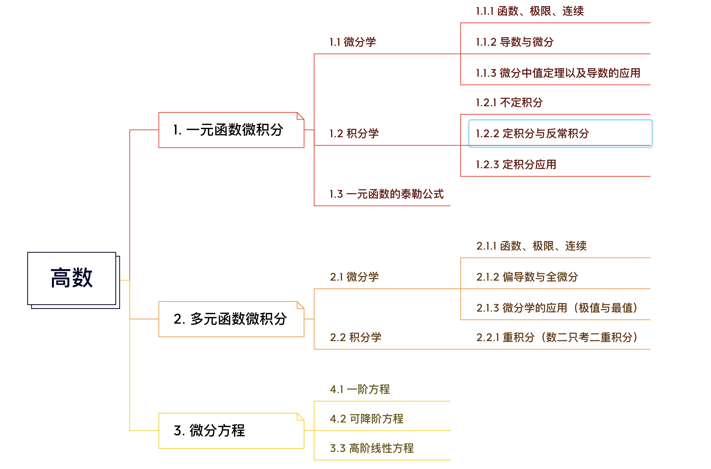

# 整体总结

> 整体复习进度：
>
> - 大部分时间都放在408上面，但是学的也是懵懵懂懂的，没有对知识点有很好的巩固。
> - 数学虽然每天都分配了不少的时间，但是因为没有总结也是学完就忘记了，感觉很空，有时候过于赶进度了
> - 英语和数学一样，报的外刊班，虽然打卡在跟，但是学完就忘记。
>
> 总结
>
> - 数学和英语虽然花时间了，但是没有花心思，导致学一点忘记一点，特别是数学占比高还不重视，为了使复习效果更好，需要对每一科都有清晰的复习方向。需要花时间总结归纳。
> - 归纳太少。每天晚上学完之后没有对单天学习内容进行总结，导致学完就忘记了，这样使得自己复习不踏实，也没有对知识有个很好的巩固。现在需要每天进行总结。
> - 总结方法。写日报周报月报--坚持下去，格式在过程中不断形成。

# 政治

还没有开始，计划八月中下旬开始，打印徐涛笔记，利用碎片时间看课程-配合1000题。

# 英语

回顾

---

单词：这个月没有好好背单词，因为总是感觉记不住，记了也没用，而且APP一直复习之前的单词，发现之前的都记不住了。

阅读：外刊课程结束了，但是掌握的并不是很好，这个需要专门抽时间把里面生词、词组搭配、句式表达，以及写作技巧总结成一个md文件。

作文：没有开始，不知道从何下手，需要找一个老师进行学习。

计划

---

单词：还是要增加背单词的时间，第一个目标先把之前的单词背熟，第二个是需要补充词汇，通过阅读将生词进行补充-最好能结合英英释义和情节例句进行记忆(需要坚持，这样后面就会快起来的，加油！)

阅读：学习做题方法，精读阅读文章2010-2020---共四十篇，规划坚持精读8篇--两天一篇，后面做题为一天两篇。

作文：找到考试主题进行归纳总结，将阅读积累的词组句式进行对应。训练两次。

# 数学

回顾

---

高数：自从上次总结之后，没有动过高数-学到了极限、泰勒公式-有遗忘，需要得到重视，这次需要提高 高数的 复习时间占比。

线代：尽量结束线代最后一章内容。线代内容过多，很多概念以及技巧容易弄混，需要加强总结归纳和抽时间记忆。

计划

---

高数：八月前完成一元微分学的内容--即导数、微分中值定理的证明题。

线代：八月前结束一轮复习，然后结合错题进行总结。

# 408

## DS

回顾

---

一个多月没有复习了，忘的差不多了。之前线性表到队列串的几章没有学好，这轮复习结合蓝蓝的算法练习，把基础进行巩固和归纳。

计划

---

月底前重点复习线性表内容，并整理成笔记。

## OS

回顾

---

结合机组学习了内存管理和I/O管理，之前学到的进程没有学完。总共还剩下进程系统和文件系统没有学。

计划

---

月底前学完进程、文件系统两章，下个月开始强化。

## CO

回顾

---

计组一轮结束，运算那一张的题目没有学会，乘法什么的也没有学会，需要重新学习。

计划

---

做大题为主，将重要知识点进行串记整理。

## CN

回顾

---

学到链路层，后面的都没有学，最重要的传输层和网络层还没有开始。

计划

---

计网需要记忆的多，学完一章就通过错题和知识点进行总结。一定要总结，这样才更快。

# 计划

> 到月底--一周计划
>
> 到星期天共 6天

| 科目 | 计划                                                         | 时间 | 备注 |
| ---- | ------------------------------------------------------------ | ---- | ---- |
| 数学 | 相似矩阵1天，二次型2天，所有整理1天，高数极限整理1天，导数整理1天 | 7.30 |      |
| 英语 | 单词每天早上记忆一个小时（其他时间见缝插针），晚上精读一篇阅读（本周3篇），其他时间整理外刊内容md文件。 |      |      |
| DS   | 线性表的定义 1天 顺序表2天，链式表3天，每天蓝蓝的一题，c语言基础有需要整理 |      |      |
| OS   | I/O设备整理1天，文件系统先完成3天，进程2天                   |      |      |
|      | 尽量完成！！！ 每天写日报。复盘总结--加在跑步这个好习惯前。  |      |      |

