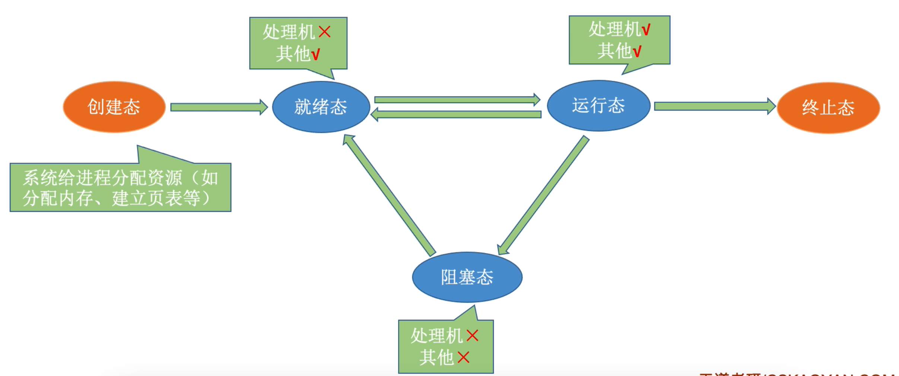
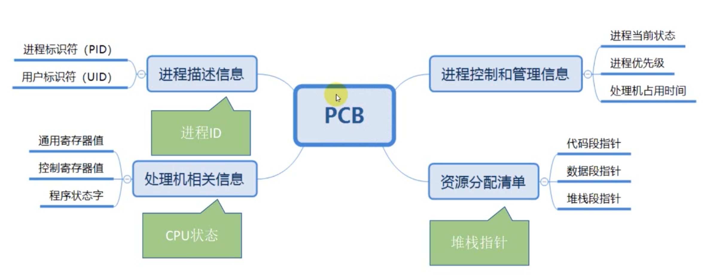
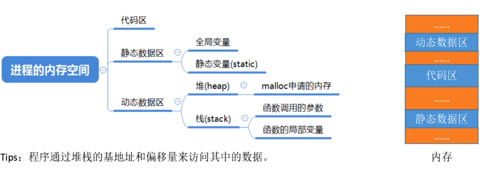
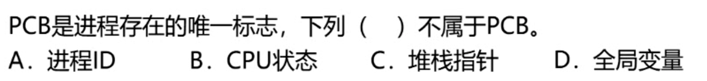
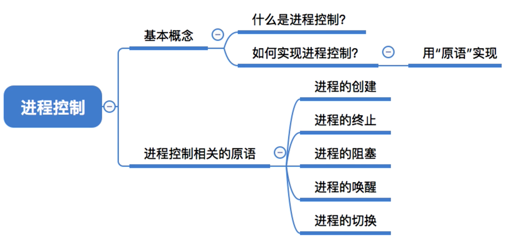

# 第2章 进程与线程
## 2.1进程与线程
### 2.1.1 进程的概念和特征
### 2.1.2 进程的状态与转换

### 2.1.3 进程的组成

> 进程：PCB、程序段、数据段
>
> 数据段：包含的是与程序逻辑本身相关的数据，如全局变量
>
> 程序段：执行的代码数据
>
> PCB：管理控制进程所需的参数一定放在PCB

答案【D】

### 2.1.4 进程控制

### 2.1.5 进程的通信
### 2.1.6 线程和多线程模型
## 2.2处理机调度
### 2.2.1 调度的概念
### 2.2.2 调度的目标
### 2.2.3 调度的实现
### 2.2.4 典型的调度算法
### 2.2.5 进程切换
## 2.3同步与互斥·
### 2.3.1 同步与互斥的基本概念··
### 2.3.2 实现临界区互斥的基本方法
### 2.3.3 互斥锁
### 2.3.4 信号量
### 2.3.5 管程
### 2.3.6 经典同步问题
## 2.4死锁
### 2.4.1 死锁的概念
### 2.4.2 死锁预防
### 2.4.3 死锁避免
### 2.4.4 死锁检测和解除

