# 第2章 进程与线程
## 2.1进程与线程
### 2.1.1 进程的概念和特征

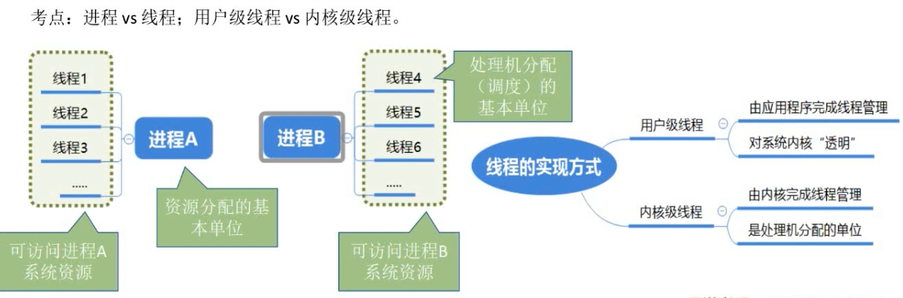

### 2.1.2 进程的状态与转换

### 2.1.3 进程的组成

> 进程：PCB、程序段、数据段
>
> 数据段：包含的是与程序逻辑本身相关的数据，如全局变量
>
> 程序段：执行的代码数据
>
> PCB：管理控制进程所需的参数一定放在PCB

 

答案【D】

### 2.1.4 进程控制

### 2.1.5 进程的通信

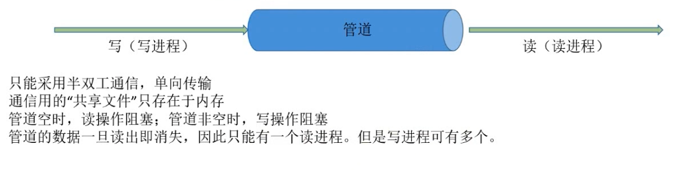

### 2.1.6 线程和多线程模型
## 2.2处理机调度
### 2.2.1 调度的概念

> 对处理机进行分配--就绪队列按照**一定算法**选择一个进程将处理机分配给她

#### 三个层次

- 高级调度 -- 作业调度 -- 频率最低
- 中级调度 -- 内存调度 -- 频率其次
- 低级调度 -- 进程调度 -- 频率最高

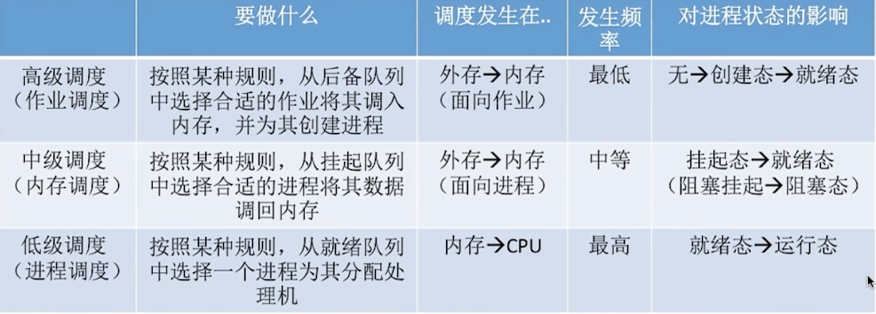

#### 进程的挂起与七状态模型

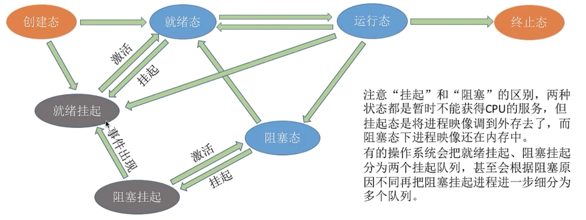

### 2.2.2 调度的目标

#### 评价指标

1. CPU利用率 = 忙碌时间/总时间
2. 系统吞吐量：单位时间内完成作业多数量
   - =总共完成了多少道作业/总共花了多少时间
3. 周转时间：从作业被提交给系统开始到作业完成为止
   - 周转时间=作业完成时间- 作业提交时间
   - 平均周转时间=各作业周转时间之和/作业数
   - **带权周转时间=作业周转时间/作业实际运行时间( >=1)**
   - **平均带权周转时间=各作业带权周转时间之和/作业数**
4. 等待时间：作业/进程处于等待处理机状态时间之和
   - 
5. 响应时间：用户提交请求到首次响应的时间

### 2.2.3 调度的实现

#### 进程调度的时机

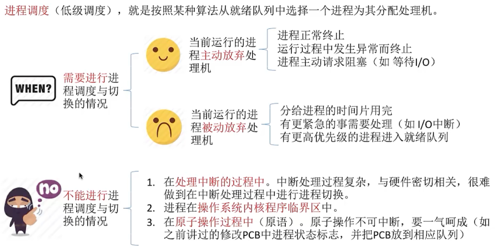

进程在**操作系统内核程序临界区**中**不能**进行调度与切换

> 临界资源：一个时间段内只允许一个进程使用的资源。各进程需要互斥的访问临界资源。
>
> 临界区：访问临界资源的那段代码

> 内核程序临界区一般是用来访问某种内核数据结构的，比如进程的就绪队列。
>
> 普通的临界区--如打印机，可以进行进程调度也切换的。

#### 进程调度方式

- 非剥夺调度方式--非抢占方式
  - 适合早期的批处理系统
- 剥夺调度方式--抢占方式
  - 适合分时、实时操作系统

### 2.2.4 典型的调度算法

> 1. 算法思想
> 2. 算法规则
> 3. 用于作业调度还是进程调度
> 4. 抢占式还是非抢占式
> 5. 优缺点
> 6. 是否会饥饿：某进程/作业长期得不到调用

#### 先来先服务（FCFS）

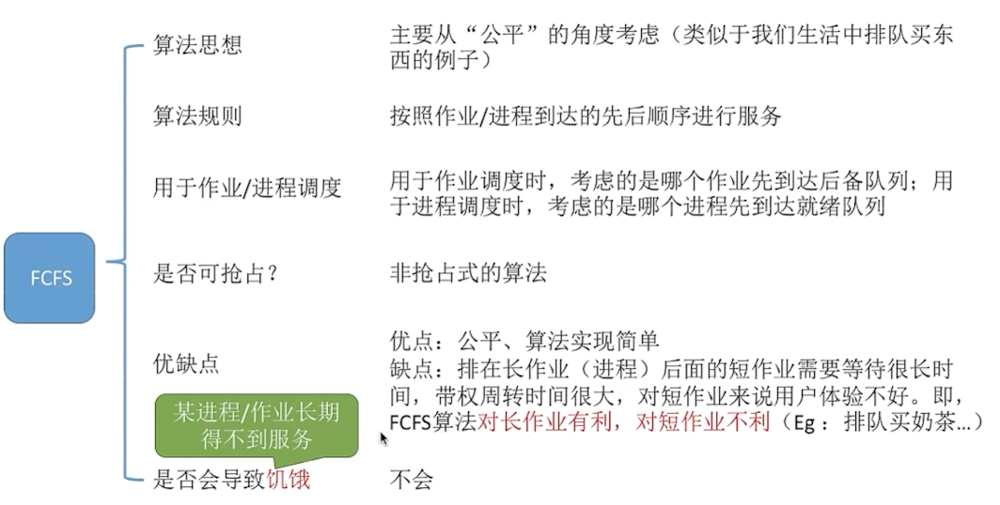

#### 短作业优先（SJF）

> 每次调度时选择**当前已达**到且**运行时间最短**的作业/进程
>
> 

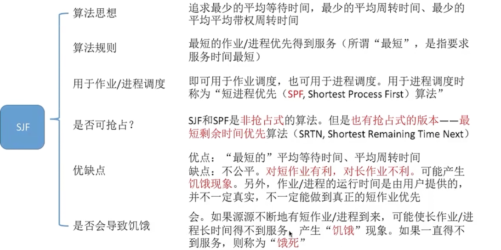

  

#### 高响应比优先（HRRN）

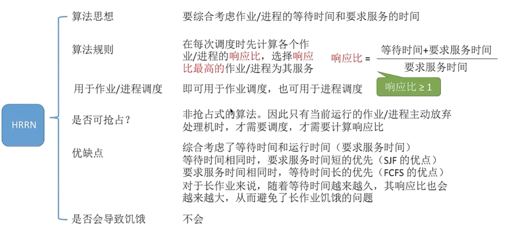

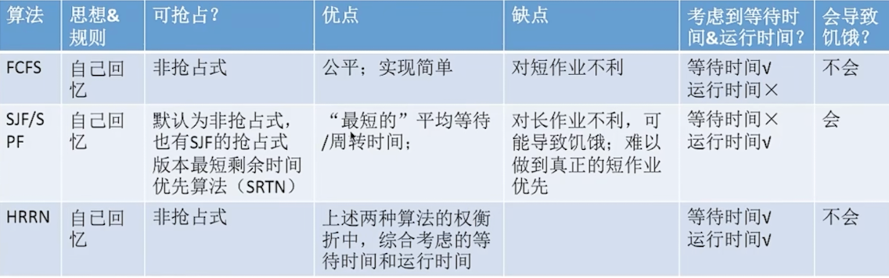

#### 时间片轮转调度算法（RR）

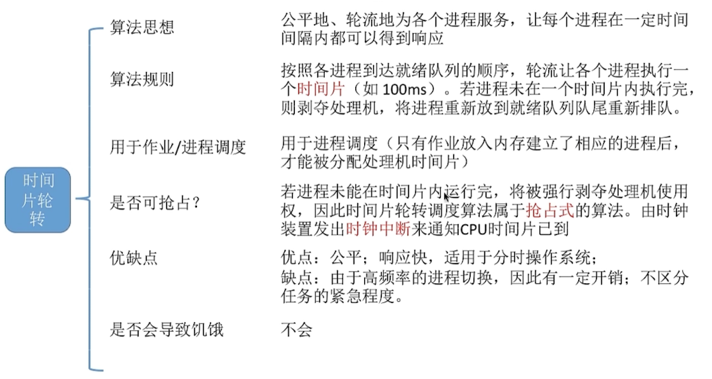

#### 优先级调度算法

> 非抢占式优先级调度算法：每次调度时选择当前已到达且优先级最高的进程。当前进程主动放弃处理机时发生调度。
>
> 抢占式优先级算法：除非抢占式，当就绪队列发生改变时也需要检查是否会发生抢占。
>
> 优先级：静态优先级和动态优先级
>
> 系统进程优先级高于用户进程、前台进程优先级高于后台进程、操作系统更偏好I/O进程

#### 多级反馈队列调度算法

> P2优先级低于P3时，会将抢占CPU，此时P2没有运行完，会返回到第二级队列
>
> 若第三级队列上的进程使用完CPU之后，没有结束会继续排在第3级队列后面

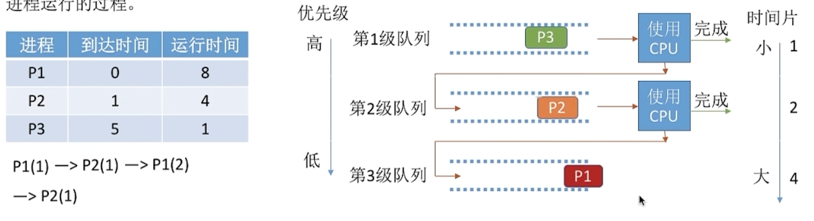

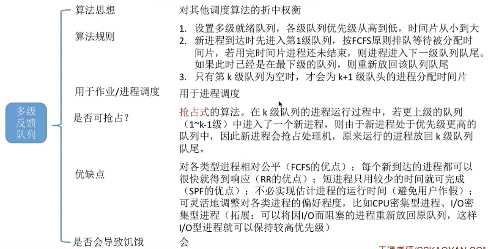

 

#### 多级队列调度算法

> 多个队列优先级：系统进程>交互式进程>批处理进程
>
> 分配时间50%，40%，10%
>
> 不同队列可以采取不同的调度策略

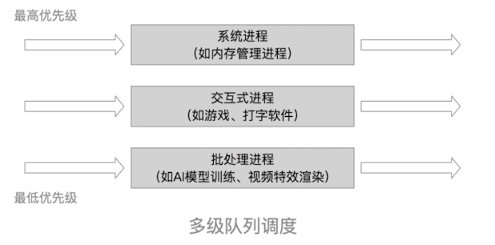

### 2.2.5 进程切换

#### 进程切换与过程

> 1. 保存原来运行的各种数据 数据-->PCB
> 2. 对新的进程各种数据的恢复 PCB --> 数据
>
> 进程切换是有代价的，不可过于频繁。

## 2.3同步与互斥·
### 2.3.1 同步与互斥的基本概念

> 临界资源：一段时间内只允许一个进程使用，进程互斥访问。如物理设备（摄像头、打印机）

同步：进程之间直接合作

互斥：

~~~c
do {
  entry section; //进入区 可进入，则设置正在访问临界资源的标志（“上锁”） 
  critical section; //临界区 访问临界资源的那段代码
  exit section; // 退出去 解除正在访问临界资源的标志（“解锁”）
  remainder section; // 剩余区 其他处理 
} while(true)
// 临界区是访问临界资源的代码段
// 进入区和推出区市负责实现互斥的代码段
~~~

原则

- 空闲让进
- 忙则等待
- 有限等待
- 让权等待

### 2.3.2 实现临界区互斥的基本方法

> 重要‼️
>
> - 单标志法
> - 双标志先检查
> - 双标志后检查
> - Peterson 算法

#### 

### 2.3.3 互斥锁
### 2.3.4 信号量
### 2.3.5 管程
### 2.3.6 经典同步问题
## 2.4死锁
### 2.4.1 死锁的概念
### 2.4.2 死锁预防
### 2.4.3 死锁避免
### 2.4.4 死锁检测和解除

