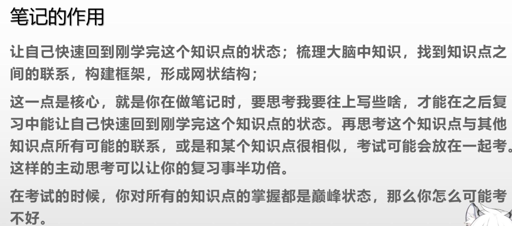

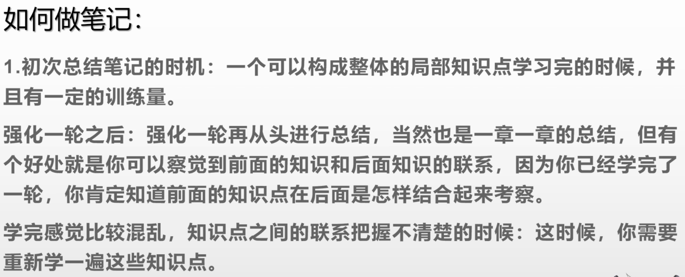

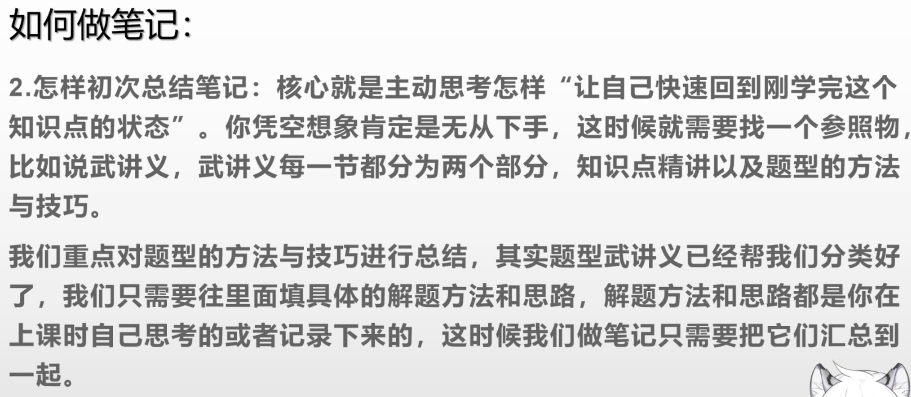

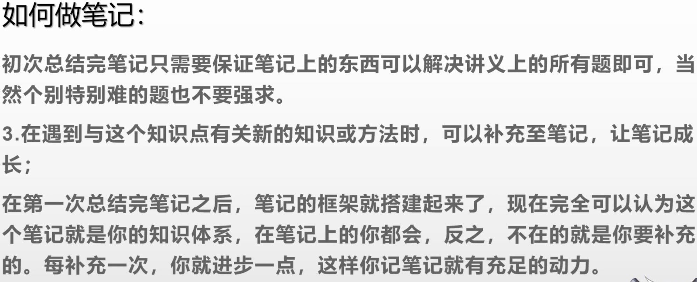

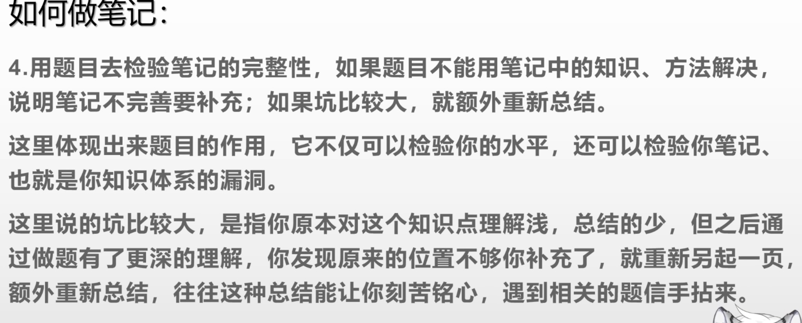

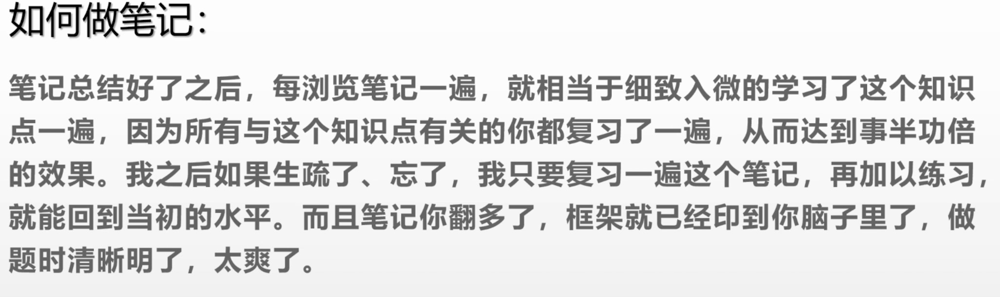

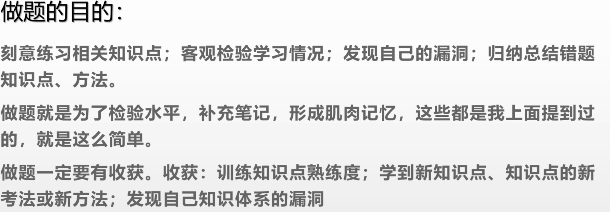

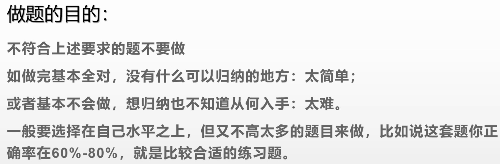

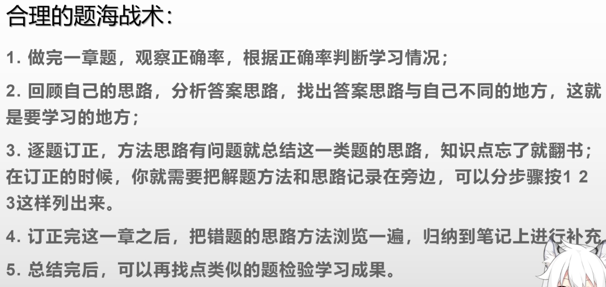

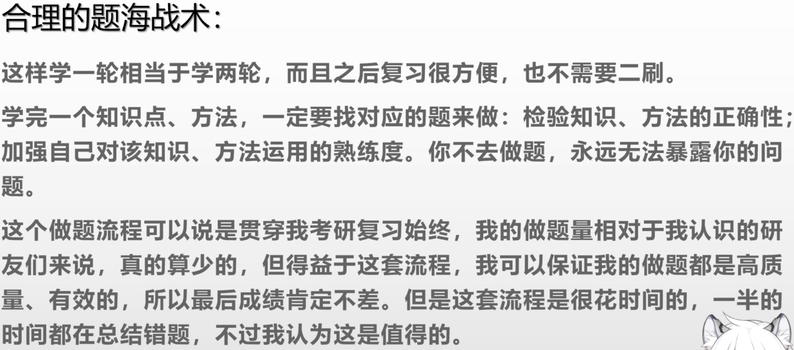

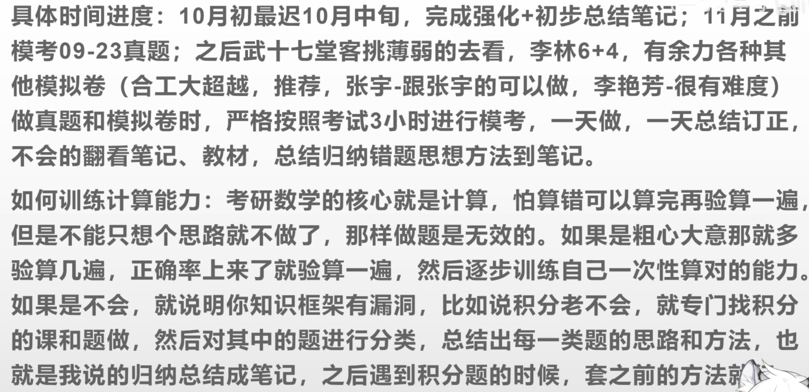

- 笔记作用：让自己回到刚学完这个知识点的状态，构建知识点之间联系，形成自己的框架
- 笔记时机：学完知识点，并且有一定的做题量之后
- 核心：
  - 思考怎样做笔记让自己回到刚学习知识点的状态---可以重点对题型和技巧进行总结
  - 遇到与笔记知识点相关的新的知识点需要进行补充
  - 用题目检验笔记点完善性，如果不能用笔记上的知识解决就需要补充必要时重新整理
- 做题方法（会做的在60%-80%）
  - 做完一章题，根据正确率判断学习方法
  - 回顾自己的思路，分析答案的思路，对比不同就是要学习的地方
  - 逐题订正，把解题方法和思路积累在旁边--可以分步骤
  - 订正完成后，把错题的思路浏览一遍，积累到笔记本
  - 总结完成再找类似的题目检验

我通过百度网盘分享的文件：22计算机导图p...
链接：https://pan.baidu.com/s/1X-37_m9IyitmnZ04EBAOvw 
提取码：Kg4y 
复制这段内容打开「百度网盘APP即可获取」