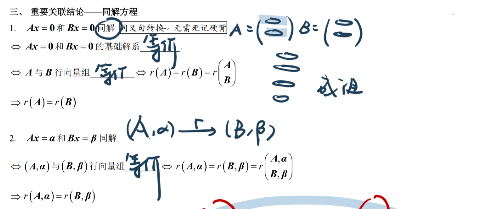
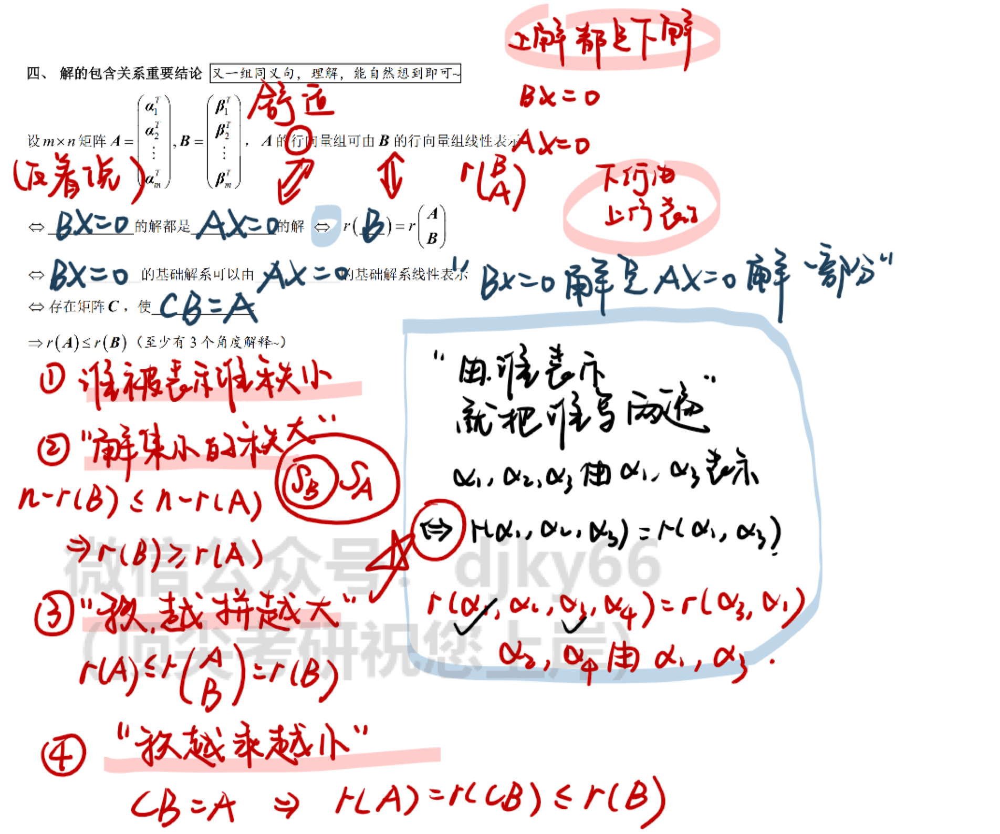
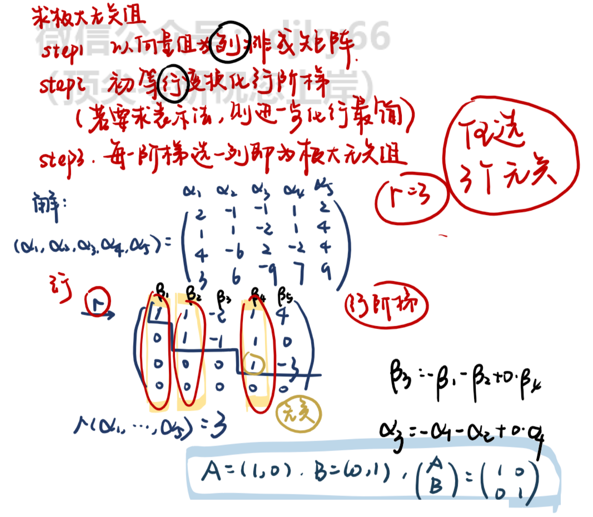
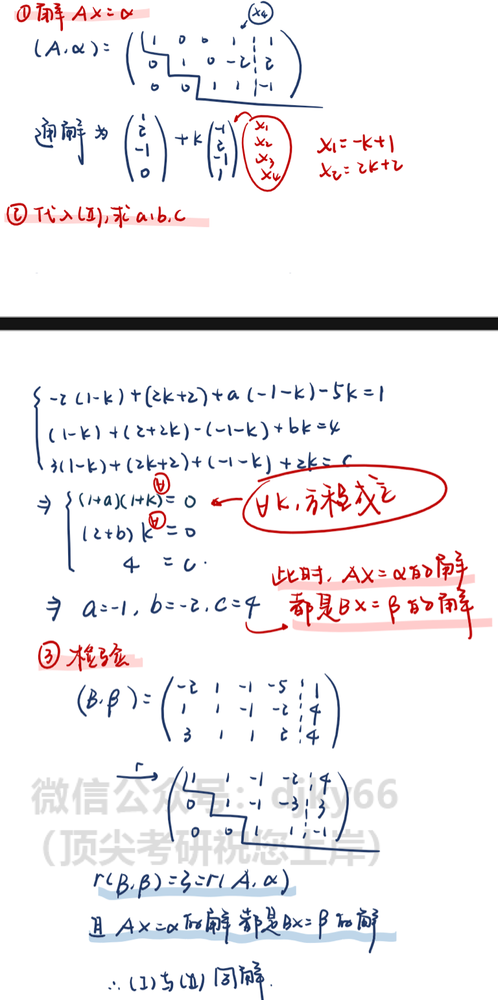
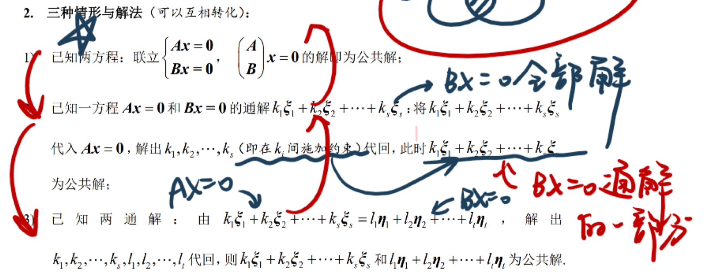
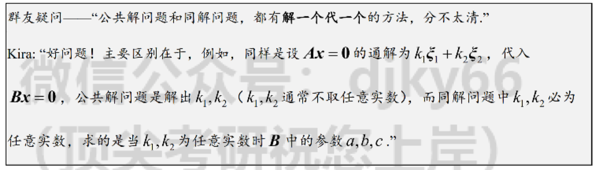
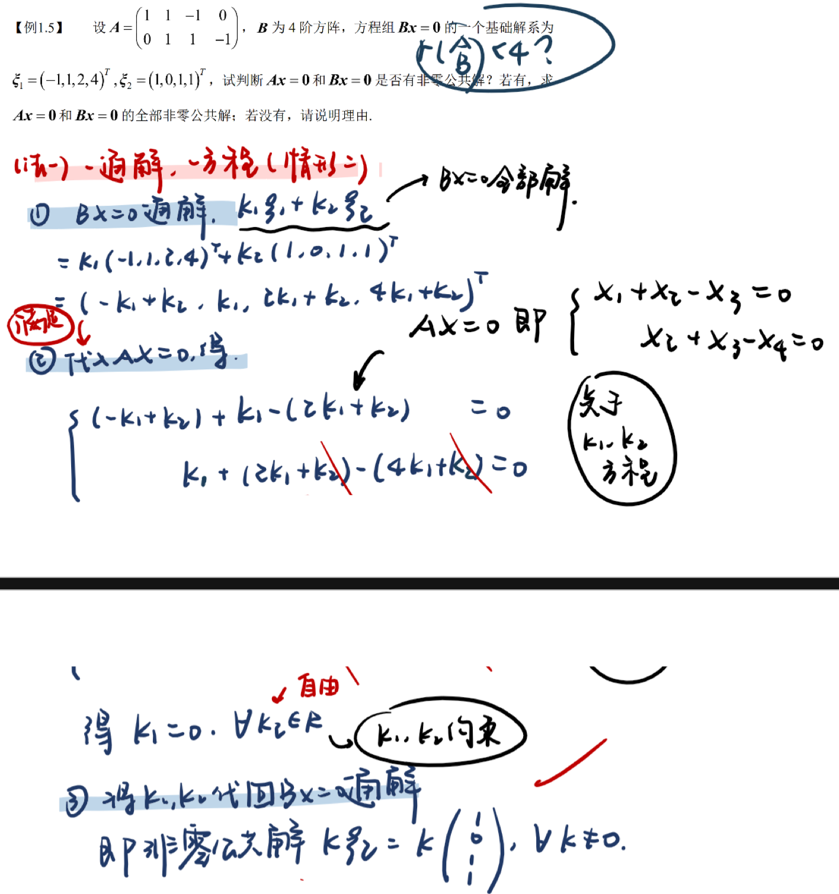
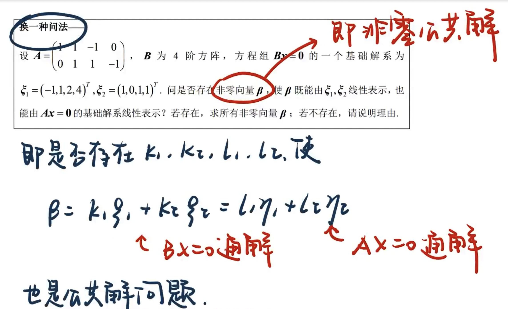
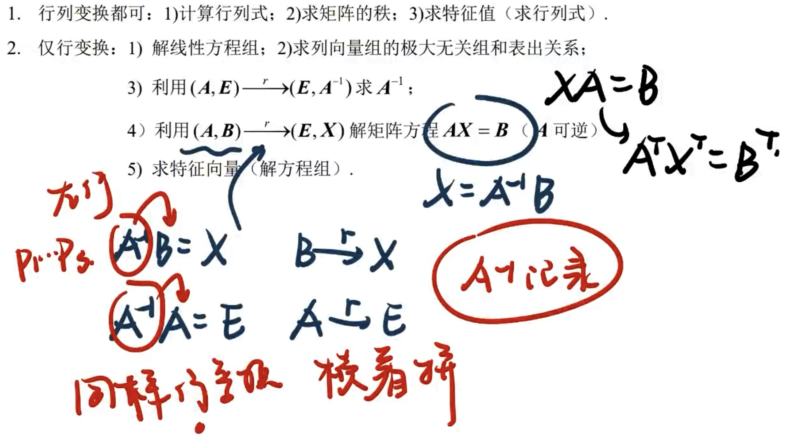
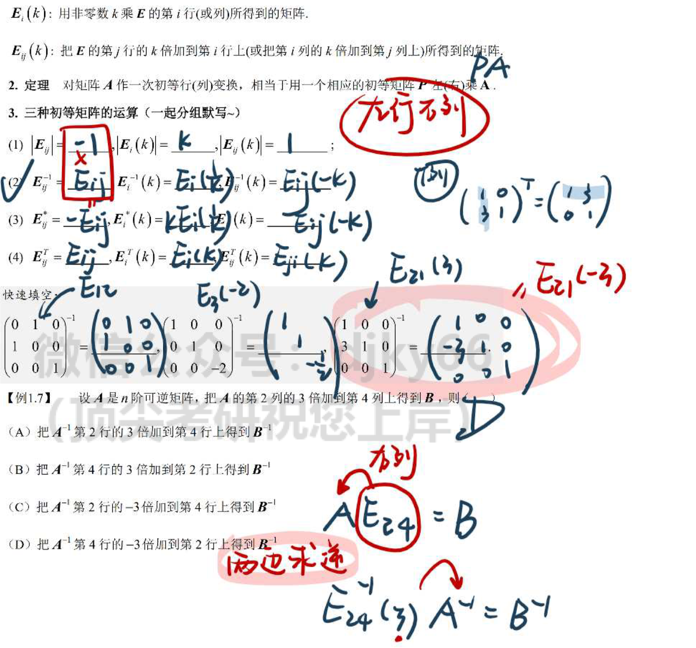

##  同解

> A经过初等行变换成B <==> AX=0,BX=0同解 <==> A、B行向量等价
>
> 同解找行 如果题目给列，想到转置
>
> 有行变换就有同解

> 理解：
>
> 本质上是线性方程组的变化，无论是齐次还是非齐次都可以用一个矩阵块包起来，然后对矩阵进行操作。
>
> 对矩阵进行行变化，相当于对两个方程式进行操作，相当于对矩阵的行向量进行操作。
>
> 对于行向量这里，可以理解为变换之后的行向量可以由之前的行向量线性表示(对之前第几行*多少+下一行)
>
> AX=0，BX=0同解，也就是A,B之间可以通过行变换相互转化，本质上还是一个方程组，只不过是阶段不同，所以他们的基础解系等价，这时候他们之间的行向量也必然等价，继续推出r(A)=r(B)=AB竖着排的秩(这是因为可以通过行变换消去另一个).注意以上都是充分必要条件，可以互推。这里如果只是有r(A)=r(B)是不能推出AX=0和BX=0同解的，因为不能保证A B之间可以通过行变换进行转化。
>
> 如果题目给出的是列变换，一般要用到转置，变成行变换，这样才能使用上面的结论。
>
> 再回忆一下，同解问题--三秩相等--行向量等价-- 齐次和非齐次同样处理

## 解的包含

> 这个是我经常弄不清楚的地方，表示问题
>
> 同样针对行向量，转化为同解问题
>
> A的行向量可以用B的行向量表示<==>反着说BX=0的解都是AX=0的解(我能由你表示，那你的解就都是我的解了，你的解系也就是我的解系)<==>r(B)=AB竖着排的秩(由谁表示就把谁写两遍，这里是B)<==>存在矩阵C，CB=A(A的行向量由B的行向量表示，记住) -->  **r(A)<=r(B)** 
>
> 强行记忆：
>
> - 谁被表示谁秩小
> - 解集小的秩大(n-r(A))
> - 秩越拼越大
> - 秩越乘越小

> 极大无关组按列排也是方便做行变换，最终等到的结果是新的列向量可以用原来的表示，也就没有改变原矩阵的性质

## 同解方程组

> 一般是求参数，先通过已知的方程组求出解，然后带入到另一个方程组中，这个时候要把已知的同解中的k当成未知数，要保证k取任意数都能保证方程有解

## 公共解

> 公共解的条件比较弱，属于求交集，公共解是先通过一个方程组求出通解，然后代入到另一个方程组，这时候是需要解出来k1 k2，这时候要求满足两个方程组。

## 初等变换

适用场景

拼命背下来 

# 行列式

