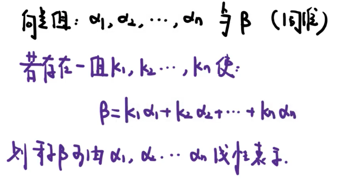
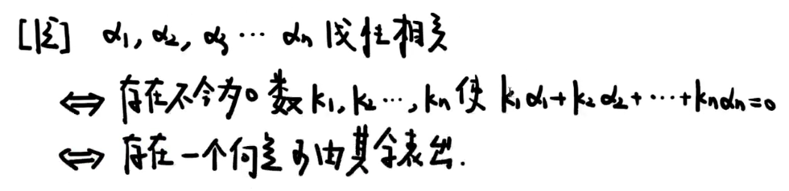
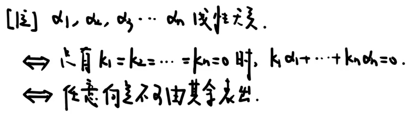
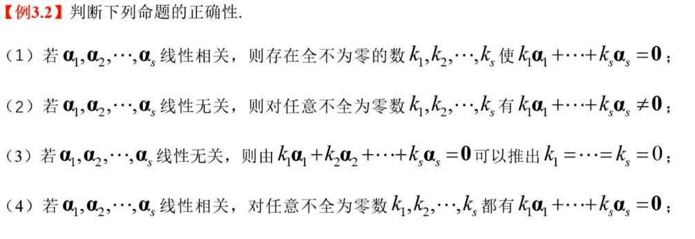
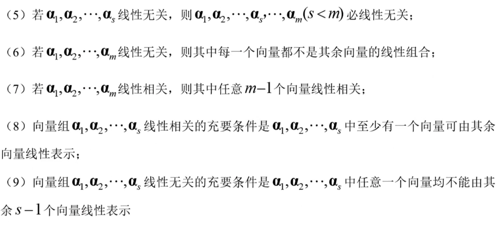

## 向量的概念

### 向量的定义

n个数a1，a2..an构成的有序数组称为n维向量

- 向量组：每个向量的维数一样

### 向量的线性运算

> 默认列向量 

## 向量的线性表出

> 向量能不能由另一个向量组表示

### 线性组合 

### 线性表出

## 线性相关/无关

> 向量组内部关系
>
> 记忆点：
> $$
> 若k_1a_1+k_2a_2+...+k_na_n=0,是否只有k_1=k_2=..=k_n=0成立？\\
> 是，无关 \\
> 否，还有其他情况，则相关。
> $$
> 

### 线性相关

$$
若存在一组不全为0的数k_1,k_2,k_3,k_4,...,k_n,使得\\k_1a_1+k_2a_2+...k_na_n=0,则称a_1,a_2,a_3,...a_n线性相关。
$$

### 线性无关

$$
若k_1a_1+k_2a_2+...+k_na_n=0,当且仅当k_1=k_2=..=k_n=0成立，\\称线性无关。
$$

【相关例题】

> 1. 全部为0❌，不全为0✅
> 2. ✅
> 3. ✅
> 4. 任意❌，存在✅

### 【重点1】

1. 局部相关可推整体相关，不能反推。
2. 整体无关可推局部无关，不能反推。

### 【重点2】

线性相关性的几何意义

1. 单个向量 α
   - 线性相关 α=0
   - 线性无关 α不为0

2. 两个向量   α β
   - 线性相关 β=kα
   - 线性无关 β不等于kα

3. 三个向量 α β γ
   - 线性相关 共面
   - 线性无关 不共面

> 5. 局部无关不能推整体无关
> 6. ✅
> 7. 任意❌，存在✅
> 8. ✅
> 9. ✅

**线性相关性的判定方法-定义法**

