## 行列式考点

### 排序与逆序数

​	逆序数：一个排序中所有逆序的总数。（小-->大）

 排序 ：1 4 5 3 2 

逆序 ：0+0+0+2+3=5 看前面有几个比它小
$$
\tau（1\quad 4\quad5\quad3\quad2）=5
$$

### n阶行列式的定义

> n阶行列式为方形-->数

计算：来自不同行不同列元素乘积的“代数和”。
$$
元素按行顺序排列，则需要求列的逆序数：
(-1)^{\tau(列)}a_{1x}a_{2y}a_{3z}..
$$

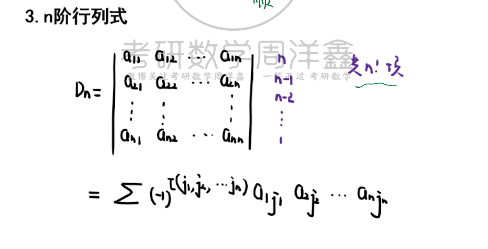

例题：

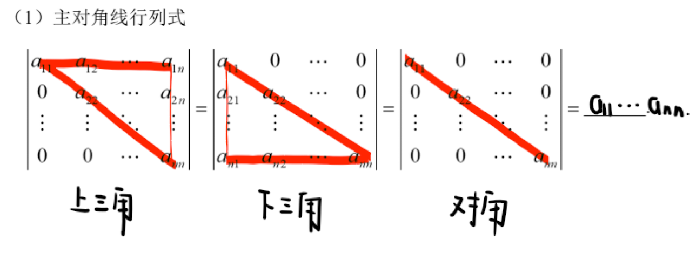

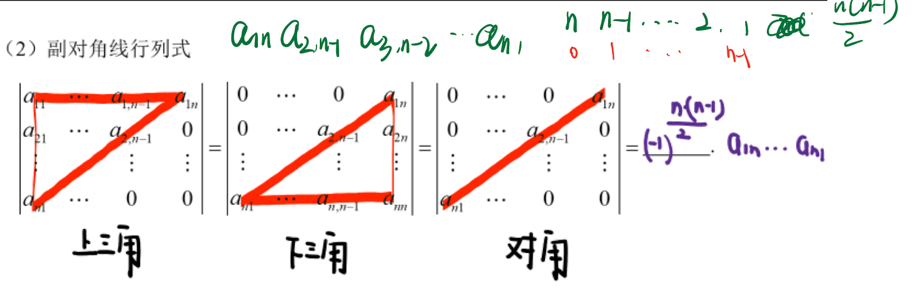

### 行列式的性质

- 转置  行列式不变
- 互换 两行互换变号 两行相同行列式为0
- 倍乘 单行（列）运算
- 倍加 某行*k + 另一行-->行列式不变 高斯消元-变成上三角
-  拆分 -单行（列）

### 余子式与代数余子式

余子式：

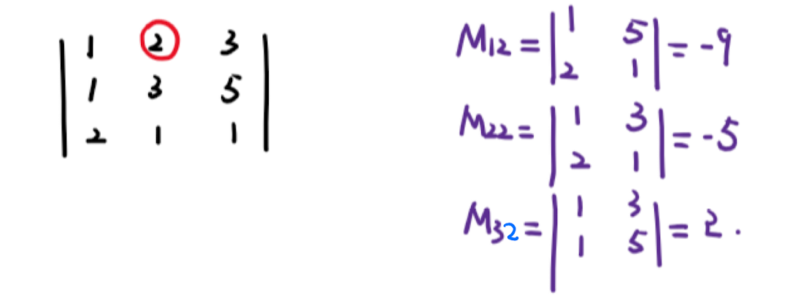

代数余子式：

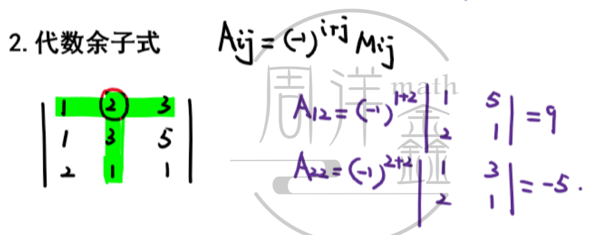

### 行列式展开原理

- 一般是首行或首列
- 0多的行、列

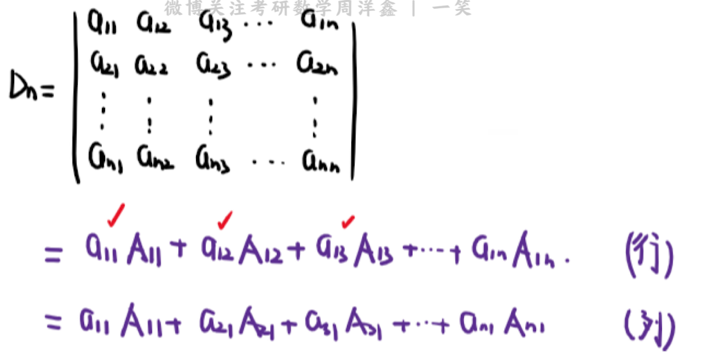

【重要考点】某行某列代数余子式线性和问题

展开某行的替换

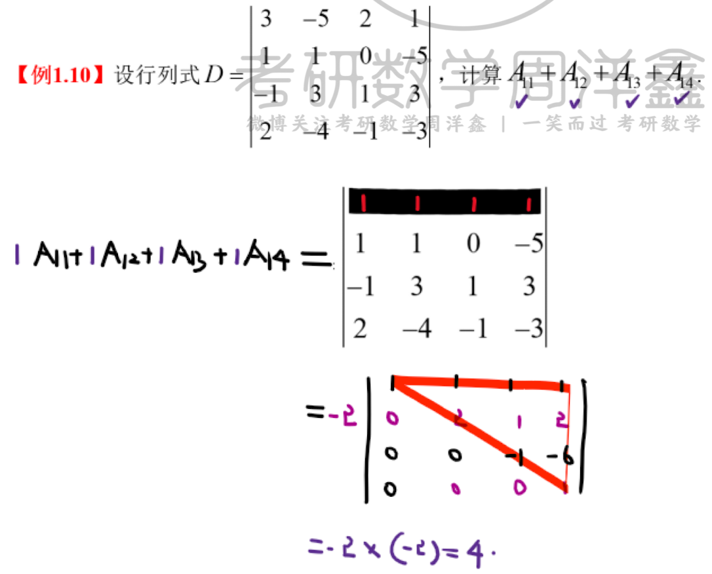

特殊情况：按不同行的元素和代数余子式展开，结果为0

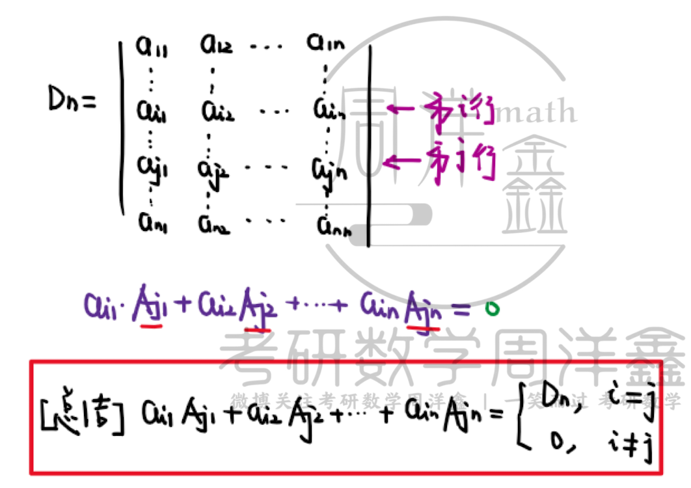

### 范德蒙行列式

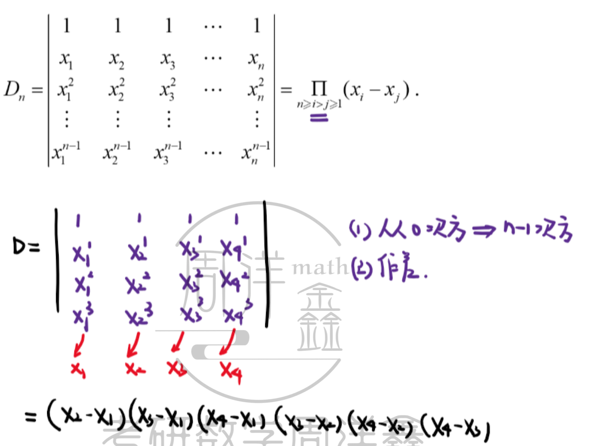

依次相减

---

## 综合计算

### 行（列）和相等型

> 各行（或各列）相加的和一样

将所有元素加到第一行（列）-->提取公因子-->按照第一行处理

高斯消元化为上三角

### 爪型行列式

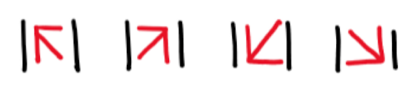

处理方法：消除一边-->三角形

### 点斜行列式

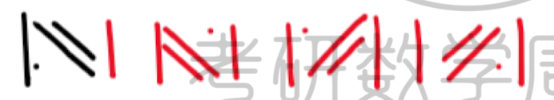

跟点走，进行行列式展开

### ！三线行列式 

递推法：

- 展开，定出递推公式

- 解递推公式，等到结果

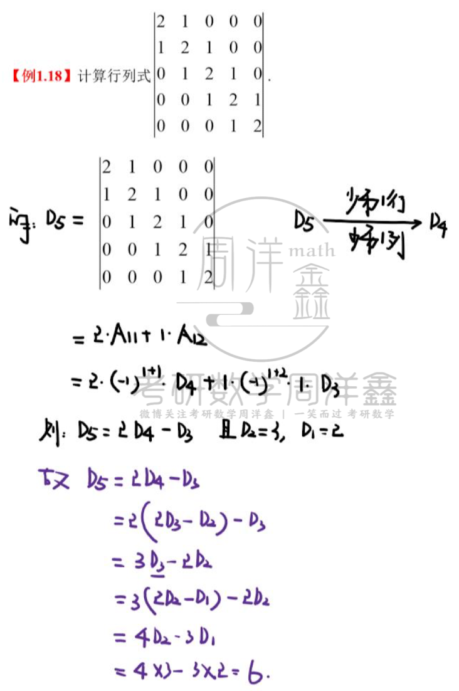

【重点】！线性递推式求解万能方法

> "待定系数法创造等比数列"

- 一阶

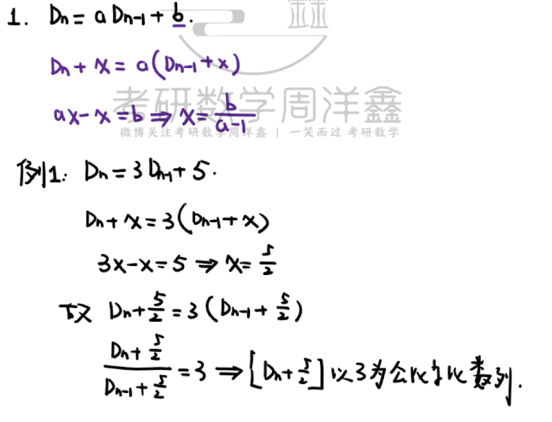

- 二阶

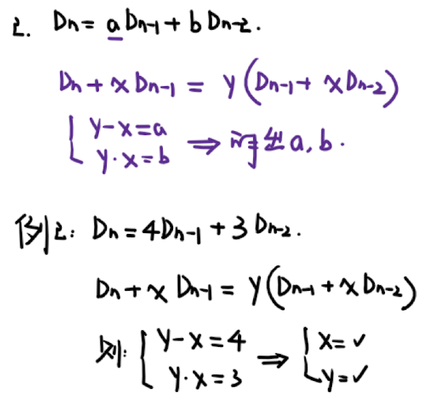

！！归纳法：

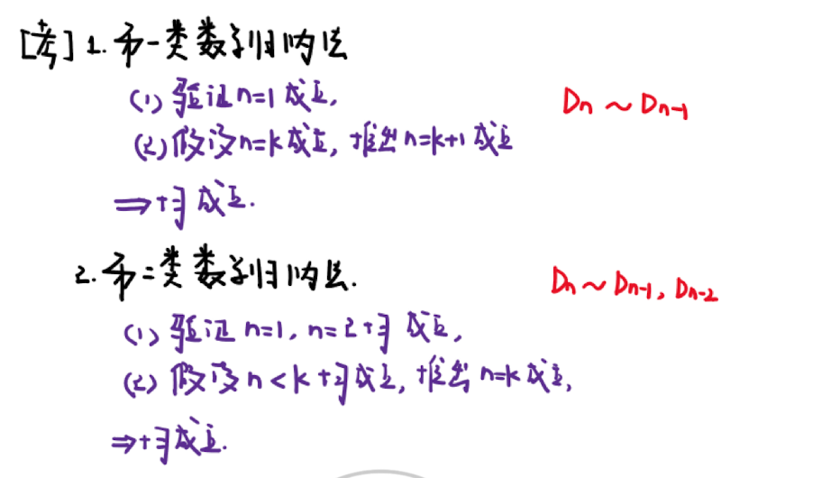

### ！！求特征值

- 对应消0成比例
- 行一下，列一下

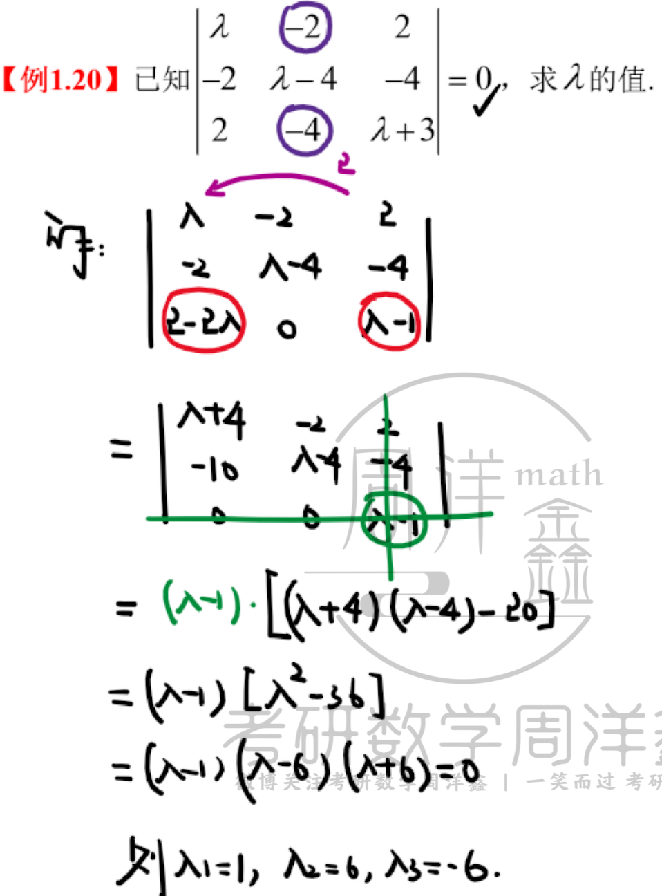

【考点】多数题目需要去找规律

### 拉普拉斯

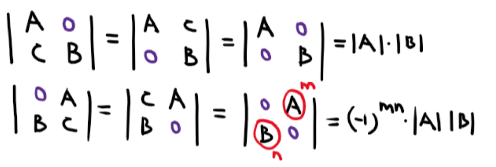

